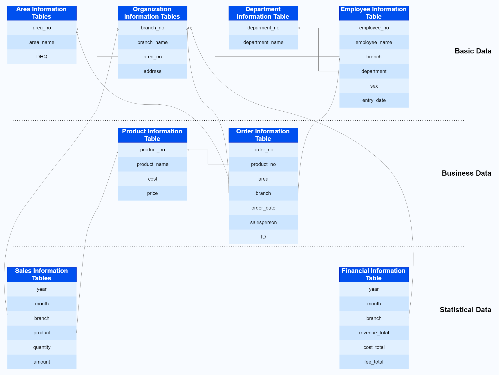

SQL (Structured Query Language) is the primary interface for developers to operate databases. This manual comprehensively introduces the SQL functionality implementation of YashanDB from aspects including data types, operators, functions, and SQL statements.


## Explanation of Examples Used in the Manual

* Tools for connecting to YashanDB (mysql mode) include the YashanDB client (*yasql*), YashanDB JDBC driver, and YashanDB C driver, as well as MySQL ecosystem tools such as MySQL client, MySQL Connector/J, etc.Considering the differences in print display between yasql tool and MySQL Client or other third-party tools for TIME, TIMESTAMP, DATETIME, NUMBER, and DOUBLE data types, the SQL statements in this chapter will be executed using the yasql tool unless otherwise specified, and the output results from the yasql tool will be used as examples for demonstration. Differences will be listed and explained separately.

* The example uses DBMS_OUTPUT.PUT_LINE statements to print output to the *yasql* tool. To achieve the output effect, ensure that the command set serveroutput on has been run in the *yasql* tool to enable control of the output. For details, refer to the tool manual [yasql User Guide](../../Tools Guide/yasql/User Guide for yasql).

* Before using examples in mysql mode, you need to first create a user and grant permissions through CREATE USER and GRANT statements, then execute the CREATE DATABASE statement to create a database instance schema and specify the schema through the USE statement. Unless otherwise specified, this chapter will use the user "sales" and the database instance "sales" with the same name as examples.

* The system defaults the display width for floating-point and NUMBER type data output to 10, which can be adjusted using the [set NUMWIDTH](../../Tools Guide/yasql/User Guide for yasql.md#numwidth) command of *yasql*.

* For date display format: To closely simulate actual business, the date format of the sample database in this manual is set to 'YYYY-MM-DD HH24:MI:SS'. If the DATE_FORMAT configuration parameter is not set to this format, the observed date format will be inconsistent with this manual.

* Regarding the general tables used in the examples: This manual uses sales as the example user (see [CREATE USER](./SQL Statements/CREATE USER) for user creation) and creates a set of sample tables under this user. The sample tables come from a simplified business model listed below and are adjusted according to different architecture/storage features. The general tables used in the examples derive from these sample tables. When executing examples, switching to the sales user will allow querying these tables. The product documentation [Appendix: Sample Tables](./Appx Sample Tables) shows the creation scripts of these tables.


    
    > **Note**: 
    >
    > To achieve specific purposes, examples may require creating other tables or modifying the structure and data of general tables. These will not be reflected here but can be found in the specific examples.

### Sample Business Model



```sql
-- Area Information Table: area, area1
-- Organization Information Table: branches, branches1
-- Department Information Table: department
-- Employee Information Table: employees
-- Product Information Table: product
-- Order Information Table: orders_info
-- Sales Information Table: sales_info, sales_info_range, sales_info_list, sales_info_hash
-- Financial Information Table: finance_info
```
