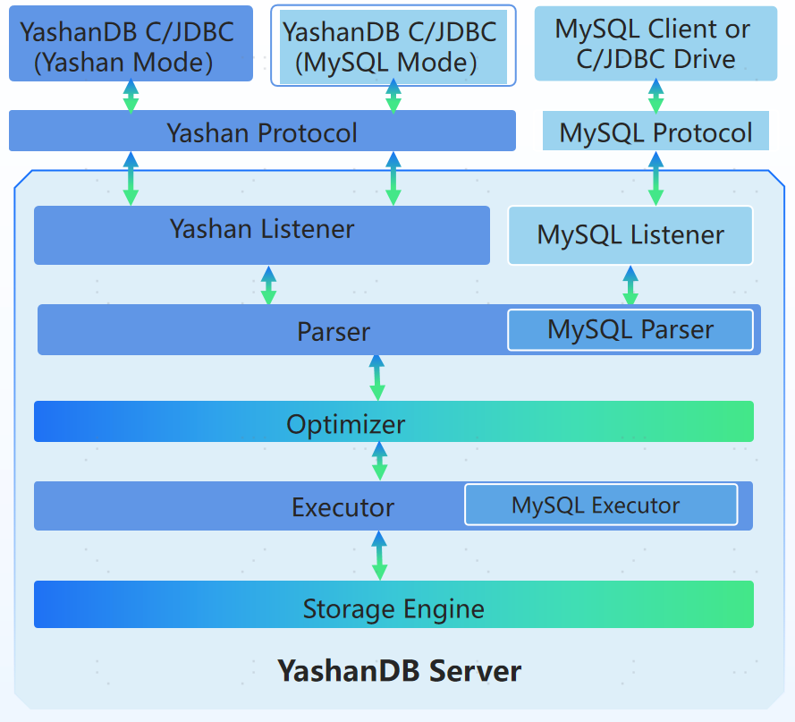

YashanDB V23.4 adds MySQL 5.7 syntax compatibility for business systems migrating from MySQL 5.7 to YashanDB in standalone mode.

## Product Architecture

The product architecture of mysql mode is shown below.

YashanDB has added MySQL ecosystem interfaces, MySQL protocol listeners, MySQL SQL parsers, and MySQL SQL executors to its original product architecture. This allows for seamless integration with the MySQL ecosystem while maintaining MySQL protocol and syntax compatibility. Furthermore, YashanDB retains its enterprise-level high availability, security, reliability, and flexible scalability, providing more possibilities for enterprise application development.

When YashanDB is deployed in mysql mode, please follow the requirements for database operations:

1. Whether connecting to YashanDB using the original factory-supported tools (C/JDBC driver or yasql tool) or through properly adapted third-party tools (MySQL JDBC driver, mysql client, or Navicat), MySQL SQL syntax must be followed for executing business SQL, including DDL/DML/DQL statements;

2. In database operation and management scenarios, operations must be performed through the original factory-supported tools, and before database management operations, the session parameter `COMPAT_VECTOR` must be switched to yashan mode. For simple operation commands, this can be executed directly using the `yasql -compat yashan` keyword through the yasql tool. The maintenance operations that must be executed in yashan mode include:

    -  Backup and restoration
    -  Flashback
    -  Instance startup and shutdown
    -  Primary-standby switchover
    -  Data synchronization
    -  Log management
    -  File management
    -  Tablespace and tablespace set management
    -  Table management
    -  Resource management
    -  Fault diagnosis
    -  Session and scheduling management

3. If connecting to the database using the original factory-supported tools and modifying the session parameter `COMPAT_VECTOR` to yashan mode, DDL/DML/DQL operations can also be performed according to the native yashan mode SQL syntax. However, given that the SQL semantics differ between mysql and yashan in this scenario, it is essential to understand the differences to avoid misunderstandings of SQL execution results. We also advise against mixing modes.

4. If it is necessary to use YashanDB PL stored procedure capability in mysql mode, the YashanDB PL syntax must be followed. However, static and dynamic SQL statements inside the stored procedures will be parsed according to the compatibility mode configured by the session parameter `COMPAT_VECTOR`. If the session parameter `COMPAT_VECTOR` is not adjusted, it defaults to mysql mode. For YashanDB PL stored procedure capabilities, please refer to the [PL Reference Manual](../All Manuals/开发手册/PL参考手册/00PL参考手册).

5. If connecting to YashanDB mysql mode using third-party tools, it is not recommended to modify the session parameter `COMPAT_VECTOR` to yashan mode for database operations due to compatibility issues.

## Concept Explanation

There are differences in the product concept system between YashanDB native yashan mode and mysql mode. It is recommended to use the same concept system for database operations.

|Term |yashan Mode (Same as Oracle) |mysql Mode |
|--------------------|-----------------------|---------------|
| Database            | A complete instance consisting of tablespaces, data files, etc.  One YashanDB environment is one Database | A logical container for database objects (tables, views, etc.) |
| Schema              | Corresponds to users, is the logical container for user database objects (tables, views, etc.)  A schema with the same name is automatically created when a user is created | Alias for a database  |
| User                | Login account + owner of the same name schema (naturally has full permissions for objects in that schema)  Can be granted permissions for objects in other schemas | Only the login account  Can be granted permissions for any database |
| Role                | A set of permissions | None  Can use YashanDB built-in roles (using yashan syntax for related SQL statements) |

## Compatibility Explanation

YashanDB version 23.4 focuses on the following MySQL compatibility features:

- When installing YashanDB database management system in mysql mode, a separate listener port is enabled by default to handle connections initiated with MySQL protocol to the YashanDB server for executing protocol commands.

- Compatibility with MySQL-specific data types, character sets, and collation rules. Syntax parsing and execution will follow MySQL 5.7 standards;

- Supports over 80 MySQL-specific functions, covering multiple areas such as date and time, string handling, mathematical operations, control flow, system information, and password verification;

- Expression support for SQL_MODE configurations such as ANSI_QUOTES, NO_BACKSLASH_ESCAPES, PIPES_AS_CONCAT, REAL_AS_FLOAT, PAD_CHAR_TO_FULL_LENGTH to validate data legality and enforce SQL syntax norms; compatibility with MySQL variable types including user, session, and system variables, supporting complete variable management and query methods;

- Compatibility in operation and monitoring, supporting full compatibility with INFORMATION_SCHEMA, PERFORMANCE_SCHEMA, and MySQL views, as well as operational commands like SHOW STATUS/SHOW VARIABLES;

- Support for pluggable service plugins, allowing the development of more compatibility modes based on the plugin model;

- Support for connections from certain versions of MySQL Client, mysqldump, mydumper, and MySQL C/Java drivers;

## Usage Constraints

When using mysql mode, the following constraints apply:

|Constraint Item |Constraint Behavior |
| ----------------------- |-------------------------------------------|
| Deployment Mode          | The mysql mode can only be selected for standalone (primary/standby) deployment.                                     |
| Table Type               | Only row storage tables can be created in mysql mode.         |
| User Login               | * Client must support SHA256 plugin if using users created in yashan mode to log in to YashanDB (mysql mode). * If using yasql to log in with users created in mysql mode, the username needs to be enclosed in double quotes.             |
| User Deletion and Modification | Deleting or modifying users created in yashan mode is not allowed in mysql mode.                            |
| Object Name              | The lower_case_table_names parameter only supports being set to 1.  Schema, table, view, and table alias names are displayed in lowercase.  Object name matching is case-insensitive.          |
| Binary/Blob Type Text Protocol | When there is a character set inconsistency between the client and server, transcoding will occur based on the server's character set, which may differ from client expectations.                        |
| Character Set            | The character set at schema/table/column level must be consistent with the instance-level character set setting.          |
| Collation                | Character collation can be specified at schema/table/column level and supports actual functionality, but must be compatible with the instance-level character set.                |
| Global Variables          | Queries and settings for global variables are only for syntax compatibility; most will not take effect except for character set and auto-commit.       |
| SQL_MODE                | In YashanDB mysql mode, the SQL_MODE syntax switches such as ANSI_QUOTES, NO_AUTO_VALUE_ON_ZERO, and NO_BACKSLASH_ESCAPES and so on are implemented, and you can refer to [SQL_MODE](../All Manuals/Reference Manual of mysql Mode/SQL参考手册/SQL_MODE) to view the detail. However, for all other configuration switches, regardless of whether they are set or not, they will not affect database behavior — the actual execution behavior remains consistent with the yashan mode. |
| Executable Comments       | Executable comments are treated as comments in mysql mode and have no effect on statement execution.                    |

