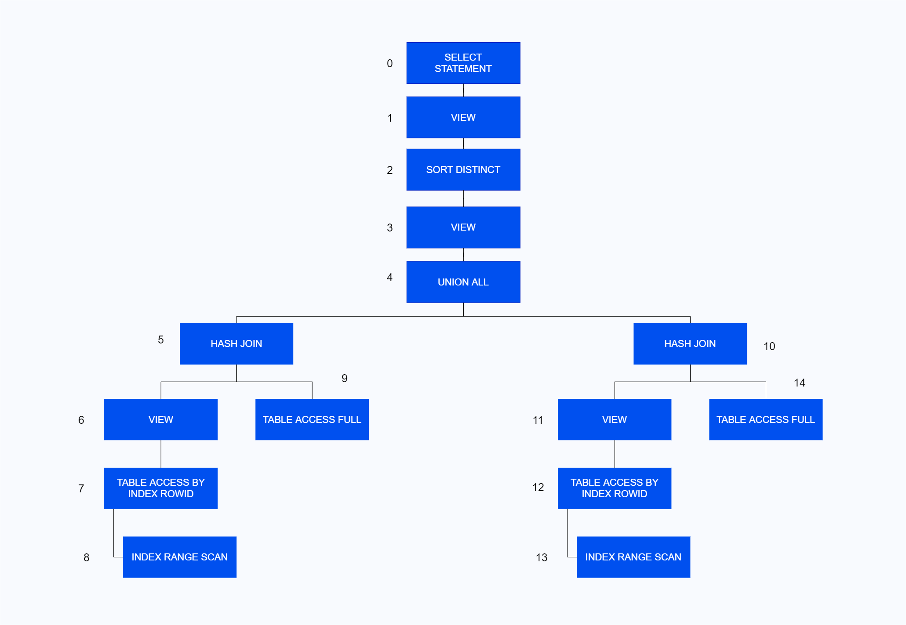

通用描述
----

EXPLAIN用于展示一条SQL语句的执行计划（Execution Plan）。

当SQL语句的执行计划已经在plan cache中存在时，直接重读该计划并输出；否则，由优化器进行试算生成计划到plan cache后再读取并输出。

只能对DML类的SQL语句展示执行计划，同时需满足执行该SQL语句的各项约束要求。

语句定义
----

**explain::=**

```ebnf+diagram
syntax::= EXPLAIN [PLAN [SET PROJ ON] FOR] sql_statement
```

### 1. PLAN FOR

用于兼容，可省略。EXPLAIN PLAN FOR=EXPLAIN。

### 2. SET PROJ ON

用于打开HEAP表投影打印。

> **Caution**: 
>
> HEAP表投影打印功能属于实验室特性，**不推荐在生产环境中使用**，以免影响系统稳定性。

### 3. sql\_statement

要展示执行计划的SQL语句，长度不超过2M。

示例

```sql
-- 单机部署中的SQL语句
EXPLAIN
WITH q_area(ano,aname) AS
(SELECT area_no ano,area_name aname FROM area WHERE area_no IN ('01','04'))
SELECT bno,bname,aname FROM (
SELECT a.branch_no bno,a.branch_name bname,b.aname aname FROM branches a,q_area b WHERE a.area_no=b.ano AND a.area_no='01'
UNION
SELECT a.branch_no bno,a.branch_name bname,b.aname aname FROM branches a,q_area b WHERE a.area_no=b.ano AND a.area_no='04'
);

-- 存算一体分布式集群部署中的SQL语句
EXPLAIN
SELECT *
FROM (SELECT * FROM area WHERE area_no IN ('01','02')
      UNION
      SELECT * FROM area WHERE area_no IN ('01','03')
     );
```

输出定义
----

输出1.单机HEAP表输出的执行计划为：

```sql
PLAN_DESCRIPTION                                                 
---------------------------------------------------------------- 
SQL hash value: 3782799764                                      
Optimizer: ADOPT_C                                              
                                                                
+----+--------------------------------+----------------------+------------+----------+-------------+--------------------------------+
| Id | Operation type                 | Name                 | Owner      | Rows     | Cost(%CPU)  | Partition info                 |
+----+--------------------------------+----------------------+------------+----------+-------------+--------------------------------+
|  0 | SELECT STATEMENT               |                      |            |          |             |                                |
|  1 |  VIEW                          |                      |            |      1000|     1652( 0)|                                |
|  2 |   HASH DISTINCT                |                      |            |      1000|     1652( 0)|                                |
|  3 |    VIEW                        |                      |            |   2512000|     1576( 0)|                                |
|  4 |     UNION ALL                  |                      |            |   2512000|     1446( 0)|                                |
|  5 |      NESTED LOOPS INNER        |                      |            |   1256000|      687( 0)|                                |
|* 6 |       TABLE ACCESS FULL        | BRANCHES             | SALES      |      4000|      445( 0)|                                |
|* 7 |       VIEW                     |                      |            |       314|      151( 0)|                                |
|  8 |        TABLE ACCESS BY INDEX ROWID| AREA                 | SALES      |          |             |                                |
|* 9 |         INDEX RANGE SCAN       | SYS_C_13             | SALES      |      7840|      151( 0)|                                |
| 10 |      NESTED LOOPS INNER        |                      |            |   1256000|      687( 0)|                                |
|*11 |       TABLE ACCESS FULL        | BRANCHES             | SALES      |      4000|      445( 0)|                                |
|*12 |       VIEW                     |                      |            |       314|      151( 0)|                                |
| 13 |        TABLE ACCESS BY INDEX ROWID| AREA                 | SALES      |          |             |                                |
|*14 |         INDEX RANGE SCAN       | SYS_C_13             | SALES      |      7840|      151( 0)|                                |
+----+--------------------------------+----------------------+------------+----------+-------------+--------------------------------+
                                                                
Operation Information (identified by operation id):             
---------------------------------------------------             
                                                                
   6 - Predicate : filter("A"."AREA_NO" = '01')                 
   7 - Predicate : filter("B"."ANO" = '01')                     
   9 - Predicate : access("AREA"."AREA_NO" IN ('01', '04'))     
  11 - Predicate : filter("A"."AREA_NO" = '04')                 
  12 - Predicate : filter("B"."ANO" = '04')                     
  14 - Predicate : access("AREA"."AREA_NO" IN ('01', '04'))    
```

输出2.单机TAC表输出的执行计划为：

```sql
PLAN_DESCRIPTION                                                 
---------------------------------------------------------------- 
SQL hash value: 3782799764                                      
Optimizer: ADOPT_C                                              
                                                                
+----+--------------------------------+----------------------+------------+----------+-------------+--------------------------------+
| Id | Operation type                 | Name                 | Owner      | Rows     | Cost(%CPU)  | Partition info                 |
+----+--------------------------------+----------------------+------------+----------+-------------+--------------------------------+
|  0 | SELECT STATEMENT               |                      |            |          |             |                                |
|  1 |  COL TO ROW                    |                      |            |          |             |                                |
|  2 |   RESULT                       |                      |            |      1000|     1652( 0)|                                |
|  3 |    HASH GROUP                  |                      |            |      1000|     1652( 0)|                                |
|  4 |     RESULT                     |                      |            |   2512000|     1576( 0)|                                |
|  5 |      UNION ALL                 |                      |            |   2512000|     1446( 0)|                                |
|  6 |       NESTED LOOPS INNER       |                      |            |   1256000|      687( 0)|                                |
|* 7 |        TABLE ACCESS FULL       | BRANCHES             | SALES      |      4000|      445( 0)|                                |
|* 8 |        RESULT                  |                      |            |       314|      151( 0)|                                |
|  9 |         TABLE ACCESS BY INDEX ROWID| AREA                 | SALES      |          |             |                                |
|*10 |          INDEX RANGE SCAN      | SYS_C_58             | SALES      |      7840|      151( 0)|                                |
| 11 |       NESTED LOOPS INNER       |                      |            |   1256000|      687( 0)|                                |
|*12 |        TABLE ACCESS FULL       | BRANCHES             | SALES      |      4000|      445( 0)|                                |
|*13 |        RESULT                  |                      |            |       314|      151( 0)|                                |
| 14 |         TABLE ACCESS BY INDEX ROWID| AREA                 | SALES      |          |             |                                |
|*15 |          INDEX RANGE SCAN      | SYS_C_58             | SALES      |      7840|      151( 0)|                                |
+----+--------------------------------+----------------------+------------+----------+-------------+--------------------------------+
                                                                
Operation Information (identified by operation id):             
---------------------------------------------------             
                                                                
   1 - Projection: RemoteTable[1][CHAR, 4], RemoteTable[1][VARCHAR, 200], RemoteTable[1][VARCHAR, 60]
   2 - Projection: Tuple[0, 0][CHAR, 4], Tuple[0, 1][VARCHAR, 200], Tuple[0, 2][VARCHAR, 60]
   3 - Projection: Tuple[0, 0][CHAR, 4], Tuple[0, 1][VARCHAR, 200], Tuple[0, 2][VARCHAR, 60]
   4 - Projection: Tuple[0, 0][CHAR, 4], Tuple[0, 1][VARCHAR, 200], Tuple[0, 2][VARCHAR, 60]
   5 - Projection: Tuple[0, 0][CHAR, 4], Tuple[0, 1][VARCHAR, 200], Tuple[0, 2][VARCHAR, 60]
   6 - Projection: Tuple[0, 0][CHAR, 4], Tuple[0, 1][VARCHAR, 200], Tuple[1, 0][VARCHAR, 60]
   7 - Projection: Tuple[0, 0][CHAR, 4], Tuple[0, 1][VARCHAR, 200]
       Predicate : access("A"."AREA_NO" = '01')                 
   8 - Projection: Tuple[0, 1][VARCHAR, 60]                     
       Predicate : filter(Tuple[0, 0] = '01')                   
  10 - Projection: Tuple[0, 0][CHAR, 2], Tuple[0, 1][VARCHAR, 60]
       Predicate : access("AREA"."AREA_NO" IN ('01', '04'))     
  11 - Projection: Tuple[0, 0][CHAR, 4], Tuple[0, 1][VARCHAR, 200], Tuple[1, 0][VARCHAR, 60]
  12 - Projection: Tuple[0, 0][CHAR, 4], Tuple[0, 1][VARCHAR, 200]
       Predicate : access("A"."AREA_NO" = '04')                 
  13 - Projection: Tuple[0, 1][VARCHAR, 60]                     
       Predicate : filter(Tuple[0, 0] = '04')                   
  15 - Projection: Tuple[0, 0][CHAR, 2], Tuple[0, 1][VARCHAR, 60]
       Predicate : access("AREA"."AREA_NO" IN ('01', '04'))        
```

输出3.单机LSC表输出的执行计划为：

```sql
PLAN_DESCRIPTION                                                 
---------------------------------------------------------------- 
SQL hash value: 3782799764                                      
Optimizer: ADOPT_C                                              
                                                                
+----+--------------------------------+----------------------+------------+----------+-------------+--------------------------------+
| Id | Operation type                 | Name                 | Owner      | Rows     | Cost(%CPU)  | Partition info                 |
+----+--------------------------------+----------------------+------------+----------+-------------+--------------------------------+
|  0 | SELECT STATEMENT               |                      |            |          |             |                                |
|  1 |  COL TO ROW                    |                      |            |          |             |                                |
|  2 |   RESULT                       |                      |            |      1000|     2252( 0)|                                |
|  3 |    HASH GROUP                  |                      |            |      1000|     2252( 0)|                                |
|  4 |     RESULT                     |                      |            |   2512000|     2176( 0)|                                |
|  5 |      UNION ALL                 |                      |            |   2512000|     2046( 0)|                                |
|  6 |       NESTED LOOPS INNER       |                      |            |   1256000|      987( 0)|                                |
|* 7 |        TABLE ACCESS FULL       | BRANCHES             | SALES      |      4000|      445( 0)|                                |
|* 8 |        RESULT                  |                      |            |       314|      451( 0)|                                |
|* 9 |         TABLE ACCESS FULL      | AREA                 | SALES      |      7840|      451( 0)|                                |
| 10 |       NESTED LOOPS INNER       |                      |            |   1256000|      987( 0)|                                |
|*11 |        TABLE ACCESS FULL       | BRANCHES             | SALES      |      4000|      445( 0)|                                |
|*12 |        RESULT                  |                      |            |       314|      451( 0)|                                |
|*13 |         TABLE ACCESS FULL      | AREA                 | SALES      |      7840|      451( 0)|                                |
+----+--------------------------------+----------------------+------------+----------+-------------+--------------------------------+
                                                                
Operation Information (identified by operation id):             
---------------------------------------------------             
                                                                
   1 - Projection: RemoteTable[1][CHAR, 4], RemoteTable[1][VARCHAR, 200], RemoteTable[1][VARCHAR, 60]
   2 - Projection: Tuple[0, 0][CHAR, 4], Tuple[0, 1][VARCHAR, 200], Tuple[0, 2][VARCHAR, 60]
   3 - Projection: Tuple[0, 0][CHAR, 4], Tuple[0, 1][VARCHAR, 200], Tuple[0, 2][VARCHAR, 60]
   4 - Projection: Tuple[0, 0][CHAR, 4], Tuple[0, 1][VARCHAR, 200], Tuple[0, 2][VARCHAR, 60]
   5 - Projection: Tuple[0, 0][CHAR, 4], Tuple[0, 1][VARCHAR, 200], Tuple[0, 2][VARCHAR, 60]
   6 - Projection: Tuple[0, 0][CHAR, 4], Tuple[0, 1][VARCHAR, 200], Tuple[1, 0][VARCHAR, 60]
   7 - Projection: Tuple[0, 0][CHAR, 4], Tuple[0, 1][VARCHAR, 200]
       Predicate : access("A"."AREA_NO" = '01')                 
   8 - Projection: Tuple[0, 1][VARCHAR, 60]                     
       Predicate : filter(Tuple[0, 0] = '01')                   
   9 - Projection: Tuple[0, 0][CHAR, 2], Tuple[0, 1][VARCHAR, 60]
       Predicate : access("AREA"."AREA_NO" IN ('01', '04'))     
  10 - Projection: Tuple[0, 0][CHAR, 4], Tuple[0, 1][VARCHAR, 200], Tuple[1, 0][VARCHAR, 60]
  11 - Projection: Tuple[0, 0][CHAR, 4], Tuple[0, 1][VARCHAR, 200]
       Predicate : access("A"."AREA_NO" = '04')                 
  12 - Projection: Tuple[0, 1][VARCHAR, 60]                     
       Predicate : filter(Tuple[0, 0] = '04')                   
  13 - Projection: Tuple[0, 0][CHAR, 2], Tuple[0, 1][VARCHAR, 60]
       Predicate : access("AREA"."AREA_NO" IN ('01', '04'))   
```

输出4.分布式TAC/LSC表输出的执行计划为：

```sql
PLAN_DESCRIPTION                                                 
---------------------------------------------------------------- 
SQL hash value: 3958538062                                      
Optimizer: ADOPT_C                                              
                                                                
+----+--------------------------------+----------------------+------------+----------+-------------+--------------------------------+
| Id | Operation type                 | Name                 | Owner      | Rows     | Cost(%CPU)  | Partition info                 |
+----+--------------------------------+----------------------+------------+----------+-------------+--------------------------------+
|  0 | SELECT STATEMENT               |                      |            |          |             |                                |
|  1 |  DISTRIBUTED COORDINATOR       |                      |            |          |             |                                |
|  2 |   COL TO ROW                   |                      |            |          |             |                                |
|  3 |    RESULT                      |                      |            |      1000|      959( 0)|                                |
|  4 |     HASH DISTINCT              |                      |            |      1000|      959( 0)|                                |
|  5 |      RESULT                    |                      |            |     15680|      958( 0)|                                |
|  6 |       UNION ALL                |                      |            |     15680|      957( 0)|                                |
|  7 |        PX N2I REMOTE           | QUEUE_0              |            |      7840|      478( 0)|                                |
|* 8 |         TABLE ACCESS FULL      | AREA                 | SALES      |      7840|      451( 0)|                                |
|  9 |        PX N2I REMOTE           | QUEUE_1              |            |      7840|      478( 0)|                                |
|*10 |         TABLE ACCESS FULL      | AREA                 | SALES      |      7840|      451( 0)|                                |
+----+--------------------------------+----------------------+------------+----------+-------------+--------------------------------+
                                                                
Operation Information (identified by operation id):             
---------------------------------------------------             
                                                                
   2 - Projection: RemoteTable[1][CHAR, 2]                      
   3 - Projection: Tuple[0, 0][CHAR, 2]                         
   4 - Projection: Tuple[0, 0][CHAR, 2]                         
   5 - Projection: Tuple[0, 0][CHAR, 2]                         
   6 - Projection: Tuple[0, 0][CHAR, 2]                         
   7 - Projection: Tuple[0, 0][CHAR, 2]                         
       PX RemoteInfo: (RANDOM SENDER -> RANDOM RECEIVER : 3->1 [3][4][5]->[2])
   8 - Projection: Tuple[0, 0][CHAR, 2]                         
       Predicate : access("AREA"."AREA_NO" IN ('01', '02'))     
   9 - Projection: Tuple[0, 0][CHAR, 2]                         
       PX RemoteInfo: (RANDOM SENDER -> RANDOM RECEIVER : 3->1 [3][4][5]->[2])
  10 - Projection: Tuple[0, 0][CHAR, 2]                         
       Predicate : access("AREA"."AREA_NO" IN ('01', '03'))    
```

### SQL hash value

SQL语句的哈希号，即V$SQL视图里的hash_value字段值。

### Optimizer

YashanDB使用的优化器名称， ADOPT_C表示CBO。

### Id

执行步骤号，按二叉树结构从底部向上逆序执行。

如下为一个执行二叉树示例：



### Operation type

执行算子，定义了执行计划每一步的操作。

如上例输出1和2中的INDEX RANGE SCAN表示执行索引范围扫描，检索到ROWID，TABLE ACCESS BY INDEX ROWID则根据这个ROWID读取行数据，然后继续向上直到0步的算子。

上例输出3和4中的TABLE ACCESS FULL表示执行全表扫描，检索到记录RESULT后，对两个RESULT进行UNION ALL算法，然后继续向上直到0步的算子。

其中，PX算子可分为BROADCAST、HASH、RANDOM等类型，表示数据在节点间的重分布方式。在每个PX算子后面会列出节点发送情况，N2I表示多个节点将数据发往一个节点，具体发送和接收节点可在投影信息中查看。

### Name

算子操作的数据库对象名称，如扫描表、索引时对应的表名、索引名等。

对于PX算子，Name列示的是该算子在通讯过程中的唯一标识号。

### Owner

操作对象的属主。如上例输出1中的area、branches表，及SYS_C_16索引，其Owner为SALES用户。

上例输出2中的area、branches表，其Owner为SALES_LSC用户。

上例输出3中的area表，其Owner为SALES用户。

### Rows

算子扫描的记录行数。

### Cost(%CPU)

估算执行此算子产生的CPU代价。

### Partition Info

对于分区表，此列展示算子扫描到的分区。

示例1（单机HEAP表）

```sql
--创建sales表为一张范围分区表，且在year字段上创建local索引。
CREATE TABLE sales
(year CHAR(4) NOT NULL,
month CHAR(2) NOT NULL,
branch CHAR(4),
product CHAR(5),
quantity NUMBER DEFAULT 0 NOT NULL,
amount NUMBER(10,2) DEFAULT 0 NOT NULL,
salsperson CHAR(10))
PARTITION BY RANGE(year)
(PARTITION p_sales_1 VALUES LESS THAN ('2001'),
PARTITION p_sales_2 VALUES LESS THAN ('2011'),
PARTITION p_sales_3 VALUES LESS THAN (2022));
 
CREATE INDEX idx_sales ON sales(year) LOCAL;
 
INSERT INTO sales VALUES ('2001','01','0201','11001',30,500,'0201010011');
INSERT INTO sales VALUES ('2015','11','0101','11001',20,300,'');
INSERT INTO sales VALUES ('2021','10','0101','11001',20,300,'');
INSERT INTO sales VALUES ('2000','12','0102','11001',20,300,'');
INSERT INTO sales VALUES ('2015','03','0102','11001',20,300,'');
INSERT INTO sales VALUES ('2020','05','0101','11001',40,600,'');
COMMIT;
 
--查看执行计划
EXPLAIN
SELECT a.area_name,
b.branch_name,
s.product,
s.amount
FROM branches b,
area a,
(SELECT branch,
product,SUM(amount) amount
FROM sales
WHERE year>'2005'
GROUP BY branch,product) s
WHERE s.branch=b.branch_no
AND b.area_no=a.area_no;
```

上例的输出结果（\[1,2\]表示扫描第1到第2个分区）为：

```sql
--以HEAP表为例，TAC表将会多出一个COL TO ROW算子
PLAN_DESCRIPTION                                                 
---------------------------------------------------------------- 
SQL hash value: 3362858118                                      
Optimizer: ADOPT_C                                              
                                                                
+----+--------------------------------+----------------------+------------+----------+-------------+--------------------------------+
| Id | Operation type                 | Name                 | Owner      | Rows     | Cost(%CPU)  | Partition info                 |
+----+--------------------------------+----------------------+------------+----------+-------------+--------------------------------+
|  0 | SELECT STATEMENT               |                      |            |          |             |                                |
|  1 |  NESTED LOOPS INNER            |                      |            |      1000|      461( 0)|                                |
|  2 |   NESTED LOOPS INNER           |                      |            |      1000|      311( 0)|                                |
|  3 |    VIEW                        |                      |            |      1000|      161( 0)|                                |
|* 4 |     HASH GROUP                 |                      |            |      1000|      161( 0)|                                |
|  5 |      PART SCAN ITERATOR        |                      |            |     33000|      160( 0)| [1,2]                          |
|  6 |       TABLE ACCESS BY INDEX ROWID| SALES                | SALES      |          |             |                                |
|* 7 |        INDEX RANGE SCAN        | IDX_SALES            | SALES      |     33000|      160( 0)|                                |
|  8 |    TABLE ACCESS BY INDEX ROWID | BRANCHES             | SALES      |          |             |                                |
|* 9 |     INDEX UNIQUE SCAN          | SYS_C_125            | SALES      |         1|      149( 0)|                                |
| 10 |   TABLE ACCESS BY INDEX ROWID  | AREA                 | SALES      |          |             |                                |
|*11 |    INDEX UNIQUE SCAN           | SYS_C_123            | SALES      |         1|      149( 0)|                                |
+----+--------------------------------+----------------------+------------+----------+-------------+--------------------------------+
                                                                
Operation Information (identified by operation id):             
---------------------------------------------------             
                                                                
   4 - Predicate : group expressions("SALES"."BRANCH", "SALES"."PRODUCT")
   7 - Predicate : access("SALES"."YEAR" > '2005')              
   9 - Predicate : access("B"."BRANCH_NO" = "S"."BRANCH")       
  11 - Predicate : access("A"."AREA_NO" = "B"."AREA_NO")               
```

示例2（分布式LSC表）

```sql
--sales表为一张范围分区表
CREATE DUPLICATED TABLE sales
(year CHAR(4) NOT NULL,
month CHAR(2) NOT NULL,
branch CHAR(4),
product CHAR(5),
quantity NUMBER DEFAULT 0 NOT NULL,
amount NUMBER(10,2) DEFAULT 0 NOT NULL,
salsperson CHAR(10))
PARTITION BY RANGE(year)
(PARTITION p_sales_1 VALUES LESS THAN ('2001'),
PARTITION p_sales_2 VALUES LESS THAN ('2011'),
PARTITION p_sales_3 VALUES LESS THAN (2022));
  
INSERT INTO sales VALUES ('2001','01','0201','11001',30,500,'0201010011');
INSERT INTO sales VALUES ('2015','11','0101','11001',20,300,'');
INSERT INTO sales VALUES ('2021','10','0101','11001',20,300,'');
INSERT INTO sales VALUES ('2000','12','0102','11001',20,300,'');
INSERT INTO sales VALUES ('2015','03','0102','11001',20,300,'');
INSERT INTO sales VALUES ('2020','05','0101','11001',40,600,'');
COMMIT;

--查看如下语句执行计划，[1,2]表示扫描到第1到第2个分区
EXPLAIN
SELECT a.area_name,
b.branch_name,
s.product,
s.amount
FROM branches b,
area a,
(SELECT branch,
product,SUM(amount) amount
FROM sales
WHERE year>'2005'
GROUP BY branch,product) s
WHERE s.branch=b.branch_no
AND b.area_no=a.area_no;
 
PLAN_DESCRIPTION                                                 
---------------------------------------------------------------- 
SQL hash value: 3362858118                                      
Optimizer: ADOPT_C                                              
                                                                
+----+--------------------------------+----------------------+------------+----------+-------------+--------------------------------+
| Id | Operation type                 | Name                 | Owner      | Rows     | Cost(%CPU)  | Partition info                 |
+----+--------------------------------+----------------------+------------+----------+-------------+--------------------------------+
|  0 | SELECT STATEMENT               |                      |            |          |             |                                |
|  1 |  DISTRIBUTED COORDINATOR       |                      |            |          |             |                                |
|  2 |   COL TO ROW                   |                      |            |      1000|      734( 0)|                                |
|  3 |    PX N2I REMOTE               | QUEUE_0              |            |      1000|      734( 0)|                                |
|* 4 |     HASH JOIN INNER            |                      |            |      1000|      730( 0)|                                |
|  5 |      JOIN FILTER USE           |                      |            |    100000|      271( 0)|                                |
|  6 |       PART SCAN ALL            |                      |            |    100000|      271( 0)| [0,20]                         |
|* 7 |        TABLE ACCESS FULL       | AREA                 | SYS        |    100000|      271( 0)|                                |
|* 8 |      JOIN FILTER CREATE        |                      |            |      1000|      450( 0)|                                |
|* 9 |       PX N2N REMOTE            | QUEUE_1              |            |      1000|      450( 0)|                                |
|*10 |        HASH JOIN INNER         |                      |            |      1000|      446( 0)|                                |
| 11 |         PART SCAN ALL          |                      |            |    100000|      272( 0)| [0,20]                         |
| 12 |          TABLE ACCESS FULL     | BRANCHES             | SYS        |    100000|      272( 0)|                                |
| 13 |         RESULT                 |                      |            |      1000|      169( 0)|                                |
| 14 |          HASH GROUP            |                      |            |      1000|      169( 0)|                                |
|*15 |           PX I2N REMOTE        | QUEUE_2              |            |     33000|      166( 0)|                                |
| 16 |            PART SCAN ITERATOR  |                      |            |     33000|      153( 0)| [1,2]                          |
|*17 |             TABLE ACCESS FULL  | SALES                | SYS        |     33000|      153( 0)|                                |
+----+--------------------------------+----------------------+------------+----------+-------------+--------------------------------+
                                                                
Operation Information (identified by operation id):             
---------------------------------------------------             
                                                                
   2 - Projection: RemoteTable[3][VARCHAR, 60], RemoteTable[3][VARCHAR, 200], RemoteTable[3][CHAR, 5], RemoteTable[3][NUMBER]
   3 - Projection: Tuple[0, 0][VARCHAR, 60], Tuple[0, 1][VARCHAR, 200], Tuple[0, 2][CHAR, 5], Tuple[0, 3][NUMBER]
       PX RemoteInfo: (RANDOM SENDER -> RANDOM RECEIVER : 3->1 [3][4][5]->[2])
   4 - Projection: Tuple[0, 1][VARCHAR, 60], Tuple[1, 1][VARCHAR, 200], Tuple[1, 2][CHAR, 5], Tuple[1, 3][NUMBER]
       Predicate : access(Tuple[0, 0] = Tuple[1, 0])            
   5 - Projection: Tuple[0, 0][CHAR, 2], Tuple[0, 1][VARCHAR, 60]
   6 - Projection: Tuple[0, 0][CHAR, 2], Tuple[0, 1][VARCHAR, 60]
   7 - Projection: Tuple[0, 0][CHAR, 2], Tuple[0, 1][VARCHAR, 60]
       Predicate : RUNTIME FILTER(RUNTIME USE(0): "A"."AREA_NO")
   8 - Projection: Tuple[0, 0][CHAR, 2], Tuple[0, 1][VARCHAR, 200], Tuple[0, 2][CHAR, 5], Tuple[0, 3][NUMBER]
       Predicate : RUNTIME FILTER(RUNTIME CREATE(0): Tuple[0, 0])
   9 - Projection: Tuple[0, 0][CHAR, 2], Tuple[0, 1][VARCHAR, 200], Tuple[0, 2][CHAR, 5], Tuple[0, 3][NUMBER]
       PX RemoteInfo: (HASH SENDER -> RANDOM RECEIVER : 3->3 [3][4][5]->[3][4][5])
       Predicate : access(Tuple[0, 0])                          
  10 - Projection: Tuple[0, 1][CHAR, 2], Tuple[0, 2][VARCHAR, 200], Tuple[1, 1][CHAR, 5], Tuple[1, 2][NUMBER]
       Predicate : access(Tuple[0, 0] = Tuple[1, 0])            
  11 - Projection: Tuple[0, 0][CHAR, 4], Tuple[0, 1][CHAR, 2], Tuple[0, 2][VARCHAR, 200]
  12 - Projection: Tuple[0, 0][CHAR, 4], Tuple[0, 2][CHAR, 2], Tuple[0, 1][VARCHAR, 200]
  13 - Projection: Tuple[0, 1][CHAR, 4], Tuple[0, 2][CHAR, 5], Tuple[0, 0][NUMBER]
  14 - Projection: SUM(Tuple[0, 0])[NUMBER], Tuple[0, 1][CHAR, 4], Tuple[0, 2][CHAR, 5]
       Group Expression: (Tuple[0, 1], Tuple[0, 2])             
  15 - Projection: Tuple[0, 0][NUMBER, (10, 2)], Tuple[0, 1][CHAR, 4], Tuple[0, 2][CHAR, 5]
       PX RemoteInfo: (HASH SENDER -> RANDOM RECEIVER : 1->3 [3]->[3][4][5])
       Predicate : access(Tuple[0, 1])                          
  16 - Projection: Tuple[0, 0][NUMBER, (10, 2)], Tuple[0, 1][CHAR, 4], Tuple[0, 2][CHAR, 5]
  17 - Projection: Tuple[0, 5][NUMBER, (10, 2)], Tuple[0, 2][CHAR, 4], Tuple[0, 3][CHAR, 5]
       Predicate : access("SALES"."YEAR" > '2005')                    
```

### Predicate

谓词信息，包括：

* access：限定谓词，用于减少结果集的大小，如索引限定谓词、HashJoin限定谓词。
* filter：过滤谓词，对结果集中的每条记录进行过滤运算。
* projection：投影信息，对下层算子的引用。其中Tuple\[sourceId, attrId\]表示下层算子的第sourceId个数据源的第attrId个投影，两者的序号都是从0开始。
