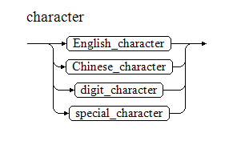
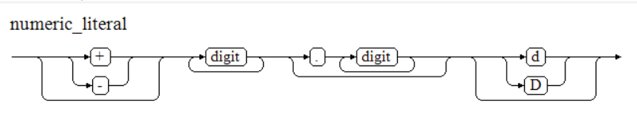
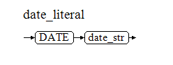

字面量的意思是不变的值，它以字符串的形式直接出现在SQL和PL语句中，通过声明时的格式对其进行类型区分，例如''用于识别字符型的字面量，DATE用于识别日期时间型的字面量。

字面量几乎可以用在所有场景中，例如作为值、参数、格式、标识或输出显示。

字面量与变量、常量在概念上的区别：

- 字面量是以字符串形式出现的固定值，它没有存储容器，只是一种书面上的记法。
- 变量是用来存储数据的一个容器，且容器可以被多次赋值。
- 常量是变量的一种，但它只能被初始赋值，且不能再次被赋值。


## 字符串字面量（Character Literal）

字符串字面量是使用单引号`''`包围的英文字母、中文汉字、数字字符和特殊字符的组合，其声明方式如下所示：




YashanDB将字符串字面量解析成VARCHAR类型数据。

示例

```sql
SELECT 'SHENZHEN', '3.14567', '!@#$',
TYPEOF('SHENZHEN') type1,
TYPEOF('3.14567') type2,
TYPEOF('!@#$') type3
FROM DUAL;
+----------+---------+------+---------+---------+---------+
| SHENZHEN | 3.14567 | !@#$ | type1   | type2   | type3   |
+----------+---------+------+---------+---------+---------+
| SHENZHEN | 3.14567 | !@#$ | varchar | varchar | varchar |
+----------+---------+------+---------+---------+---------+
```


## 数值字面量（Numeric Literal）

数值字面量是以数字0 ~ 9和小数点组合形成的数值，数值前可以用正号（+）或负号（-）将其变成正数负数（默认为正数）。其声明方式如下图所示：



数值字面量包含4个数据类型：INT、BIGINT、NUMBER、DOUBLE。YashanDB按如下规则解析这些类型：

- 当数值后出现'd'或'D'时，将解析为DOUBLE类型。
- 小数解析成NUMBER类型。
- 整数首先尝试将它解析为INT类型（判断是否在INT值域\[-2<sup>31</sup>， 2<sup>31</sup> - 1\]），失败则尝试解析为BIGINT类型（判断是否在BIGINT值域\[-2<sup>63</sup>，2<sup>63</sup> - 1\]），失败则解析为NUMBER类型。
- 超过NUMBER范围解析为DOUBLE类型。

例如，11d被解析为DOUBLE类型，2147483647被解析为INT类型，2147483648被解析为BIGINT类型，1.1被解析为NUMBER类型。

示例

```sql
SELECT 1, TYPEOF(1) FROM DUAL;
           1 TYPEOF(1)
------------ ---------
           1 integer
  
SELECT 2147483647, TYPEOF(2147483647) FROM DUAL;
  2147483647 TYPEOF(2147483647)
------------ ------------------
  2147483647 integer
  
SELECT 2147483648, TYPEOF(2147483648) FROM DUAL;
           2147483648 TYPEOF(2147483648)
--------------------- ------------------
           2147483648 bigint
  
SELECT 1.1, TYPEOF(1.1) FROM DUAL;
        1.1 TYPEOF(1.1)
----------- -----------
        1.1 number
            
SELECT 11d, TYPEOF(11d) FROM DUAL;

        11  TYPEOF(11D)
----------- -----------
   1.1E+001 double
```

**科学计数法数值字面量**

YashanDB支持将类似1.24E3格式的字面量解析为科学计数法输入的NUMBER类型数据。

示例

```sql
SELECT 1.24e3 FROM dual;
      1.24E3 
------------ 
        1240
```

## 日期字面量（Date Literal）

日期字面量是以DATE关键字开始，直至单引号`''`包围的字符串右引号结束的值，采用'yyyy-mm-dd'进行格式匹配，例如`DATE '2020-01-01'`。其声明方式如下图所示，其中date_str表示符合DATE类型标准格式的字符串。



示例

```sql
SELECT DATE '2020-01-01', TYPEOF(DATE '2020-01-01') TYPE FROM DUAL;
DATE'2020-01-01'                 TYPE
-------------------------------- -----
2020-01-01 00:00:00              date
```

## 时间戳字面量（Timestamp Literal）

日期时间戳字面量是以TIMESTAMP开始，直至单引号`''`包围的字符串右引号结束的值，采用'yyyy-mm-dd hh24:mi:ss.ff'进行格式匹配，时分秒可缺省，例如`TIMESTAMP '2020-01-01 13:08:28'`。其声明方式如下图所示，其中timestamp_str表示符合TIMESTAMP类型标准格式的字符串。


示例

```sql
SELECT TIMESTAMP '2020-01-01 13:08:28', TYPEOF(TIMESTAMP '2020-01-01 13:08:28') TYPE FROM DUAL;
TIMESTAMP'2020-01-01                                             TYPE
---------------------------------------------------------------- -------------
2020-01-01 13:08:28.000000                                       timestamp
```


## 十六进制字面量（Hexadecimal Literal）

十六进制字面量有两种形式：

- 0xval：x必须为小写，val可以为所有十六进制的数字（0..9，A..F）但不允许为空。如果val为奇数，会补充一个前导0，例如0x123等价于0x0123。

- x'val'：x不区分大小写，val必须为十六进制数字的偶数且允许为空（即x''）。如果val为奇数，将报错。

十六进制字面量的数据类型默认为varbinary，两个十六进制位表示一个字节，例如0x41对应ASCII字符集的'A'字符，此时x''会被视为空串。

在二元运算中，十六进制字面量的数据类型会被识别成INT或BIGINT，例如0x10+0x10将被视作16+16，此时x''会被视为0。如需将十六进制字面量当做数字进行计算，建议先将其与0进行加法运算再进行其他运算，例如0x10+0。

在二元运算中，十六进制字面量的数据类型仅支持+、\-、\*和/运算。

## \_BINARY 字面量（\_BINARY Literal）

_BINARY 将常量数据指定为Binary字符集，_BINARY 指定的常量数据有两种形式：

- 字符串。

- 十六进制字面量数据。

示例

```sql
SELECT _binary x'0001',
TYPEOF(_binary x'0001') TYPE
FROM DUAL;
x'0001' TYPE
------- -----
0001    raw
```
