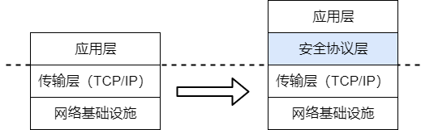

## 功能简介 

可信信道是数据库安全体系中的关键组件，旨在为客户端与数据库服务端之间、数据库各节点之间建立安全、可靠的传输通道。其主要功能包括：

- 数据机密性保护：通过对传输数据进行加密，防止敏感信息在传输过程中被窃取或泄露。

- 数据完整性保障：通过消息认证码（MAC）等机制，确保数据在传输过程中未被篡改或损坏。

- 身份真实性验证：通过数字证书和PKI体系，验证通信双方的真实身份，防止中间人攻击。

- 抗重放攻击能力：通过序列号和时间戳机制，防止攻击者重放截获的数据包。

在YashanDB中，可信信道采用分层安全架构，在TCP/IP协议之上建立安全协议层为上层应用提供透明的安全服务。

开启可信信道功能时，需基于公/私钥各类证书建立完整的身份认证和信任链，并根据有效期等机制持续进行信任链有效性维护。进行数据通信时，通过非对称加密技术完成通信双方的身份认证和会话密钥的协商，然后使用协商好的会话密钥对实际业务数据进行高效加密传输。

## 支持的加密协议 

在YashanDB中，目前可以为数据库客户端与服务端之间、主备复制网络以及存算一体分布式集群部署中的内部互联总线（DIN）配置可信信道，具体信道支持的加密协议如下表所示。

| 信道 | 支持的协议 |
|---------------------------|-----------|
| 数据库客户端<->服务端| * SSL   * TLCP  |
| 主备复制网络 | SSL |
| DIN  | SSL |

在配置数据库服务端与客户端之间的可信信道时，可根据实际需求选择合适的加密协议。

| 差异点 | SSL | TLCP |
|--------------------|-------------------|-------------------|
| 标准规范 | IETF国际标准（RFC 5246/6176等） | 国家密码管理局标准（GMT 0024-2014） |
| 算法体系 | 支持RSA、ECC、AES、ChaCha20等多种国际标准密码算法，全球兼容性强 | 完全基于SM2公钥加密、SM3哈希算法、SM4对称加密等国家密码算法标准，完全满足国产密码合规要求 |
| 证书体系 | 单证书体系 | 采用签名证书和加密证书分离的双证书体系 |
| 前向保密 | 支持（ECDHE等） | 支持（SM2密钥交换） |

## 可信信道配置规则 

- 可信信道均默认关闭，如需开启必须同时正确配置相应证书，否则将导致数据库无法正常启动。

- 证书文件在数据库安装服务器的存放路径（绝对路径）最长不超过254字节。

- 若开启数据库客户端<->服务端可信信道：

    - 只能选用SSL协议或TLCP协议之一，不得混用或并存。

    - 必须正确配置服务端各类证书路径相关的数据库参数，否则会导致数据库启动失败。

        若开启SSL可信信道且使用[服务器配置参数文件](../../../数据库管理/存储管理/数据库文件管理/配置参数文件与密码文件管理.md)（yasdb.spfile），启动数据库时还会额外校验服务端证书文件与yasdb.spfile记录的一致性，校验失败也会导致数据库启动失败。
        
    
    - 客户端必须正确配置证书才能连接到数据库。

    - 可信信道与用户认证无关联，用户登录数据库仍需进行认证。

- 若开启DIN可信信道：

    - DIN可信信道是否开启（DIN_SSL_ENABLE参数）必须整个集群统一，不允许只开启部分节点的相应功能。

    - 所有分布式节点的服务器证书应使用同一份根证书签名，否则将报错。
