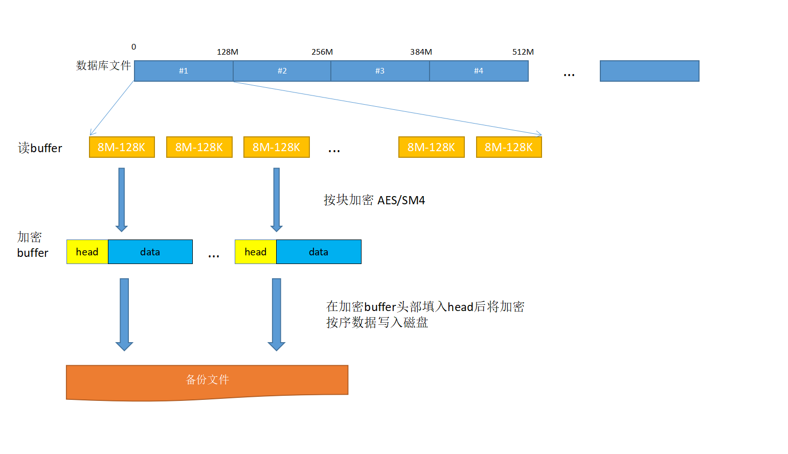

YashanDB支持在备份时指定加密策略，保障备份集数据的安全。用户可根据实际需求选择AES128、AES192、AES256或SM4加密算法，默认为SM4。

> **Note**:
>
> 如需采用SM4算法且需要使用OpenSSL工具时，请先参照[依赖项准备](../../../安装和升级/安装部署/安装前准备/依赖项准备)检查并确保服务器系统中已安装符合要求的工具。

备份加密的密钥采用与YashanDB用户密码一致的策略，并使用与其相同的密钥保护机制，保证在没有明文密码的情况下不会被破解，进一步保障了数据的安全。



备份加密可以在YashanDB提供的任一种备份方式里使用，详情请查阅[备份恢复](../../../数据库管理/备份恢复/00备份恢复)。增量备份的每个备份集需要保证统一的加密策略（都加密或都不加密），且每个备份集的密钥必须保持一致。

示例（单机、共享集群部署）

```sql
BACKUP DATABASE INCREMENTAL LEVEL 0 ENCRYPTION IDENTIFIED BY 12345;

BACKUP DATABASE INCREMENTAL LEVEL 1 ENCRYPTION SM4 IDENTIFIED BY 12345;
```

加密的备份集在恢复时必须进行解密才可使用，解密采取输入密码进行一致性校验的方式。

示例（单机、共享集群部署）

```sql
RESTORE DATABASE DECRYPTION 12345 FROM 'backup';
```
