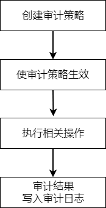

YashanDB数据库支持统一审计，能够记录用户的每一次操作，方便后期问题审查。

统一审计主要利用策略和条件在数据库内部有选择地执行有效的审计。将现有审计跟踪统一为单一审计跟踪，从而简化了管理，提高了数据库生成的审计数据的安全性。

统一审计操作流程如下：

## 审计项分类

YashanDB语法上支持权限审计、行为审计和角色审计，逻辑上包括了系统级、语句级、对象级进行审计，支持对指定用户或所有用户进行审计。

- 权限审计：当对某个系统特权启用审计策略后，只要在SQL语句或其他操作中使用了该系统特权就会被审计。[DBA_SYS_PRIVS](../../参考手册/系统视图/DBA视图/DBA_SYS_PRIVS.md)视图可以查询系统特权的授权记录。

- 角色审计：当对某个角色上启用审计策略后，所有直接被赋予给该角色的系统特权就会被审计。[DBA_ROLE_PRIVS](../../参考手册/系统视图/DBA视图/DBA_ROLE_PRIVS.md)视图可以查询系统特权的授权记录。

- 行为审计：包括系统操作行为审计和对象操作行为审计。

    - 系统操作行为审计：表示对创建/删除对象、建库/关库、提交/回滚等系统操作行为进行审计。在[V$AUDITABLE_SYSTEM_ACTIONS](../../参考手册/系统视图/动态视图/V$AUDITABLE_SYSTEM_ACTIONS)视图中可以查看当前所有可以作为审计项的系统操作行为，其中ALL表示对所有的系统操作行为都进行审计。

    - 对象操作行为审计：表示对某个已存在的具体对象的操作行为进行审计，例如对某张表的SELECT/INSERT/UPDATE/DELETE操作。在[V$AUDITABLE_OBJECT_ACTIONS](../../参考手册/系统视图/动态视图/V$AUDITABLE_OBJECT_ACTIONS)视图中可以查看当前所有可以作为审计项的对象操作行为，其中ALL表示对在一个对象上的所有操作行为都进行审计。

## 审计日志 

单机/共享集群/分布式集群部署中，审计日志可以存储在系统表（默认值）或外部文件中，由AUDIT_RECORD_TABLE参数控制。存算一体分布式集群部署中则只能存储在系统表中，无法进行调整。

| 目标端 | 日志查看方式 |日志写满表现 | 
|--------------------|--------------------|------------------|
| 系统表 | 可以通过[UNIFIED_AUDIT_TRAIL](../../参考手册/系统视图/DBA视图/UNIFIED_AUDIT_TRAIL)视图查看 |如果SYSAUX表空间容量不足无法再写入审计日志，会在运行日志run.log中产生形如“`[WARN][errno=02007]: [AUDIT……`”的告警信息，审计日志写满不影响数据库运行但会导致审计缺失。 需人工介入，清理日志或切换存储方式。 |
| 审计日志文件 | 无法从数据库层面查看，默认文件路径为$YASDB_DATA/log/audit/audit-yyyymmddhhmmss.aud |如果当前文件大小已达自定义阈值，会判断能否创建新文件（即文件总数是否达到自定义阈值），若能创建新文件则新建文件并继续在新文件中写日志；否则自动覆盖最早的日志文件。 |

单机/共享集群/分布式集群部署中，可通过执行[CHECK_AUDIT_THRESHOLD函数](../../开发手册/SQL参考手册/内置函数/CHECK_AUDIT_THRESHOLD)查看空间占用情况。同时，根据函数返回结果系统会自动运行容量超额预警机制以及自动转储机制：

- 容量超额预警机制：审计日志相关系统表占用SYSAUX表空间百分比超过自定义配置的警示值（AUDIT_RECORD_THRESHOLD参数）时，记录1条ACTION为“AUDIT RECORD THRESHOLD”的审计日志。

- 自动转储机制：审计日志相关系统表占用SYSAUX表空间百分比超过80%时转为文件存储审计日志，占比降至80%及以下切换回系统表存储。每次切换存储方式均会记录1条ACTION为“AUDIT RECORD SWITCH”的审计日志。

如果一直不执行CHECK_AUDIT_THRESHOLD函数触发自动转储、不手动调整存储方式，会始终保持当前配置向目标端写入审计日志直至写满。

为避免审计日志相关系统表过多占用SYSAUX表空间容量，建议定期[清理](审计日志管理)不必要的日志信息。单机/共享集群/分布式集群部署中还可以配置自动切换存储方式的定时任务，具体操作请查阅[安全审计基础配置](安全审计基础配置)。

## 异步审计

为减少审计对数据库性能的影响，YashanDB支持异步审计的方式写审计记录。该功能开关由AUDIT_QUEUE_WRITE参数控制，默认AUDIT_QUEUE_WRITE = TRUE，即开启异步审计。

异步审计将审计数据信息先写入审计数据队列，当审计数据队列达到阈值（数据刷新时间间隔、数据队列满）时再将数据批量插入审计记录表中，阈值可通过AUDIT_FLUSH_INTERVAL和AUDIT_QUEUE_SIZE进行调整。

异步审计可以减少对数据库性能的影响，但在一些异常情况下（例如数据库异常宕机）可能导致丢失部分审计数据。
