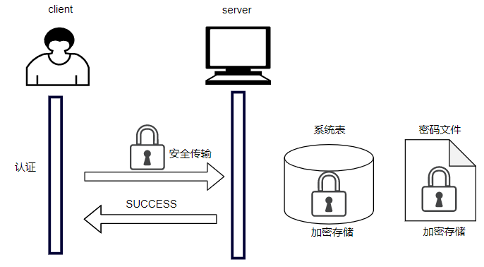

YashanDB对用户的密码采用加密存储，在存储的密码中添加盐值以有效防止彩虹攻击。认证过程中对用户输入的密码进行加密传输，保证密码在存储和传输过程的安全性。

服务端将密码哈希计算后，与存储的密码对比，验证其正确性。YashanDB采用密码文件与系统表配合的方法实现密码认证，并支持在数据库各个状态下的密码认证。



虽YashanDB支持多种认证方式，但对于绝大多数用户而言，密码认证是其登录数据库的唯一认证方式，保管好自己的密码即是保障了数据库的安全。同时，YashanDB也支持制定密码策略，加强用户对密码的管理。

用户的密码需由自己掌握和保管，为保障系统安全，用户必须安全地保管自己的密码，通常应该做到以下方面：

- 不将密码告诉他人，防止数据外漏或被盗取身份执行数据库操作。

- 使用命令行发起登录数据库请求时，使用YashanDB提供的提示输入功能，不显式地在命令行中输入密码，防止偷窥和窃取。

    例如：

    ```shell
    -- shell命令
    $ yasql sales@192.168.1.2:1688
    YashanDB SQL Enterprise Edition Release {版本号} x86_64
    please input password: 

    -- SQL命令
    SQL> conn sales
    please input password: 
    ```

- 在应用程序里发起登录数据库请求时，不直接在代码中记录明文密码。可由专人保管密码，其他开发人员通过配置使用但不感知密码内容，或加密后再交由开发人员使用。
