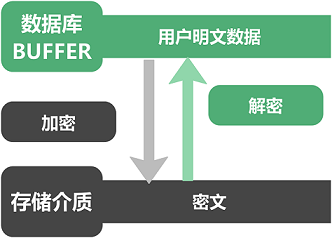

数据库的数据最终都是以存储介质为载体，除了对其物理上的安全保障（防止攻击、防止盗取）外，将数据进行加密存储是极其有效和牢固的安全保障方式。

基于透明加密技术，在用户自定义配置数据库对象的加密属性后，YashanDB可以实现在用户和应用程序完全无感知的情况下，由数据库自动完成数据的加密和解密过程。数据在被写入存储介质时自动加密，最终以密文形式进行存储；从存储读取至数据库buffer中时自动解密，以明文形式进行结果呈现。加/解密过程对应用程序完全透明，数据库层的访问控制、数据操作以及SQL查询等都不会受任何影响。



YashanDB采用符合中国或国际标准的加密算法进行数据透明加密，支持AES128算法和SM4算法，在保证密文的破解难度外，同时兼顾了加解密对数据库的低性能损耗。为了提高安全性，YashanDB通过多级密钥管理体系进一步对数据密钥进行加密保护。

> **Note**:
>
> - 如需使用国密算法SM4、数据透明加密相关的密钥管理功能，请先参照[依赖项准备](../../../安装和升级/安装部署/安装前准备/依赖项准备)检查并确保服务器系统中已安装符合要求的工具。
>
> - 密钥管理功能不适用于存算一体分布式集群部署，在存算一体分布式集群部署中请直接创建加密对象。

## 功能介绍

### 加密颗粒度

YashanDB支持三种数据透明加密颗粒度，分别是表空间级别、表级别和列级别。

### 加密算法

支持加密算法AES128和国密算法SM4。

### 功能约束

- 在单机/共享集群/分布式集群部署中，创建加密对象前必须先完成密钥管理相关配置，包括创建钱包、开启钱包、设置主密钥等。

- 加密属性只能在创建对象时指定，后续无法修改。如果是列加密，加密列的其他属性也无法修改。创建对象的操作包括：新建表空间、新建表以及为已有表新增列字段。

- sys用户不能使用表加密和列加密。

- 列加密仅适用于HEAP表和LSC表，且不能为临时表。需加密的目标列必须满足如下要求：

    - 若同时需为该列创建索引，只能指定为等值查询的BTREE索引。

    - 该列不能为分区键或子分区键。

    - 该列不能为AC对象所依赖的列。

    - 该列不能为外键列或外键所依赖的键。

    - 若为LSC表的列加密，该列的数据类型不能为LOB类型。

- 加密算法统一性要求：

    - 在一个表中，对多个列进行加密时，加密算法必须统一。

    - 在一个表中，同时使用列加密和表加密时，加密算法必须统一。

- 对于加密表空间中的表对象，在其上创建的索引和AC也必须位于某个加密表空间。

##  使用数据透明加密

在单机/共享集群/分布式集群部署环境中，部分场景需要先[配置并开启钱包](密钥管理.html#configuringwallet)：

- 存量加密对象：例如从YashanDB 23.2升级至YashanDB 23.4后，数据库中原有的加密对象无需配置钱包和密钥可继续正常使用。如需为原有加密对象启用密钥管理功能，则需配置并开启钱包。

- 新增加密对象：需要先配置钱包，并在日常启停数据库时按要求开启钱包。

在存算一体分布式集群部署中，无钱包和密钥管理功能，直接创建并使用加密对象即可。

### 创建加密表空间

具体操作请查阅CREATE TABLESPACE的[encryption_clause](../../../开发手册/SQL参考手册/SQL语句/CREATE TABLESPACE.html#encryptionclause)子句。

```sql
-- 新建加密表空间，默认采用SM4加密算法
CREATE TABLESPACE encrypt_tb ENCRYPTION ENCRYPT;

-- 新建加密表空间，并指定采用AES128加密算法
CREATE TABLESPACE aes128_tb ENCRYPTION USING 'AES128' ENCRYPT;
```

### 创建加密表

具体操作请查阅CREATE TABLE的[table_encryption_clause](../../../开发手册/SQL参考手册/SQL语句/CREATE TABLE.html#tableencryptionclause)子句。

```sql
-- 创建加密表，默认采用AES128加密算法
DROP TABLE IF EXISTS encrypt_branches;
CREATE TABLE encrypt_branches
(branch_no CHAR(4), 
branch_name VARCHAR2(200), 
area_no CHAR(2), 
address VARCHAR2(200)) 
ENCRYPT;

-- 创建加密表并指定使用SM4加密算法
DROP TABLE IF EXISTS encrypt_area;
CREATE TABLE encrypt_area
(area_no CHAR(2), 
area_name VARCHAR2(60), 
DHQ VARCHAR2(20)) 
ENCRYPT USING 'SM4';
```

### 创建含加密列的表

具体操作请查阅CREATE TABLE的[column_encryption_clause](../../../开发手册/SQL参考手册/SQL语句/CREATE TABLE.html#columnencryptionclause)子句。

示例（HEAP表、LSC表）

```sql
-- 创建员工信息表并对employee_ID列加密，并指定采用SM4加密算法
DROP TABLE IF EXISTS encrypt_col_employees;
CREATE TABLE encrypt_col_employees
(branch CHAR(4), 
department CHAR(3), 
employee_no CHAR(10) NOT NULL PRIMARY KEY, 
employee_name VARCHAR2(10), 
employee_ID CHAR(18) ENCRYPT USING 'SM4', 
sex CHAR(1), 
entry_date DATE
);
```

### 为已有表新增加密列

具体操作请查阅ALTER TABLE的[column_encryption_clause](../../../开发手册/SQL参考手册/SQL语句/ALTER TABLE.html#columnencryptionclause)子句。

示例（HEAP表、LSC表）

```sql
-- 在encrypt_col_employees表中新增address列并加密，必须采用相同的加密算法
ALTER TABLE encrypt_col_employees ADD address VARCHAR(200) ENCRYPT USING 'SM4';
```
