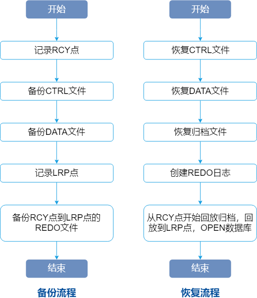

数据备份与恢复是确保数据在遇到灾难或不可预见的事件后能够恢复的重要机制。

传统的备份方法分为离线备份（冷备）和在线备份（热备），冷备表示将数据库关闭后通过操作系统命令进行文件系统的复制，热备表示在数据库正常运行期间所进行的在线备份。

YashanDB支持在线备份，用户可以根据自身业务需求定期备份数据，提升数据库系统应对故障的能力，一旦遇到问题也有合适的备份集用于恢复数据，防止数据丢失。

## 备份与恢复流程

备份与恢复流程如下图所示：

备份功能要求数据库运行于OPEN状态且归档模式开启，执行备份时以数据块的方式从物理文件读取数据写入备份文件中，在读取物理文件时会对相应数据块加锁，防止备份期间写入数据。

恢复功能要求数据库运行于NOMOUNT状态，执行时将备份集中的文件，以数据块为基本单位拷贝回数据库的文件中，并回放归档日志，对数据库进行一致性恢复。

## 备份集

备份集是指对数据库执行备份操作后生成的若干文件集合。当备份介质为磁盘时，备份集以文件夹的形式存在，用户可以自定义指定备份集文件夹的名称和存放路径。

在生成备份集的过程中，可能会进行切片、压缩、加密等操作，因此备份文件的大小以及个数与目标文件不一定相等。

备份集中可能包含以下文件：

- backup_profile文件：备份集的元数据信息。
- backup_filelist文件：当前备份集中所有文件的校验信息。
- ctrl*.bak文件：数据库控制文件的备份。
- data*.bak文件：数据库所有数据文件的备份。
- arch*.bak文件：数据库归档日志文件的备份集合。
- redo*.bak文件：数据库redo文件备份集合，一般存在于在备库执行备份生成的备份集内。
- bucket*.bak文件：slice文件的备份集合。

## 备份策略

|  备份策略项&nbsp;&nbsp;| &nbsp;&nbsp;| 说明|
|---------|-----------|---------------|
| 备份颗粒度 | 全库备份 | 数据库所有数据文件（包括控制文件、数据文件、归档文件等）的拷贝 |
|  | 归档备份 | 针对目标数据库当前已存在的归档文件执行的备份操作  |
| 备份目的地 | 本地备份 | 备份集存储在执行实例服务器本地磁盘，或执行实例可访问的共享存储上 |
|  | 流式备份 | 又称远程备份，通过网络将备份集发送到远程服务器进行保存|
| 备份集压缩 |   | 执行备份时，可以按需指定不同的压缩算法对新生成的备份集进行压缩，使用该类备份集进行恢复时需指定解压 |
| 备份集加密 |   | 执行备份时，可以按需指定不同的加密算法对备份数据集加密，使用该类备份集进行恢复时需解密 |

## 备份方式

备份方式分为全量备份和增量备份。

- 全量备份：将备份目标的文件完全拷贝，全量备份生成的备份集包含完整的数据文件，可以单独用于恢复。
- 增量备份：首次备份时备份全量数据生成LEVEL 0备份集，后续只备份某一次备份后发生过修改的数据页面生成LEVEL 1备份集。增量备份可以减少备份集占用的空间，但增量备份集不能单独用于恢复，需要先恢复其依赖的基线备份集。增量备份分为差异增量备份和累积增量备份。
    
    - 差异增量备份：以最近一次增量备份集（可能是LEVEL 0，也可能是LEVEL 1）作为基线备份集进行增量备份。恢复时，需要依次所有增量备份集恢复。

    - 累积增量备份：以最近一次LEVEL 0备份集作为基线备份集。恢复时，只需要依次恢复基线备份集和当前最新的累积增量备份集。

## 恢复模式

根据不同的场景需求，恢复可基于不同的备份集分为全量恢复或指定时间点恢复（PITR）。

- 全量恢复：基于相应备份集将数据库恢复到执行备份的时间点。对于全量备份集，直接一次性恢复；对于增量备份集，需先恢复基线备份集再恢复相关的增量备份集。
- 指定时间点恢复：允许数据库恢复到备份时间点至最新时间点间的任意时间。

## 备份恢复操作

备份恢复操作支持使用SQL语句和使用yasrman工具：

- 使用SQL语句：备份集必须存放在数据库服务端。
    
    - 备份：[BACKUP DATABASE](../../开发手册/SQL参考手册/SQL语句/BACKUP DATABASE)语句
    - 恢复：[RESTORE DATABASE](../../开发手册/SQL参考手册/SQL语句/RESTORE DATABASE)和[RECOVER DATABASE](../../开发手册/SQL参考手册/SQL语句/RECOVER DATABASE)语句

- 使用[yasrman](../../工具手册/yasrman/00yasrman)工具：可以远程发起备份/恢复操作，备份集可以按需选择存放在工具端或数据库服务端。

关于备份恢复的详细操作过程请查阅[备份与恢复](../../数据库管理/备份与恢复/00备份与恢复)。
除了直接进行热备与恢复外，使用[exp](../../工具手册/exp/00exp)工具导出数据形成文件备份，然后在有需要时使用[imp](../../工具手册/imp/00imp)导入数据，也可以达到备份恢复的效果。
