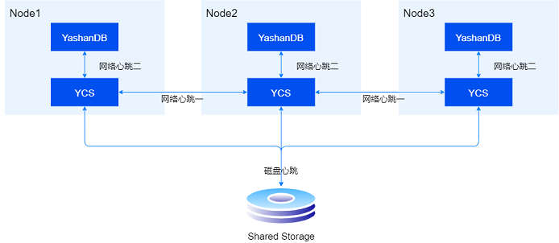
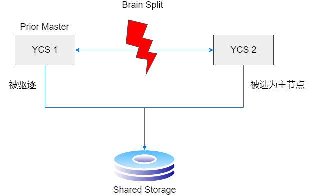

集群服务高可用指的是当软件、硬件或者操作失误等原因导致集群中服务器发生故障时，该服务器将被踢出集群，服务器上承载的业务迁移到其他服务器，保证数据库服务能够正常进行。同时，当该服务器的故障恢复后，将其重新纳入集群中。

## 心跳机制

YCS通过心跳机制来监控故障的发生与恢复，当检测到故障时，进入对应的故障处理流程；当检测到故障恢复时，将服务器或者资源重新纳入集群管理之中。

为确保及时感知服务器和资源的状态变化，YCS建立了多种心跳机制，包括：

- **磁盘心跳**

  所有服务器定时更新心跳序号并写入投票盘的同时读取其他服务器的磁盘心跳，根据是否及时写入的情况判断其他服务器是否异常。

  配置参数DISK_HB_KEEP_ALIVE决定了判定服务器磁盘心跳超时的等待时间，一旦在DISK_HB_KEEP_ALIVE配置的时间内，某服务器都没有更新磁盘心跳，则视为异常，并启动异常处理流程。

- **网络心跳**

  包括网络心跳一和网络心跳二：

  - 网络心跳一：所有YCS服务器，两两之间都会定时发送心跳，一旦不能及时收到心跳，会认为服务器异常。
  - 网络心跳二：DB通过UDS连接，定时发送心跳给YCS服务端，一旦不能及时收到心跳，会认为该资源异常。

  配置参数NETWORK_HB_TIMEOUT决定了判定服务器/资源网络心跳超时的等待时间，一旦在NETWORK_HB_TIMEOUT配置的时间内，某服务器/数据库实例都没有更新网络心跳，则视为异常，并启动异常处理流程。



## 投票仲裁

当集群无主或通过心跳机制判定某服务器异常时，集群会进入投票仲裁流程。



投票流程会首先选出计票服务器，然后由计票服务器根据每个节点的网络可见列表、运行状态及其他信息判断旧集群是否因为网络隔离被划分为多个脑裂的子集群。若是，计票服务器会选择成员数最多的子集群幸存（成员数一致时有旧主的幸存）并在幸存子集群内选出主服务器，同时将幸存子集群外的所有服务器计入待驱逐列表；若否，仅集群内异常的服务器会被计入待驱逐列表，若异常的是主则选出新主。

投票仲裁完成后，计票服务器将幸存子集群的成员信息以及待驱服务器的信息写入投票盘，交由主服务器处理。主服务器会先根据集群配置的FENCE_TYPE对每个待驱逐服务器执行相应的[I/O Fencing操作](../集群服务管理/IO Fencing/00IO Fencing)，以避免已被驱逐的服务器上的数据库实例的在途I/O写坏数据文件。所有驱逐流程完成后，主服务器将更新服务器状态、重新生成集群成员关系并通过拓扑同步到整个集群。

## 拓扑状态查看

通过ycsctl status命令可以查看YCS拓扑的状态，包含服务器号、主服务器、资源等。

1. 发生故障前两个YCS服务器的拓扑信息（显示的服务器数目等于部署的服务器数目）：

  ``` shell
  $ ycsctl status
  ---------------------------------------------------------------------------------------------
  Self Host ID|Cluster Master ID|YasFS Master ID|YasDB Master ID|Active Host Count
  ---------------------------------------------------------------------------------------------
  1            1                 1               1               2
  ---------------------------------------------------------------------------------------------
  Host ID   |Target    |State     |YasFS     |YasDB     |VIP
  ---------------------------------------------------------------------------------------------
  1          online     online     online     online     host1.online
  2          online     online     online     online     host2.online
  ```

2. 当一个YCS服务器发生故障时，会进入故障处理流程。例如Host1磁盘心跳故障，Host2检测到Host1故障后，进入投票仲裁流程。当集群发起投票时，会在日志打印“vote”相关信息：

  ```shell
  abnormal found, trigger a new vote cycle
  ```

3. 当集群投票成功后，对于新的主服务器，日志打印如下信息：

	```shell
	ycs run as primary successfully
	```

   对于非主服务器，日志打印如下信息：

	```shell
	try join primary
	```

4. 投票仲裁结束后查看拓扑信息：

	```shell
	$ ycsctl status
	-----------------------------------------------------------------------------------------
	Self Host ID|Cluster Master ID|YasFS Master ID|YasDB Master ID|Active Host Count
	-----------------------------------------------------------------------------------------
	2       2            2                 2               2                1         
	-----------------------------------------------------------------------------------------
	Host ID   |Target    |State     |YasFS     |YasDB     |VIP
	-----------------------------------------------------------------------------------------
	1          online     offline    offline    offline    host2.online
	2          online     online     online     online     host2.online
	```

## YCSM监控

YCSM监控进程是独立运行的进程，在YCS进程启动时最先启动，YCS进程退出后退出，用于持续监控YCS进程的状态。YCSM进程具备以下能力：

- **监控YCS进程状态并处理**

  YCSM进程与YCS进程间存在本地心跳，一旦本地心跳超时，YCSM进程将强制停止并重新启动YCS进程及其所管理的数据库实例，本地心跳的超时时间与磁盘心跳的超时时间一致。

- **YCS进程掉线拉起**

  当YCS进程不存在且为非正常停止状态时，YCSM进程会主动拉起YCS进程。
