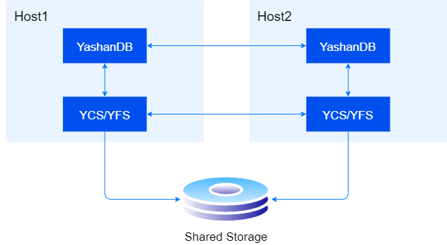

## 系统概述

崖山集群服务（后续简称YCS）是YashanDB的一个集群管理组件，提供包括服务器管理、资源管理、集群监控、集群高可用等能力，支撑YashanDB共享集群从部署到启停的完整形态的稳定运行。

下图是集群数据库的物理部署示意图，硬件上包括两台服务器和一台共享存储，每台服务器视为集群的一个节点；其中YFS运行期无独立进程，由YCS进程看护，不同服务器之间的YCS通过网络互联；数据库实例运行期有独立进程，不同服务器之间的实例进程通过网络互联；在同一个服务器上，数据库实例使用UDS方式连接到YCS和YFS。

## 服务器管理

一套共享集群由若干台服务器组成，当某台物理服务器宕机时，共享集群仍能正常提供服务。每个服务器上运行一套YCS/YFS进程和一套YashanDB进程。

YCS对服务器的管理包括集群中服务器增删和集群服务器启停。

也可以在YashanDB的安装过程中，通过调整toml文件实现对服务器的配置指定。

YCS提供启停命令，实现对集群中指定服务器的启动和停止，默认情况下服务器上的YCS服务、YFS服务、数据库实例将一起被启停；其中，数据库实例允许配置是否随YCS服务一起启停，YFS则不允许配置为单独启停。

## 资源管理

YCS管理的资源包括外部资源YashanDB、内嵌资源YFS和节点服务资源VIP。

其中，对外部资源需要配置启动资源和停止资源的shell脚本（start.sh，stop.sh）。在YashanDB安装过程中这些shell脚本已自动生成，且不可以删除，否则将导致数据库无法启动。

使用ycsctl show config命令可以查看当前的资源信息。

## 集群监控

**数据库状态监控**

YCS定期检测数据库实例的状态，当实例离线时，根据配置参数AUTO_START决定是否自动拉起DB，根据配置参数RESTART_TIMES决定拉起次数（RESTART_TIMES为0表示不拉起实例）。

**告警事件**

YCS实现了一套告警机制，当发生特定状况时，在告警日志中上报告警事件，状况解除时，消除告警事件（对无需消除的告警事件不进行消除）。

**运行日志**

YCS实现了与数据库类似的运行日志记录和管理功能，供管理员在需要时查看和分析。

**操作系统负载监控**

YCS实现了一套操作系统负载监控机制OS Watcher，定期收集操作系统当前的负载信息，供管理员在需要时查看和分析。

## 集群高可用

YCS通过网络心跳+磁盘心跳确认各服务器和资源运行状态是否正常，在资源异常或者服务器异常时，将相关资源或者服务器逐出集群，避免脑裂，实现共享集群服务的高可用。
