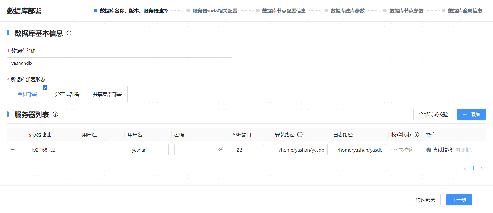
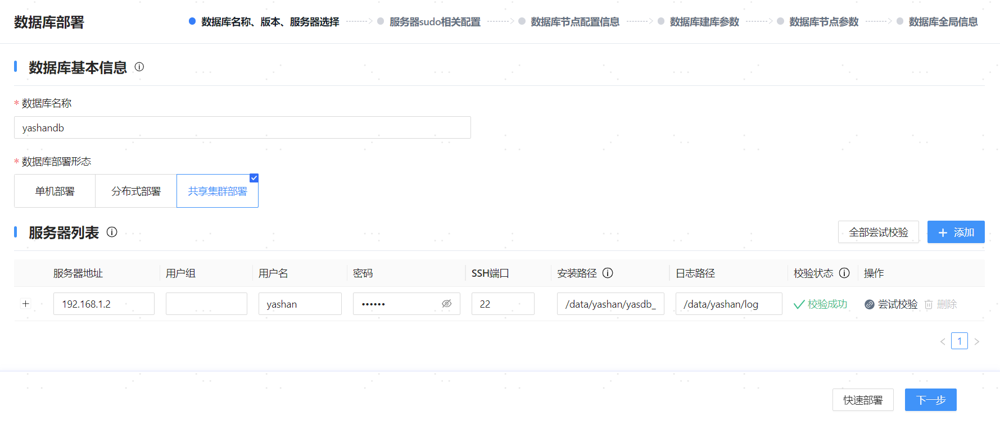
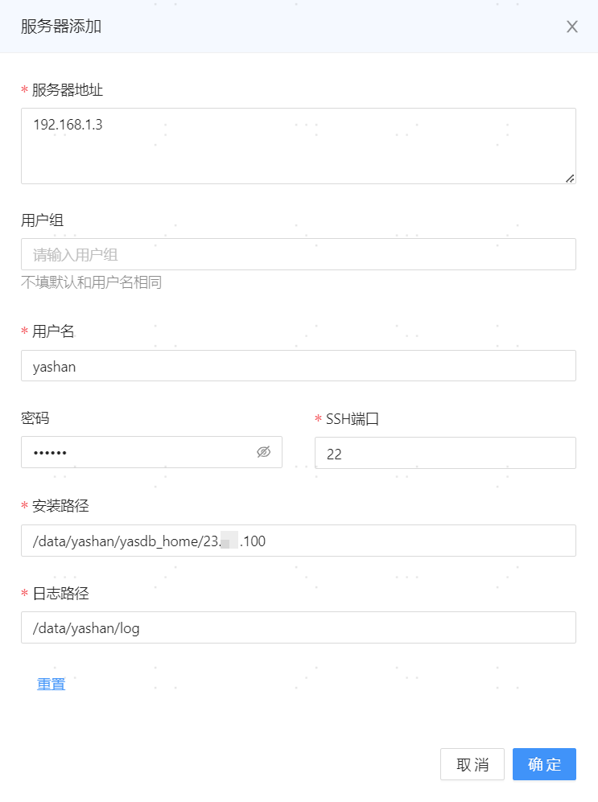
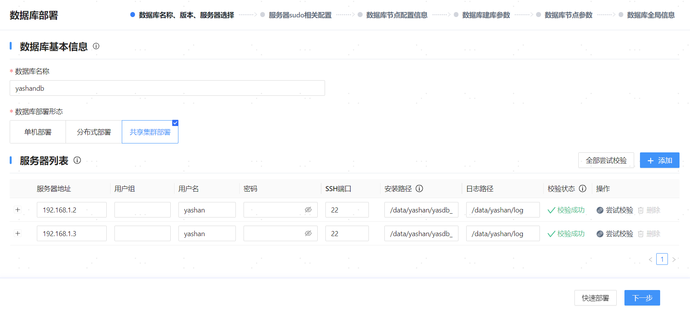
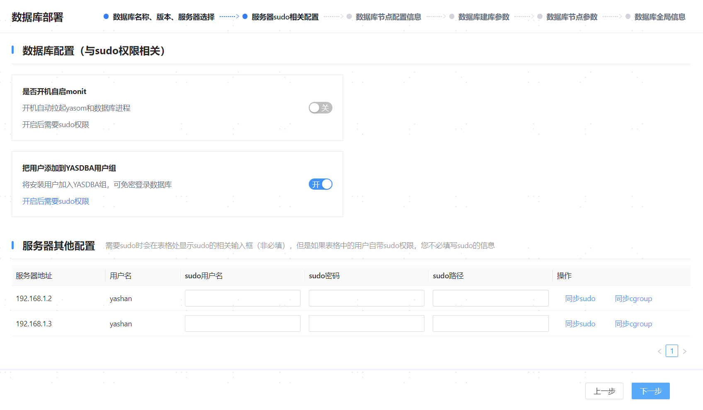
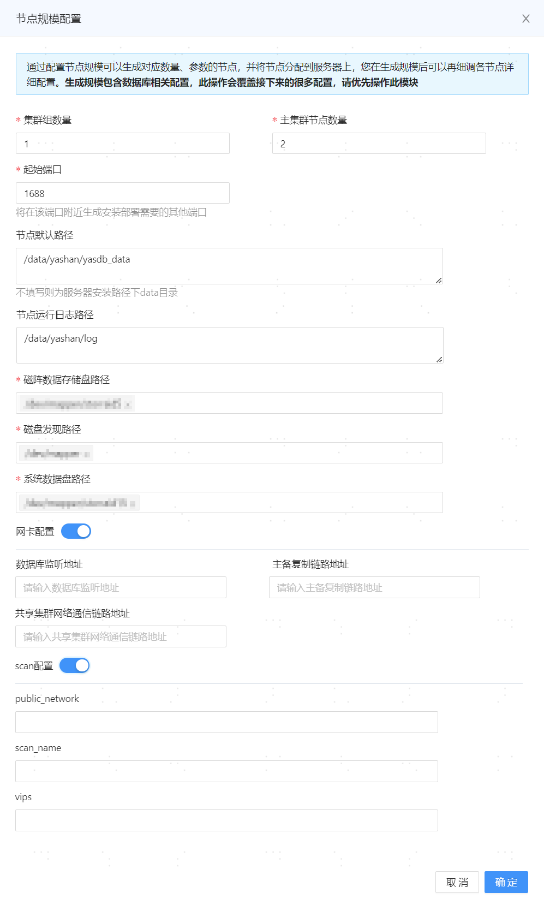
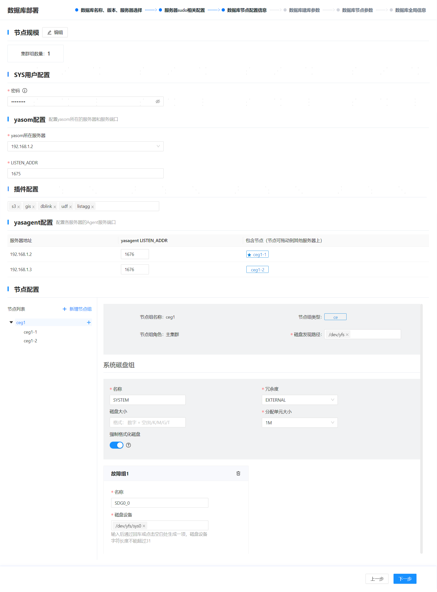
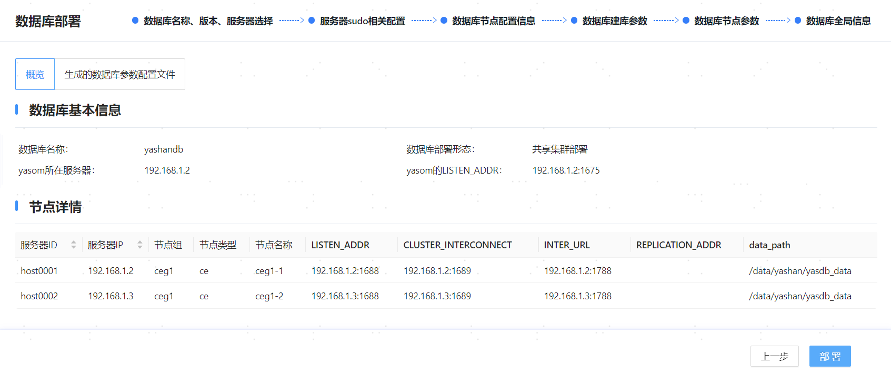
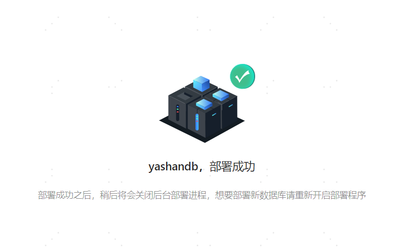

## 步骤1：启动Web服务

1. 以yashan用户登录192.168.1.2服务器。

2. 执行如下命令，进入安装目录下Web服务所在的目录。
    ```shell
    $ cd /home/yashan/install/om
    ```

3. 执行如下命令，使用yasom启动Web服务端：
    ```shell
    $ ./bin/yasom --web --listen 192.168.1.2:9001
    ```

    - --web：指定以Web服务端启动。

    - --listen：指定监听的地址（即可视化安装的网页地址），格式为`IP:PORT`，通常设置为当前服务器的IP，端口推荐使用9001。

4. 在PC端浏览器中访问可视化安装的网页地址。

   

## 步骤2：配置数据库基本信息与服务器信息

1. 根据实际情况，配置数据库基本信息：
   
   - 数据库名称：填写数据库集群名称，该名称也将作为初始数据库的名称（database name）。必须以字母开头，支持字母（区分大小写）、数字以及下划线，长度为[4,64]个字符，例如yashandb。

   - 数据库类型：选择数据库部署形态，例如集群。

> **Note**:
>
> 如需复用/清理当前环境中的配置信息记录（可能会保留配置信息的场景：可视化安装成功后又卸载数据库、可视化安装失败等），可单击【数据库名称】输入框，在下拉选项中选择/清理对应的配置。
> 
> 

2. 在服务器列表中，默认识别Web服务所在服务器的信息，检查确认安装路径等信息无误后单击【尝试校验】检查正确性。

   

3. 单击服务器列表右上方的【添加】。

4. 在弹出的对话框中，配置其他服务器信息，单击【确定】保存配置。
   
   - 服务器地址：服务器的IP地址，格式：`192.168.1.3`或`192.168.1.[3-4]`，允许配置多个IP地址/集，使用换行符分割。

   - 用户组：安装用户所属用户组，不填写默认和用户名相同。

   - 用户名：安装用户的名称，例如yashan。

   - 密码：可选参数，安装用户的密码，若已配置当前服务器对其他服务器SSH免密，无需填写密码。

   - SSH端口：SSH端口，例如22。

   - 安装路径：数据库安装路径，建议配置为规划的[HOME目录](../安装前准备/目录划分)/{版本号}（此处不校验/{版本号}子目录是否存在，安装过程中会自动创建），支持数字、字母（区分大小写）以及部分符号（`/`、`-`、`_`、`.`），例如/data/yashan/yasdb_home/{版本号}。

   - 日志路径：[运行日志目录](../安装前准备/目录划分)，例如/data/yashan/log。

   

5. 单击【全部尝试校验】检查正确性。

   

6. 确认信息无误后，单击【下一步】。

## 步骤3：配置服务器sudo

1. 在数据库配置区域，可以配置以下功能：

   - 开机自启monit：开启时，守护进程将在服务器开机后自行启动并拉起YashanDB的各个进程，间接实现数据库的开机自启动。

   - 用户添加到YASDBA用户组：开启表示将安装用户加入YASDBA组，可免密登录数据库。

   上述功能开启后均需安装用户具备sudo权限，本示例使用默认配置，即仅开启将用户添加到YASDBA用户组。
   
   > **Note**:
   >
   >若【开机自启monit】参数设置为关闭但后续需使用相关功能，可参考[配置开机自启动](../安装后初始环境/配置开机自启动)完成相关配置。
   
   

2. 确认信息无误后，单击【下一步】。

## 步骤4：配置集群节点信息

1. 在弹出的节点规模配置对话框中，根据[实际规划](../安装前准备/服务器准备)的实例数调整相关配置，单击【确定】保存信息。

   - 集群组数量：共享集群组的数量。例如1为搭建1个集群，2为搭建一主一备集群，3为搭建一主两备集群，以此类推。此例中以搭建1个集群为例。

   - 主集群节点数量：选择主集群的数据库实例数量。

   - 备集群节点数量：选择备集群的数据库实例数量。如果集群组数量大于1，会出现该输入框。

   - 起始端口：填写数据库监听端口的起始值，若存在多个监听端口系统会根据[端口划分规则](../安装前准备/安装初始环境调整)自行计算，默认值为1688。

   - 节点默认路径：填写YashanDB的数据目录，置空则默认为服务器安装路径上一级目录的yasdb_data目录，**安装后修改不生效**，支持数字、字母（区分大小写）以及部分符号（`/`、`-`、`_`、`.`），最长71个字符，例如/data/yashan/yasdb_data。

   - 节点运行日志路径：填写YashanDB的运行日志路径，置空则默认为服务器安装路径上一级目录的log目录，推荐和主机列表的日志路径一致。例如/data/yashan/log。

   - 磁盘发现路径：填写为磁盘发现路径，用于发现集群共享存储的磁盘路径，该路径是磁阵数据存储盘路径和系统数据盘路径的父级目录，例如/dev/yfs。

   - 磁阵数据存储盘路径：填写为数据盘规划的共享存储LUN路径，例如/dev/yfs/data0。

   - 系统数据盘：填写为系统数据盘规划的共享存储LUN路径，例如/dev/yfs/sys0、/dev/yfs/sys1和/dev/yfs/sys2。

   - 网卡配置：可以将数据库监听地址、主备复制链路地址和共享集群网络通信链路地址配置为不同的网段，格式为`192.168.1.0/24`。

   - scan配置：配置公网子网、SCAN域名或VIP信息。

      - public_network：共享集群对外提供服务的公网，格式为子网/子网掩码[/网卡名]，网卡名可以省略，例如：192.168.1.0/24

      - scan_name：共享集群的SCAN域名，需配合--public-network参数使用

      - vips：共享集群的VIP配置信息，格式为IP地址/子网掩码[/网卡名]，例如：192.168.1.62/255.255.255.0/ens192，如果无法确保同一集群中所有服务器访问公网的网卡名一致，则必须省略网卡名。需配合--public-network参数使用，且IP地址应属于公网网段。VIP个数与节点个数一致，多个VIP配置之间用逗号`,`隔开
   
   

2. 在SYS用户配置区域，设置数据库超级管理员SYS用户的密码，配置要求如下：

    - 密码长度为8 - 64位。
    
    - 密码中不能包含对应的数据库用户名称。
    
    - 密码必须同时包含数字、字母和特殊字符。

    - Linux OS命令相关的特殊字符（例如`@`、`/`、`.`、`!`、`$`、`'`等）需进行转义。

3. 在yasom配置区域，可根据实际情况调整yasom所在服务器和监听端口。

   - yasom所在服务器：默认为当前服务器IP。

   - LISTEN_ADDR：yasom的监听端口，默认为1675。

4. 在插件配置区域，可按需选择需要安装的插件。

5. 在yasagent配置区域，可按需调整以下配置：

   - yasagent LISTEN_ADDR：yasagent的监听端口，默认为1676。

   - 包含节点：显示每个服务器上对应部署的数据库实例信息，带星标的实例角色为主，其他为备。可拖拽实例调整其分布。

6. 在节点配置区域，可按需调整以下配置：
   
   - 单击节点组（如下图ceg1），可以对该节点组的磁盘相关配置进行修改。

   - 修改节点规模：增删节点/节点组。例如单击【增加节点组】，可增加备集群；单击节点组（如下图ceg1）旁边的【+】，可为该集群增加实例；单击实例名称（如下图ceg1-1）旁边的删除标志，可删除该集群的实例。

   - 展开数据库实例列表，单击实例名称（如下图ceg1-1），查看实例信息，可按需调整相关配置。

     
7. 确认信息无误后，单击【下一步】。

## 步骤5：设置建库参数

在【数据库建库参数】页面，可参考[共享集群配置文件](../../../工具手册/yasboot/配置文件/共享集群配置文件)按需增/删/改建库参数，参考[共享集群YFS参数配置](../../../共享集群/集群文件系统/集群文件系统配置)按需增/删/改YFS参数，参考[共享集群YCS参数配置](../../../共享集群/集群服务管理/共享集群配置)按需增/删/改YCS参数，确认信息无误后，单击【下一步】。

## 步骤6：设置配置参数

在【数据库节点参数】页面，可按需增/删/改各数据库实例的参数，确认信息无误后，单击【保存并下一步】。

## 步骤7：部署数据库

1. 在【数据库全局信息】页面，确认信息无误后，单击【部署】。

   

2. 当出现下面提示时，表示部署完成，可以手动关闭网页，服务端会在一定时间内自动退出。

   

> **Note**:
>
>部署完成后，yasom会在`/home/yashan/install/conf/CE/yashandb`目录中生成hosts.toml和yashandb.toml文件，其中yashandb为数据库名称，此目录为安装目录。

## 步骤8：配置环境变量

部署成功后，前面步骤中配置的安装路径（例如/data/yashan/yasdb_home/{version_number}）下会生成子目录/conf，该目录下会自动生成YashanDB相关的环境变量文件`{集群名称}.bashrc`，需将其应用于操作系统。

以安装用户登录到每个服务器上，执行如下命令生效环境变量。

```shell
# 进入环境变量文件所在目录，例如/data/yashan/yasdb_home/{version_number}/conf
$ cd /data/yashan/yasdb_home/{version_number}/conf

# 生效环境变量
$ cat yashandb.bashrc >> ~/.bashrc
$ source ~/.bashrc

# 校验环境变量是否生效（回显信息中的路径请以实际为准）
$ echo $YASDB_DATA
/data/yashan/yasdb_data/ce-1-1
```

具体的环境变量介绍请查阅[安装后初始环境 > 环境变量](../安装后初始环境/环境变量)。

## 步骤9：检查安装结果

若连接报错或执行SQL语句报错，请根据错误提示信息检查安装步骤，或咨询我们的技术支持。

1. 使用[yasql](../../../工具手册/yasql/yasql使用指导)工具连接数据库，查看实例状态。

    ```shell
    $ yasql sys/********@192.168.1.2:1688
    SQL> SELECT STATUS FROM V$INSTANCE;

    STATUS        
    ------------- 
    OPEN        

    SQL> SELECT database_name FROM v$database;

    DATABASE_NAME                                                    
    ---------------------------------------------------------------- 
    yashandb
    ```

2. （可选）创建数据库用户并赋权，更多操作请查阅[用户管理](../../../产品安全/身份标识与鉴别/管理用户)。

    ```shell
    SQL> CREATE USER sales IDENTIFIED BY sales;
    
    SQL> GRANT CONNECT TO SALES;
    ```
