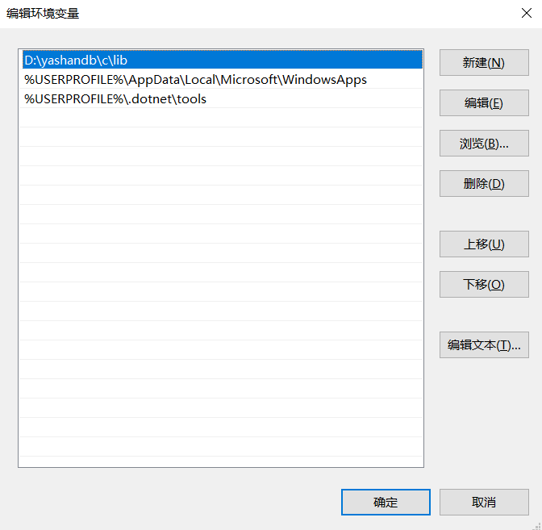
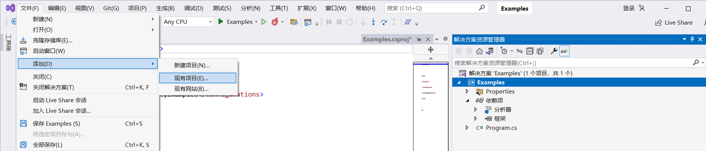
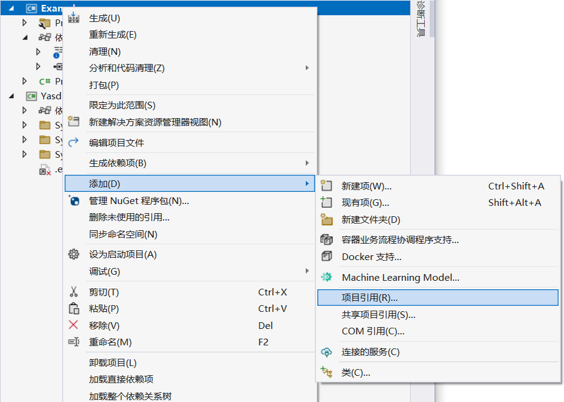
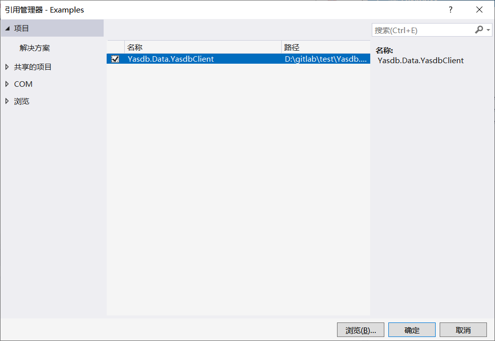

## 安装.NET环境

开发.NET应用程序需要先安装.NET开发环境，YashanDB ADO.NET驱动要求的.NET版本如下：

- .NET 2.0
- .NET 5.0
- .NET 6.0

**对于Windows平台**

> **Note**:
> 
> 目前仅支持Windows 10及以上版本。

1. 通过官方路径下载并安装适用于Windows的上述版本的.NET。

2. 安装Visual Studio或类似的集成开发环境来编写和编译C#源代码，本手册以Visual Studio为例进行介绍。

3. 运行dotnet --version验证.NET环境是否正常：

    ```shell
    C:\>dotnet --version
    6.0.301

    C:\>
    ```

**对于Linux平台**

1. 通过官方路径下载并安装适用于Liunx的上述版本的.NET。

2. 运行dotnet --version验证.NET环境是否正常：

    ```shell
    $ dotnet --version
    6.0.301
    $ 
    ```

## 安装依赖项

为了正确使用YashanDB ADO.NET驱动，还需安装YashanDB C驱动客户端并设置环境变量，可自行选择当前或之前版本的YashanDB C驱动客户端使用。

**对于Windows平台**

1. 参考[YashanDB软件包清单](../../安装和升级/安装部署/安装前准备/下载软件包)获取YashanDB客户端安装包yashandb-client-*版本号*-windows-x86.zip。

2. 下载并解压到本地路径，例如D:\yashandb\client。
3. 设置环境变量PATH，指向该文件路径下的lib文件夹。

    

**对于Linux平台**

1. 参考[YashanDB软件包清单](../../安装和升级/安装部署/安装前准备/下载软件包)获取YashanDB客户端安装包yashandb-client-*版本号*-linux-x86_64.tar.gz。

2. 下载并解压到本地路径，例如/opt/yashandb/client。
3. 设置环境变量。

    ```shell
    export LD_LIBRARY_PATH=/opt/yashandb/c/lib:$LD_LIBRARY_PATH
    ```

## 安装YashanDB ADO.NET驱动

1. 参考[YashanDB软件包清单](../../安装和升级/安装部署/安装前准备/下载软件包)获取YashanDB ADO.NET驱动安装包yashandb-dotnet-*版本号*.zip。

2. 将压缩包下载并解压到本地路径，例如/path/Yashandb.Data.YashandbClient。

3. 编辑应用程序项目，将Yashandb.Data.YashandbClient项目引用到该项目。本手册使用的项目文件示例为Examples，具体内容见[YashanDB ADO.NET驱动使用示例](YashanDB ADO.NET驱动使用示例)章节描述。

    **对于在Visual Studio开发的应用程序**

    1. 打开应用程序项目Examples，单击【文件 > 添加 > 现有项目】，单击Yashandb.Data.YashandbClient所在路径，选择Yashandb.Data.YashandbClient.csproj文件，将Yashandb.Data.YashandbClient加入到应用所在解决方案内。
    
	
    
    2. 右键单击Examples应用程序项目，依次选择【添加 > 项目引用 > 项目】，勾选Yashandb.Data.YashandbClient选项。

        
		
        
    
    **对于在命令行开发的.NET应用程序（以Linux环境为例）**

    1. 进入Examples应用程序项目所在文件夹，通过dotnet命令将Yashandb.Data.YashandbClient项目添加到该应用程序项目内。

        ```bash
        dotnet add reference /path/Yashandb.Data.YashandbClient/Yashandb.Data.YashandbClient.csproj
        ```

    完成项目引用后，该应用程序即可进行对YashanDB数据库的访问操作。

### 下载dll链接库安装

1. 将dll文件拷贝到项目路径下。

2. 在项目csproj文件下添加项目引用。

    ```xml
    <ItemGroup>
        <Reference Include="Yashandb.Data.YashandbClient">
            <HintPath>Yashandb.Data.YashandbClient.dll</HintPath>
        </Reference>
    </ItemGroup>
    ```

    完成项目引用后，该应用程序即可进行对YashanDB数据库的访问操作。
