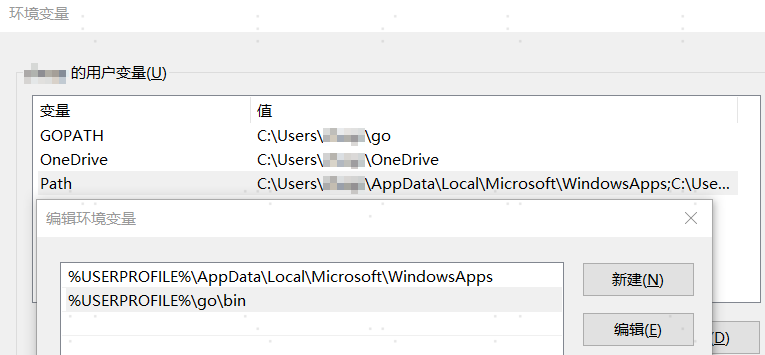
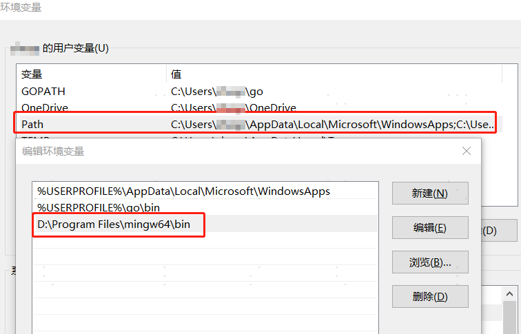
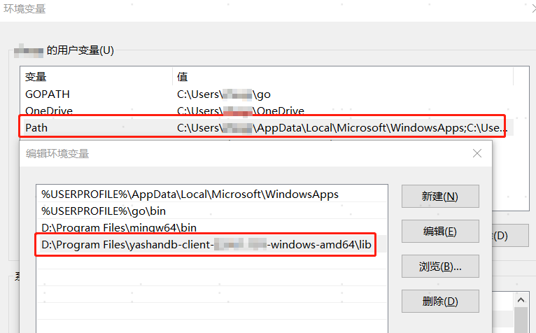

本文以Windows10专业版、go1.18 windows/amd64 及以上版本和YashanDB客户端安装包yashandb-client-xx.xx-windows-amd64.zip为例，介绍YashanDB Go驱动在该环境下的安装配置过程。

## Go环境安装

使用YashanDB Go驱动的Go语言程序版本需在1.18及以上，开发环境为Windows for x86_64，请至Golang官网下载。以go1.22.7为例：


下载安装完成后，配置如下环境变量（以下路径为示例，请修改为实际安装路径）：



使用go version检验编译环境是否正常：

```shell
$ go.exe version
go version go1.22.7 windows/amd64
```

## YashanDB Go驱动安装

### 步骤1：安装GCC

YashanDB Go驱动底层涉及到cgo调用，要在Windows操作系统中安装gcc编译工具。本文MinGW 12.1.0版本为例，安装完成后，设置环境变量PATH，指向安装路径的bin目录。



### 步骤2：下载YashanDB客户端安装包

1. 参考[YashanDB软件包清单](../../../安装和升级/安装部署/安装前准备/下载软件包)获取YashanDB客户端安装包。

2. 将YashanDB客户端安装包下载并解压到本地路径，例如`D:\Program Files\yashandb-client-{版本号}-windows-amd64`。

### 步骤3：设置动态库依赖路径

设置环境变量PATH，指向该文件路径下的lib文件夹。



### 步骤4：下载Go驱动安装包

1. 参考[YashanDB软件包清单](../../../安装和升级/安装部署/安装前准备/下载软件包)获取YashanDB Go驱动安装包。

2. 将Go驱动安装包下载并解压到本地路径 `D:\yashandb\client\yasdb-go`。

### 步骤5：构建Go驱动客户端

1. 编写Go应用程序。

    ```go
    package main

    import (
    	"database/sql"
    	"fmt"

    	_ "git.yasdb.com/go/yasdb-go"
    )

    func main() {
        dsn := "sys/Cod-2022@127.0.0.1:1688"
    	db, err := sql.Open("yasdb", dsn)
    	if err != nil {
    		fmt.Println(err)
    		return
    	}
    	defer db.Close()

    	rows, err := db.Query("select version from v$instance")
    	if err != nil {
    		fmt.Println(err)
    		return
    	}
    	for rows.Next() {
    		var version string
    		err = rows.Scan(&version)
    		if err != nil {
    			fmt.Println(err)
    			return
    		}
    		fmt.Println("instance version: ", "=>", version)
    	}
    }
    ```

2. 加载依赖包，其中replace路径为YashanDB Go驱动的安装路径。

    ```shell
    $ go mod init example
    $ go mod edit -replace="git.yasdb.com/go/   yasdb-go=D:\yashandb\client\yasdb-go"
    $ go mod tidy
    ```

3. 编译生成可执行程序。

    ```shell
    $ go build -o example.exe  main.go
    ```

4. 运行程序。

    ```shell
    $ .\example.exe
    instance version:  => Enterprise Edition Release xx.xx x86_64
    ```
