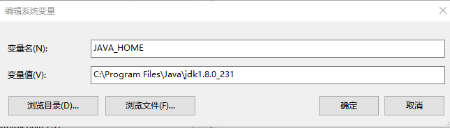
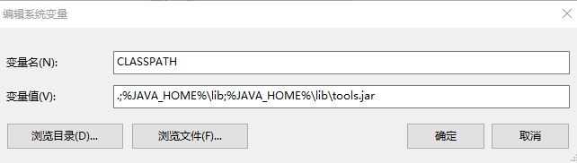

## JVM环境安装

通用Java应用程序连接YashanDB JDBC驱动需要先安装JDK，YashanDB JDBC驱动对JDK版本兼容信息如下：

- JDK：1.8及以上
- JRE：1.8及以上

> **Note**:
>
> YashanDB的JDBC驱动主要支持JDK1.8及以上版本，为方便使用，同样为使用JDK1.6和1.7的用户提供了兼容低版本的驱动包yasdb-jdbc-*版本号*-jre6.jar，但该安装包只能[离线安装](#offline)。

通过Java官方路径下载上述版本的JDK并安装成功后，还需配置如下环境变量（以Windows 10环境为例）：

- **JAVA_HOME**：JDK目录路径，例如C:\Program Files\Java\jdk1.8.0_231

  

- **PATH**：分别添加%JAVA_HOME%\bin和%JAVA_HOME%\jre\bin

  

- **CLASSPATH**: .;%JAVA_HOME%\lib;%JAVA_HOME%\lib\tools.jar

  

配置完成后，通过运行java -version验证Java环境是否正常：

```shell
>java -version
java version "1.8.0_231"
Java(TM) SE Runtime Environment (build 1.8.0_231-b11)
Java HotSpot(TM) 64-Bit Server VM (build 25.231-b11, mixed mode)
```

## 通过Maven安装YashanDB JDBC驱动

在项目中使用Maven管理器配置yashandb-jdbc库。

yashandb-jdbc发表在[The Maven](https://central.sonatype.com/search?q=yashandb-jdbc&smo=true)上，具有以下Group ID和artifactId：

- Group ID: com.yashandb
- artifactId: yashandb-jdbc

在项目中的pom.xml文件中添加以下依赖项：

```xml
<dependency>
    <groupId>com.yashandb</groupId>
    <artifactId>yashandb-jdbc</artifactId>
    <version>x.y.z</version>
</dependency>
```
> **Note**:
>
> x.y.z表示可用的JDBC版本号，例如1.6.1。

<span id="offline" name="offline" class="yaslink"></span>

## 离线安装YashanDB JDBC驱动

1. 从[YashanDB官网下载中心](https://download.yashandb.com/download)，或者联系我们的技术支持获取对应的软件包。

2. 将jar文件下载到本地路径，例如/path/yasdb-jdbc-{version_number}.jar。

3. 将YashanDB JDBC驱动加入到JVM环境中：

    - **对于在命令行运行的Java应用程序**（以Linux环境为例）

    ```shell
    # 预先加入方式
    export CLASSPATH=/path/yasdb-jdbc-{version_number}.jar:${CLASSPATH} 

    # JVM运行时加入方式，Jdbcexample为应用程序名称
    java -cp .:/path/yasdb-jdbc-{version_number}.jar Jdbcexample
    ```

    - **对于在IDE运行的Java应用程序**

    每个IDE产品均会提供配置外部library的界面，以IDEA为例，从菜单中选择【Project Settings > Libraries】，根据提示将YashanDB JDBC驱动的jar文件添加到project。

4. 在Java应用程序中加载YashanDB JDBC驱动，驱动名称为com.yashandb.jdbc.Driver：

    ```shell
    # 方式一：在代码中创建连接之前任意位置隐含装载
    Class.forName("com.yashandb.jdbc.Driver");

    # 方式二：在JVM启动时参数传递，Jdbcexample为应用程序名称
    java -Djdbc.drivers=com.yashandb.jdbc.Driver Jdbcexample
    ```

    完成加载后，即可开始通过YashanDB JDBC驱动连接和操作数据库。
