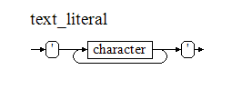
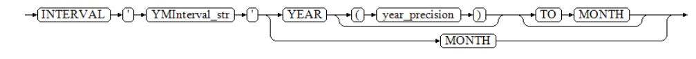

字面量的意思是不变的值，它以字符串的形式直接出现在SQL和PL语句中，通过声明时的格式对其进行类型区分，例如''用于识别字符型的字面量，DATE用于识别日期时间型的字面量。

字面量几乎可以用在所有场景中，例如作为值、参数、格式、标识或输出显示。

字面量与变量、常量在概念上的区别：

- 字面量是以字符串形式出现的固定值，它没有存储容器，只是一种书面上的记法。
- 变量是用来存储数据的一个容器，且容器可以被多次赋值。
- 常量是变量的一种，但它只能被初始赋值，且不能再次被赋值。


## 字符串字面量（Character Literal）

字符串字面量是使用单引号`''`包围的英文字母、中文汉字、数字字符和特殊字符的组合，其声明方式如下所示：




YashanDB将字符串字面量解析成与其等长的CHAR类型数据，例如'China'就是'CHAR(5)'。

示例

```sql
SELECT 'SHENZHEN', '3.14567', '!@#$',
TYPEOF('SHENZHEN') type1,
TYPEOF('3.14567') type2,
TYPEOF('!@#$') type3
FROM DUAL;
'SHENZHEN' '3.14567' '!@#$' TYPE1 TYPE2 TYPE3
---------- --------- ------ ----- ----- -----
SHENZHEN   3.14567   !@#$   char  char  char
```


## 数值字面量（Numeric Literal）

数值字面量是以数字0 ~ 9和小数点组合形成的数值，数值前可以用正号（+）或负号（-）将其变成正数负数（默认为正数）。其声明方式如下图所示：


数值字面量包含4个数据类型：INT、BIGINT、NUMBER、DOUBLE。YashanDB按如下规则解析这些类型：

- 当数值后出现'd'或'D'时，将解析为DOUBLE类型。
- 小数解析成NUMBER类型。
- 整数首先尝试将它解析为INT类型（判断是否在INT值域\[-2<sup>31</sup>， 2<sup>31</sup> - 1\]），失败则尝试解析为BIGINT类型（判断是否在BIGINT值域\[-2<sup>63</sup>，2<sup>63</sup> - 1\]），失败则解析为NUMBER类型。
- 超过NUMBER范围解析为DOUBLE类型。

例如，11d被解析为DOUBLE类型，2147483647被解析为INT类型，2147483648被解析为BIGINT类型，1.1被解析为NUMBER类型。

示例

```sql
SELECT 1, TYPEOF(1) FROM DUAL;
           1 TYPEOF(1)
------------ ---------
           1 integer
  
SELECT 2147483647, TYPEOF(2147483647) FROM DUAL;
  2147483647 TYPEOF(2147483647)
------------ ------------------
  2147483647 integer
  
SELECT 2147483648, TYPEOF(2147483648) FROM DUAL;
           2147483648 TYPEOF(2147483648)
--------------------- ------------------
           2147483648 bigint
  
SELECT 1.1, TYPEOF(1.1) FROM DUAL;
        1.1 TYPEOF(1.1)
----------- -----------
        1.1 number
            
SELECT 11d, TYPEOF(11d) FROM DUAL;

        11  TYPEOF(11D)
----------- -----------
   1.1E+001 double
```

**科学计数法数值字面量**

YashanDB支持将类似1.24E3格式的字面量解析为科学计数法输入的NUMBER类型数据。

示例

```sql
SELECT 1.24e3 FROM dual;
      1.24E3 
------------ 
        1240
```

## 日期字面量（Date Literal）

日期字面量是以DATE关键字开始，直至单引号`''`包围的字符串右引号结束的值，采用'yyyy-mm-dd'进行格式匹配，例如`DATE '2020-01-01'`。其声明方式如下图所示，其中date_str表示符合DATE类型标准格式的字符串。


示例

```sql
SELECT DATE '2020-01-01', TYPEOF(DATE '2020-01-01') TYPE FROM DUAL;
DATE'2020-01-01'                 TYPE
-------------------------------- -----
2020-01-01 00:00:00              date
```

## 时间戳字面量（Timestamp Literal）

日期时间戳字面量是以TIMESTAMP开始，直至单引号`''`包围的字符串右引号结束的值，采用'yyyy-mm-dd hh24:mi:ss.ff'进行格式匹配，时分秒可缺省，例如`TIMESTAMP '2020-01-01 13:08:28'`。其声明方式如下图所示，其中timestamp_str表示符合TIMESTAMP类型标准格式的字符串。


示例

```sql
SELECT TIMESTAMP '2020-01-01 13:08:28', TYPEOF(TIMESTAMP '2020-01-01 13:08:28') TYPE FROM DUAL;
TIMESTAMP'2020-01-01                                             TYPE
---------------------------------------------------------------- -------------
2020-01-01 13:08:28.000000                                       timestamp
```


## 年到月字面量（Interval Year To Month Literal）

年到月字面量的声明方式如下图所示，其中YMInterval_str表示符合INTERVAL YEAR TO MONTH类型标准格式的字符串，year_precision表示年的精度（默认值为2）。



声明时可以指定年、月中的一个或多个域；当单独指定的月间隔超过11时，YashanDB将自动将其转换为年间隔。

示例

```sql
-- Example 1: 仅指定年间隔
SELECT INTERVAL '120' YEAR(3) YMINTERVAL,
TYPEOF(INTERVAL '120' YEAR(3)) TYPE
FROM DUAL;
YMINTERVAL      TYPE
--------------- -------------------------
+120-00         interval year to month
  
-- Example 2: 仅指定月间隔，超过11月将转换为年
SELECT INTERVAL '3' MONTH YMINTERVAL,
TYPEOF(INTERVAL '3' MONTH) TYPE
FROM DUAL;
YMINTERVAL      TYPE
--------------- -------------------------
+00-03          interval year to month
  
SELECT INTERVAL '14' MONTH YMINTERVAL,
TYPEOF(INTERVAL '14' MONTH) TYPE
FROM DUAL;
YMINTERVAL      TYPE
--------------- -------------------------
+01-02          interval year to month
  
-- Example 3: 指定年和月间隔，在此情况下月超过11时无法转换为年
SELECT INTERVAL '100-11' YEAR(3) TO MONTH YMINTERVAL,
TYPEOF(INTERVAL '100-11' YEAR(3) TO MONTH) TYPE
FROM DUAL;
YMINTERVAL      TYPE
--------------- -------------------------
+100-11         interval year to month
  
SELECT INTERVAL '100-14' YEAR(3) TO MONTH YMINTERVAL FROM DUAL;
YAS-00008 type convert error : not a valid month
```

## 天到秒字面量（Interval Day To Second Literal）

天到秒字面量的声明方式如下图所示，其中DSInterval_str表示符合INTERVAL DAY TO SECOND类型标准格式的字符串，day_precision表示天的精度（默认值为2），second_precision表示秒的精度（默认值为6）。


声明时可以指定天、时、分、秒中的一个或多个域；当时超过23、分和秒超过59，且没有指定上级域时，YashanDB会自动将其进位。

示例

```sql
-- Example 1: 仅指定天
SELECT INTERVAL '50' DAY DSINTERVAL,
TYPEOF(INTERVAL '50' DAY) TYPE
FROM DUAL;
DSINTERVAL                       TYPE
-------------------------------- -------------------------
+50 00:00:00.000000              interval day to second
  
-- Example 2: 仅指定时，超过23时则进位为天
SELECT INTERVAL '160' HOUR INTERVAL1, INTERVAL '13' HOUR INTERVAL2 FROM DUAL;
INTERVAL1                        INTERVAL2
-------------------------------- --------------------------------
+06 16:00:00.000000              +00 13:00:00.000000
  
-- Example 3: 仅指定分，超过59分则进位为时
SELECT INTERVAL '63' MINUTE INTERVAL1,
INTERVAL '32' MINUTE INTERVAL2
FROM DUAL;
INTERVAL1                        INTERVAL2
-------------------------------- --------------------------------
+00 01:03:00.000000              +00 00:32:00.000000
  
-- Example 4: 仅指定秒，超过59秒则进位为分
SELECT INTERVAL '63' SECOND INTERVAL1,
INTERVAL '45' SECOND INTERVAL2,
INTERVAL '59.999999' SECOND(6)
FROM DUAL;
INTERVAL1                        INTERVAL2                        INTERVAL'59.999999'S
-------------------------------- -------------------------------- --------------------------------
+00 00:01:03.000000              +00 00:00:45.000000              +00 00:00:59.999999
  
-- Example 5：指定多个域
SELECT INTERVAL '1000 23:30' DAY(4) TO MINUTE INTERVAL1,
INTERVAL '12:15:21.647' HOUR TO SECOND(3) INTERVAL2
FROM DUAL;
INTERVAL1                        INTERVAL2
-------------------------------- --------------------------------
+1000 23:30:00.000000            +00 12:15:21.647000
  
-- Example 6：当存在上级域时，下级域无法进位
SELECT INTERVAL '12:63' HOUR TO MINUTE FROM DUAL;
YAS-00008 type convert error : not a valid minute
```

## 二进制字面量（BIT Literal）

仅适用于yashan模式。

二进制字面量是以字符b开始，直至单引号`''`包围的字符串右引号结束的值。其声明方式如下，其中bit_str表示符合二进制类型标准格式的字符串。

bit_literal :=  b'bit_str'

示例

```sql
SELECT b'010011101',
TYPEOF(b'010011101') TYPE
FROM DUAL;
B'010011101'                                                     TYPE
---------------------------------------------------------------- -----
10011101                                                         bit
```

## 国家字符集字面量（NCHAR Literal）

国家字符集字面量是以字符N开始，直至单引号`''`包围的字符串右引号结束的值，其中nchar_str是英文字母、中文汉字、数字字符和特殊字符的组合，具体声明方式如下。

nchar_literal :=  N'nchar_str'

YashanDB将国家字符集字面量解析成与其等长的NCHAR类型数据，例如N'China'就是'NCHAR(5)'。

在客户端中语句使用客户端字符集，语句从客户端传输到数据库服务器时字符集会转换为数据库字符集。为避免因转换到不兼容的数据库字符集而导致丢失数据，可以开启NCHAR字面量替换功能。该功能会先以透明方式将客户端的国家字符集字面量替换为YashanDB内部格式，数据库执行语句时再将其解码为Unicode。

NCHAR字面量替换功能默认关闭，如需开启，请按需参考[yasql使用指导](../../../工具手册/yasql/yasql使用指导)、C驱动[yacSetEnvAttr](../../C语言系驱动/C驱动/C驱动接口说明/句柄属性设置与查询函数/yacSetEnvAttr)接口、OCI驱动[OCIEnvCreate](../../C语言系驱动/OCI驱动/OCI接口说明/连接、授权和初始化函数/OCIEnvCreate)接口和[OCIEnvNlsCreate](../../C语言系驱动/OCI驱动/OCI接口说明/连接、授权和初始化函数/OCIEnvNlsCreate)接口文档进行配置。

示例

```sql
-- Example 1: 未开启NCHAR字面量替换功能
SELECT N'12%',
TYPEOF(N'12%') TYPE
FROM DUAL;
N'12%'            TYPE
----------------- ---------
12%               nchar

-- Example 2: 开启NCHAR字面量替换功能
SET nchar_literal_replace true
SELECT N'12%',
TYPEOF(N'12%') TYPE
FROM DUAL;
U'\0031\0032\0025' TYPE
------------------ ---------
12%                nchar
```
