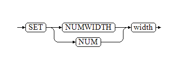

数值型数据包括正负整数、小数、0、正负无穷（Inf、-Inf）、以及非数（Nan），主要应用于数学运算、数字计量等场景。YashanDB支持对此类数据的加减乘除取模运算，并提供统计函数和聚集函数来满足各式场景的需求。

可以将数值型数据进一步划分为整数类型（Integer Data Type）、浮点类型（Floating-Point Data Type）、NUMBER类型（Number Data Type）、以及BIT类型（Bit Data Type）。YashanDB为不同的数值类型定义了值域、字节长度、精度等属性。

整数类型（Integer Data Type）
-----------------------

整数类型为定长、精确数值类型，是没有小数部分的整数，具体包括TINYINT、SMALLINT、INT、BIGINT四种数据类型，每个类型有不同的字节长度和值域，建表时需要根据数据存储所需的空间来决定使用哪一种类型。

PLS_INTEGER、INT为INTEGER的别名，行为完全同INTEGER。

整数类型通过十进制精度（Decimal Precision，数字0~9）存储，在值域和精度范围以内的十进制数字都可以被准确的存储。

INT类型在语法上支持定义时带精度信息，精度范围为 0 ~ 255。

当配置参数USE_NATIVE_TYPE为FALSE时，TINYINT、SMALLINT、INT、BIGINT返回值类型为NUMBER，precision为38，scale为0。

示例

```sql
CREATE TABLE int_test(c1 INT(255));
INSERT INTO int_test VALUES(128);
SELECT c1 res FROM int_test;
RES
------------
128
```

### 存储属性

|  类型| 字节长度| 值域|
| --- | --- |--------------------------------|
| TINYINT | 1   | \[-2<sup>7</sup> , 2<sup>7</sup> - 1\] |
| SMALLINT | 2   | \[-2<sup>15</sup>, 2<sup>15</sup> - 1\]        |
| INT | 4   | \[-2<sup>31</sup>, 2<sup>31</sup> - 1\]        |
| BIGINT | 8   | \[-2<sup>63</sup>, 2<sup>63</sup> - 1\]        |

浮点类型（Floating-Point Data Type）
------------------------------

浮点类型为定长、非精确数值类型，具体包括FLOAT、DOUBLE两种数据类型。在YashanDB中，浮点类型的行为与行业标准IEEE Standard 754保持一致。

REAL为FLOAT的别名，行为完全同FLOAT。

浮点类型通过二进制精度（Binary Precision，数字0和1）存储。

- 浮点类型拥有更宽广的值域，可以表达特殊值Inf、-Inf、Nan，对小数点的位置也没有限制。
- 无法避免由于二进制精度转换至十进制精度所带来的误差，所以一些数字无法被浮点数类型准确的表达（例如0.1）。且精度根据USE_NATIVE_TYPE配置参数的值存在不同规则：
  - 当USE_NATIVE_TYPE为TRUE时，YashanDB只做语法兼容，等价于浮点类型本身（例如DOUBLE`(p)`等价于DOUBLE）。
  - 当USE_NATIVE_TYPE为FALSE时，FLOAT类型不适用于列存表，在行存表中，FLOAT类型不带精度信息时，默认为FLOAT(126)，FLOAT后面带精度信息时，精度值为设置值。

### 存储属性

|  类型| 字节长度| 值域| 可保证准确的十进制精度|
| --- | --- |-----------------------------------------------------------------------------------------------------------------------------------------------------------------------------------------| --- |
| FLOAT | 4   | \[-3.402823E38, -1.401298E-45\]<br>0<br>[1.401298E-45, 3.402823E38\]<br>数字3.402823和1.401298为四舍五入的值，非最精确值                                                                                | 6位  |
| DOUBLE | 8   | \[-1.79769313486232E308, -4.94065645841247E-324\]<br>0<br>[4.94065645841247E-324, 1.79769313486232E308\]<br>数字1.797693134862315807和4.94065645841247为四舍五入的值，非最精确值 | 15位 |

### 使用规则

#### 定义格式

浮点类型有如下几种定义格式：

```sql
FLOAT
DOUBLE
FLOAT(m,d)
DOUBLE(m,d)
FLOAT(p)
DOUBLE(p)
```

其中，在USE_NATIVE_TYPE为TRUE时，`(m,d)`和`(p)`均为语法兼容格式，即支持DOUBLE`(m,d)`和DOUBLE`(p)`语法，但二者均等价于DOUBLE，无实际含义，但存在如下约束规则：

- m: Magnitude, 0 < m <= 255
- d: Division, 0 <= d <= 30
- d <= m
- p: Precision, 0 <= p <= 53
- 定义FLOAT类型时，0 <= p <= 126 ，大于53小于等于126的部分会当作53处理，如m或者p值超过23，系统将类型转换为DOUBLE类型

示例

```sql
--定义m超过23的FLOAT类型
DROP TABLE IF EXISTS float_tb;
CREATE TABLE float_tb(c FLOAT(24,1));

--系统将其转换为DOUBLE类型
DESC float_tb
NAME              NULL?     DATATYPE       
----------------- --------- ---------------
C                           DOUBLE  
```

其中，在USE_NATIVE_TYPE为FALSE时，在实现上支持FLOAT缺省或者带精度信息，存在如下规则：

- 当不带精度信息时， p = 126
- 当带精度信息时，1 <= p <= 126

示例（HEAP表）

```sql
DROP TABLE IF EXISTS float_tb;
CREATE TABLE float_tb(c FLOAT(2));

DESC float_tb
NAME              NULL?     DATATYPE       
----------------- --------- ---------------
C                           FLOAT(2)  
```

#### 显示方式

浮点类型以科学计数法的形式显示。

#### 特殊值

浮点类型有3个特殊值：Nan、Inf、-Inf。它们的大小排序为：Nan>Inf>正数>0>负数>-Inf。

下表列示一些特殊场景下将产生这些特殊值或0：

|  特殊场景| 产生值|
| --- | --- |
| 大于浮点类型值域的最大值，但被用浮点数表示 | Inf |
| 小于浮点类型值域的最小值，但被用浮点数表示 | \-Inf |
| 绝对值小于值域的最小绝对值，但被用浮点数表示 | 0   |
| 正浮点数或Inf作为被除数与0作除法 | Inf |
| 负浮点数或-Inf作为被除数，与0作除法 | \-Inf |
| Inf、-Inf之间作除法 | Nan |
| Nan作为被除数，与0作除法 | Nan |

当浮点数大小超过值域的最大绝对值时，会被表示为Inf或-Inf；当浮点数大小小于值域的最小绝对值时，会被表示成0。

#### 精度约束

当浮点类型的实际精度超过其最大精度限制时，超过精度的部分会被舍弃，且舍弃规则无法确定为四舍五入或截断，舍弃后数字的最大精度位的结果也无法预测。

由于存储方式的差异，将其他数值型转换为浮点类型时可能产生无法避免的误差。

因此，浮点类型不适合用在对精确程度要求较高的场景，也不适合用在涉及大量等于比较条件和边界值的场景。

示例

```sql
SET NUMWIDTH 30;
-- Example 1: 向FLOAT插入超过最大精度数字，超过最大精度位的部分被舍弃，且舍弃方式并非四舍五入或截断
CREATE TABLE number_f (c1 FLOAT);
INSERT INTO number_f VALUES (10.567895678956789);
COMMIT;
   
SELECT c1 FROM number_f;
                             C1
-------------------------------
                1.05678959E+001

-- Example 2: 将NUMBER、整数类型转换为浮点类型会产生误差
CREATE TABLE number_bn (c1 BIGINT, c2 NUMBER(38, 60));
INSERT INTO number_bn VALUES (9223372036854775800, 0.000000000000000000000000000000000000000000000401298);
COMMIT;
  
SELECT c1,c2 FROM number_bn;
                   C1                              C2
--------------------- -------------------------------
  9223372036854775800  4.012980000000000000000000E-46
  
SELECT CAST(C1 AS FLOAT) float1,
CAST(C2 AS FLOAT) float2
FROM number_bn;
                         FLOAT1                          FLOAT2
------------------------------- -------------------------------
                9.22337204E+018                               0
```

NUMBER类型（Number Data Type）
--------------------------

NUMBER类型为非定长、精确的数值类型，它可以自由指定精度（P，Precision）和刻度（S，Scale）。NUMBER类型可以准确表示符合精度和刻度要求的任何数字，因此非常适合用于需要精确计算且涉及小数的场景。

DECIMAL、NUMERIC为NUMBER的别名，行为完全同NUMBER。

### 存储属性

|  类型| 字节长度| 值域| 存储方式|
| --- | --- | --- | --- |
| NUMBER | 1~22 | 0<br>绝对值`[1E-130，1E126)` | 通过十进制精度（Decimal Precision，数字0~9）存储，在值域和精度范围以内的十进制数字都可以被准确的存储。 |

### 使用规则

#### 定义格式

NUMBER类型的定义格式为`NUMBER(P,S)`或`NUMBER`，其中P和S的含义如下：

*   P：精度，表示数字的有效位数（不包含小数点、正负符号的位数），取值范围\[1,38\]；也可以为\*，表示精度为38。
*   S：刻度，表示数字从小数点到最右侧有效数字的位数，取值范围[-84,127]。刻度为正数，表示小数点在最小位数左侧（例如3.14的格式定义可以为`NUMBER(3, 2)`）；刻度为负数，表示小数点在最小位数右侧（例如31400的格式定义可以为`NUMBER(3, -2)`）。

当定义格式为NUMBER，不指定P/S时，表示为浮动精度。

#### 精度约束

不指定P/S时为浮动精度，以实际计算产生的值为准，无精度限制。

指定P/S：

*   实际刻度超过定义的S时，系统将超过的部分四舍五入至最小刻度位。
*   实际精度超过定义的P时，系统报错。

#### 支持科学记数法作为值输入

*   支持诸如1.24E3的格式处理。
*   异常带E的数值格式如E1，1E，1.3E2A等进行相应报错。

示例

```sql
-- Example 1: 将31401表示为number(3, -2)。因为最小刻度是百分位，31401会被四舍五入为31400
SELECT CAST(31401 AS NUMBER(3,-2)) FROM DUAL;
                               CAST(31401ASNUMBER(3
---------------------------------------------------
                                              31400
   
-- Example 2: 将31400表示为NUMBER(1, -2)。因为最大精度是1，但31400有三位有效数字，所以会有larger than specified precision allowed报错
SELECT CAST(31400 AS NUMBER(1, -2)) FROM DUAL;
[1:34]YAS-00025 value is larger than specified precision allowed for this column

-- Example 3: 支持科学记数法作为值输入，同输入全数值有一致的结果
SELECT CAST('1.24E3' AS NUMBER) FROM DUAL;
                               CAST('1.24E3'ASNUMBE
---------------------------------------------------
                                               1240
-- Example 4: 支持精度以*进行输入，精度为*时表示是38                                   
SELECT CAST('12.38' AS NUMBER(*,0)) FROM DUAL;

CAST('12.38'ASNUMBER
--------------------
                  12
                                   
CREATE TABLE Etest7293 (NUM1 NUMBER(*,0),NUM2 NUMBER(*), NUM3 NUMBER, NUM4 NUMBER(*,23));

desc Etest7293;
NAME            NULL?     DATATYPE
--------------- --------- ---------------------
NUM1                      NUMBER(38)
NUM2                      NUMBER
NUM3                      NUMBER
NUM4                      NUMBER(38,23)
```

BIT类型（Bit Data Type）
--------------------

BIT类型支持1-64位宽度（Size）的二进制位图，每BIT位只允许存放0/1值，其他值将视为非法BIT类型。

以字符串形式插入/更新BIT类型时，字母b开头的字符串以二进制数值处理，其它以十进制字符串处理。

BIT类型以二进制输出。

BIT类型的定义格式为`BIT[(Size)]`，Size：表示BIT的宽度，取值范围为`[1,64]`，省略时，系统取默认值1。

BIT类型仅适用于HEAP表，分布式行表不支持Bit类型。

示例（HEAP表）

```sql
CREATE TABLE number_nb (numbera NUMBER,numberb BIT(64));
INSERT INTO number_nb VALUES (10,10);
  
SELECT numbera,numberb FROM number_nb;
    NUMBERA NUMBERB                                                         
----------- ----------------------------------------------------------------
         10 1010
```

显示宽度调整
------

SET NUMWIDTH用于设置浮点类型及NUMBER类型数据输出时的显示宽度，只针对当前会话有效。

其中，SET NUMWIDTH=SET NUM，用于设置显示宽度；SHOW NUMWIDTH=SHOW NUM，用于显示设置的宽度值。

系统对浮点类型及NUMBER类型数据输出时的显示宽度默认为10。

YashanDB对浮点类型数字均采用科学计数法显示，显示格式为：

*   正数  x.yyyyE{+|-}zzz
*   负数 -x.yyyyE{+|-}zzz

其中只有yyyy显示内容长度受到width限制；指数zzz固定显示3个字节，其前面固定显示符号'+' 或 '-'。

YashanDB对NUMBER类型数字的显示规则如下：

*   如果是纯小数，则小数点前的0会省略不显示。如果纯小数为0.00000xxx  其中xxx为任意数字，则使用科学计数法显示，否则使用非科学计数法显示。
*   如果是非纯小数，且给定的宽度能够完整输出整数内容，则不会使用科学计数法显示，否则使用科学计数法显示。
*   NUMBER类型数字的科学计数法显示格式为：
    *   正数： x.yyyyE{+|-}zz 
    *   负数：-x.yyyyE{+|-}zz 

其中yyyy显示内容长度受到width限制；指数zz默认2个字节，最大3个字节，其前面固定显示符号'+' 或 '-'。

### 语句定义

**set numwidth::=**



**show numwidth::=**


width

该语句用于指定显示宽度值，值范围为`[2,128]`。

当此值设置过小，导致某个数字无法完整显示出来时，系统输出按此值个数的'#'。

示例

```sql
--创建numbers_nfd表，包含NUMBER、FLOAT、DOUBLE三个类型的字段
CREATE TABLE numbers_nfd (cnumber NUMBER, fnumber FLOAT, dnumber DOUBLE);
INSERT INTO numbers_nfd VALUES (0.0000002334, 0.0000002334, -0.0000002334);
INSERT INTO numbers_nfd VALUES (2334.0000002334, 2334.0000002334, -2334.0000002334);
INSERT INTO numbers_nfd VALUES (233423342334.0000002334, 233423342334.0000002334, -233423342334.0000002334);
COMMIT;
   
-- 默认宽度下显示
SELECT cnumber,fnumber,dnumber FROM numbers_nfd;
    CNUMBER     FNUMBER     DNUMBER
----------- ----------- -----------
 2.3340E-07  2.334E-007  -2.33E-007
       2334  2.334E+003  -2.33E+003
 2.3342E+11  2.334E+011  -2.33E+011
   
-- 设置显示宽度为20
SET NUMWIDTH 20;
SELECT cnumber,fnumber,dnumber FROM numbers_nfd;
              CNUMBER               FNUMBER               DNUMBER
--------------------- --------------------- ---------------------
          .0000002334       2.33400002E-007           -2.334E-007
      2334.0000002334            2.334E+003  -2.334000000233E+003
 233423342334.0000002        2.3342334E+011   -2.33423342334E+011
   
-- 设置显示宽度为8
SET NUMWIDTH 8;
SELECT cnumber,fnumber,dnumber FROM numbers_nfd;
  CNUMBER   FNUMBER   DNUMBER
--------- --------- ---------
 2.33E-07  2.3E-007  ########
     2334  2.3E+003  ########
 2.33E+11  2.3E+011  ########
   
-- 设置显示宽度为5
SET NUMWIDTH 5;
SELECT cnumber,fnumber,dnumber FROM numbers_nfd;
CNUMBER FNUMBER DNUMBER
------- ------- -------
      0   #####   #####
   2334   #####   #####
  #####   #####   #####
```
