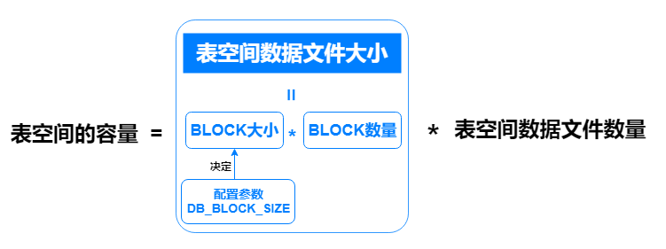

## 用户表空间管理准则

建议为业务用户创建特定的用户表空间，而不是使用默认的USERS表空间。

对于用户表空间，建议按以下准则进行创建和维护：

- 将用户数据与数据字典数据分开，以减少I/O争用。
- 将一个应用程序的数据与另一个应用程序的数据分开，以防止在表空间必须脱机时多个应用程序受到影响。
- 将不同表空间的数据文件存储在不同的磁盘驱动器上，以减少I/O争用。
- 单个表空间脱机时，其他表空间可以继续保持联机，无需全部表空间脱机或关闭数据库，从而提供更好的可用性。
- 通过为特定类型的数据库使用保留表空间来优化表空间的使用，例如高更新活动、只读活动或临时段存储。
- 按单个表空间执行逻辑备份。

## YashanDB默认表空间

YashanDB内置了如下表空间，其属性可以直接使用默认值或在建库时自定义指定：

- 永久表空间，包括SYSTEM表空间、SYSAUX表空间和USERS表空间（即DEFAULT TABLESPACE）
- TEMP表空间
- UNDO表空间
- SWAP表空间
- USERS_AIM表空间（仅存在于存算一体分布式集群部署）

表空间的容量计算方式如下，在安装过程中创建的初始数据库表空间容量（即数据文件大小和数量）可通过[建库参数](../../../../工具手册/yasboot/建库参数)指定。

- 表空间数据文件大小：由BLOCK大小及其数量决定。

    - BLOCK大小：由配置参数DB_BLOCK_SIZE决定，参数值可以为8192、16384或32768（即8KB、16KB或32KB），默认值为8192。

    - BLOCK数量：默认值为8192个，开启自动扩展时默认扩展8192个/次。

        UNDO表空间：BLOCK数量可以为[8192,8388608]个。

        其他永久表空间：BLOCK数量可以为[8192,97108864]个。

- 表空间数据文件数量：可以为[1,64]个，默认值为1个。

安装过程中创建的初始数据库表空间容量与建库参数的对应关系及其初始默认值如下：

|  表空间类型| 关联的建库参数| 表空间默认容量（字节）|
| ---- | ---- | ---- |
|SYSTEM表空间      |SYSTEM_FILE_INIT_SIZE SYSTEM_FILE_NUM     | 64M * 1 = 64M       |
|SYSAUX表空间      |SYSAUX_FILE_INIT_SIZE SYSAUX_FILE_NUM      | 64M * 1 = 64M       |
|SWAP表空间      |SWAP_FILE_INIT_SIZE SWAP_FILE_NUM      | 64M * 1 = 64M       |
|UNDO表空间      |UNDO_FILE_INIT_SIZE UNDO_FILE_NUM      | 64M * 1 = 64M       |
|TEMP表空间      |TEMP_FILE_INIT_SIZE TEMP_FILE_NUM      | 64M * 1 = 64M       |
|USERS表空间      |DATA_FILE_INIT_SIZE DATA_FILE_NUM      | 64M * 1 = 64M       |
|USERS_AIM表空间      |MMS_DATA_FILE_SIZE MMS_DATA_FILE_NUM      | 32M * 1 = 32M       |
