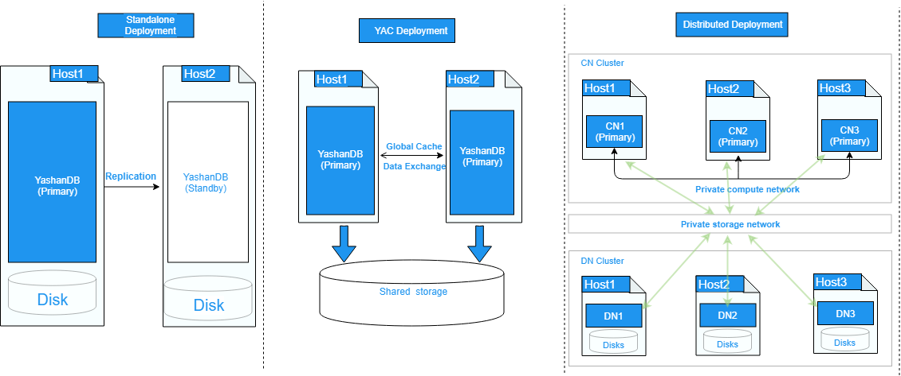
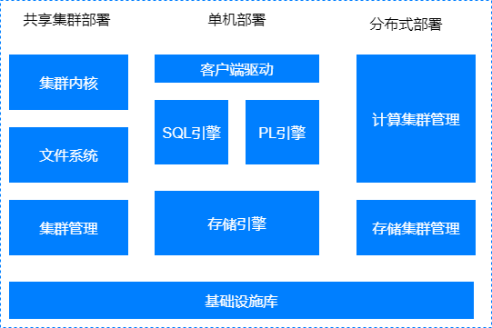

## 部署架构

YashanDB支持三种部署形态，分别是**单机（主备）部署**（简称：单机部署）、**共享存储集群部署**（简称：共享集群部署）和**分布式集群部署**。

### 单机部署

单机部署一般会在两台服务器上分别运行主实例和备实例，通过主备复制实现主库的修改同步到备库，也有一些场景对高可用要求较低，部署时只使用一台服务器仅运行一个实例。

单机部署是比较常见的形态，适用于大多数场景。

### 共享集群部署

共享集群在硬件层面需要依赖共享存储，所有实例均可读写，实例之间通过全局缓存实现数据交换。

共享集群部署常应用于对多实例数据库集群多写、高可用、性能以及可扩展能力均有较高要求的高端核心交易场景。

### 分布式集群部署

分布式集群部署采用存算分离部署架构，分为计算集群和存储集群，计算集群由一组多活计算实例组成，所有实例均可支持读写服务。存储集群由一组存储节点组成一个分布式智能存储集群。计算集群和存储集群可以按需灵活独立弹性。

分布式集群部署常应用于对高可用以及弹性能力有较高要求的交易、分析或者交易和分析混合场景。

## 逻辑架构

YashanDB的逻辑架构零层视图如下图所示：

### 单机主要子系统

**客户端驱动**

包括一系列客户端API，提供包括建立连接，执行SQL语句，获取结果集等一系列能力。

**SQL引擎**

SQL引擎包括解析器、优化器、执行器，负责客户端提交SQL文本的解析，生成执行计划，以及具体执行。SQL引擎提供丰富的内置函数库，方便在SQL中直接使用函数做表达式运算。

**PL引擎**

PL引擎提供用户自定义函数、类型管理，自定义类型等能力，包括高级包、存储过程、存储函数、触发器等。PL对象可持久化，创建后可以多次执行。

**存储引擎**

负责存储空间管理，采用段区页三级空间管理；负责事务管理，并控制并发访问，提供一致性访问能力；负责关系对象的管理，包括表、索引等。

### 共享集群主要子系统

在单机形态基础上，共享存储集群部署形态中新增了聚合内存管理、存储管理和集群管理三个子系统：

**聚合内存管理**

共享集群部署形态中集群运行时的核心组件，通过聚合内存技术负责各服务器运行期内存页面的协调，确保集群多实例高效实现一致性的访问。

**存储管理**

负责管理存储设备，提供类文件系统接口给数据库使用，处理上层应用的文件读写请求，经过地址转换转化为对存储设备的读写操作。

**集群管理**

共享集群部署形态中负责管理集群，提供配置管理能力。

### 分布式集群主要子系统

分布式集群部署形态在单机和共享集群的基础上，新增了分布式事务管理、分布式并行执行子和智能存储服务三个子系统。

**分布式事务管理**

负责分布式事务管理，通过去中心化、全局高精度逻辑时钟同步技术，提供分布式多实例数据实时强一致性能力，避免全局中心事务管理（GTM）的扩展瓶颈问题。

**分布式并行执行**

负责分布式并行执行的调度，充分利用分布式多实例资源，加速海量数据分析计算。

**智能存储服务**

负责存储设备的管理和监控，为计算集群提供统一的分布式存储服务能力，具备弹性和高可用能力。

### 公共基础设施库

基础设施库中是常用的公共基础能力，包括网络通讯、线程管理等。

## 实例架构

YashanDB包括数据库和数据库实例（简称“实例”）两个概念。数据库和数据库实例一般是一对一关系，但在共享集群部署和分布式集群部署中，数据库与数据库实例是一对多关系，更多详情请查阅[部署架构](#deploy)。

- 数据库

    数据库指存放在非易失存储上的一组数据文件，包括控制文件、数据文件和日志文件。若这些数据文件缺失或损坏，数据库实例将无法正常启动和运行。

- 数据库实例

    数据库实例仅在运行期存在，它包括一组内存结构和一个多线程程序，更多详情请查阅[实例架构](../实例架构/数据库实例)。

通常情况下，我们会用“数据库”同时指代上述两个概念。
