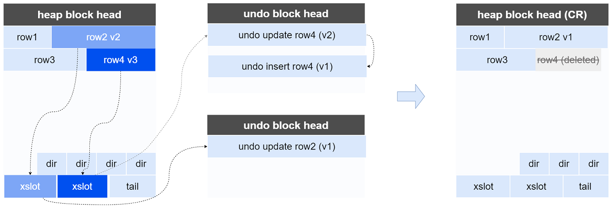

为了充分利用系统资源（内存、CPU、网络等），YashanDB允许多个会话并行访问、修改数据库内容，如果对并发操作没有加以控制，就会破坏数据库的完整性和一致性。

YashanDB通过多版本并发控制、事务隔离级别以及锁来维护数据库的一致性：

- 多版本并发控制：主要处理读写之间的并发。
- 事务隔离级别：控制多个事务之间的并发，并发事务在不同的隔离级别下只能访问对应可见版本的数据。
- 锁机制：主要处理写写之间的并发，通过锁机制控制不同事务对同一数据的并发修改。

## 多版本并发控制

### 读一致性

YashanDB通过数据多版本实现读一致性，在修改数据时，会在UNDO表空间中保留数据的历史版本，使读写互不阻塞，并发事务可以访问一致版本，其特点如下：

- 查询一致性：用户执行SQL语句查询到的都是已经提交的、可见的、一致的数据版本。
- 读写不阻塞：用户执行SQL语句修改数据时，不阻塞并发事务查询正在修改的数据。

YashanDB以系统变更版本号（SCN，System change Number）作为事务可见性判断依据，SCN是一个时间相关的数值，事务提交时会推进系统SCN。查询SQL语句以特定的SCN为视角，判断已提交事务对当前查询的可见性，从而获取到一致性的结果。

查询语句访问数据是以Block（数据块/页）为单位，通过判断Block上Xslot（事务槽位）对应事务的事务可见性：

- 对于可见的事务，生成一个对查询可见的一致性读Block，又称CR（Consistent Read） Block。
- 对于不可见的事务，通过Xslot指向的回滚段中的历史记录，还原到可见的版本。



以HEAP block为例，当前Block上存在4个row，row2和row4对应的事务对当前查询SCN不可见，通过Xslot上指向的undo Row，找到对应的可见版本。

- row2：需要应用一次历史版本得到可见的版本。
- row4：其可见的历史版本不存在（insert的undo意味着行是新插入的，对当前查询不可见）。

将undo记录应用于HEAP block上，生成一个对查询可见的CR block，从而满足查询的一致性。此时并发事务仍然可以对页面上的记录进行访问和修改，并不影响当前语句对CR block的访问。

YashanDB所有部署形态都满足读一致性，共享集群中一个block可以被多个实例同时访问、修改，可能产生多个实例的事务参与同一个HEAP block的CR block生成，整个过程在全局缓存中完成。

**语句级一致性读**

用户执行SQL查询语句时获取基于某一时间点的SCN，并在查询过程中使用此SCN进行一致性读。

YashanDB默认的多版本读一致性是语句级的。

**事务级一致性读**

事务级一致性读在满足语句级一致性读原则的基础上，每条查询语句获取的查询SCN采用当前事务开始时的快照，即同一个事务内所有语句获取的是同一个版本的数据。

### 写一致性

写一致性定义两条（或多条）并发执行的语句需要以近似串行化的方式执行，其本质是当并发执行的修改语句产生互相影响时，后发生的一方会触发语句重启。在一些需要修改保持一致性的场景下，YashanDB会自动以写一致性的方式执行。

以一个实际用户场景为例，在没有写一致性的情况下，下面并发语句会存在漏更新问题：

|  会话1| 会话2| 会话3| 解读|
| --------------- | -------- | ----------- | ---------------------------- |
| create table employee (id int, title int, age int)<br/>partition by range (title) (<br/>partition p1 values less than (5),<br/>partition p2 values less than (10),<br/>partition p3 values less than (15)<br/>) enable row movement;<br/><br/>insert into employee values (1, 4, 24);<br/>insert into employee values (2, 8, 28);<br/>insert into employee values (3, 12, 30);<br/>commit; |                                                 |                                    | 会话1创建职工测试表并插入三条记录。                          |
|                                                              | select * from employee where id = 2 for update; |                                    | 通过**for update**语句锁定分区2内的数据。                    |
|                                                              |                                                 | update employee set age = age + 1; | 对所有员工的年龄增加1，此时会话3会被会话2阻塞，需等待会话2事务结束。 |
| update employee set title = 6 where id = 3;<br/>commit;      |                                                 |                                    | 更新id为3的职工title由12更新为6并提交，此时产生数据的**跨分区变更**，职工3的信息从分区3搬迁到分区2中。 |
|                                                              | rollback;                                       | 更新成功                           | 会话2解除锁定，会话3更新成功。                                 |
|                                                              |                                                 | select * from employee;            | 在没有写一致性的保护下，职工3的年龄会出现漏更新的情况。      |

写一致性定义的是并发执行的语句间的关系，而并发事务间的关系请查阅[事务隔离级别](#isolevel)。

<span id="isolevel" name="isolevel" class="yaslink"></span>

## 事务隔离级别

数据库事务的并发可能会对事务之间的读写产生一定影响：

- 脏读：一个事务读取了另外一个尚未提交事务修改的数据。
- 不可重复读：同一个事务内，多条语句重复读取同一行数据，读取到的**数据**发生变化。
- 幻读：同一事务内，多条语句重复读取同一条件的数据，读取到的**结果集数量**发生变化。

事务隔离级别能确保多个事务并发执行时的行为，影响数据的一致性和并发性能。在ANSI标准中定义了四种事务隔离级别：

- 读未提交（Read Uncommitted）

  最低级别的隔离级别，性能较好，但会破坏数据的一致性。
  
  在此级别下，允许脏读，即一个事务可能会看到其他并发执行事务未提交的修改。

- 读已提交（Read Committed）

  此隔离级别保证事务访问其他事务修改数据时，只能读取已提交的数据版本。避免出现脏读，但存在不可重复读现象。

  此类级别还包含读当前提交（Current Committed），只能读取已提交的数据版本，不存在脏读和幻读，但无法保证语句内的读一致性，且可能存在不可重复读场景。

- 可重复读（Repeatable Read）

  在读已提交的基础上，同一个事务内所有语句看到的数据版本都是一致的，避免了脏读和不可重复读，但仍然存在幻读。

- 可串行化（Serializable）

  最严格的隔离级别，事务之间完全隔离，保证了并发事务之间不会产生冲突，避免了脏读、不可重复读和幻读。

不同的隔离级别会导致并发数据访问时可能会出现以下问题：

|  隔离级别| 脏读| 不可重复读| 幻读|
| -------- | ------ | ---------- | ------ |
| 读未提交 | 可能   | 可能       | 可能   |
| 读已提交 | 不可能 | 可能       | 可能   |
| 可重复读 | 不可能 | 不可能     | 可能   |
| 可串行化 | 不可能 | 不可能     | 不可能 |

YashanDB支持的事务隔离级别为读已提交和可串行化。

### 读已提交

YashanDB默认采用读已提交隔离级别，同样可以通过SQL语句设置隔离级别为读已提交。

```sql
SET TRANSACTION isolation LEVEL read committed;
```

**读一致性**

事务内每条语句严格按照语句级一致性读执行，语句开始执行时获取系统最新SCN作为查询SCN，并且在整个语句执行过程中采用同一SCN进行查询，生成一致性的结果集。

**写冲突**

写冲突场景下，一个事务会尝试修改另外一个未提交事务修改的行记录，此时会触发[行锁](#rowlock)等待，直到对方事务结束：

- 如果等待的事务回滚，此时当前事务会继续锁定当前行并进行修改。
- 如果等待的事务提交，此时当前事务会读取最新版本并进行条件检查，如果符合条件会继续锁定当前行并进行修改。

下面以一个实际示例说明读已提交隔离级别：

|  会话1| 会话2| 解读|
| -------------------- | --------------------- | ------------------------- |
| create table t1 (id int);<br/>insert into t1 values (1);<br/>insert into t1 values (2);<br/>commit; |                   | 会话1创建测试表并插入两条记录。          |
|                  | set transaction isolation level read committed;<br/>select * from t1; | 会话2设置当前事务隔离级别为读已提交。并查询表数据。 |
| update t1 set id = -1 where id = 1;<br/>commit;          |                  | 会话1更新第一条记录的id为-1并提交。                 |
|                  | select * from t1;      | 会话2再次查询表数据，读取到会话1事务更新后的值。    |
| update t1 set id = -2 where id = 2;         |                  | 会话1更新第二条记录的id为-2。                   |
|                  | update  t1 set id = id * 10 where id = 2;                    | 会话2尝试更新相同记录，此时产生事务等待。           |
| commit;       |                  | 会话1提交后，会话2更新成功。      |
|                  | select * from t1;          | 会话2查询结果为-1和-20。                            |

### 可串行化

YashanDB支持的串行化属于快照级串行化，提供了事务级一致性读能力，并提供写写串行化冲突检测机制。可以通过下面SQL语句设置隔离级别为可串行化：

```sql
SET TRANSACTION isolation LEVEL serializable;
```

**读一致性**

事务内的每条语句严格按照事务级一致性读进行，事务启动时会获取当前系统的SCN作为当前事务查询的SCN。整个可串行化事务运行过程中采用同一个SCN进行查询，生成一致性的结果集。

**写冲突**

可串行化的写冲突检测机制与读已提交的写冲突处理不同：

- 如果等待的事务回滚，此时当前事务会继续锁定当前行并进行修改。
- 如果等待的事务提交，此时会触发串行化写冲突，会串行化冲突错误。

下面以一个实际示例说明可串行化隔离级别：

|  会话1| 会话2| 解读|
| -------------------- | --------------------------- | ----------------------------- |
| create table t1 (id int);<br/>insert into t1 values (1);<br/>insert into t1 values (2);<br/>commit; |                        | 会话1创建测试表并插入两条记录。                     |
|                 | set transaction isolation level serializable;<br/>select * from t1; | 会话2设置当前事务隔离级别为可串行化。并查询表数据。 |
| update t1 set id = -1 where id = 1;<br/>commit;              |               | 会话1更新第一条记录的id为-1并提交。                 |
|                   | select * from t1;               | 会话2再次查询表数据，读取到会话1更新前的值。        |
|              | update t1 set id = id * 10 where id = -1;         | 会话2更新报错，检测到串行化冲突错误。               |

<span id="lock" name="lock" class="yaslink"></span>

## 锁机制

锁是数据库内控制并发事务对数据的修改的一种机制，而数据库内数据由元数据、用户数据共同组成。基于数据类别的并发有以下几种：

- 并发事务对元数据的冲突修改，即DDL间并发。
- 并发事务对用户数据的冲突修改，即DML间并发。
- 并发事务对用户数据和元数据之间的冲突修改，即DDL与DML间并发。

通过不同粒度的锁进行上述场景的并发控制，在YashanDB中面向用户的锁主要有表锁和行锁。

### 表锁管理

表锁主要发生DDL语句或修改数据的DML语句，在语句执行时自动加锁，直至事务结束时自动释放。表锁模有两种模式：

- Share Lock（表级共享锁，S）：最低级的表锁，允许DML并发执行，DML修改数据时会加表级共享锁来阻塞并发DDL的执行。
- Exclusive Lock（表级排他锁，X）：最高级别的表锁，DDL操作时会加表级排他锁，阻塞其他并发的DDL和DML执行。

可以通过lock table employee in exclusive mode语句对目标表显式加排他锁。

<span id="rowlock" name="rowlock" class="yaslink"></span>

### 行锁管理

行锁主要发生在DML语句修改数据时，事务修改数据时会锁定要修改的行记。在YashanDB中行锁是一种物理锁，通过Block上的Xslot（事务槽位）登记锁信息。

行锁只有排他锁一种类型，不支持行级共享锁。

可以通过如下语句显式锁定要访问的行。

```sql
SELECT * FROM employee FOR UPDATE;
```

### 死锁与检测

当多个事务获取并修改同一数据库资源时，会产生资源等待（例如等待表锁释放、等待行锁释放等）。当多个事务互相等待彼此释放资源时会产生死锁现象。此时单靠并发事务自身无法识别并解除死锁，YashanDB支持对产生死锁的事务进行检测并处理。

**表锁死锁**

以显式加表锁为例，构造表锁死锁场景：

|  会话1| 会话2| 解读|
| ---------------------------- | --------------------- | -------------------------- |
| create table t1 (id int)；<br/>create table t2 (id int); |                                  | 创建测试表t1、t2。                                         |
| lock table t1 in exclusive mode;                         |                                  | 会话1对t1表加排他锁。                                      |
|                                                          | lock table t2 in exclusive mode; | 会话2对t2表加排他锁。                                      |
| lock table t2 in exclusive mode;                         |                                  | 会话1对t2表尝试加排他锁，此时会等待会话2事务。             |
|                                                          | lock table t1 in exclusive mode; | 会话2对t1表尝试加排他锁，此时会等待会话1事务。             |
|                                                          |                                  | 此时数据库检测会话1、会话2互相等待，报死锁错误并解除死锁。 |

**行锁死锁**

以更新事务为例，构造行锁死锁场景：

|  会话1| 会话2| 解读|
| ---------------------------- | ------------- | ---------------------------- |
| create table t (id int);<br/>insert into t values (1);<br/>insert into t values (2);<br>commit; |                                         | 创建测试表，并插入两行记录。                               |
| update t set id = -id where id = 1;                          |                                         | 会话1更新row1。                                            |
|                                                              | update t set id = id * 10 where id = 2; | 会话2更新row2。                                            |
| update t set  id = -id where id = 2;                         |                                         | 会话1更新row2，此时尝试对row2加锁，等待会话2事务。         |
|                                                              | update t set id = id * 10 where id = 1; | 会话2更新row1，此时尝试对row1加锁，等待会话1事务。         |
|                                                              |                                         | 此时数据库检测会话1、会话2互相等待，报死锁错误并解除死锁。 |
