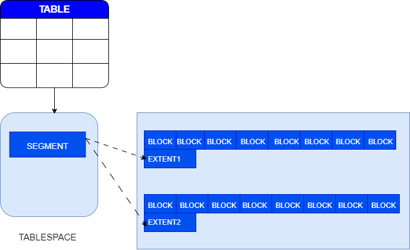

## 模式简介

数据库中的模式（Schema）是用于管理一系列关系对象（表、索引等）的逻辑容器。数据库管理员在做数据库设计阶段可将业务上关联性较强的关系对象划分到同一个模式中便于统一管理；将业务无关联的关系对象划分到不同的模式中，避免不同业务之间的对象相互干扰。模式下包含的关系对象称为模式对象。

## 模式与用户的区别

Schema是模式对象的逻辑容器，其作用是便于将不同的对象进行分组管理，且每个模式对象必须属于某一个Schema。

用户（User）是在数据库中执行特定操作的身份，主要用于权限管理。每个用户都拥有一个与之同名的Schema，除同名Schema外，用户在具备相应权限的前提下还可以访问和使用其他Schema。

用户登录数据库后，当前Schema（current_schema）默认为登录用户的同名Schema，可以通过ALTER SESSION语句手动切换current_schema。

用户执行SQL语句操作模式对象时，如果没有显式指定对象所属Schema，YashanDB会默认视为操作current_schema下的对象（若对象不存在、用户对相应对象无操作权限等都将会报错）。

对于复杂的模式对象（例如视图、存储过程以及自定义函数），在编译此类对象定义的过程中，YashanDB会临时将当前用户和当前Schema切换为对象所属的Schema。

## 关系对象的存储

关系对象需要储存的信息包含两部分：定义和数据。

定义是存储在YashanDB的系统表中与对象相关的信息，通过系统视图、DBMS_METADATA程序包等方式可以查询。

包含数据的关系数据结构（表、索引、访问约束、分区），其数据由YashanDB存储在表空间中。存储在YashanDB表空间中的对象，包含一个或多个逻辑存储结构，称之为段（segment），由段来负责管理属于该对象的数据块（Block），为了提高效率，段将数据库按照区（Extent）的方式批量管理。当创建这些对象时，需要指定其存储的表空间，当这些对象需要申请存储空间时，段向所属的表空间申请区，区中包含连续地若干个数据块。然后这些对象便可将自己的数据写入某个数据块中。当对象被删除时，其对应的段将被释放，由这些段管理的数据块将释放归还给表空间，而后表空间可分配给其他对象使用。

## 关系对象依赖关系

关系对象依赖关系是指创建或使用某个关系对象时，需依赖或直接引用其他关系对象。YashanDB在创建对象时、对象的定义发生变更时，或使用对象时，会自动检测并维护该对象所依赖的其他对象的状态。

例如某个视图依赖一张表，当该表的某一列数据类型发生变更时，视图如果引用了该列，则视图中该列的数据类型也会随之变更。

如果一个存储过程A调用了另一个存储过程B，在存储过程B被重新定义后再次执行存储过程A时，A会调用重新定义后的B。
