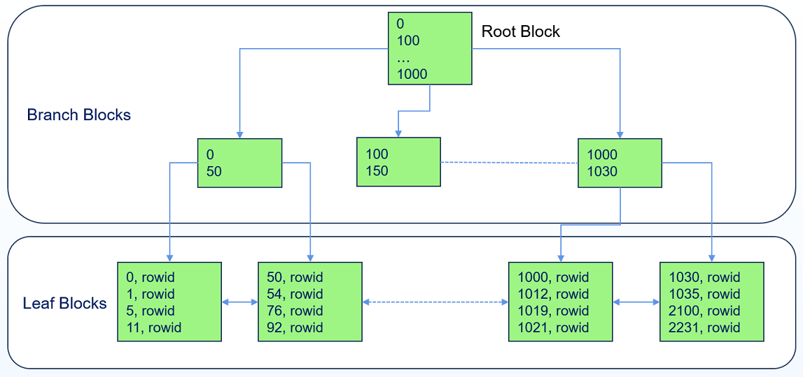
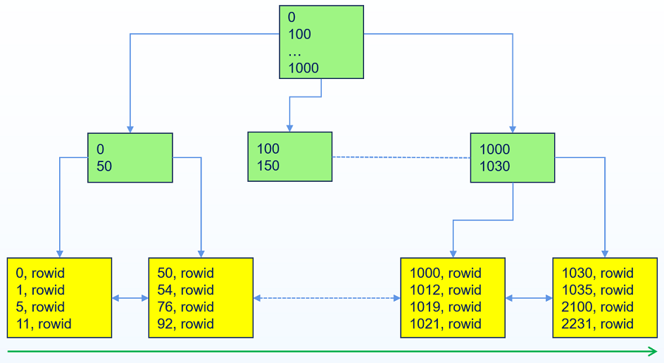
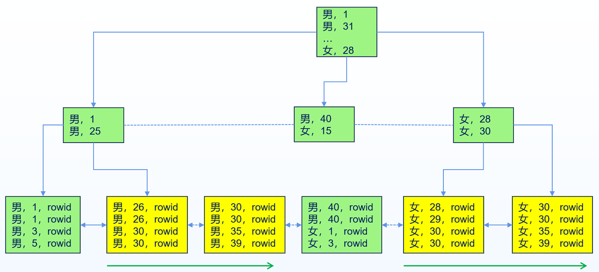

## 索引概述

在一个数据库系统中，索引是一个独立对象，是表的一个可选结构。索引包含表的索引列的所有数据（包括NULL）。

索引数据是有序的，给表创建合适的索引相当于给表创建了一个目录，可以提高该表关于索引列的访问效率。适合创建索引的列的特征如下：

- 列会被频繁查询

- 列经常作为查询条件

- 外键列（在外键列上创建索引，可以避免操作父表带来的子表的排他锁，而是改为共享锁）

- 需要保持唯一的列（可以创建唯一索引）

### 索引的优点和缺点

**优点**

- 减少I/O开销

    表的数据是随机存储的，如果表上没有索引，查询需要执行全表扫描才能获取结果，这意味着数据库需要访问这个表的每个数据块，从而带来大量的I/O开销。

- 提高查询速度
    
    若在表的某一列或某几列上创建了索引，执行关于该索引列或包含索引列过滤的查询时，只需基于索引在随机分布的表中检索小部分数据块（甚至可能不需要检索数据块）便可快速获得查询结果。

**缺点**

- 额外的空间开销
    
    索引是一个独立对象，创建索引会带来额外的空间开销。
    
- 增加DML语句的执行开销

- 可能的性能损失
    
    创建合适的索引可以带来业务的极大性能提升，但如果滥用索引，则可能会导致业务性能下降。

### 索引的可用性和可见性

**可用性**

索引可以是可用usable的（默认值），也可以是不可用unusable的。

YashanDB在DML操作中不维护不可用索引，且优化器也不会选择不可用索引执行查询操作。

当一个索引从可用状态变更为不可用状态时，YashanDB会把这个索引对应的segment删除，即不可用索引不会占用物理空间。

不可用索引或索引分区可以通过rebuild语句调整状态为可用。

通常，在导入大表时，先将索引设置为不可用状态待导入完成后再rebuild使其可用，可以提高导入性能。

```sql
ALTER INDEX idxtest UNUSABLE;
ALTER INDEX idxtest REBUILD;
```

**可见性**

索引可以是可见visible的（默认值），也可以是不可见invisible的。

YashanDB在DML操作中依然维护不可见索引，但优化器不会选择不可见索引执行查询操作。

在调整业务时，可以通过设置索引的可见性来测试索引对业务性能的影响。

```sql
ALTER INDEX idxtest INVISIBLE;
ALTER INDEX idxtest VISIBLE;
```

### 唯一索引和非唯一索引

创建索引时可以设置索引的唯一性。

唯一索引：要求索引列的每个值唯一，即不允许重复值（NULL除外，YashanDB会将索引列全NULL的行也存入索引），通常按照索引列排序，如果唯一索引列全NULL则按照RowId排序。

非唯一索引：不要求值的唯一性，在索引值不同时按照索引列排序，索引列值相同时则按照RowId排序。

### 索引的存储

索引是一个独立对象，有单独的segment。索引segment的表空间默认是索引所有者的默认表空间，在创建索引或重建索引时，可以自定义指定索引的表空间。

索引中的行与表一一对应，用于存储索引列的值以及对应表中的行RowId，索引严格按照索引列的值（值相同时按照RowId的值）有序存储。

### 索引的维护

索引是表的一个可选结构，跟随表的变动而变动：

- 当表插入一行数据，索引也在合适位置插入一行数据（只存储索引列）。

- 当表删除一行数据，索引也删除对应行数据。

- 当表没有更新索引列时，索引不需要维护。

- 当表更新索引列时，为了保持索引的有序性，索引不能像表那样在原位更新，而是先删除老数据构造的索引行然后在合适的位置插入新值构造的索引行。

## BTree索引

BTree索引通过维护一个B树数据结构来保持索引的有序性。

在YashanDB中，数据块是物理存储的最小单元，BTree索引在单个数据块中存储的索引行是有序的，不同的数据块之间也是有序的，从而确保了整个BTree索引是有序的。



### 分支块和叶子块

BTree索引存在两种数据块：存储索引列数据的叶子块和存储路由信息（用户查找）的分支块。

- 叶子块：存储索引列的值以及对应表中的RowId，叶子块之间使用双向链表串联。

- 分支块：存储指向其下层数据块的指针，以及对应下层数据块的数据大小信息。最顶层的分支块又称根分支块。

BTree索引是一个平衡树，所有叶子块都处在同一深度（通常，叶子块所处的层级称为level 0，比叶子块高一层的分支块为level 1，以此类推）。从根分支块访问任意叶子块需经历的块的个数（称为BTree索引的高度）是相等的，即根分支块的层级 = B树高度 - 1。同时，也意味着查找任意索引列数据需要消耗的时间几乎相同。

### 索引扫描

假设某个YashanDB数据库中BTree索引的高度是h，通过B树的结构可知，对于任意索引列数据，最多只需访问h个数据块便可检索到所需数据。如需获取该数据所在行的非索引列数据（即采用索引列作为查询的过滤条件），则再额外访问1个数据块。

当采用索引列作为查询的过滤条件时，YashanDB可以通过索引来加速查找。如果待查询的数据本身就是索引列时，则只需在索引数据块中查询即可快速获取数据。

#### 索引全扫描（Index Full Scan）

当一个查询需要扫描一个表的所有数据，同时需要使用索引列的前导列排序，YashanDB会执行索引全扫描。索引全扫描相当于从索引的最左侧叶子块扫描到最右边叶子块（或从最右边叶子块扫描到最左边叶子块）。

假设有表idxtest，其上建有a列的索引，如下的查询会执行索引全扫描。

```sql
SELECT a FROM idxtest ORDER BY a;
```

索引全扫描利用索引的有序性，可直接跳过排序的过程。



#### 索引快速全扫描（Index Fast Full Scan）

在索引全扫描的基础上，如果扫描结果不需要有序，则YashanDB执行索引快速全扫描，例如count(*)，sum()等与顺序无关的扫描。

索引快速全扫描的特点是需要访问全表所有行，但只访问索引列数据，且不要求排序。

假设有表idxtest，其上建有a列的索引，如下的查询会执行索引快速全扫描。

```sql
SELECT SUM(a) FROM idxtest;
```

索引快速全扫描会根据索引数据块在物理存储的存储顺序去扫描数据（预读会加速索引快速全扫描）。


#### 索引范围扫描（Index Range Scan）

当索引的前导列参与查询并且返回结果可能不止一条时，YashanDB执行索引范围扫描。索引范围扫描会根据扫描设置的左边界，从根分支块定位到叶子块满足第一个条件的索引行，然后依次向右扫描，直到扫描出右边界。如果是降序扫描，则先定位右边界，然后向左扫描，直到扫描出左边界。

假设有表idxtest，其上建有a列的索引，如下的查询会执行索引范围扫描。

```sql
SELECT * FROM idxtest WHERE a > 50 AND a < 1020;
```

上述查询，YashanDB会先定位50（扫描左边界）在索引块的位置，然后依次向右扫描，直到索引列值超过1020（扫描右边界）。

如果表idxtest上仅有a列，则上述扫描不需要额外的IO回表查询。如果表idxtest上不止a列一列，则上述扫描还需要对满足条件的每一行数据产生额外的依次IO回表查询。


#### 索引唯一扫描（Index Unique Scan）

当过滤条件使用相等运算符，并且包含了唯一索引的所有列时，YashanDB执行索引唯一扫描。索引唯一扫描要么扫描出一行数据，要么一行数据都扫描不到。

假设有表idxtest，其上建有a列的唯一索引，如下的查询会执行索引唯一扫描。

```sql
SELECT * FROM idxtest WHERE a = 1000;
```

执行上述扫描，YashanDB在扫描到第一条1000后就会终止扫描（唯一索引保证了最多只可能存在一个1000）。


#### 索引跳跃扫描（Index Skip Scan）

当索引的前导列基数非常小（前导列的distinct值相比于全表行数非常小），如果查询的条件在索引前导列后面的索引列上，此时YashanDB执行索引跳跃扫描。

例如表person里有gender和age两列，并且有一个索引建在（gender，age）上，则`select * from person where age = 30`就会执行索引跳跃扫描。YashanDB会先找到第一个（男，30），然后扫描直到扫描出age = 30这个条件，再重新定位边界到第一个（女，30），然后扫描直到扫描出age = 30。

索引跳跃扫描相当于把扫描拆分成若干个索引范围扫描。



#### 索引聚集因子

索引聚集因子描述了索引对应表数据块的有序程度，表数据越有序，索引聚集因子越小，扫描的代价越小。如果表数据完全按照索引的顺序分布，则索引聚集因子最小，值为表数据块的个数。

- 如果索引聚集因子比较高，则说明在大型索引范围扫描过程中，YashanDB可能会需要执行较高数量的I/O。
- 如果索引聚集因子比较低，则说明在大型索引范围扫描过程中，YashanDB只需要执行较低数量的I/O。

### 反向索引

反向索引也是BTree索引的一种，但是反向索引在存储值时，会按照字节序逆转后的结果存储（索引列顺序不变）。

按照字节序逆转后的值存储，索引分布的会更加离散。例如当使用自增列作为索引列时，业务总是插入更大的索引列值到索引中，删除的则都是较小的索引列值。如果使用正常的BTree索引，随着业务的进行，就会导致整个索引倾斜。但如果索引是反向索引，由于索引列值被按照字节序逆转，新插入的值就可以分散到整个B树的叶子块。

同时反向索引由于存储结构的变化，也丧失了普通BTree索引范围查询的能力。

### 升序索引和降序索引

默认情况下，YashanDB创建索引会按照索引列值从小到大来进行存储，即默认为升序索引。例如`create index ageIdx on teachers(age)`，创建的索引会按照教师的年龄，从小到大进行存储。

YashanDB还支持降序索引，通过指定索引列`desc`可创建降序索引。例如`create index ageIdx on teachers(age desc)`，创建的索引会按照教师的年龄，从大到小进行存储。

YashanDB支持对组合索引的索引列分别设置升序或降序，例如`create index nameAgeIdx on teachers(name asc, age desc)`。创建的索引首先按照教师名字按照字典序升序存储，当教师名字相同时，按照教师年龄从大到小进行存储。

### 函数索引

YashanDB支持用户基于函数，或者与基表相关某个或多个列的表达式来创建索引，此类索引称为函数索引。函数索引根据某一行上的数据以及计算函数或者表达式，计算出一个值存储到索引中。

#### 函数索引的使用

如果定义一张表存储教师信息，包含基础工资，教师职称等，而教师的实际工资是基于基础工资和教师职称的一个表达式，此时可以创建一个基于基础工资列和教师职称列的函数索引，当查询教师实际工资时，可以使用该函数索引加速查询。

```sql
CREATE TABLE teachers(id INT, teachingAge INT, salary INT, title INT);
CREATE INDEX payment ON teachers(salary * title);

SELECT * FROM teachers WHERE salary * title > 8000;
```

当查询中包含了函数索引的表达式时，YashanDB会在查询中使用函数索引。

#### 函数索引的执行优化

当函数索引的表达式出现在WHERE语句中时，优化器就可以选择函数索引执行索引扫描算子（索引全扫描/索引快速扫描/索引范围扫描/索引唯一扫描/索引跳跃扫描）。此时函数索引的表达式就相当于表的一个虚拟列，优化器对该虚拟列索引的处理和对普通列索引的处理相同。

## RTree索引

RTree索引是BTree在n维空间的扩展，是专门用于空间数据查询的多维索引结构，主要用于处理地理空间数据、多维范围查询和最近邻查询。

YashanDB的空间索引是R树（Rectangle Tree）的变体，基于n维矩形（通常为二维矩形或者三维立方体）构建索引，采用树状结构管理，每个键值代表一个矩形区域。

Rtree存储的键值是Geometry对象的MBR（Minimum Boundary Rectangle），采用空间聚集的方式把相邻近的Geometry对象划分在一起，组成更高一级的节点；在更高一层又根据这些节点的MBR进行聚集，划分形成更高一级的节点，直到所有Geometry对象组成一个根节点。

Rtree索引检索就是给定一个目标矩形，通过对比RTree上每个key的外包矩形与目标矩形的空间关系（有无公共点或是否包含），从而选择出符合条件的行。
