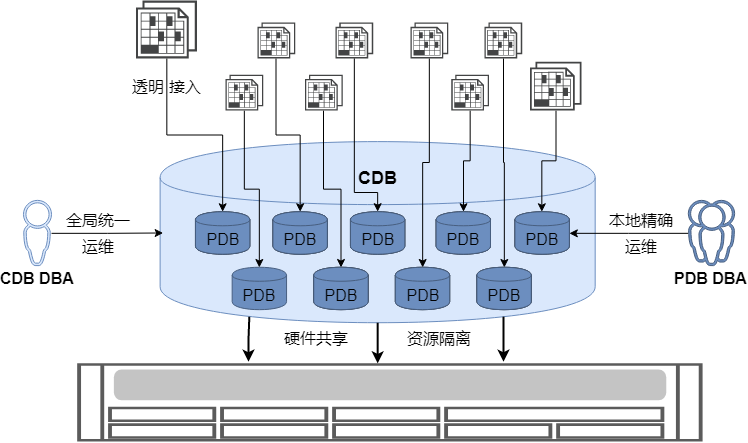

多租户架构赋予YashanDB原生的多租户能力，为复杂业务系统提供了一个在成本、安全和性能之间平衡的数据库部署解决方案。

## 租户定义

租户是YashanDB为业务系统分配数据库服务的基本实体单元。在多租户架构下，YashanDB实例被创建为容器数据库（CDB，Container Database），统一管理多个可插拔数据库（PDB，Pluggable Database），单个CDB实例最多可支持管理8192个PDB。

YashanDB采用“数据库即租户”的设计理念，将PDB作为租户的核心载体。业务系统通过在CDB中创建PDB来获得独立的数据库租户身份，从而享受完整的数据库服务能力和资源隔离保障。

## 租户资源

当业务系统以租户身份使用YashanDB时，系统将为其分配专属的资源集合，确保各租户间的资源隔离和性能稳定。

- 计算资源

  支持按CPU核心数或线程数为租户分配专属计算资源，并提供智能化的动态调整机制。系统可根据业务负载变化自动扩展CPU配额，有效避免资源争用导致的性能瓶颈，确保关键业务的服务质量。

- 内存资源

  支持为每个租户精确指定内存配额，系统将根据预设配额自动为不同内存池合理分配内存资源，实现精细化的内存管理。

- IO资源

  提供基于存储设备的IOPS（每秒输入输出操作次数）配额限制机制，有效保障各租户存储访问的带宽稳定性和响应性能。

- 存储资源

  为每个租户分配专属表空间，支持数据文件的智能自动扩容与容量上限控制，确保存储资源的合理利用和成本可控。

- 对象资源

  每个租户拥有完全独立的数据库逻辑对象命名空间，包括模式、用户、表、索引、视图等，实现真正的数据和逻辑隔离。

## 多租户架构的作用

通过多租户架构，YashanDB帮助企业实现从“烟囱式”分散部署向“池化式”集中管理的根本性转变，在保障各业务系统独立性和安全性的前提下，最大化资源利用效率，降低总体拥有成本。无论是在大型企业的混合IT环境，还是中小型企业的云原生部署场景中，YashanDB多租户架构都能提供灵活、高效、安全的数据库服务。

### 显著降低数据库部署成本

通过深度整合硬件资源和优化数据库底层架构，YashanDB显著提升了资源利用率，大幅降低了基础设施投资和运维管理成本。YashanDB单个CDB实例最多可支持管理8192个PDB，这意味着企业能够将原本分散在数千个独立数据库系统中的业务整合到统一的数据库平台和硬件环境中。在此架构下，原有各系统的独立运维能力大多可纳入CDB的统一运维管理体系，DBA团队规模和运维投入成本相较于传统部署模式可显著下降，为企业带来可观的TCO（总体拥有成本）优化效果。

### 租户身份对应用透明

YashanDB多租户架构中的PDB与传统非CDB保持100%兼容。当应用通过PDB获得租户身份时，所有使用方式和数据库行为表现都与独立非CDB完全一致，为单个应用提供独占完整YashanDB实例的使用体验。业务系统可在YashanDB的CDB中为不同应用创建具有不同兼容性模式的PDB（例如Oracle兼容模式或MySQL兼容模式），各应用通过连接对应PDB即可使用最适合的数据库兼容模式，真正实现“一个平台，多种选择”的灵活部署。

### 细粒度资源隔离

为有效限制每个PDB的资源占用并解决不同PDB在同一环境中的资源争用问题，YashanDB多租户架构提供了精细化的资源隔离机制，支持为每个PDB独立分配和管控以下关键系统资源：

- 计算资源：CPU核心数和线程数的精确配额管理

- 内存资源：独立的内存池分配和动态调整机制

- IO资源：基于存储设备的IOPS配额限制和带宽保障

- 存储资源：专属表空间和容量上限控制

通过这种全方位的资源隔离机制，确保了租户间的公平性和性能稳定性。同时，每个租户的数据在物理存储和逻辑访问层面实现完全隔离，从根本上防止了数据跨租户泄露的安全风险。

### 灵活的运维方式

YashanDB多租户架构提供了层次化的灵活运维能力，满足不同角色和场景的运维需求：

- 全局统一运维：支持CDB级别的集中化管理操作，包括：

    - 整体架构的升级和补丁管理

    - 全局备份恢复策略制定

    - 统一配置管理和参数调优

    - 跨租户的资源调度和优化

- 本地精细运维：提供PDB级别的独立运维能力，涵盖：
    
    - 租户的本地用户与权限管理

    - 单个租户的备份恢复操作

    - 租户专属的主备复制配置

    - 精确到租户的闪回和恢复

    - 租户级别的性能监控和调优

这种灵活的分层运维模式既保证了整体架构的统一管理效率，又满足了各业务租户的个性化运维需求，真正实现了“统一管理，个性服务”的运维理念。
