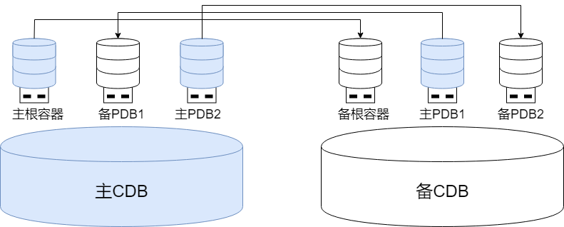

## 单机（主备）部署多租户

在单机（主备）部署中搭建多租户环境，通常是在多台服务器上分别运行1个主CDB+1个或多个备CDB，通过主备复制实现数据同步。

在对高可用要求较低的场景中，可以只使用一台服务器部署运行一个单CDB。

### 主备CDB

在主备部署的CDB中，系统由一个主CDB和若干个备CDB组成。主根容器对应的CDB被定义为主CDB，备根容器对应的CDB被定义为备CDB。

PDB的创建和删除操作只能在主CDB中执行，且会自动同步至备CDB确保主备CDB间的元数据一致性。PDB的其他日常运维操作，例如PDB启停，则在主备CDB中均可执行。

新创建的PDB默认跟随CDB的主备角色，即主CDB中的是主PDB，后续通过PDB级别的主备切换可以自由转换为备PDB。

PDB的主备角色不受CDB角色约束，主CDB中可以包含备PDB、备CDB中也可以包含主PDB。PDB可以进行独立的主备切换，但对整个CDB进行主备切换时会一并切换PDB的角色：

- 整个CDB进行计划内切换：根容器和所有PDB的角色都会转换。

- 整个CDB进行故障切换：备根容器升主后，其上所有PDB的角色都转换为主。

### 租户级主备高可用

基于主备CDB的交叉PDB部署架构，能够动态平衡负载压力，有效提升整体资源利用率和系统性能。

#### PDB主备复制

PDB间的主备复制链路虽依赖于主备根容器间的连接配置，但不同主备PDB间的日志传输相互独立。可按需配置差异化的高可用策略：

- 保护模式：每个PDB可独立选择适合的保护级别，满足不同业务场景的可靠性要求。

- 多样化主备复制方式：支持物理复制和逻辑复制，用户可根据具体业务需求进行独立选择与配置。

#### PDB主备切换

PDB间的主备角色切换互不干扰，可按需配置差异化的自动选主策略，也可按需进行手动切换：

- 自动选主策略：每个PDB可自定义配置个性化的主备切换策略，实现业务级别的灵活容灾。

- 手动主备切换：

    - 全局运维：通过根容器定向操作指定单个或多个PDB进行主备切换。

    - 本地运维：直接连接目标PDB执行主备切换。

## 共享/分布式集群部署多租户

在共享/分布式集群部署中搭建多租户环境，通常在多台服务器上分别运行多个多活实例。多个实例可并发读写同一份数据，保证实例间读写的强一致性，具备高可用、高扩展、高性能等特性。

集群中每台服务器上会运行1个YCS实例、1个YFS实例、1个根容器实例和若干PDB的实例，每个PDB可以在每台服务器上启动0 - 1个实例。每个根容器实例都能独立管理其下属的PDB实例，同一服务器上的根容器实例和所有PDB实例共用同一个YCS和YFS实例。

实际使用中，还可根据服务器资源状况、不同租户的高可用要求以及负载水平，灵活管控每个服务器上运行的PDB实例数量。例如采用交叉运行方式将多个PDB实例相对均衡地分布在不同服务器上，避免单点资源紧张，提升资源优化配置和负载均衡效果。

同一PDB在不同服务器上启动的PDB实例可以对等访问，不同PDB之间保持完全隔离，确保租户间的安全性和独立性。
