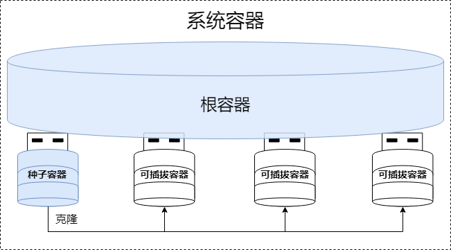

容器数据库（CDB，Container Database）作为YashanDB多租户架构的核心引擎和关键实现载体，采用了数据库虚拟化技术，能够在单一物理数据库实例中高效托管数百乃至数千个相互独立、完全隔离的逻辑数据库实例，为企业级应用提供了真正意义上的数据库原生多租户服务能力。

CDB通过将多个不同类型的容器（Container）整合到统一的共享资源池中，实现了资源的高效利用和灵活管理。

## 系统容器

CDB作为容器数据库本身也是一个可托管其他容器的容器实体，而系统容器（System Container）即是CDB对应的逻辑容器，负责管理包含其他各种类型物理容器的统一资源池。

## 根容器

每个CDB实例都拥有一个唯一且自动创建的根容器（CDB Root），名称为CDB$ROOT。根容器作为整个CDB的“管理中心”和“调度枢纽”，承担着双重核心职责：

- 连接管理：作为数据库请求的统一监听入口，负责所有容器连接的智能重定向和路由分发。

- 运维管控：作为CDB的全局管理容器，负责所有容器的生命周期管理（创建、删除等）和全局运维操作协调。

虽然根容器具备完整的数据库服务能力，但出于安全和管理规范考虑，通常建议仅将其作为管理容器使用，避免直接承载实际业务。

## 种子容器

种子容器（PDB seed）顾名思义是用于标准化创建PDB的模板容器，旨在实现PDB的快速创建和规范化部署。在创建CDB时，系统会自动创建名为PDB$SEED的种子容器。

种子容器具有以下特征：

- 默认处于关闭状态，不对外提供服务。

- 不可被删除，确保模板的持久可用性。

- 只能以只读模式启动，保证模板的一致性和安全性。

- 无主备角色。

## 可插拔容器

可插拔容器（PDB，Pluggable Database）是专门用于提供数据库服务的核心容器，本质上是一个完整的逻辑数据库对象。同传统非容器物理数据库相似，PDB具备同等完整的数据库服务能力，拥有独立的用户、对象、表空间等逻辑资源，以及数据文件等物理资源。

PDB具有卓越的灵活性和可移植性，可从种子容器快速克隆生成新的PDB实例，避免重复的初始化配置工作。

不同的业务系统可以分开规划使用独立的PDB实例，业务系统通过PDB访问YashanDB的方式与传统非容器物理数据库完全一致，获得如同独占数据库般的使用体验。不同PDB既可以独立进行运维管理（例如启停、配置优化、备份与恢复等），也可以通过根容器实现全局统一的运维管控。
