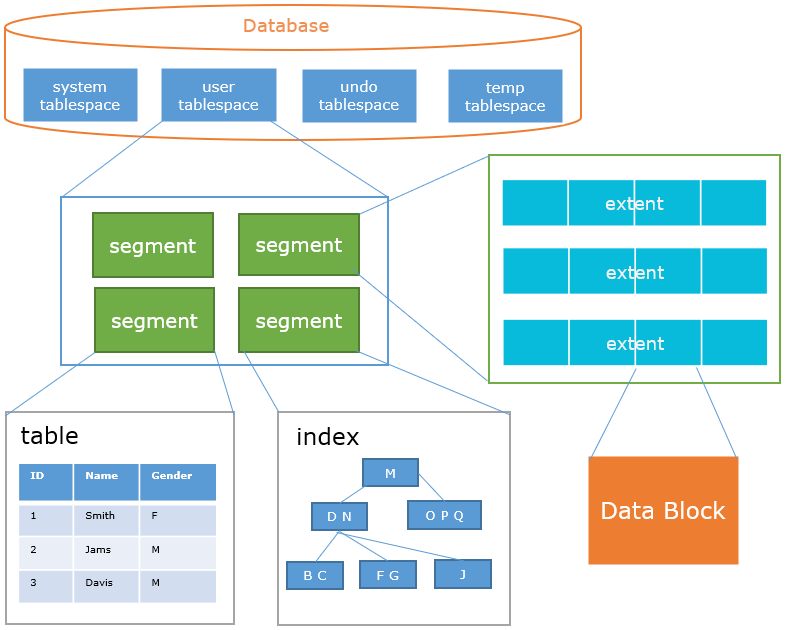
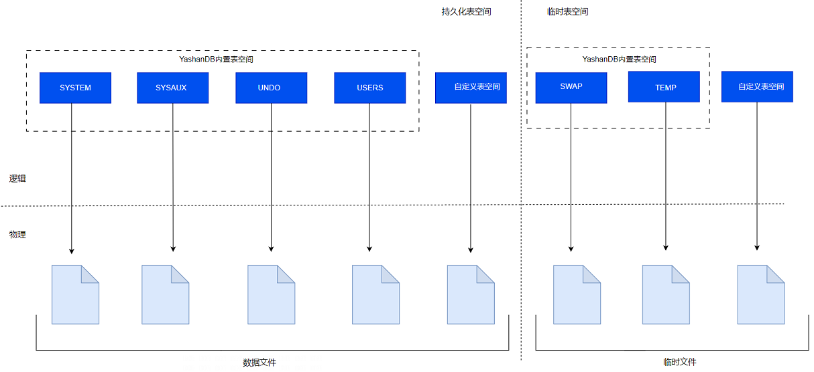
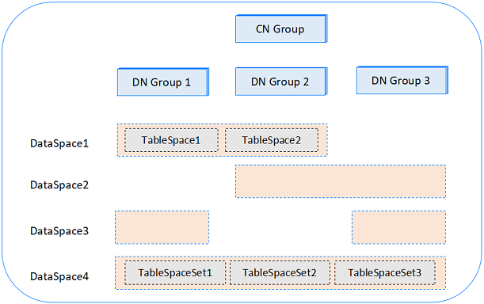

YashanDB通过提供逻辑存储结构，使数据库存储空间管理更加灵活快捷。与物理存储结构不同，逻辑存储结构对操作系统是透明的，所有的访问都需要通过数据库提供的接口。

## 段页式存储结构

YashanDB段页式存储主要包括：

- 块（Block）：数据存储的最小逻辑单元，例如数据块、索引块、undo块等。

- 区（Extent）：由一组物理上连续的数据块组成，可以提高空间管理的效率。

- 段（Segment）：每个数据库对象至少包含一个数据段。空间上由若干数据区组成。包含表段、索引段、 回滚段等不同类型的段。

- 表空间（Tablespace）：数据库划分的逻辑单元，包含若干数据库对象，例如表、索引、视图等。

段页式存储结构不同部分之间的关系如下图所示，其中Data Block与物理存储结构中数据文件的物理数据库一一对应。

### 块

数据块是YashanDB最小的逻辑存储单元，也是I/O的最小单位，数据块大小由参数DB_BLOCK_SIZE决定。YashanDB支持8K、16K、32K三种不同大小的数据块。

#### 块类型

YashanDB包含不同用途、不同类别的块，常见的块类型包括：

- HEAP Block：用于存储heap表数据的块。

- BTree Block：用于存储btree索引数据的块。

- undo Block：用于存储历史版本数据的块。

- Space Head Block：表空间头的块。

- LOB Block：用于存储大对象类型的块。

- Xact Block：用于存储事务信息的块。

#### 块格式

以HEAP数据块为例， 一个数据块包含以下几部分：

- 块头：数据块的物理位置信息，块类型等信息。

- HEAP块头：数据块上的行数，事务条目数，空闲空间信息。

- 行数据：以行为单位组织的数据。

- 空闲空间：页面上可以用来写入数据的连续空间。

- 行目录：描述每个行在数据块上的位置。

- 事务：描述更新数据块的事务信息。

### 区

区是YashanDB数据库分配磁盘空间的最小单位，单个数据区由连续的数据块组成。

#### 区的分配

YashanDB数据库向对象分配数据区的方式由表空间的区管理方式和当前申请空间的对象大小决定，表空间的区管理分为：

- 自动分配：表空间每次根据当前对象大小动态分配包含不同数量数据块的数据区。

- 统一分配：表空间每次向当前对象分配固定数量数据块的数据区，数量由创建表空间时指定的EXTENT UNIFORM SIZE决定，且不可更改。

#### 区的释放

当对象分配的数据区不再使用时，例如被drop/truncate，这些数据区会归还到对应的表空间，可以被后续的空间申请复用。

### 段

数据段由一个或多个连续或不连续的数据区组成，用于存储数据库对象。每个数据段只能属于一个表空间，数据段可以跨同一表空间下的不同数据文件，但是不能跨不同的表空间。

#### 段类型

YashanDB主要包含以下不同类型的段：

- HEAP/LSC/TAC Segment：存储HEAP/LSC/TAC表数据的段。

- BTree Segment：存储BTree索引的段。

- undo Segment：存储历史版本数据的段。

- LOB Segment：存储大对象类型数据的段。

#### 水位线

水位线是段上的标记点，分为高水位线（HWM）和低水位线（LWM）。

HWM以上的数据块未被使用过且未被初始化。数据扫描时，HWM以上的数据块不会被扫描。

插入数据时，如果HWM以下没有空间，则需要扩展段，并推高HWM。对于随机插入的数据段，段扩展时，会先推高HWM再从新的HWM以下初始化一批数据块用于插入。

LWM以下的数据块全部是初始化过的，LWM到HWM之间的数据块可能有部分未初始化，且这部分数据块可能是其他已删除的对象使用过的，这部分数据块的扫描需要借助空闲空间管理的元数据，做精细化读取。

LWM以下的数据块则可以在一个区内连续读取。

全表扫描时，可以计算出原LWM以上还有多少连续的已初始化的数据块，然后将LWM推高至连续的已初始化的数据块的顶点处。

#### 段空间管理

段空间管理提供一种通过三层空闲度列表管理段上空闲空间的方式，将数据页面的空闲空间划分成多个空闲度描述在空闲度列表上，插入数据时根据数据长度在空闲列表上查找符合条件的数据块。段空间管理通过随机的方式，使多个会话离散到不同的空闲度列表上，最大的限度提高并发性：

- 提供多个会话并发初始化数据页面的能力。

- 提供多个会话搜索不同的空闲列表的能力。

- 提供事务内空闲空间复用的能力。

- 提供不同实例使用不同的空闲度列表的能力。

不同的存储结构对空闲都的定义不同。

|  空闲度| 状态| 含义|
| ------ | -------- | ------------------ |
| 0      | Full     | 页面不可再插入数据 |
| 255    | unformat | 未初始化           |

**HEAP**

|  空闲度| 状态| 含义|
| ------ | --------------- | -------------------------------------------- |
| 1      | 0 - 25%           | 页面有0 - 25%的空闲空间，且可以继续插入数据    |
| 2      | 25% - 50%         | 页面有25% - 50%的空闲空间，且可以继续插入数据  |
| 3      | 50% - 75%         | 页面有50% - 75%的空闲空间，且可以继续插入数据  |
| 4      | 75% - 100%        | 页面有75% - 100%的空闲空间，且可以继续插入数据 |
| 5      | Empty           | 页面为空，未插入过数据或数据已经删空         |
| 6      | shrink complete | 页面已经通过shrink搬空                       |

**BTree**

|  空闲度| 状态| 含义|
| ------ | ----- | ------------ |
| 0      | Full  | 页面上有数据 |
| 1      | empty | 页面为空     |

**PCTFREE**

数据块插入时预留给将来更新数据的空间百分比，即插入数据不能占用预留的这部分空间，避免后续数据更新产生行迁移。

### 表空间

表空间是YashanDB数据库最大的逻辑存储单元，是数据段的逻辑容器，同一表空间的存储空间可供其所有对象共享使用。

YashanDB数据库表空间概览图如下所示：

 

#### 表空间分类

YashanDB数据库表空间从用户角度分为内置表空间和用户自定义表空间，其中内置表空间包括：

- SYSTEM表空间：用于存储数据字典、数据库管理信息的表和视图、已编译的存储对象（例如触发器、过程和包）。

- SYSAUX表空间：SYSTEM的辅助表空间，减轻SYSTEM表空间的负载，是YashanDB许多特性（例如快照信息）的默认表空间。

- UNDO表空间：用于YashanDB数据库创建和管理回滚（撤销数据库更改）信息，这种信息包括交易行为的记录，且主要是在交易提交之前，统称为UNDO。

- TEMP表空间：主要用于临时表的段分配以及临时表相关的UNDO空间分配，并存储临时表数据和临时表相关的UNDO。

- SWAP表空间：用于数据库虚拟内存的换入换出，例如order by、hash join、统计信息收集等操作首先会通过数据库虚拟内存（通过VM_BUFFER_SIZE参数控制）缓存计算的中间结果，但如果虚拟内存不足时，需要通过将虚拟内存换出到SWAP表空间来释放内存，必要时再将内存从SWAP表空间换入。

- USERS表空间：YashanDB数据库默认的用户表空间，用于用户永久对象和私有信息。

YashanDB数据库表空间从对象存储角度分为持久化和临时两种类型，两种类型都支持用户自定义创建。

- 持久化表空间：持久化表空间存储非临时对象的数据段，这些段存储在数据文件中。

- 临时表空间：临时表空间包含仅在会话期间持久存在的临时数据，持久化对象不能驻留在临时表空间中，临时表空间数据存储在临时文件中。

#### 在线和离线表空间

表空间通常是在线的，以便用户可以访问数据。可以通过ALTER TABLESPACE [OFFLINE|ONLINE]切换自定义表空间的在离线状态，但内置表空间不能离线。

当表空间离线时，访问该表空间中对象、添加/删除文件等操作都会收到错误。

#### 表空间文件管理

- 表空间最少包含一个数据文件。

- 支持通过增加/删除表空间内文件来扩展/缩小表空间的存储空间。

- 支持对单个表空间文件进行RESIZE。

- 支持对单个表空间文件离线。

#### 表空间的空间管理

表空间通过每个数据文件的位图块管理空闲空间，位图块上一位对应一组数据块，1表示对应空间已经被分配，0表示对应空间空闲。

当对象（例如表、索引）需要新的存储空间时，会向所属的表空间进行申请。此时表空间会根据申请的大小，从包含的数据文件上搜索满足条件的空闲空间。

## 对象式存储结构

### 切片

切片（Slice）是LSC表冷数据的存储单元，用户创建的LSC表，在经过分区切分后，会将分区内的数据横向切分成多个切片存储，每个切片最大可存储行数由配置项SCOL_SLICE_ROWS控制。

每个切片由一个目录和目录下的多个文件（即物理存储结构中的[切片文件](物理存储结构)）组成，每个切片目录中，有多个后缀为.meta和.bin的文件，其中32767.meta是整个切片的入口文件，其他meta和bin文件为列的数据和元数据。

### Databucket

Databucket，即数据桶，是一组数据文件目录组成一个Tablespace的对象式空间，支持指定本地磁盘或云端存储。

## 分布式数据空间

分布式数据空间管理提供切分数据的能力，用户可以选择合适的策略将数据切分到不同数据空间和不同节点上，对数据与资源进行隔离。其示意图如下：

**DataSpace**

分布式数据的逻辑空间，用于关联数据库与数据节点，在创建一个DataSpace时，需要指定其关联的节点组和Chunk个数，系统将自动计算Chunk在节点组中的分布。

**TableSpaceSet**

用于存储分布表（Sharded Table）的表空间集，创建表空间集时，系统会自动在DataSpace关联的节点组上创建对应的表空间。

用户在创建分布表时，需要指定其所在的表空间集，或使用默认的表空间集。表数据将依据Chunk分布到不同的节点组中。

**TableSpace**

用于存储复制表（Duplicated Table）的表空间，表空间会在DataSpace关联的所有节点组上创建。

用户在创建复制表时，需要指定其所在的表空间，或使用默认的表空间。表数据将依据Chunk完全复制到不同的节点组中。

**Chunk**

数据分片与迁移的最小逻辑单元，一个TableSpaceSet下的一个Chunk有且仅有一个tablespace。

一个Chunk中的每个tablespace，是数据分片与迁移的最小物理单元。

**默认数据空间**

为简化存储管理，YashanDB在安装过程中内置了创建DataSpace和TableSpaceSet的脚本，作为默认的数据空间，用户建表时无需进行指定，即可按默认规则将数据分布到各DN组上。
