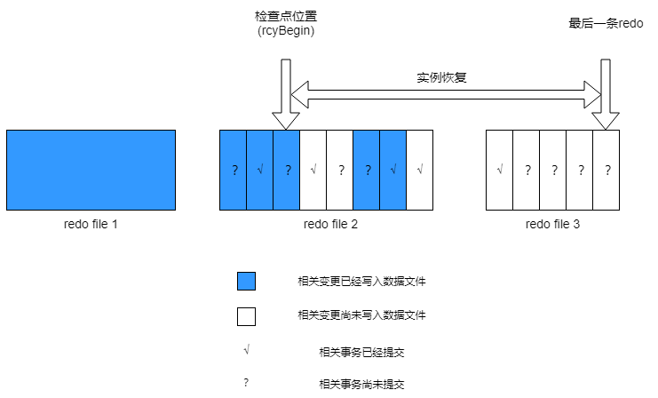
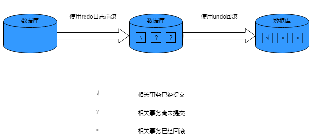

## 实例启停机制

数据库启停流程：

### 数据库的启动阶段

数据库实例从关闭到打开需要经过NOMOUNT、MOUNT和OPEN三个阶段。

可以通过yasboot工具或使用ALTER DATABASE语句启动数据库实例。

- **NOMOUNT**：启动实例，但不加载数据库。

  YashanDB启动实例时，需要执行以下步骤：
   - 按传入的实例类型（例如STANDALONE、MN、CN、DN），启动实例。

   - 初始化运行日志模块，将实例启动过程的日志写入运行日志文件中。
   
   - 读取配置参数文件，获取系统配置，初始化基础的实例运行环境，如全局内存区，基本的后台线程，连接监听器等。

   可以通过查看V$INSTANCE视图的STATUS更新为STARTED，确认成功启动到NOMOUNT状态。成功后，可以查看实例相关的系统视图。

- **MOUNT**：实例已启动，数据库完成加载，但数据库仍处于关闭状态。

   数据库加载的过程如下：

  - 加载数据库控制文件。

  - 加载表空间与数据文件。

  可以通过查看V$INSTANCE视图的STATUS更新为MOUNTED，确认已成功启动到MOUNT状态。成功后，可以查看数据库、文件级别的系统视图。

- **OPEN**：实例已启动，数据库已处于打开状态。

  数据库打开的过程如下：

  - 加载系统表的DC。

  - 启动前滚线程与回滚线程进行数据库恢复。

  - 启动所有数据库运行所需的线程。

  - 若为存算一体分布式集群部署，加载启动分布式的相关能力。

  可以通过查看V$INSTANCE视图的STATUS更新为OPEN，确认已成功启动到OPEN状态。成功后，可以提供所有正常的数据库服务。

### 数据库的打开模式

数据库实例从NOMOUNT或MOUNT阶段启动到OPEN阶段时，支持READWRITE、READONLY、RESETLOGS和UPGRADE四种打开模式。

- **READWRITE**：数据库默认打开为READWRITE模式，该模式下数据库支持完整的事务读写操作，用于正式生产环境。

- **READONLY**：以只读模式打开数据库，限制数据库只读，不产生任何redo。
  
  - 共享集群部署时，无法以只读模式打开数据库。

  - 单机主备部署时，物理备库默认使用该方式打开数据库。

- **UPGRADE**：数据库升级时，升级工具yasboot使用此模式打开数据库，该模式下不允许建立新的会话连接，也不允许以该模式手动OPEN数据库。

- **RESETLOGS**：当数据库进行了PITR（基于时间点的恢复）、数据库闪回或逻辑备库配置时，如果无法进行完全恢复，则需要通过RESETLOGS模式打开数据库，该模式将重新设置redo日志号。

### 数据库的关闭模式

可以通过yasboot工具或使用SHUTDOWN语句关闭数据库实例。

数据库关闭时，可以选择以下三种模式：

- **SHUTDOWN NORMAL**

  数据库会等待正在执行的事务正常结束后，关闭数据库。默认使用此模式。

- **SHUTDOWN IMMEDIATE**

  数据库会终止任何正在执行的事务操作，回滚未提交的事务，并断开用户连接，然后关闭数据库。

- **SHUTDOWN ABORT**

  数据库强制中断所有操作并立刻关闭数据库。但后续再打开数据库时，由于数据恢复可能导致启动时间变长。通常仅在紧急情况下使用。

## 实例配置参数

实例启动时，会从配置文件读取配置参数控制/影响数据库的行为从而适应各种各样的用户场景。

所有配置参数都存在默认值，在产品安装时不做任何配置也能启动实例，但建议在生产环境上根据实际需求适当调整配置，以达到更优的性能表现。

配置参数可以通过ALTER SYSTEM SET与ALTER SESSION SET语句进行修改。

实例配置参数从修改生效角度看，可以分为只读参数、重启生效参数和立即生效参数。

- 只读参数

  指数据库实例创建后就不允许再修改的参数，一般跟部署规划、存储格式等有关。例如节点ID是数据库实例部署时分配的，后续不支持修改。

- 重启生效参数

  指修改后需重启数据库实例才能生效的参数，实例只在启动时读取一次此类配置参数并进行使用。例如网络地址等。ALTER SYSTEM SET时，指定SCOPE=SPFILE可以将参数值写入配置文件，实例重启后生效。

- 立即生效参数

  指在数据库实例正常运行过程中，修改可以立即生效的参数。修改会实时刷新程序内存中的值，下一次读取会读到最新值进行使用，例如心跳间隔时间等。ALTER SYSTEM SET时，指定SCOPE=MEMORY可以将参数值写入内存，立即生效但重启后会失效；指定SCOPE=BOTH可以将参数值同时写入内存和配置文件，立即生效且重启后仍生效。

实例配置参数从影响范围上划分，可以分为系统级参数和会话级参数。

  - 系统级参数

    指对系统有全局性影响的参数，例如整个实例的基本信息、网络配置、性能参数等。可以通过ALTER SYSTEM SET语句进行修改。

  - 会话级参数

    指仅对会话产生影响的配置参数，例如当前会话的事务隔离等级。用户连接数据库实例产生新会话时，将从全局的会话级参数复制一份作为当前会话的参数。在会话里通过ALTER SESSION SET语句修改会话级参数后，仅对当前会话生效。

存算一体分布式集群部署中可以通过CN实例，对所有实例的配置参数进行修改。通过指定`TYPE = 实例类型`或`NODE = 实例号`的方式，将配置参数的修改应用到指定的实例上。

## 实例持久化机制

检查点是数据库保证数据的持久性和一致性关键机制，将数据库data buffer中的dirty block写入磁盘，以保障数据库正常运行（释放redo）、脏页写入、正常关闭、实例恢复以及正常启动。

- 检查点数据结构

  - truncPoint：data buffer中的数据页第一次被修改时的日志点。

  - checkpoint dirty queue：data buffer中所有的脏页按照truncPoint排列的有序队列，每个数据库实例有且仅有一个checkpoint dirty queue。

  - rcyBegin：控制文件上记录的实例redo日志点，标记数据库实例在该日志点前dirty block已经被写入硬盘。rcyBegin是redo日志回放起始点、数据库的重启回放点以及执行恢复时的检查点。

- 工作线程

  - ckpt：启动检查点并通知dbwr开启脏页写入。
  
  - dbwr：将checkpoint dirty queue上的脏页写入磁盘。

数据库使用检查点有如下作用：

- 减少实例恢复或介质恢复的时间。

- 确保数据库有规律地将data buffer的脏页写入磁盘，控制data buffer脏页数量。

- 确保在数据库一致性关闭时将所有已提交事务的数据写入磁盘。

检查点触发存在多种场景，YashanDB分为全量检查点和增量检查点。

### 全量检查点

将本实例上checkpoint dirty queue的全部dirty blocks写入硬盘。

全量检查点保证将本实例上的rcyBegin推进到checkpoint dirty queue最后一个dirty block的后面位置，即执行的时刻所有dirty blocks刷盘。

常见触发场景如下：

- 数据库关闭。

- 删除或offline表空间、删除或offline数据文件。

- 人为主动触发（ALTER SYSTEM FLUSH BUFFER_CACHE或ALTER SYSTEM CHECKPOINT）。

- 实例恢复完成。

### 增量检查点

增量检查点将data buffer一部分脏页写入磁盘，用于控制data buffer的脏页比例。

增量检查点执行过程：从checkpoint dirty queue起始位置开始，将一部分的dirty blocks写入磁盘，并且推进本实例的rcyBegin。

常见触发场景如下：

- 每间隔3秒。

- CHECKPOINT_TIMEOUT等条件触发。

## 实例恢复机制

实例恢复是从最新一次检查点开始回放（apply）所有的redo文件到数据文件，重建最新检查点后数据库的所有变更。

当打开一个不一致关闭数据库时，数据库自动启动实例恢复。

### 实例恢复的目的

实例恢复确保数据库在异常关闭后能恢复到一致状态。

数据库重做（redo）日志文件记录了对实例的所有更改，每个数据库实例拥有一个redo线程（即共享集群和分布式集群部署中有多个redo线程）。

事务提交时，redo写入线程LGWR将log buffer中的redo日志和事务SCN同时写入redo日志。但是事务提交时并未将data buffer中的脏页写入磁盘，由DBWR线程使用最有效的方式将已修改的脏页写入数据文件；因此会导致未提交事务的更改可能写入了数据文件中，而已提交的更改可能未写入数据文件。

如果打开异常关闭的数据库（服务器异常断电或数据库shutdown abort），将会出现下列情况：

- 已提交的事务修改的block未写入数据文件，而redo已写入。
  
  此时需要回放对应redo并将修改写入数据文件。

- 数据文件中已写入未提交事务的修改。
  
  此时需要将未提交事务的修改进行回滚（rollback），确保事务一致。

实例恢复时需要使用在线redo文件和在线的数据文件进行数据同步和一致性保证。

### 实例恢复的触发

数据库在如下场景中，将自动执行实例恢复：

- 单机部署或共享集群以及分布式集群中所有的数据库实例在异常关闭（例如服务器异常断电或数据库shutdown abort）后首次打开时。

- 共享集群或分布式集群场景下，如果一个实例异常关闭，由存活的实例执行实例恢复。

实例恢复由数据库SMON后台线程自动执行。

### 实例恢复的重要性

实例恢复使用检查点决定哪些redo改变必须被回放写入数据文件，检查点可以确保检查点之前的SCN对应的改变已完全写入数据文件。

在实例恢复期间，数据库必须回放从检查点开始所有的redo日志文件。如上图所示，检查点后的某些更改可能也已写入数据文件，但只有检查点前的更改才保证一定已全部被写入数据文件。

### 实例恢复的阶段

实例恢复分为两个阶段，两个阶段都完成实例恢复操作才算完成。redo日志和undo块的丢失或损坏，都可能导致实例恢复失败。

**第一阶段：前滚（Rolling Forward）**

前滚操作又称缓存恢复（Cache Recovery），是指从检查点往前回放在线redo日志，将数据文件还原至实例出现错误前所处的状态。
  
在前滚阶段，恢复线程先从控制文件中获得检查点位置（rcyBegin），再从检查点开始往前回放所有的在线redo日志。

redo日志中所有已提交的事务操作的数据均被写入数据文件后，最终data buffer中的缓存恢复成实例出现错误那个时间点的状态（此时，缓存中仍然存在实例出现错误时已提交但未写入数据文件的脏块以及当时事务被突然终止而残留的未提交且未来得及回滚的脏块）。至此，前滚操作完成。

前滚完成后，数据库会启动至OPEN阶段。

**第二阶段：回滚（Rolling Back）**

回滚操作又称事务恢复（Transaction Recovery），是指结合undo块将已执行但尚未提交的更改还原成执行前的状态。

在回滚阶段，恢复线程会使用undo块回滚所有未写入数据文件的改变（脏块），直至data buffer中所有脏块被还原到初始状态。

若在恢复线程完成回滚前，有用户进程发出读取这些脏块的请求，用户服务线程会先对脏块数据进行回滚再将回滚后的数据返回给用户。

## 实例故障诊断

YashanDB提供故障诊断架构，用于收集和管理诊断数据，从而诊断和解决数据库的问题。故障诊断架构有助于预防、检测、诊断和解决问题。发生严重错误时，触发自动故障诊断，将诊断数据存储在自动诊断存储库中。

### 故障诊断

**故障检测**

健康监控线程（HEALTH_MONITOR）：实时监控数据库的一些组件，检测到严重错误时，立即上报或直接自动修复，发现错误及时修复可以有效避免引起更严重的错误，例如数据文件监控等。

**故障上报**

- 告警日志：数据库检测到部分异常会记录告警事件，例如：归档磁盘空间不足等。

- 事件警报：数据库检测到严重的错误，会在第一时间收集诊断数据，分配事件编号标识，存储在自动诊断存储库中，以便问题的追踪和解决。

- trace日志：数据库检测到一些异常后，会自动记录trace日志。也支持手动执行dump命令将线程栈调用或文件存储结构转储到trace文件中。数据库管理员可以通过分析trace文件中的信息，快速定位和修复异常。

- 黑匣子：进程出现故障宕机前，收集进程运行堆栈等信息，存储在自动诊断存储库中。这种主动诊断数据类似于飞机“黑匣子”飞行记录仪收集的数据。

**故障处理**

- 数据页面自动修复：当主库检测到损坏的数据页面时，会自动从备库获取正常的数据页面修复主库。

- 防止故障扩散：当数据库检测到严重错误时，会采取一定的措施防止故障扩散。

  例如归档磁盘空间不足时，数据库被设置为故障状态，避免用户执行业务卡住时无法感知错误。数据库管理员释放空间后，数据库检测到有可用空间，会自动恢复正常状态（也可以手动清理数据库的故障状态）。

### 自动诊断存储库

自动诊断存储库是基于文件的存储库，用于存储数据库的诊断数据。它的目录结构如下（默认放在YASDB_DATA目录下，可设置参数进行配置）：

|  子目录名称| 内容|
| ---------- | ----------------------------------------------------------- |
| hm         | 存放健康检查的报告                                          |
| metadata   | 存放自动诊断存储库的元数据文件（主要有incident、problem等） |
| blackbox   | 存放黑匣子的诊断数据                                        |
| trace      | 存放手动dump的数据或后台自动生成的trace日志                  |
