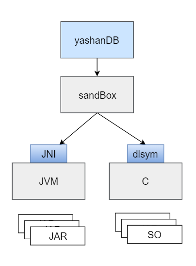

## PL简介
PL语言是一种高度可编程的语言，提供了多种数据类型（SQL能力范畴内各种标准的数据类型、用户可自定义数据类型）、变量声明、变量赋值、多种类型表达式、控制语句、循环语句、跳转语句、静态SQL、动态SQL、异常处理等提供灵活多变的编程元素。同时，PL在数据库内核中存在多种形态的对象，包括存储过程、自定义函数、外置自定义函数、触发器等，每种对象的编译、执行原理相似，但生命周期和触发运行的原理并不相同。

## PL语言结构

PL语言结构的基本原型为堆栈，遵循FILO的使用原则。

组成PL的语言块整体上分为数据区和语句区两大部分。

- 数据区：声明和定义变量的区域，提供参数声明（匿名块不具备）、局部变量（变量、常量、游标、异常变量等）声明的能力。

- 语句区：逻辑行的区域，提供赋值语句、控制语句（IF判断、FOR循环、WHILE循环、GOTO语句等）、调用过程或函数语句、静态SQL语句、动态SQL语句、异常处理语句等编程能力。

PL语言块允许在语句块内部嵌套PL语言块，在PL执行过程中，变量的执行、异常的响应等都遵循局部优先的原则。

PL语句块中可以通过按名字寻址方式查找自定义高级包的公共变量、绑定参数等。在触发器这种特殊的对象中，还可以直接通过形如`:NEW`、`:OLD`等形式加载触发器对应作用的记录。

YashanDB通过绑定参数技术实现在PL语言块中调用SQL语句，即静态SQL语句功能。静态SQL语句在PL编译阶段，会提前将PL中出现的变量改写成绑定参数的形式，再将改写后的语句传入SQL引擎进行编译。

动态SQL语句不似静态SQL语句受SQL语句类型范围限定，可以自由拼接需要执行的SQL语句达到PL极大的编程灵活度。

## PL运行机制

在常见的程序语言中，每一次函数调用都会在调用栈上维护一个独立的栈帧，用于记录调用上下文、形参和局部变量。

PL的执行原理正是如此，每进行一次调用（例如函数、控制语句、动态SQL等调用），PL的数据区会形成压栈操作，入栈的是PL数据区的形参和局部变量。在调用结束后，形成出栈操作，同时完成形参到实参的赋值。

PL的语句块在编译阶段已经编译好具体行号，在执行阶段会根据计算结果选择行号递增或发生行号跳转，在产生调用时，会进行上下文压栈处理，展开并执行被调用语句块。执行完成后，进行退栈还原调用栈，直至所有栈退出。

当执行语句发生错误，优先进行异常捕获，当异常匹配成功时，PL执行器会将行号切换到异常处理的入口语句上，然后恢复正常的执行过程。若异常无法匹配，则会停止当前栈的语句执行，将错误返回给上层栈，确认上层栈的异常捕获是否生效，直至所有栈退出。

## PL对象

### 匿名块

匿名块是数据库里的一种特殊的PL对象，它无名称、参数等定义，数据区只包含局部变量声明，也不会被持久化，创建后立即运行，无法通过调用执行。

### 存储过程

存储过程是PL语言按过程进行组织的数据库对象形式，类似Pascal（结构化编程语言）中的过程。结合EXEC或CALL命令按名称调用，也可以直接在PL的语句块中调用。

当用户通过CREATE [OR REPLACE] PROCEDURE语句创建存储过程时，数据库实例将解析该DDL命令携带的存储过程名称、存储过程形参和存储过程语句等信息，名称和形参将作为存储过程的头部（HEAD）信息，语句则作为存储过程的身体（BODY）信息。当头部定义满足要求时，数据库实例会将创建存储过程的数据库对象，将其记入存储。如果编译身体信息时报错，会记录所有出错行的编译信息，进行统一报错。

编译成功的存储过程在数据库实例中会产生一个二进制缓存，供执行阶段使用，从而减少存储过程被反复调用时的编译开销。受限于缓存池大小，长时间未被使用或因依赖对象变更为失效的存储过程二进制缓存可能会被释放。释放后，再通过EXEC命令调用相应的存储过程时需要重新编译。

存储过程的调用思路如下：

- 在存储过程入口要优先完成数据区的栈帧，包括准备形参和声明变量。

- 语句区完成执行逻辑的计算，根据实时情况调整程序运行轨迹，直至过程体执行结束。

    若过程体执行过程中发生错误且异常处理模块未捕获该错误，会导致存储过程运行报错。存储过程最终将出参赋值完毕，退出栈帧。

### 自定义函数

自定义函数UDF是PL语言按函数进行组织的数据库对象形式，类似Pascal（结构化编程语言）中的函数。可以直接在SQL语句调用内置函数的位置调用自定义函数。

当用户通过CREATE [OR REPLACE] FUNCTION语句创建自定义函数时，发生的行为和创建存储过程基本一致，但自定义函数多了返回值信息。

自定义函数的数据块、语句块能力等同于存储过程。

直接在SQL语句中调用自定义函数时，返回值会参与SQL的运算过程，此情况下不允许自定义函数携带出参，以及不允许函数体内存在影响SQL所在主事务的行为。

**外置自定义函数**

外置自定义函数是自定义函数的特殊形式，包含外置C语言和外置JAVA语言两种形式，简称外置UDF或Ext-UDF。在一些使用PL较难实现的功能，可以通过外置自定义函数充分利用其他高级语句的特性和优势，提高数据库的适用范围。

C语言自定义函数需要先通过动态库（SO动态库）将C语言函数打包到库文件中，数据库再加载该动态库获取函数信息。调用C语言自定义函数时，将使用系统动态加载接口实现动态库加载和函数符号查找。

JAVA语言自定义函数需要通过JAR包和CLASS文件，使用自定义类加载器将CLASS加载到JVM中。调用JAVA自定义函数时，使用JNI技术实现C调用JAVA的能力。

为了避免动态库对数据库造成无法预知的风险，YashanDB使用了SAND BOX技术，隔离YEX_SERVER进程，通过UDS协议完成数据库和YEX_SERVER的通信，保证即使外置UDF执行时发生异常也不影响的数据库的正常运行。

### 自定义高级包

自定义高级包是数据库里的一种PL对象，是一组相关的过程、函数、变量、游标和类型等的集合。

YashanDB内置了很多高级包扩展数据库功能，例如提供统计信息收集能力的DBMS_STATS、提供用户创建/删除/读写等文件系统的能力的UTL_FILE、提供性能报告的生成能力的DBMS_AWR等。

自定义高级包允许用户根据自身需求，进一步扩展数据库的能力。高级包可以通过创建特定的命名空间，通过隔离公共和私有两种类型的变量、过程、函数，实现具有封装性、强安全、高性能的包功能实现。

用户需通过以下两部分创建自定义高级包：

- 定义包头（PACKAGE HEAD）
    
    包头用于声明公有（PUBLIC属性）成员，可包括变量、类型、游标以及子程序对象（存储过程、自定义函数）。自定义高级包创建成功后，公有成员可被其他外部程序引用。

- 定义包体（PACKAGE BODY）
    
    包体用于定义公有成员中的子程序对象、声明并定义私有（PRIVATE属性）成员。私有成员可包括变量、类型、游标以及子程序对象，私有成员只能在该包体中使用。

包头、包体通过不同语法进行定义，YashanDB不严格要求同一自定义高级包包头、包体的创建顺序。即使先定义包体再创建包头也能创建成功，但该自定义高级包会因包头不存在而抛出编译错误，在完成包头创建前将始终无法执行和调用。

自定义高级包在首次调用后，会在会话信息上创建专属于该高级包的全局变量区域，在同一个会话期间，调用相同高级包可以直接使用前一次执行结果。

### 触发器

触发器（TRIGGER）是数据库里的一种PL对象。创建一个触发器等同于创建一个可执行的过程体，但触发器不能接收参数且不可以被用户显式调用，触发器必须由一个事件来启动运行，即当特定事件发生时自动地隐式运行触发器，运行触发器称为触发或点火（Firing）。

触发器包含如下要素：

- 触发操作：触发执行的内容，为一个过程体。

- 触发事件：可以由系统判断的触发过程体执行的事件，事件通常是对表的INSERT/UPDATE/DELETE等DML操作。可以定义单个触发事件，也可以定义多个触发事件的组合（OR逻辑组合）。

- 触发时机：触发过程体执行的时间点，分为BEFORE（触发事件发生前执行）和AFTER（触发事件发生后执行）。

- 触发对象：触发事件所基于的对象，即具体的某个表。

- 触发类型：分为语句级触发（触发事件发生时，执行一次过程体）和行级触发（触发事件发生时，对其影响的每一行数据均执行一次过程体）两种类型。

- 触发条件：对于行级触发器，可以由WHEN语句指定一个条件表达式，在触发事件发生且条件表达式结果为TRUE时，过程体才会被执行。

在表上定义触发器，可以实现在对该表执行DML操作时及时进行一些错误拦截、操作记录或业务逻辑处理。相比存储过程，触发器更具实时性，且可以获得当下时刻的数据信息，但触发器会对DML操作产生关联影响，例如执行效率或触发器问题导致DML操作失败等。

除触发器外，另一个在对表执行DML操作时会被触发的功能是[约束](../关系数据结构/数据完整性)。约束是为了保证数据完整性而执行的字段级别的数据检查，相比约束，触发器使用的过程性语句可以实现更复杂的数据处理。

对一个同时定义了约束和触发器的表执行DML操作时，系统处理顺序如下：

1. 执行BEFORE语句级触发器。

2. 对DML操作影响的每一行：

    1. 执行BEFORE行级触发器。

    2. 执行DML操作，同时执行非FOREIGN KEY的约束项检查。

    3. 执行AFTER行级触发器。

    4. 执行FOREIGN KEY检查。

3. 执行AFTER语句级触发器。

### 自定义类型

自定义类型（UDT，User Defined Type）是由用户自行定义的数据类型，用于将现实世界的实体建模为数据库中的对象，可以用于表的列定义以及PL的变量类型定义。UDT与面向对象的编程思想类似，UDT包含一组属性和方法，用户可以基于数据库内置的基本类型和其他UDT类型创建新的UDT。

UDT包含如下类型：

- 对象（OBJECT）是包含属性和方法的自定义类型（在YashanDB中，也可以称为Abstract Data Type (ADT)），是一种复合的记录形式，可以类比C语言中的结构体。

- 可变数组（VARRAY）是一组具有相同数据类型的元素的集合，大小在创建时指定，可以类比C语言中的结构体数组。每个成员的数据类型可以是数据库内置类型，也可以嵌套自定义类型。

- 嵌套表（NESTED TABLE）也是一种集合，与VARRAY在变量声明、构造函数、成员声明、函数调用等各个方面类似，区别在于其大小无需在创建时指定，而且可以作为嵌套表和主表关联。

UDT定义的变量，可以在PL各种对象间通过形参或变量声明实现，也可以通过%TYPE进行继承。

**继承类型**

在某些使用场景中，用户需要定义一个变量接收数据，但并不关心数据源的类型。在此类场景中，可以通过继承类型直接生成一个跟数据源类型相同的变量，且无需关心内部细节。在PL中主要通过%TYPE继承变量的数据类型，通过%ROWTYPE继承记录的数据类型。

### 定时任务

定时任务（JOB）是一个根据时间定时触发执行的后台任务。

定时任务包含如下基本要素：

- JOB唯一标识
- JOB需要执行的任务
- JOB执行时间及频率

基于这三个要素，可以使用一系列PL语言的过程实现对一个JOB的直接操作管理。

在调用高级包执行创建或管理定时任务等各种操作后，可以通过配置参数或系统视图监控定时任务的执行状况和各种属性。
