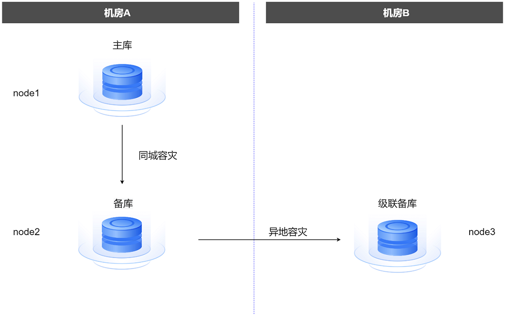
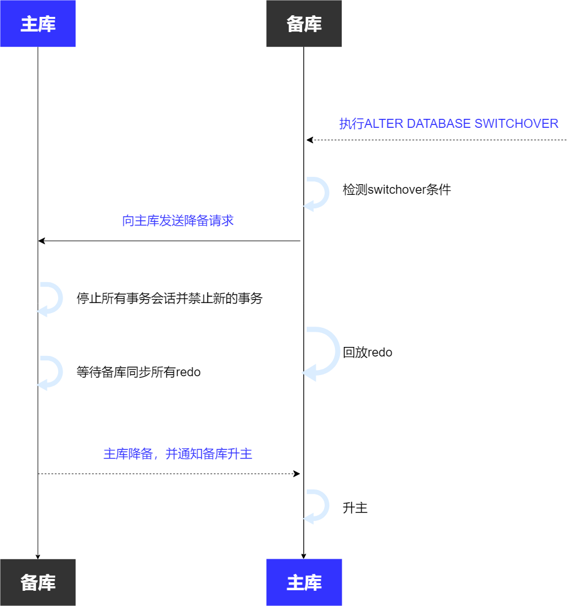

## 主备复制

主备复制是指通过将主库上的数据实时复制到备库实现高可用，是数据库最主要的高可用措施。

主库（primary database）是指执行业务的数据库实例，备库（standby database）是指复制主库数据的数据库实例。当主库发生故障时，业务可以转移到备库上继续执行，降低故障对业务的影响，提高数据库的可用性。

主备复制分物理复制和逻辑复制，物理复制将主库的物理存储内容复制到备库，逻辑复制基于逻辑变更记录（例如SQL语句）在备库上执行的方式重现主库数据。

- 物理备库：物理备库通过物理回放从主库接收的redo数据与主库保持同步。物理备库是主库的物理副本，其磁盘数据库结构与主库逐块相同、数据库架构（包括索引）与主库完全相同。

- 逻辑备库：逻辑备库通过逻辑回放与主库保持同步，先将从主库收到的redo数据转换为SQL语句，然后再执行对应SQL语句。逻辑备库包含与主库相同的逻辑信息，即两者包含完全相同的业务数据与元信息，但允许在物理存储结构（例如数据文件分布、索引组织形式）上存在差异。

### 主库复制

#### 日志传输

YashanDB主库通过发送redo日志给备库来实现数据的同步。主库将redo日志传输给备库，备库收到后写入自己的redo文件，并给主库响应确认消息。一个主库可以同时给多个备库发送redo日志，一个备库只能接收一个主库的redo日志。

根据备库接收redo与主库事务提交的关系，分为同步复制和异步复制两种模式。

- 同步复制是指主库提交事务前，需要先将redo日志发送到备库。备库的数据始终与主库一致，即redo同步延迟为0。同步复制模式下的备库称为同步备库。

- 异步复制是指redo日志的发送不影响主库提交事务，备库的数据可能落后于主库，即redo同步延迟不为0。

#### 保护模式

YashanDB高可用架构中的保护模式有三种，分别为最大性能（Maximize Performance）、最大可用（Maximize Availability）和最大保护（Maximize Protection）模式。数据库建库后，默认为最大性能模式。

- **最大性能**

    数据库默认的保护模式。是在不影响主库性能的情况下，尽可能做数据保护。主库事务对应的所有redo日志写入主库redo文件后即可立即提交事务。redo日志的发送由独立线程异步完成，且事务提交不需要等待备库接收redo日志，因此主库的性能不会受到备库影响。

    此保护模式对主库性能的影响最小，备库故障也不会阻塞主库事务，但有一定的数据丢失的风险。

- **最大可用**

    此保护模式是在不影响主库可用性的情况下，尽可能做数据保护。在同步备库可用的情况下，redo日志传输到同步备库后（是否等待写入redo文件取决于配置），主库事务才会提交。如果主数据库无法将redo日志传输到至少一个同步备库时，则它会像处于最大性能模式一样运行，不阻塞主库事务提交，以保持主库可用性，直到主库再次能够正常将redo日志传输到同步备库。

    在此保护模式下可以保证数据零丢失，除非出现连续故障。例如备库故障后主库故障，再拉起备库后，该备库会丢失部分数据。
    
    最大可用模式的性能与最大保护模式的性能基本相同。

- **最大保护**

    此保护模式可以保证主库出现故障时不会造成数据丢失。该保护模式下，事务提交之前redo日志传输到所指定的同步备库并写入redo文件，确保主库故障后，同步备库不会发生数据丢失。在一定时间内，如果主数据库无法将其redo日志写入同步备库（至少有一个同步备库），则数据库会置为ABNORMAL状态，保护已经进行的事务，阻塞后续的事务，需要数据库管理员人为介入处理该故障。

    在此保护模式下可以严格保证数据零丢失，但同步备库故障后会阻塞主库事务提交。另外由于必须发送redo日志给同步备库，会对主库性能造成一定程度的影响。

- **Quorum**

    YashanDB支持Quorum机制，用户可以自定义同步备库的数量。在最大可用模式和最大保护模式下，同步备库收到主库的redo日志后，主库的事务才可以提交。

    默认情况下同步备库的数量是整个集群的多数派（假设N为整个集群的数据库数量（包含主库），则同步备库的数量为N/2）。例如有两个备库，则同步备库的数量是1，任意一个备库收到主库的redo日志后，主库的事务就可以提交。如果有一个备库故障，也并不影响主库的可用性。

    在Quorum机制下，同步备库的数量是固定的，但具体哪些备库是同步备库是不确定的。通常可以认为同步进度最快的几个备库为同步备库。

### 备库同步

#### 物理回放

备库接收到redo日志后，还需要应用redo日志更新备库的数据页面，使备库的数据更新到与主库一致，这个过程称为日志回放。日志回放的过程中会保证数据的瞬时一致性，支持备库上进行只读操作。

备库在回放redo前会确认该redo日志对应的事务在主库上已经提交，以保证主库的事务状态不落后于备库。

YashanDB的备库默认开启日志回放，当备库接收到redo日志后会立即应用redo日志，可以更快的用于查询数据，也可以更快的完成计划内切换（Switchover）和故障转移（Failover）。日志回放可以随时暂停和继续。

#### 逻辑回放

备库接收到redo日志后，将redo日志解析成SQL语句，备库通过执行SQL语句与主库保持逻辑相同。

YashanDB的逻辑备库默认关闭逻辑回放，需要用户手动开启回放。

#### 归档修复

当备库网络异常，或备库停机一段时间后，主库在此期间产生的redo日志无法发送到该备库。当该备库恢复正常后，为了加快redo同步，会直接从主库最新redo开始接收。

这个机制会导致中间缺少部分redo文件，使备库redo文件或归档日志文件不连续，这个空洞称为GAP。出现GAP时，备库会启动一个归档修复线程，从主库获取空洞对应的归档日志文件，解决备库redo文件（或归档日志文件）不连续的问题，这个过程称为归档修复。

归档修复和redo日志接收可以在备库上并行执行，能让备库更快地追赶主库，提高了备库同步性能。

#### 级联备

备库在接收主库redo日志的同时，也可以将自身的redo日志传输到它的备库，备库的备库称为级联备库。

出于成本和性能考虑，级联备库常用于异地部署和容灾，通过同步备库（常见同城备库）来间接传输主库的redo日志，达到异地容灾的目的。

级联备库的redo日志间接由备库传输的，并不直接接收主库的redo日志。且备库与级联备库之间的redo日志传输属于异步复制，主库的事务提交与级联备库的redo接收没有任何关系，因此级联备库升主可能会有数据丢失。

## 主备切换

主备切换指主备角色切换的过程，主库降为备库，备库升为主库。一般分为计划内切换（Switchover）和故障切换（Failover）。

### Switchover

Switchover表示计划内的切换，在保证数据不丢失的前提下，将主备角色互换。Switchover执行时，会停止主库业务，等待主库的redo全部同步给目标备库后，将主库和备库的角色互换。Switchover完成后，原主库降为备库，原备库升为主库，而且新主库不会丢失任何数据。

Switchover一般应用于数据库运维，例如滚动升级，或维护服务器。

### Failover

Failover表示故障切换，可在主库故障宕机的情况下，选择一个备库转换为新主库，以便恢复业务。Failover的目标备库不一定包含原主库的所有数据，所以Failover后可能会丢失数据。

Failover一般用于主库故障后，快速恢复业务。故障的原主库，可以手动降备，如果开启了自动选主或仲裁，则会自动降备。

#### 日志回退

原主库宕机前可能会有部分日志没有同步到备库，备库failover升主、原主库降备后，原主库的redo日志和新主库的redo日志会有差异。如果这部分日志暂未提交（或备库的这部分日志暂未应用），则可以通过回退这部分日志保证主备库的数据一致性。

如果数据库是最大保护模式，会自动回退这部分日志，如果是最大可用或最大性能模式，则需要用户决定是否回退旧主库的这部分日志来消除日志分歧（一旦回退，将无法恢复这部分日志），使备库正常同步新主库的日志。

#### 脑裂

原主库宕机前可能会有部分redo日志没有同步到备库，备库failover升主、原主库降备后，原主库的日志和新主库的redo日志会有分歧，且这部分redo日志已提交（或这部分日志已在备库应用），主备库数据不一致，出现了脑裂。这种情况下，无法通过redo日志回退来保证主备库的数据一致性，只能通过脑裂修复措施尝试快速修复备库。如果原主库没有即时降备，且保护模式为最大性能，则原主库重启后，两个主库都提供业务，后续原主库降备后，也会和新主库发生脑裂。
