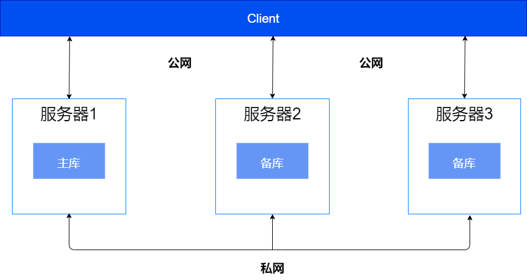
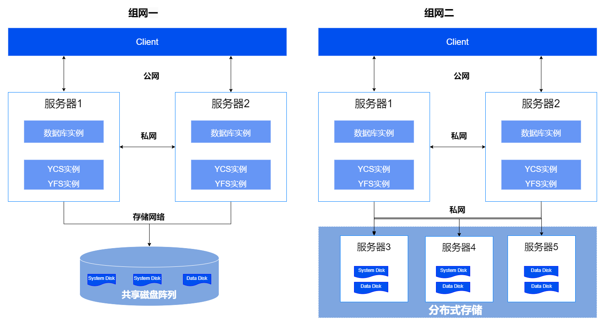
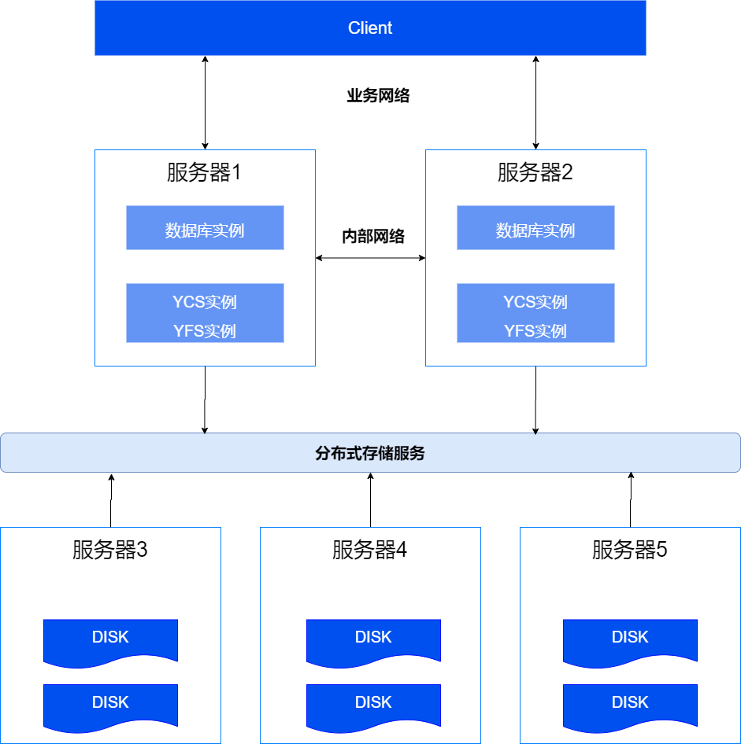
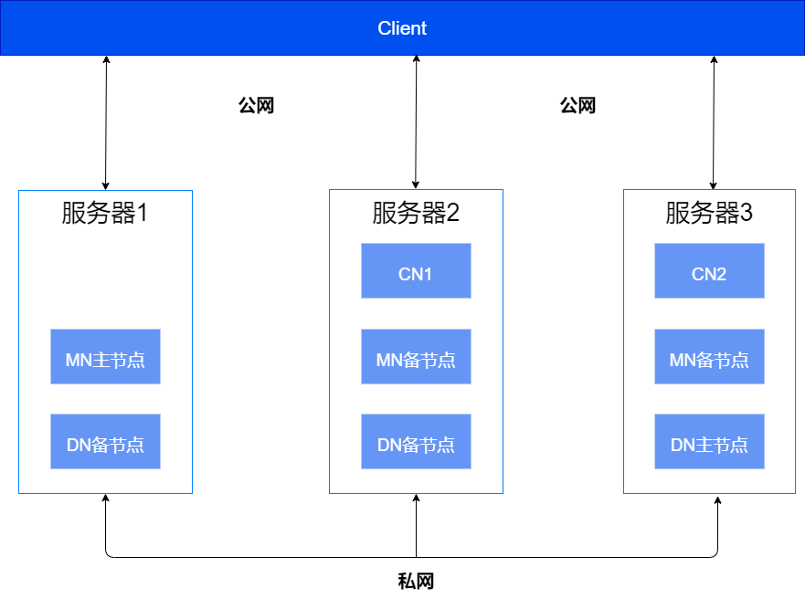

网络准备是指对要搭建的数据库集群的子网、IP地址、端口等进行规划和配置。

## 组网规划

依据YashanDB服务器所需通信属性分类，我们定义了如下两个逻辑子网：

- 公网：主要用于外部业务访问YashanDB、DBA进行数据库管理以及数据库工具进行数据库命令调用等。
- 私网：主要用于YashanDB内部通信。

企业可根据实际需要，将上面的公网和私网放入同一个物理子网，或分别放入不同的物理子网。

为确保应用数据的安全以及隔离来自互联网的非法命令，建议将YashanDB的组网根据功能划分为相互独立且隔离的网络。

::: tabs

== 单机部署

单机部署的典型组网如下图所示，该组网方案以一主两备为例，主库和各个备库建议分别部署在不同的服务器上。



|  地址| 说明| 建议网段|
|--------------------|-------------|-----------------|
| 数据库对外监听地址 | 用于连接数据库，对外提供数据库服务 | 公网网段        |
| 主备库通信地址 | 用于主备库之间内部通信，数据库用户无法访问<br/>仅主备部署时，需要规划该地址  | 私网网段    |

== 共享集群部署

依据不同的存储设备，共享集群存在如下两种典型组网方案：

- 组网一：该组网方案以2台服务器 + 1台共享存储搭建双实例单库共享集群环境为例，实例应部署不同服务器上。其中存储网络为专用于共享存储的网络，例如SAN或者NAS。
- 组网二：该组网方案以2台服务器 + 多台服务器组成的NVMe-oF分布式存储搭建双实例单库共享集群环境为例，实例应部署在不同服务器上。



|  地址| 说明| 建议网段|
|--------------------|-------------|-----------------|
| 数据库对外监听地址 | 用于连接数据库，对外提供数据库服务<br/>包括LISTEN_ADDR、SCAN VIP、VIP三类地址，SCAN VIP、VIP必须与LISTEN_ADDR处于相同子网、相同网卡 | 公网网段         |
| 内部yasdb间通信地址<br>内部YCS间通信地址 | 分别用于集群内数据库实例之间通信，和集群内YCS实例之间内部通信，数据库用户均无法访问<br>同一台服务器上的这两类地址可以采用相同IP + 不同端口号 | 私网网段 |
| 内部NVMe-oF通信地址 | 用于使用分布式存储时的内部NVMe-oF通信，数据库用户无法访问 | 私网网段    |
| 主备集群通信地址 | 用于主备集群之间内部通信，数据库用户无法访问<br/>仅主备集群部署时，需要规划该地址 | 私网网段 |

== 分布式集群部署

分布式集群部署的典型组网如下图所示，该组网方案以5台服务器（其中3台挂载NVMe存储）搭建2CN+3DN的分布式集群环境为例，节点应部署在不同服务器上。



| 地址| 说明| 建议网段|
| ------------------------------------------------------------ | ------------------------------------------------------------ | ----------------------------- |
| 数据库对外监听地址                                           | 用于连接数据库，对外提供数据库服务                           | 公网网段                      |
| 内部yasdb间通信地址<br/>内部YCS间通信地址                    | 分别用于集群内数据库实例之间通信，和集群内YCS实例之间内部通信，数据库用户均无法访问<br/>同一台服务器上的这两类地址可以采用相同IP + 不同端口号 | 私网网段                      |
| 内部NVMe-oF通信地址                                          | 用于内部NVMe-oF通信，数据库用户无法访问                      | 私网网段                      |

== 存算一体分布式集群部署

存算一体分布式集群部署的典型组网如下图所示，该组网方案以1个MN组、2个CN、1个DN组（DN组和MN组均为1主2备）为例，各组的主备节点建议分别部署在不同的服务器上。

  

|  地址| 说明| 建议网段|
|--------------------|-------------|-----------------|
| 数据库对外监听地址 | CN节点的监听地址用于连接数据库，对外提供数据库服务 | 公网网段         |
| REPLICATION_ADDR（MN/DN组内主备部署时需要）<br/>DIN_ADDR | REPLICATION_ADDR用于同组内主备节点之间通信，DIN_ADDR用于MN、CN及DN节点跨组内部通信，数据库用户均无法访问<br/>每个节点组的端口号不同，同一台服务器上的这两类地址可以采用相同IP  | 私网网段    |

:::

## IP规划

依据实际网段划分，上述组网中的每台服务器均需规划一个或多个IP地址。

对于共享集群部署，还需进行IP地址预留：

- 建议公网为每个集群预留1到3个IP地址作为SCAN VIP，以满足后续可能的SCAN功能使用需要。

- 建议公网为每台服务器预留1个IP地址作为VIP，以满足后续可能的VIP功能使用需要。

## 配置DNS解析

企业可根据实际需要自行选择是否为公网中的IP配置DNS解析。

如后续可能使用[SCAN](../../../数据库管理/集群管理/SCAN管理)功能，则必须在DNS服务器中，根据规划的SCAN域名（例如scan.example.com）和预留的SCAN VIP配置DNS解析规则，以下为配置示例：

```bash
# DNS记录
scan.example.com IN A 192.168.1.100
……

# 反向解析记录
100.1.168.192.in-addr.arpa IN PTR scan.example.com
……
```

<span id="openports" name="openports"></span>
## 端口规划

运行YashanDB需要使用一系列端口（[端口列表](../../../参考手册/端口列表)中已列示这些端口的作用及相关信息）。YashanDB制订了一套端口划分规则，并据此规则提供了安装部署过程中需要指定的端口号默认值。用户可根据自身网络规划修改端口号，但应遵循端口划分规则，以避免出现端口冲突。

端口划分规则及默认值如下：

- 数据库监听端口由安装步骤中的beging-port/起始端口参数指定，默认值为1688。

- 数据库监听端口将作为初始值，用于计算其他内部通信端口。

  - 如需将语法模式指定为[mysql模式](../../../产品描述/兼容性说明/与MySQL兼容性说明.md)，还需规划一组mysql协议使用的监听端口，默认值为1690（单机及单机主备）或1691（共享集群），每个备库缺省+3，以此类推。
  - 共享集群部署中，VIP监听端口默认与数据库监听（LISTEN_ADDR）端口一致，无需划分额外的端口号。
  - 共享集群/分布式集群部署中，所有的NVMe监听端口按顺序编号。
  - 存算一体分布式集群部署中，按照MN、CN、DN的顺序生成端口号，其内部通信端口则按跨组通信、同组内通信的顺序生成。部署多个DN组时，每个DN组缺省+3，以此类推。

  | 部署形态| 数据库监听| 内部通信| yasom| yasagent|
  | ---------------------------------- | ------------------------------------------------------------ | ------------------------------------------------------------ | ------------------------------------- | ------------------------------------- |
  | 单机部署                           | yashan模式：1688 <br/> mysql模式：1688与1690，其中1690为mysql协议使用的默认监听端口 | 主备复制链路（主备部署时需要）：初始值+1，即默认为1689       | 初始值-13，即默认为1675               | 初始值-12，即默认为1676               |
  | 共享集群部署                       | yashan模式：1688 <br/> mysql模式：1688与1691，其中1691为mysql协议使用的默认监听端口 | * 同一集群内的数据库实例间通信：初始值+1，即默认为1689<br/>* YCS实例间通信：初始值+100，即默认为1788<br/>* 主备复制链路（主备部署时需要）：初始值+2，即默认为1690<br/>* NVMe-oF通信：数据盘监听端口为初始值+2，即默认为1700，并按+1递增；系统盘监听端口默认为1700+数据盘数量，并按+1递增 | 初始值-13，即默认为1675               | 初始值-12，即默认为1676               |
  | 分布式集群部署                     | 1688                                                         | * 同一集群内的数据库实例间通信：初始值+1，即默认为1689<br/>* YCS实例间通信：初始值+100，即默认为1788<br/>* NVMe-oF通信：数据盘监听端口为初始值+2，即默认为1700，并按+1递增；系统盘监听端口默认为1700+数据盘数量，并按+1递增 | 初始值-13，即默认为1675               | 初始值-12，即默认为1676               |
  | 存算一体分布式集群部署             | MN：初始值-10，即默认为1678<br>CN：1688<br>DN：初始值+10，即默认为1698 | 对应监听端口依次+1，按跨组通信、同组内通信的顺序生成<br/><br/>* 跨组通信：MN为1679、CN为1689、DN为1699<br/>* 同组内通信：MN为1680、CN为1690、DN为1700 | 初始值-13，即默认为1675               | 初始值-12，即默认为1676               |

- 如需启用可视化部署Web服务的服务器，还需使用9001端口。

## 开放端口

- **方式一：关闭防火墙**

   如您计划使用关闭防火墙的方式开放服务器上的所有端口，则可以直接在所有服务器上执行如下命令：

   ```shell
   ## 关闭防火墙
   # systemctl stop firewalld 
   ## 关闭开机自启
   # systemctl disable firewalld
   ```

- **方式二：添加白名单**

   如果不能关闭防火墙，则可使用添加白名单的方式开放指定的端口。请先根据端口规划中所列规则计算出端口号，再按下面操作指引在所有服务器上开放所有数据库监听类端口和yasom端口。

   1. 查看防火墙端口开放情况：

      ```shell
      # firewall-cmd --zone=public --list-ports
      ```

   2. 添加端口到防火墙：

      以1688为例演示如何添加端口到防火墙中，其他端口操作方法相同。

      ```shell
      ## 添加（--permanent表示永久生效，没有此参数重启后失效）
      # firewall-cmd --zone=public --add-port=1688/tcp --permanent
      ## 重新载入
      # firewall-cmd --reload
      ## 查看
      # firewall-cmd --zone=public --query-port=1688/tcp
      ```

      > **Note**:
      >
      > 通过添加白名单的方式开放端口，安装过程中仍有可能出现由于端口无法通信而部署失败的风险。此时应联系公司网络管理员查清原因，重新开放端口后再进行安装。

   3. 如需从白名单中删除已添加的端口，使用如下命令：

      ```shell
      # firewall-cmd --zone=public --remove-port=1688/tcp --permanent
      ```
