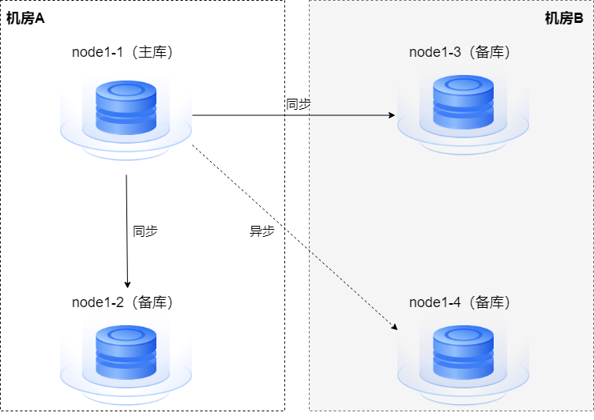

仲裁选主是在主备高可用部署的情况下，当主节点发生异常不能对外服务时，系统通过yasom仲裁，将备节点升为主节点，并将原主节点降为备节点。

YashanDB支持在如下部署模式下启用yasom仲裁，且仅在yasom和备节点的yasagent进程在线时生效，具体配置操作请查阅[yasom仲裁选主](../../../高可用/自动选主配置/yasom仲裁选主.md)。

- 单机主备部署（非级联备）

- 主备集群部署

- DN组内节点为一主一备的存算一体分布式集群部署

> **Caution**: 
>
> - 需开启[操作系统认证](../../../产品安全/身份标识与鉴别/操作系统认证/00操作系统认证.md)（遵循标准安装步骤时默认已开启）才能正常使用yasom仲裁选主功能。
>
> - yasom仲裁选主与yasom自修复互斥，yasboot process yasom repair on时，无法使用yasom仲裁选主。

## election enable on

本命令用于启用基于yasom的仲裁选主。开启仲裁选主前，可通过[election config set](#set)命令按需配置仲裁选主相关参数。

|  选项| 含义|
| --------------- | -------------------- |
| *-c, --cluster* | 部署YashanDB的集群名（必传参数） |
| *--group-ids*   | 组ID（可以通过yasboot cluster status命令查看，nodeid中短横线前的数值为group-id，例如`1-1:1`的组ID为1），多个ID间使用逗号分隔</br>单机部署中本参数不生效；存算一体分布式集群部署中本参数不填写表示所有DN组|
| *-u, --username*     | 指定数据库用户，不指定则默认使用sys用户           |
| *-p, --password*  | 数据库用户的密码<br/>若使用sys用户且已开启[操作系统认证](../../../产品安全/身份标识与鉴别/操作系统认证/00操作系统认证.md)（安装后默认开启）则无需指定密码   |
| *-h,--help*        | 查看当前命令的帮助信息 |

> **Note**: 
>
> - 开启前，须确保主备节点状态正常，且保护模式相同。
> 
> - 开启yasom仲裁选主会修改数据库的心跳间隔和心跳超时参数。

示例

```shell 
$ yasboot election enable on -c yashandb
```

## election enable off

本命令用于禁用yasom仲裁选主。

|  选项| 含义|
| ---------------- | -------------------------------- |
| *-c, --cluster*  | 部署YashanDB的集群名（必传参数）                |
| *--group-ids*   | 组ID（可以通过yasboot cluster status命令查看，nodeid中短横线前的数值为group-id，例如`1-1:1`的组ID为1），多个ID间使用逗号分隔</br>单机部署中本参数不生效；存算一体分布式集群部署中本参数不填写表示所有DN组|
| *-f, --force*   | 强制禁用，忽略离线的数据库节点的参数重置。不使用--force选项关闭仲裁，会重置所有节点的选举参数，必须保证所有节点在线  |
| *-u, --username*     | 指定数据库用户，不指定则默认使用sys用户           |
| *-p, --password*  | 数据库用户的密码<br/>若使用sys用户且已开启[操作系统认证](../../../产品安全/身份标识与鉴别/操作系统认证/00操作系统认证.md)（安装后默认开启）则无需指定密码   |
| *-h,--help*        | 查看当前命令的帮助信息 |

> **Note**: 
>
> - 当某些节点离线时，可以使用--force选项，忽略离线节点的参数重置，后续需要手动重置该节点的参数OM_ELECTION_ENABLE为FALSE，否则数据库启动时，可能因为无法确认角色而启动失败。
> - 禁用yasom仲裁选主，不会还原开启yasom仲裁选主前的心跳超时时间和保护模式。

示例

```shell
$ yasboot election enable off -c yashandb
$ yasboot election enable off --force -c yashandb
```

## election status

本命令用于展示仲裁选主的运行状态。

|  选项| 含义|
| -------------------- | ------------------------------------- |
| *-c, --cluster*      | 部署YashanDB的集群名（必传参数）                  |
| *-node*      | 数据库节点                  |
| *--group-ids*   | 组ID（可以通过yasboot cluster status命令查看，nodeid中短横线前的数值为group-id，例如`1-1:1`的组ID为1），支持多个，使用逗号分隔</br>单机部署中本参数不生效；存算一体分布式集群部署中本参数不填写表示所有DN组|
| *-u, --username*     | 指定数据库用户，不指定则默认使用sys用户           |
| *-p, --password*  | 数据库用户的密码<br/>若使用sys用户且已开启[操作系统认证](../../../产品安全/身份标识与鉴别/操作系统认证/00操作系统认证.md)（安装后默认开启）则无需指定密码   |
| *-h,--help*        | 查看当前命令的帮助信息 |

示例

```shell
$ yasboot election status -c yashandb
```


回显信息中的各字段含义如下表所示。
    
|  字段| 含义|
| --------------------- |-----------------------------------------------------------|
| group n<br />cluster | 参与yasom仲裁的对象类型：<br />- cluster：表示当前为集群级别的yasom仲裁，即环境为共享集群部署<br />- group n：表示当前为节点级别的yasom仲裁，即环境为单机部署或存算一体分布式集群部署，n为节点所属组的ID |
| Protection Mode | yasom记录的主节点保护模式。 |
| Members | 参与仲裁的节点/组信息，包括节点状态、节点角色、备节点传输延迟、回放延迟和回放速率等。 |
| Database Error(s) | 记录高可用相关异常，例如某个备库的redo日志与主库不匹配。 |
| Automatic Failover | yasom仲裁选主的开启状态：<br />- DISABLED：yasom仲裁选主已关闭。<br />- Enabled in Potential Data Loss Mode：普通模式的yasom仲裁选主已开启。<br />- Enabled in Zero Data Loss Mode：零丢失模式的yasom仲裁选主已开启。<br />- Enabled in Zero Data Loss Mode (NOT ALLOWED)：零丢失模式的yasom仲裁选主已开启，但数据库的保护模式不是最大保护，无法自动切换。 |


## election config set 

<span id="set" name="set"></span>

本命令用于设置仲裁选主相关的参数，仅允许在仲裁选主未启用的情况下设置选举参数。

|  选项| 含义|
| --------------- | ---------------------------------- |
| *-c, --cluster* | YashanDB的集群名（必传参数）                   |
| *-k, --key*     | 设置参数的名称（必传参数）                     |
| *-v, -value*    | 设置参数key对应的值（必传参数）                |
| *--group-ids*   | 组ID（可以通过yasboot cluster status命令查看，nodeid中短横线前的数值为group-id，例如`1-1:1`的组ID为1），多个ID间使用逗号分隔</br>单机部署中本参数不生效；存算一体分布式集群部署中本参数不填写表示所有DN组|
| *-h,--help*        | 查看当前命令的帮助信息 |


仲裁选主相关的参数如下表所示。

|  参数名| 默认值| 取值范围/格式| 含义|
| ----------------------- | ------ | ---------- | --------------------------- |
| FailoverThreshold       | 9      | [2, 1000]  | 备节点心跳超时时间，到达该时间后，yasom将执行failover切换流程 |
| FailoverTarget          | - 主：所有备（非级联备）<br /><br />- 备：主 | 格式为：group&#124;node n:(x,y,z…) | 指定故障切换（即备升主）的目标及其优先级顺序<br />- group：用于标识后续配置的数值编号是组ID，适用于共享集群部署。可通过yasboot cluster status命令查看，nodeId短横线前的数值为组ID<br />- node：用于标识后续配置的数值编号是节点ID，适用于单机部署、存算一体分布式集群部署。可通过yasboot cluster status命令查看，nodeId短横线前为节点ID<br />- `n:(x,y,z…)`：使用相应ID值指定Failover目标及其优先级顺序（遵循圆括号中的先后顺序）。若括号内置空`n:()`则表示n没有Failover目标，也不会作为其他节点的Failover目标，即n不参与仲裁选主<br />- 在单机部署中，`node n:(x,y,z,…)`还可以将x、y、z等其中之一配置为动态候选者，格式为`ANY[a,b,…]`（例如`node n:(ANY[a,b,…],y,z,…)`），表示特定节点集`a,b,…`中的首个可用节点作为候选者，在该配置值中最多支持1个动态候选者（即ANY仅允许出现1次）<br />示例1：`group 1:(2,3)`表示集群1的故障切换候选者为集群2和集群3，且第一优先级为集群2<br />示例2：`node 2:(1, ANY[3,4])`表示节点2的故障切换候选者为节点1以及节点3或节点4中的首个可用节点，且第一优先级为节点1 |
| FailoverAutoReinstate   | false  | true/false | 是否启用自动脑裂修复，仅单机部署生效。<br/>启用后，如果备节点发生脑裂，处于NEED REPAIR状态，yasom将尝试自动修复 |
| ZeroDataLossMode        | true   | true/false | 是否启用零丢失模式。<br>启用后，将设置主备为最大保护模式，当主节点宕机时，备节点可自动failover；当备节点异常时，主节点将由yasom降级为最大可用模式，并禁止自动failover，直到备节点恢复同步后，yasom重新将主节点升级为最大保护模式后，可以自动failover |

> **Caution**: 
>
> - 所有参数只能在yasom仲裁启动前进行修改。
> - FailoverTarget可以给多个节点设置，是节点级别的参数。ANY[a,b,..]指定的目标中，只会有一个会作为同步备，可减少性能影响。
> - FailoverThreshold太小，可能会因为网络抖动而发生不必要的切换，请根据网络状态设置合理的超时时间。
> - FailoverAutoReinstate启用后，会自动修复备节点脑裂问题，会使备节点与主节点有分歧的部分数据丢失，请**谨慎使用**。
> - ZeroDataLossMode启用后，优先使用最大保护模式。在最大保护模式下，主节点宕机，备节点自动failover后，不会丢失数据。当备节点异常后，主节点会降级为最大可用模式，此时备节点有丢失数据的风险，所以自动failover将禁用，直到主节点再次恢复最大保护模式。因此零丢失模式的切换条件更严格，但是能保证数据不丢失。
> - 如果备库在执行Failover期间发生故障，只能重新拉起该备库继续升主，无法自动选择其他备库升主。


示例

```shell
$ yasboot election config set -k FailoverThreshold -v 5 -c yashandb

# 在共享集群中，需用组ID配置FailoverTarget参数
$ yasboot election config set -k FailoverTarget  -v "group 1:(2,3)"  -c yashandb
  
# 在单机部署、存算一体分布式集群部署中，需用节点ID配置FailoverTarget参数
$ yasboot election config set -k FailoverTarget  -v "node 1:(2,3)"  -c yashandb
```

在单机部署中，借助FailoverTarget参数的动态候选者（ANY[a,b,…]）机制，能够更灵活地实现个性化配置。例如，在一主三备两中心的部署场景中，可以设定优先选择同中心的节点升为主库，而异地则仅选取任意一个可用节点作为候选者。



```shell
$ yasboot election config set -k FailoverTarget  -v "node 1:(2,ANY[3,4])"  -c yashandb
$ yasboot election target show -c yashandb
group 1
+----------------------------------+
| node id | target node id | seted |
+----------------------------------+
| 1       | 2, ANY[3,4]    | true  |
+---------+----------------+-------+
| 2       | 1, ANY[3,4]    | true  |
+---------+----------------+-------+
| 3       | 4, ANY[1,2]    | true  |
+---------+----------------+-------+
| 4       | 3, ANY[1,2]    | true  |
+---------+----------------+-------+
```

## election config show

本命令用于展示仲裁选主的参数设置，条件切换配置和运行状态。

|  选项| 含义|
| -------------------- | ------------------------------------- |
| *-c, --cluster*      | 部署YashanDB的集群名（必传参数）                  |
| *--group-ids*   | 组ID（可以通过yasboot cluster status命令查看，nodeid中短横线前的数值为group-id，例如`1-1:1`的组ID为1），多个ID间使用逗号分隔</br>单机部署中本参数不生效；存算一体分布式集群部署中本参数不填写表示所有DN组|
| *-u, --username*     | 指定数据库用户，不指定则默认使用sys用户           |
| *-p, --password*  | 数据库用户的密码<br/>若使用sys用户且已开启[操作系统认证](../../../产品安全/身份标识与鉴别/操作系统认证/00操作系统认证.md)（安装后默认开启）则无需指定密码   |

示例

```shell
$ yasboot election config show -c yashandb
```


回显信息中的各字段含义如下表所示。

|  字段| 含义|
| --------------------- |-----------------------------------------------------------|
| group n<br />cluster | 参与yasom仲裁的对象类型：<br />- cluster：表示当前为集群级别的yasom仲裁，即环境为共享集群部署<br />- group n：表示当前为节点级别的yasom仲裁，即环境为单机部署或存算一体分布式集群部署，n为节点所属组的ID |
| Protection Mode | yasom记录的主节点保护模式。 |
| Members | 参与仲裁的节点/组信息，包括节点状态、节点角色、备节点传输延迟、回放延迟和回放速率等。 |
| Database Error(s) | 记录高可用相关异常，例如某个备库的redo日志与主库不匹配。 |
| Properties | 当前已生效的参数信息。 |
| Configurable Failover Conditions | 主库的条件故障切换配置项，Health Conditions对应于主库的配置参数FAILOVER_HEALTH_CONDITION，Error Code Conditions对应于主库的配置参数FAILOVER_ERROR_CONDITION，并且只显示有效的错误码，更多详情请查阅[配置条件故障切换](../../../高可用/自动选主配置/一主多备自动选主.md#failover_error_condition)。 |
| Automatic Failover | yasom仲裁选主的开启状态：<br />- DISABLED：yasom仲裁已关闭。<br />- Enabled in Potential Data Loss Mode：普通模式的yasom仲裁选主已开启。<br />- Enabled in Zero Data Loss Mode：零丢失模式的yasom仲裁选主已开启。<br />- Enabled in Zero Data Loss Mode (NOT ALLOWED)：零丢失模式的yasom仲裁选主已开启，但数据库的保护模式不是最大保护，无法自动切换。 |


## election config unset

本命令用于重置仲裁选主相关的参数为默认值。

|  选项| 含义|
| --------------- | ---------------------------------- |
| *-c, --cluster* | YashanDB的集群名（必传参数）                   |
| *-k, --key*     | 设置参数的名称（必传参数）                     |
| *--group-ids*   | 组ID（可以通过yasboot cluster status命令查看，nodeid中短横线前的数值为group-id，例如`1-1:1`的组ID为1），多个ID间使用逗号分隔</br>单机部署中本参数不生效；存算一体分布式集群部署中本参数不填写表示所有DN组|
| *-h,--help*        | 查看当前命令的帮助信息 |

示例

```shell
$ yasboot election config unset -k FailoverThreshold -c yashandb
```

## election event show

本命令用于查看仲裁选主相关的事件，包括事件名、发生时间、处理时间以及处理是否成功等。

|  选项| 含义|
| --------------- | ---------------------------------- |
| *-c, --cluster* | YashanDB的集群名（必传参数）                   |
| *--group-ids*   | 组ID（可以通过yasboot cluster status命令查看，nodeid中短横线前的数值为group-id，例如`1-1:1`的组ID为1），多个ID间使用逗号分隔</br>单机部署中本参数不生效；存算一体分布式集群部署中本参数不填写表示所有DN组|
| *-h,--help*        | 查看当前命令的帮助信息 |

示例

```shell
$ yasboot election event show -c yashandb

group 1
+--------------------------------------------------------------------------------------------------------------------------------------------+
| Name         | Node Id | Report Time         | Process Time        | Success | Ignore | Error                                              |
+--------------------------------------------------------------------------------------------------------------------------------------------+
| need repair  | 1-1:1   | 2023-06-14 16:35:35 | 2023-06-14 16:35:38 | Yes     | 0      |                                                    |
+--------------+---------+---------------------+---------------------+---------+--------+----------------------------------------------------+
| failover     | 1-2:2   | 2023-06-14 16:35:31 | 2023-06-14 16:35:32 | Yes     | 0      |                                                    |
+--------------+---------+---------------------+---------------------+---------+--------+----------------------------------------------------+
| confirm role | 1-2:2   | 2023-06-14 16:35:26 | 2023-06-14 16:35:26 | Yes     | 0      |                                                    |
+--------------+---------+---------------------+---------------------+---------+--------+----------------------------------------------------+
| failover     | 1-1:1   | 2023-06-14 16:35:22 | 2023-06-14 16:35:22 | Yes     | 0      |                                                    |
+--------------+---------+---------------------+---------------------+---------+--------+----------------------------------------------------+
| failover     | 1-2:2   | 2023-06-14 16:35:04 | 2023-06-14 16:35:05 | Yes     | 0      |                                                    |
+--------------+---------+---------------------+---------------------+---------+--------+----------------------------------------------------+
```

仲裁选主的事件如下：

|  事件名| 含义|
| ------------------ | --------------------------- |
| failover           | 备节点无法连接主节点、心跳超时后，向yasom上报，通知yasom将进行仲裁选主 |
| confirm role       | 主节点重启时，需要确认自己的角色，向yasom上报，通知yasom确认该节点的实际角色。如果旧主节点需要降备，将直接启动为备节点 |
| need repair        | 备节点状态为NEED REPAIR，可能是非零丢失模式下，产生脑裂现象，旧主节点降备后无法继续接收日志数据，需要通知yasom修复该备节点 |
| protection demote  | 零丢失模式下，当备节点异常，导致主节点事务阻塞时，主节点向yasom上报，通知yasom将主节点的保护模式降级为最大可用模式，并禁止自动切换 |
| protection promote | 零丢失模式下，当备节点恢复同步后，主节点向yasom上报，通知yasom将主节点的保护模式升级为最大保护模式，并恢复自动切换 |

> **Note**: 
>
> - 同一种事件最多保存5条，超出将淘汰老的事件。
> - 在1分钟内，yasom处理need repair事件超过3次并且全部失败后，后续相同事件会被忽略，并在最近一次事件记录里增加ignore字段的值。当被忽略的事件超过1分钟不上报时，会重置忽略状态，下次将继续处理。

## election target show

本命令用于查看yasom仲裁选主的候选备库集配置（FailoverTarget参数）。

|  选项| 含义|
| --------------- | ---------------------------------- |
| *-c, --cluster* | 部署YashanDB的集群名（必传参数）                   |

示例

```shell
$ yasboot election target show -c yashandb
cluster
+------------------------------------+
| group id | target group id | seted |
+------------------------------------+
| 1        | 2               | false |
+----------+-----------------+-------+
| 2        | 1               | false |
+----------+                 +-------+
| 3        |                 | true  |
+----------+-----------------+-------+
```

seted字段用于标识该配置是否为手动配置：

- seted = true表示该配置项由用户手动配置。

- seted = false表示该配置项取值为系统默认值。
