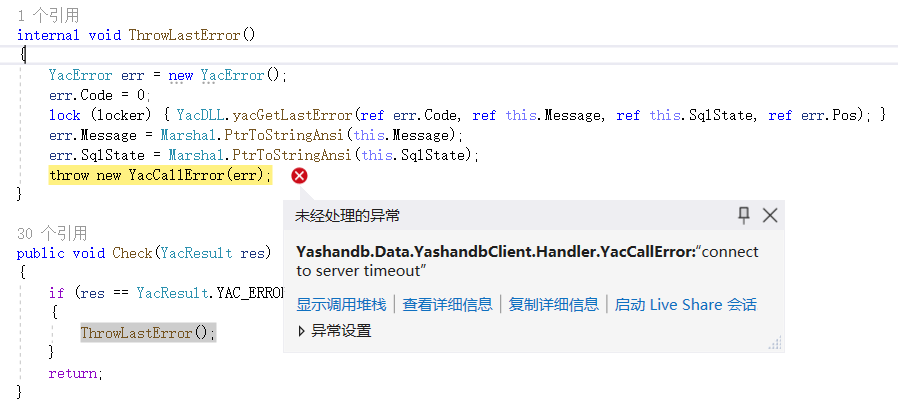

## 连接数据库

通过Yashandb.Data.YashandbClient提供的YasdbConnection类建立数据库连接：

```c#
var connection = new YasdbConnection("Data Source=192.168.31.139:1688;User ID=sys;Password=yasdb_123");
connection.Open();
```

**连接串说明**

|  参数| 描述|
| ----------- | ------------------------------------------------------------ |
| Data Source | 数据库连接描述符。格式如下： host:port <br>\* host：服务器域名或IP地址，需配置为单机实例服务器地址或分布式CN服务器地址；<br>\* port：数据库服务端口，如1688。 |
| User ID     | 数据库用户名。                                               |
| Password    | 数据库用户密码。                                             |

示例

```c#
using System;
using System.Data;
using System.Data.Common;
using Yashandb.Data.YashandbClient;

namespace Examples
{
    public class Program
    {
        public static void Main(string[] args)
        {
            var connection = new YasdbConnection("Data Source=192.168.31.139:1688;User ID=sys;Password=yasdb_123");
            connection.Open();
            
            // do something...

            connection.Dispose();
    
            Console.WriteLine("Done.");
            Console.ReadKey();
        }
    }
}
```

## 执行SQL

应用程序通过执行SQL语句来操作数据库的数据，调用YasdbConnection的CreateCommand方法创建语句对象。

```c#
 var command = (YasdbCommand)connection.CreateCommand();
```

### 执行普通SQL

调用YasdbCommand的ExecuteNonQuery方法执行SQL语句。

```c#
command.CommandText = "drop table if exists example_table";
command.ExecuteNonQuery();
command.CommandText = $"create table example_table(a int, b varchar(32))";
command.ExecuteNonQuery();
```

### 执行绑定参数的SQL

调用YasdbCommand的Parameters.Add方法进行参数绑定。

```c#
command.CommandText = "insert into example_table values(?, ?)";
command.Parameters.Add(1);
command.Parameters.Add("test1");
command.ExecuteNonQuery();

command.CommandText = "insert into example_table values(@a, @b)";
command.Parameters.Add("@a", 2);
command.Parameters.Add("@b", "test2");
command.ExecuteNonQuery();
```

### 获取结果集

调用YasdbCommand的ExecuteReader方法执行SQL语句，将返回YasdbDataReader对象，后续可通过使用 YasdbDataReader.Read方法从查询结果中获取行。

```c#
command.CommandText = "select a, b from example_table";
var reader = command.ExecuteReader();
```

### 在结果集中定位

可通过Yashandb.Data.YashandbClient提供的YasdbDataReader类对获取的结果集进行检索。为了实现最佳性能，该类提供了能够访问其本机数据类型（GetDateTime、GetDouble、GetGuid、GetInt32 等）的列值的方法。

YasdbDataReader对象具有指向其当前数据行的光标。最初，光标被置于第一行之前。执行Read方法，将返回一行数据，并将光标移动到下一行；若Read方法没有获取到一行数据时，将返回false，所以可以在while循环中使用该方法来迭代结果集。

```c#
while (reader.Read()) 
{
    Console.WriteLine(reader.GetInt64(0));
    Console.WriteLine(reader.GetString(1));
}
reader.Close();
```

### 关闭Command

```c#
command.Dispose();
```

### 异常情况说明

- **connect to server timeout**
  在使用Visual Studio运行应用程序项目时，数据连接描述符输入正确的前提下，如果出现以下情况，可能是由于服务器防火墙处于开启状态。

  

  可通过在服务器端打开对应端口的方式解决。

## 批量执行SQL

YashanDB ADO.NET驱动支持通过数组绑定（Array Binding）技术实现批量INSERT/UPDATE/DELETE操作，仅需一次网络往返和一次SQL编译即可完成批量操作，可显著提升性能。

### 约束说明

- 仅当ArrayBindCount大于1时启用批量模式，ArrayBindCount为1时按普通模式执行。
- 所有数组参数的长度必须一致，且与ArrayBindCount匹配。
- 无法对LOB类型（BLOB/CLOB/NCLOB）进行批量操作。

### 使用方式

通过设置YasdbCommand的ArrayBindCount属性指定批量大小，并将参数值设置为数组即可启用批量执行模式。

**批量INSERT**

```c#
var cmd = conn.CreateCommand();
cmd.CommandText = "INSERT INTO employees (employee_id, first_name, salary) VALUES (:id, :name, :salary)";
cmd.ArrayBindCount = 1000;

var ids = Enumerable.Range(1, 1000).Select(i => (int)i).ToArray();
var names = Enumerable.Range(1, 1000).Select(i => $"Employee_{i}").ToArray();
var salaries = Enumerable.Range(1, 1000).Select(i => (decimal)(5000 + i * 10)).ToArray();

cmd.Parameters.Add(":id", ids);
cmd.Parameters.Add(":name", names);
cmd.Parameters.Add(":salary", salaries);

int affectedRows = cmd.ExecuteNonQuery();
Console.WriteLine($"Inserted {affectedRows} rows");
```

**批量UPDATE**

```c#
var cmd = conn.CreateCommand();
cmd.CommandText = "UPDATE employees SET salary = :new_salary WHERE employee_id = :id";
cmd.ArrayBindCount = 3;

var newSalaries = new decimal[] { 6000, 7000, 8000 };
var employeeIds = new int[] { 1, 2, 3 };

cmd.Parameters.Add(":new_salary", newSalaries);
cmd.Parameters.Add(":id", employeeIds);

int affected = cmd.ExecuteNonQuery();
```

**批量DELETE**

```c#
var cmd = conn.CreateCommand();
cmd.CommandText = "DELETE FROM employees WHERE employee_id = :id";
cmd.ArrayBindCount = 3;

var idsToDelete = new int[] { 1001, 1002, 1003 };
cmd.Parameters.Add(":id", idsToDelete);

int affected = cmd.ExecuteNonQuery();
```