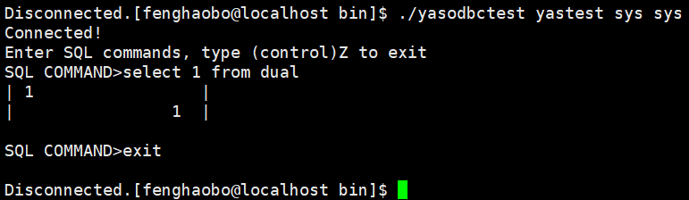

本文以Centos 7.3.1为例，介绍YashanDB ODBC驱动在该环境下的安装配置过程。

## 步骤1：安装unixODBC

```shell
yum install unixODBC-devel
yum install unixODBC
```

## 步骤2：安装YashanDB C驱动

使用YashanDB ODBC驱动需要先安装和配置YashanDB C驱动库。YashanDB C驱动安装文件集成在YashanDB客户端安装包中，安装时需获取对应的客户端安装包。


### 步骤2.1：下载C驱动安装包


1. 从[YashanDB官网下载中心](https://download.yashandb.com/download)或联系我们的技术支持获取对应的软件包。

2. 将YashanDB客户端安装包下载并解压到本地路径，例如/home/yasdb-driver-c/。

   安装包解压后可得到C驱动所需文件：

   * bin：C驱动的可执行文件（目前包括yasql）。

   * C驱动的头文件：位于include文件夹中。

   * C驱动的库文件：位于lib文件夹中。


### 步骤2.2：设置动态库依赖路径


1. 编辑bashrc文件：

   ```shell
   $ vi ~/.bashrc
   ```

2. 新起一行增加LD_LIBRARY_PATH搜索路径，指向C驱动的库文件所在文件夹：

   ```shell
   export LD_LIBRARY_PATH=$LD_LIBRARY_PATH:/home/yasdb-driver-c/lib
   ```

3. 保存并退出。

4. 刷新系统变量配置。

   ```shell
   $ source ~/.bashrc
   ```


## 步骤3：安装YashanDB ODBC驱动

1. 从[YashanDB官网下载中心](https://download.yashandb.com/download)或联系我们的技术支持获取对应的软件包。

2. 将ODBC驱动安装包下载并解压到本地路径，例如/home/yashandb_odbc/。

3. 安装ODBC驱动（so路径仅为示例，请使用实际的libyas_odbc.so路径）。

   ```shell
   $ vi /etc/odbcinst.ini

   [YashanDB]
   Description     = ODBC for YashanDB
   Driver          = /home/yashandb_odbc/libyas_odbc.so
   Setup           = /home/yashandb_odbc/libyas_odbc.so
   Driver64        = /home/yashandb_odbc/libyas_odbc.so
   Setup64         = /home/yashandb_odbc/libyas_odbc.so
   FileUsage       = 1
   ```

## 步骤4：配置数据源

```shell
$ vi /etc/odbc.ini

[YASTEST]
Description  = YashanTest
Driver       = YashanDB
SERVER       = 127.0.0.1
PORT         = 1688
URL          = 127.0.0.1:1688
USER         = sys
PWD          = sys
CHARACTER_SET = UTF8   # ODBC驱动的默认字符集为UTF8，如需使用其他字符集可通过该参数按需配置，可选项包括：ASCII、ISO88591、GBK、UTF8、GB18030
```

配置项中的URL为数据源的完整URL。配置URL参数后，SERVER和PORT参数将不会再生效。

URL格式如下：

* 单地址连接： `host:port`。

* 多个地址连接：`serverType:host:port,host:port,host:port,host:port`，多个地址间用`,`分隔，连接时根据服务类型（serverType参数）配置对相应节点进行连接。

* 多组地址连接：`serverType:host:port,host:port;host:port,host:port`，多组地址间用`;`分隔，同组内的多个地址间用`,`分隔，连接时先在组内根据serverType配置对相应节点进行连接，当组内所有连接均失败后按顺序优先级（越靠前优先级越高）访问下一组。

参数含义：

* host:port：

    * host：数据库所在服务器的网络地址，可以为IPv4地址、IPv6地址或域名。在共享集群部署中，若已配置[SCAN](../../../../数据库管理/集群管理/SCAN管理)或[VIP](../../../../数据库管理/集群管理/VIP管理)，还可以使用相应的域名或IP地址。

    * port：数据库服务端监听端口，如安装过程中未进行调整，默认为1688。

* serverType：多地址连接的连接类型，可选项包括primary、standby、loadBalance、primaryLoadBalance以及standbyLoadBalance。若不指定serverType，在输入多IP时默认采用primary。各类型的详细介绍如下：

    | serverType| 说明|
    |--------------------|---------------|
    | primary | 默认类型，可省略。<br />驱动会按指定监听地址的先后顺序连接节点，并通过执行`SELECT * FROM DATABASE_ROLE`判断节点角色，保留首次与主节点建立的连接。 |
    | standby | 驱动会按指定监听地址的先后顺序连接节点，并通过执行`SELECT * FROM DATABASE_ROLE`判断节点角色，保留首次与备节点建立的连接。 |
    | loadBalance | 驱动会将指定的监听地址随机打乱顺序后进行连接，获取每个节点当前的会话数，选取会话数最小值对应的节点作为目标节点（若最小值存在多个节点则取最先建立连接的节点），保留目标节点的连接并关闭其他连接。 |
    |primaryLoadBalance | 驱动会将指定的监听地址随机打乱顺序后进行连接，获取每个节点当前的会话数量和角色，选取主节点中会话数最小值对应的节点作为目标节点（若最小值存在多个节点则取最先建立连接的节点），保留目标节点的连接并关闭其他连接。 |
    |standbyLoadBalance | 驱动会将指定的监听地址随机打乱顺序后进行连接，获取每个节点当前的会话数量和角色，选取备节点中会话数最小值对应的节点作为目标节点（若最小值存在多个节点则取最先建立连接的节点），保留目标节点的连接并关闭其他连接。 |


>**Note**:
>
> - 多组监听地址连接的故障切换效率低于多个监听地址连接，分组主要用于尽可能保障仅通过第一组地址建立数据库连接，请根据实际需求选择是否分组。
> - 在共享集群/分布式集群部署中，若已配置[SCAN](../../../../数据库管理/集群管理/SCAN管理)或[VIP](../../../../数据库管理/集群管理/VIP管理)，直接使用数据库服务端提供的高可用能力即可，**无需**额外配置多地址连接。
> - 配置多地址连接共享集群/分布式集群时：
>   - 若为单集群部署，驱动会将其所有实例视作主节点。
>   - 在主备集群部署中，驱动会将主集群的所有实例视作主节点、备集群的所有实例视作备节点。如需在未配置SCAN或VIP的场景下实现负载均衡，可考虑配置多组地址连接并按需指定primaryLoadBalance或standbyLoadBalance，主集群的所有实例为一个组，备集群的所有实例为另一个组。


## 步骤5：测试连接

```shell
# 数据源名称以yastest为例
$ isql yastest -v

# 查看数据源名称
$ odbcinst -q -s

# 查看驱动名称
$ odbcinst -q -d

# 查看驱动配置
$ odbcinst -j
```

## 步骤6：（可选）使用yasodbc自带test程序测试连接

执行yasodbctest，数据源名称以yastest为例。

```shell
$ ./yasodbctest yastest sys sys
# 或者
$ ./yasodbctest yastest
```

使用exit退出。

```shell
> exit
```


