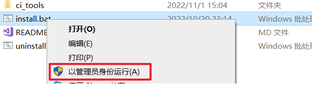
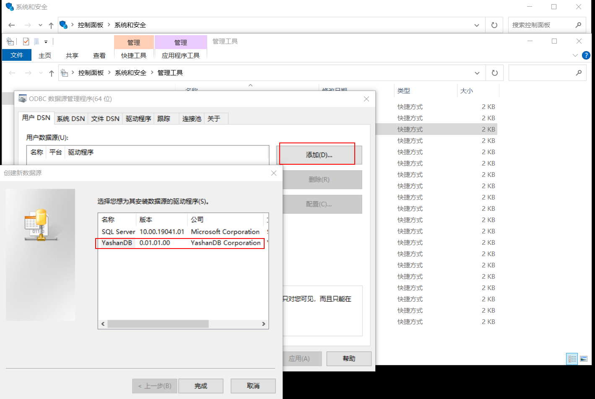
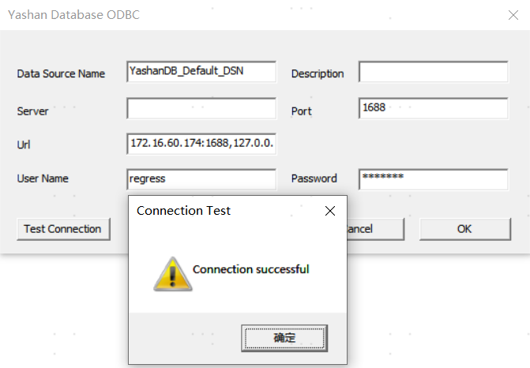
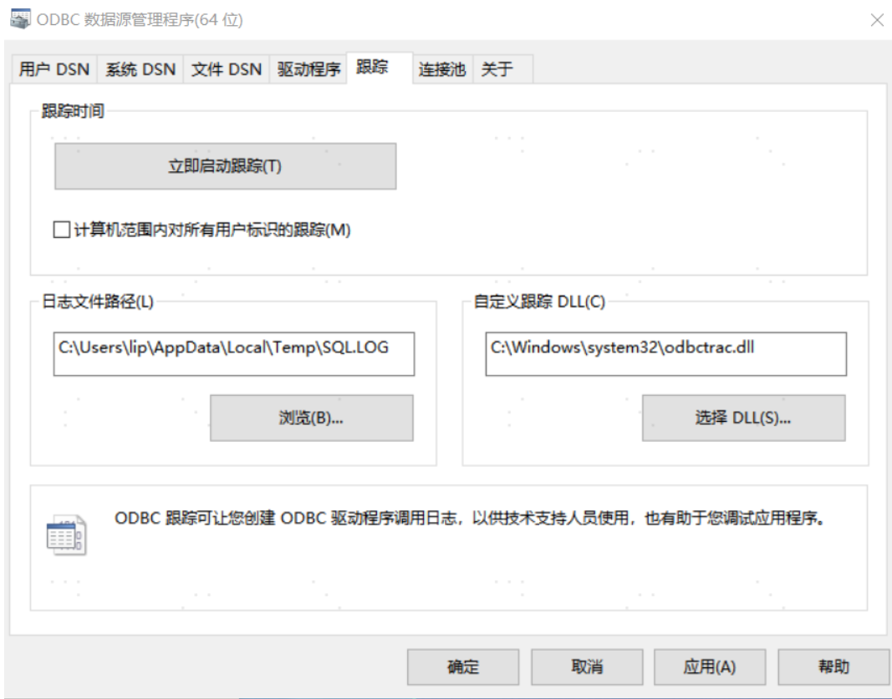

本文以Windows10专业版为例，介绍YashanDB ODBC驱动在该环境下的安装配置过程。

> **Note**:
> 
>YashanDB ODBC驱动依赖C基础开发库，因此应用端还需安装C编译工具，例如gcc、visual studio等。

## 步骤1：安装YashanDB C驱动

使用YashanDB ODBC驱动需要先安装YashanDB C驱动并设置环境变量，YashanDB C驱动安装文件集成在YashanDB客户端安装包中，安装时需获取对应的客户端安装包。


### 步骤1.1：下载C驱动安装包

1. 从[YashanDB官网下载中心](https://download.yashandb.com/download)或联系我们的技术支持获取对应的软件包。

2. 将YashanDB客户端安装包下载并解压到本地路径，例如D:\yasdb-driver-c\。

   安装包解压后可得到以下文件夹：

   * bin：C驱动的可执行文件。

   * include：C驱动的头文件。
   
   * lib：C驱动的库文件。

### 步骤1.2：设置环境变量


将C驱动的库文件所在文件夹设置到Windows环境变量PATH中，具体操作为：

1. 右键单击系统桌面上的【此电脑】图标，选择【属性】。

2. 单击【高级系统设置】。

3. 单击【环境变量】。

4. 在【系统变量】区域，选中【Path】项，单击下方的【编辑】。

5. 单击【新建】，输入C驱动的库文件所在文件夹，例如`D:\yasdb-driver-c\lib`。

6. 单击【确定】保存配置。


## 步骤2：安装YashanDB ODBC驱动

1. 从[YashanDB官网下载中心](https://download.yashandb.com/download)或联系我们的技术支持获取对应的软件包。

2. 将ODBC驱动安装包下载并解压到本地路径，例如`D:\yasdb-driver-odbc`。

3. 确认install.bat、uninstall.bat和yas_odbc.dll在相同路径下。

   ```bash
   D:\yasdb-driver-odbc>dir
   2022/11/10  10:18    <DIR>          .
   2022/11/10  10:18    <DIR>          ..
   2022/11/09  05:43             1,041 install.bat
   2022/11/09  05:43               183 README.md
   2022/11/09  05:43               181 uninstall.bat
   2022/11/09  05:43            41,984 yasodbctest.exe
   2022/11/09  05:43           144,896 yas_odbc.dll
   ```

4. 运行install.bat，此操作需以管理员身份运行，如下：

   

5. 成功后按任意键退出安装。

## 步骤3（可选）：检查依赖项（32位）

仅在安装32位驱动时，需要执行本操作。


1. 检查`C:\Windows\SysWOW64`文件夹中是否包含**32位**的ucrtbased.dll和vcruntime140d.dll。
   
   - 若无，需先自行获取ucrtbased.dll和vcruntime140d.dll文件并保存至`C:\Windows\SysWOW64`文件夹中，例如可以通过安装Visual Studio等方式获取。

   - 若有，则可直接执行后续操作。


<span id="datasource" name="datasource"></span>

## 步骤4：配置数据源

通过Windows自带的ODBC数据源管理器进行YashanDB ODBC数据源配置。

1. 进入ODBC数据源管理器，添加用户数据源。

   - 64位：【控制面板 > 系统和安全 > 管理工具 > ODBC数据源管理程序（64位）】，此处以64位为例。

   - 32位：【控制面板 > 系统和安全 > 管理工具 > ODBC数据源管理程序（32位）】
   
   

​	仅当成功安装YashanDB ODBC驱动后才会出现YashanDB选项。

2. 填写数据源信息。

   

   参数说明：

   - Data Source Name：ODBC数据源名称，唯一标识一个数据源 （必填项）

   - Description：数据源描述，等价于注释（选填项）

   - Server：数据源所在连接IP地址，即服务端IP地址（选填项）

   - Port：数据源端口，即服务端当前监听的IP端口（选填项）

   - Url：数据源的完整URL（选填项，配置URL参数后，Server和Port参数将不会再生效），URL格式如下：

      * 单地址连接： `host:port`。

      * 多个地址连接：`serverType:host:port,host:port,host:port,host:port`，多个地址间用`,`分隔，连接时根据服务类型（serverType参数）配置对相应节点进行连接。

      * 多组地址连接：`serverType:host:port,host:port;host:port,host:port`，多组地址间用`;`分隔，同组内的多个地址间用`,`分隔，连接时先在组内根据serverType配置对相应节点进行连接，当组内所有连接均失败后按顺序优先级（越靠前优先级越高）访问下一组。

      参数含义：

      * host：数据库所在服务器的网络地址，可以为IPv4地址、IPv6地址或域名。在共享集群部署中，若已配置[SCAN](../../../../数据库管理/集群管理/SCAN管理)或[VIP](../../../../数据库管理/集群管理/VIP管理)，还可以使用相应的域名或IP地址。

      * port：数据库服务端监听端口，如安装过程中未进行调整，默认为1688。

      * serverType：多地址连接的连接类型，可选项包括primary、standby、loadBalance、primaryLoadBalance以及standbyLoadBalance。若不指定serverType，在输入多IP时默认采用primary。各类型的详细介绍如下：

    | serverType| 说明|
    |--------------------|---------------|
    | primary | 默认类型，可省略。<br />驱动会按指定监听地址的先后顺序连接节点，并通过执行`SELECT * FROM DATABASE_ROLE`判断节点角色，保留首次与主节点建立的连接。 |
    | standby | 驱动会按指定监听地址的先后顺序连接节点，并通过执行`SELECT * FROM DATABASE_ROLE`判断节点角色，保留首次与备节点建立的连接。 |
    | loadBalance | 驱动会将指定的监听地址随机打乱顺序后进行连接，获取每个节点当前的会话数，选取会话数最小值对应的节点作为目标节点（若最小值存在多个节点则取最先建立连接的节点），保留目标节点的连接并关闭其他连接。 |
    |primaryLoadBalance | 驱动会将指定的监听地址随机打乱顺序后进行连接，获取每个节点当前的会话数量和角色，选取主节点中会话数最小值对应的节点作为目标节点（若最小值存在多个节点则取最先建立连接的节点），保留目标节点的连接并关闭其他连接。 |
    |standbyLoadBalance | 驱动会将指定的监听地址随机打乱顺序后进行连接，获取每个节点当前的会话数量和角色，选取备节点中会话数最小值对应的节点作为目标节点（若最小值存在多个节点则取最先建立连接的节点），保留目标节点的连接并关闭其他连接。 |


3. 单击【OK】保存数据源信息，后续如需修改，单击【配置】即可修改当前数据源信息。

4. 单击【Test Connection】且测试连接正常后，表示安装完成，
   
   用户即可开始使用YashanDB ODBC驱动开发自己的客户端程序。

## 步骤5：检查日志状态

> **caution**:
>
> 跟踪开启期间日志持续膨胀，所有ODBC应用性能都会受损；全局跟踪仅在临时排查时开启，其余时间**必须关闭**。

1. 进入ODBC数据源管理器，切换到【跟踪】选项卡。

   - 64位：【控制面板 > 系统和安全 > 管理工具 > ODBC数据源管理程序（64位）】
   - 32位：【控制面板 > 系统和安全 > 管理工具 > ODBC数据源管理程序（32位）】

2. 确认【立即启动跟踪】按钮处于可单击状态（即当前未开启跟踪）。若按钮显示为【立即停止跟踪】（表示正在跟踪），请单击【立即停止跟踪】将其关闭。

  
