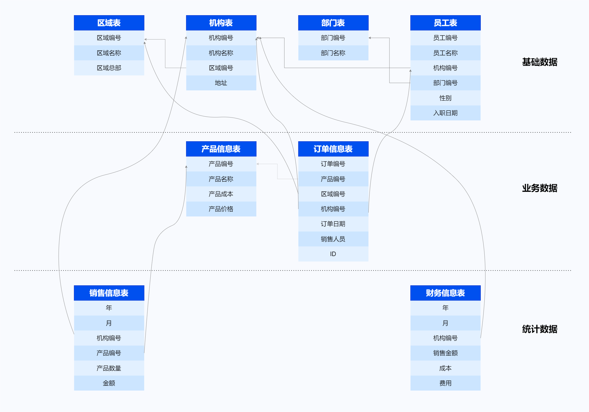

SQL（Structured Query Language）是开发者操作数据库的主要接口，本手册从数据类型、运算符、函数、SQL语句等方面全面介绍YashanDB对于SQL功能的实现。


## 手册中使用的示例说明


* 示例中的SQL、PL语句均在yasql工具中运行，并以yasql工具的输出结果作为样例进行展示。

* 示例中使用DBMS\_OUTPUT.PUT\_LINE语句向yasql工具端打印输出，为达到输出效果，需要保证在yasql工具里已运行set serveroutput on来打开控制输出的开关，详见工具手册[yasql使用指导](../../工具手册/yasql/yasql使用指导)。

* 系统对浮点类型及NUMBER类型数据输出时的显示宽度默认为10，可通过SET NUMWIDTH调节显示宽度。

* 关于日期的显示格式：为尽量模拟实际业务，本手册示例库的日期格式被设置为'YYYY-MM-DD HH24:MI:SS'，如DATE\_FORMAT配置参数不是按此格式设置，所看到的日期格式将与本手册不一致。

* 关于示例中使用的通用表：本手册使用sales作为示例用户（参考[CREATE USER](SQL语句/CREATE USER)创建用户），同时在该用户下创建一套样例表（样例表来源于下面所列的一套极简化的业务模型，并依据不同架构/存储特性进行相应调整）。示例中使用的通用表即来自于这套样例表，当执行示例时，切换到sales用户下将可以查询到这些表，产品文档中[附：样例表](../附：样例表)展示了这些表的创建脚本。


    
    > **Note**: 
    >
    > 为达到特定目的，示例可能需要创建其他表或者修改通用表的结构、数据，这些将不在此处体现，而是查看具体示例。

### 样例业务模型



```sql
--区域信息表：area、area1
--机构信息表：branches、branches1
--部门信息表：department
--员工信息表：employees
--产品信息表：product
--订单信息表：orders_info
--销售信息表：sales_info、sales_info_range、sales_info_list、sales_info_hash
--财务信息表：finance_info
```


### 样例表类型说明

YashanDB支持多种部署形态（单机/分布式/共享集群）和多种表类型（HEAP/TAC/LSC），并提供DEFAULT_TABLE_TYPE参数用于配置创建表对象时的默认表类型，同时还提供ORGANIZATION语法用于创建一个指定表类型的表对象（查看[CREATE TABLE](./SQL语句/CREATE TABLE)了解该语法详细说明）。

本手册示例中所使用的样例表的类型依据系统部署形态和DEFAULT_TABLE_TYPE参数的值确定。当示例或示例所在前提中未注明语句适用于某一种部署形态或某一种表类型时，表示该示例语句可以在所有部署形态中以任一种表类型运行；否则，该示例语句应在注明的部署形态环境中，并以注明的表类型运行，不合适的部署形态环境或表类型可能导致示例语句运行异常，或产生与预期不一致的输出结果。
