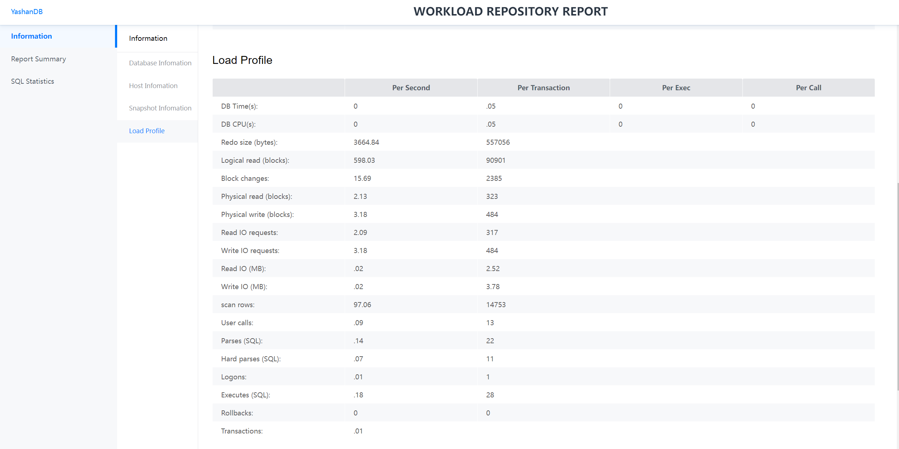
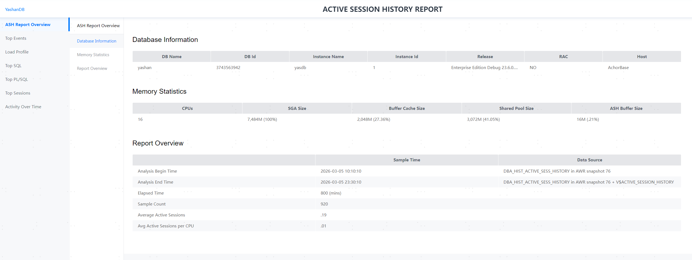

YashanDB为帮助用户了解数据库的运行状态，定位性能瓶颈，优化数据库性能提供了丰富的性能报告工具，包括AWR报告、ASH报告。

- **AWR报告**：YashanDB在运行过程中，每隔一段时间会将数据库的状态数据保存一份快照到WRM$_SNAPSHOT表中，状态数据包括等待事件、指标数据、空间使用统计、SQL状态信息等数据库关键统计信息。性能报告通过对比两份历史快照来反映整个数据库在一个时间段内的状态，为数据库异常提供事后分析和诊断的依据。

- **ASH报告**：YashanDB提供的一种轻量级性能诊断工具，通过周期性采样活跃会话状态来收集性能数据，反映数据库的负载情况。

## AWR报告

### 快照

快照默认由系统定时（默认为每小时，该值可通过[DBMS_AWR](../../开发手册/PL参考手册/内置高级包/DBMS_AWR).MODIFY_SNAPSHOT_SETTINGS修改）创建。

为诊断性能瓶颈，用户可能需要在指定时间点（例如执行某条SQL语句的前后）即时地创建快照，用于生成性能报告，此时可以通过调用[DBMS_AWR](../../开发手册/PL参考手册/内置高级包/DBMS_AWR).CREATE_SNAPSHOT程序，手动创建快照。

快照数据超过一定时间（默认为8天，该值可通过[DBMS_AWR](../../开发手册/PL参考手册/内置高级包/DBMS_AWR).MODIFY_SNAPSHOT_SETTINGS修改）后，由系统自动进行清理，也可通过[DBMS_AWR](../../开发手册/PL参考手册/内置高级包/DBMS_AWR).DROP_SNAPSHOT_RANGE手动清理。

快照的主要信息如下表所示：

|  字段名称| 含义|
| ------------------- | ------------------------------------------------------------ |
| SNAP_ID             | 快照ID，每次快照的标识，生成报告需以此为关键参数           |
| DBID                | 数据库ID，同V$DATABASE中的database_id                        |
| INSTANCE_NUMBER     | 实例标识符，同V$INSTANCE中的instance_number                      |
| STARTUP_TIME        | 实例启库时间，数据库连续运行期间的两次快照所生成的报告才是有意义的，此信息有助于在生成报告时对快照ID的有效性进行过滤判断 |
| BEGIN_INTERVAL_TIME | 快照开始时间                                                 |
| END_INTERVAL_TIME   | 快照结束时间                                                 |
| FLUSH_ELAPSED       | 生成快照时间                                                 |
| SNAP_LEVEL          | 预留字段                                                     |
| STATUS              | 预留字段                                                     |
| ERROR_COUNT         | 预留字段                                                     |
| INST_CHANGE_TIME    | 数据库实例变更时间戳 |
| SRC_DBID            | 性能数据来源数据库ID |
| DATABASE_ROLE       | 数据库角色<br>\*   PRIMARY：主库<br>\*   STANDBY：物理备库<br>\*   LOGICAL STANDBY：逻辑备库 |
| GROUP_ID            | 组ID |
| GROUP_NODE_ID       | 组内节点ID |

### 生成AWR报告

生成AWR报告即通过两个快照的对比，按照不同的维度生成性能报告。报告的运算由存储过程（[DBMS_AWR](../../开发手册/PL参考手册/内置高级包/DBMS_AWR).AWR_REPORT）完成，该存储过程由用户在需要获得报告时主动调用。

1. 以DBA用户使用yasql连接并登录数据库。

    ```shell
    $ yasql sales/********@192.168.1.2:1688
    ```

2. 查询快照信息，包括对应的数据库ID、实例标识、快照ID等信息，本文以最近2次为例。

    ```sql
    SELECT dbid,src_dbid,snap_id,instance_number,group_id,group_node_id FROM sys.wrm$_snapshot ORDER BY snap_id DESC LIMIT 2;
        DBID    SRC_DBID     SNAP_ID INSTANCE_NUMBER    GROUP_ID GROUP_NODE_ID
    ----------- ----------- ----------- --------------- ----------- -------------
    121922913   121922913         144               1           0             0
    121922913   121922913         143               1           0             0
    ```

3. 通过以下方式获取性能报告（html文件），请按需指定对应文件的路径，本文均以执行yasql命令的当前路径为例。

    ::: tabs

    == 直接将输出结果保存为文件

    文件后缀名应指定为.html，文件名规则请查阅[yasql使用指导](../../工具手册/yasql/yasql使用指导.md#spool)。
    

```sql
-- 1. 开启缓存区信息打印开关
set serveroutput on

-- 2. 开启输出结果保存为文件并指定新建目标文件信息，文件名以awr.html为例
spool awr.html create

-- 3. 基于上述步骤获取的数据库ID、实例标识、起始快照ID以及结束快照ID生成性能报告
exec dbms_awr.awr_report(121922913,1,143,144);

-- 4. 结束输出为文件并退出登录。
spool off
exit
```

    == 执行.sql文件再转换为.html文件

```shell
# 1. 退出登录
SQL> exit
# 2. 创建awr.sql文件，将下列生成性能报告相关的语句写入文件中并保存
$ vi awr.sql

set serveroutput on
exec dbms_awr.awr_report(121922913,1,143,144);

# 3.执行上述.sql文件，并将结果转换为.html文件
$ yasql sales/********@192.168.1.2:1688 -f -e awr.sql > awr.html 2>&1
```
    :::

4. 在相应路径下查看新生成的awr.html文件。

    awr.html文件即为起始和结束快照区间的性能报告。

    ```shell
    $ ll
    -rw-rw-r--  1 yashan yashan    110326 7月   2 17:11 awr.html
    ```

### 报告内容

以下为YashanDB所生成性能报告以网页形式展现的示例：



#### Information

##### Database Information

当前所在数据库的相关信息。

|  信息项| 含义|
| ------------ | ------------------------------------------------------------ |
| DB Name      | 数据库名称                                                   |
| DB Id        | 数据库ID                                                     |
| Unique Name  | 兼容字段，无含义                                             |
| Role         | 数据库角色<br/>* PRIMARY：主<br/>* STANDBY：备<br/>* CASCADE STANDBY：级联备 |
| Release      | 数据库版本号                                                 |
| Instance     | 兼容字段，无含义                                             |
| Inst ID      | 实例标识符                        |
| Startup Time | 数据库开启时间                                               |

##### Host Information

数据库所在服务器的相关信息。

|  信息项| 含义|
| ---------- | ------------------ |
| Host Name  | 服务器名称         |
| Platform   | 服务器操作系统平台 |
| CPUs       | 服务器CPU逻辑个数  |
| Cores      | 服务器CPU核数      |
| Sockets    | 服务器CPU物理个数  |
| Memory(GB) | 服务器内存大小     |

##### Snapshot Information

本性能报告所覆盖的快照相关信息。

|  信息项| 含义|
| --------------- | ------------------------------------ |
| Snap Id         | 起止快照ID                           |
| Snap Time       | 起止快照时间                         |
| Sessions        | 快照时的会话个数                     |
| Cursor/Sessions | 快照时的平均每个会话游标数           |
| Elapsed         | 起止快照时间差，即性能报告所覆盖时长 |
| DB Time         | 起止快照时间内的SQL执行总时间        |

##### Load Profile

按每秒、每个事务（DB Time和DB CPU还按每次执行、每个调用）统计的系统平均负载信息。

|  信息项| 含义|
| ---------------------- | -------------------------------- |
| DB Time(s)             | SQL执行的总时间                  |
| DB CPU(s)              | SQL执行的CPU耗时                 |
| Redo size (bytes)      | 产生的redo大小                   |
| Logical read (blocks)  | 逻辑读的块数                     |
| Block changes          | 描述数据块的变化（单位：块）       |
| Physical read (blocks) | 物理读的块数                     |
| Physical write (blocks) | 物理写的块数                     |
| Read IO requests       | 物理读IO请求次数                 |
| Write IO requests      | 物理写IO请求次数                 |
| Read IO (MB)           | 物理读IO数据量                   |
| Write IO (MB)          | 物理写IO数据量                   |
| scan rows              | 表扫描的行数                     |
| User calls             | 用户级别的调用次数               |
| Parses (SQL)           | SQL解析总次数（软解析 + 硬解析） |
| Hard parses (SQL)      | SQL硬解析次数                    |
| Logons                 | 累计建立数据库连接的次数                   |
| Executes (SQL)         | SQL命令执行次数                  |
| Rollbacks              | 事务回滚次数                     |
| Transactions           | 事务数（回滚数 + 提交数）        |

#### Report Summary

##### Top 10 Foreground Events by Total Wait Time

Top 10（按%DB Time）等待事件信息，对等待事件项的解释请查阅[等待事件](../../参考手册/等待事件)。

|  信息项| 含义|
| -------------------- | ------------------------------ |
| Wait Class           | 等待事件所属类别               |
| Waits                | 等待次数                       |
| Total Wait Time (sec) | 总等待时间                     |
| Avg Wait Time         | 平均等待时间                   |
| % DB Time            | Total Wait Time占DB Time百分比 |

##### Wait Classes by Total Wait Time

Top 10等待事件类别信息，与Top 10 Foreground Events by Total Wait Time所列信息项含义一致。Avg Active Sessions项为兼容字段，无实际含义。

对等待事件类别的解释请查阅[数据库性能指标](../实例性能诊断与调优/数据库性能指标)。

##### SGA Memory Summary

记录全局内存信息。

|  信息项| 含义|
| -------------------- | ------------------------------ |
| Memory Item Name     | 内存项名称                     |
| Memory Size (byte)    | 内存大小（单位：字节）         |

##### Instance Efficiency Percentages (Target 100%)

记录实例命中率信息。

|  信息项| 含义|
|---------------|---------------------|
| Redo NoWait % | 在redo日志写入过程中没有发生等待的比例 |
| Buffer Hit %  | 缓冲区命中率，即从缓冲区成功读取数据页的比例 |
| Soft Parse %  | 软解析的百分比             |

##### Execute Statistics

记录SQL的执行与解析次数。

|  信息项| 含义|
|---------------|---------------------|
| Execute Count | 执行次数                |
| Hard Parse Count | 硬解析次数               |
| Soft Parse Count | 软解析次数               |

#### SQL Statistics

##### SQL ordered by Elapsed Time

按SQL执行所占总时间（Elapsed Time项）排列的TOP SQL信息，信息项的解释见报告内容所述。

##### SQL ordered by CPU Time

按SQL执行所占CPU耗时（CPU Time项）排列的TOP SQL信息，信息项的解释见报告内容所述。

##### SQL ordered by User I/O Wait Time

按SQL执行所占User I/O类等待时间（User I/O Time项）排列的TOP SQL信息，信息项的解释见报告内容所述。

##### SQL ordered by Gets

按SQL执行所占逻辑读（Buffer Gets项）排列的TOP SQL信息，信息项的解释见报告内容所述。

##### SQL ordered by Reads

按SQL执行所占物理读（Physical Reads项，以字节为单位）排列的TOP SQL信息，信息项的解释见报告内容所述。

##### SQL ordered by Executions

按SQL的执行次数（Executions项）排列的TOP SQL信息，信息项的解释见报告内容所述。

##### SQL ordered by Parse Calls

按SQL的软解析次数（Parse Calls项）排列的TOP SQL信息，信息项的解释见报告内容所述。

##### SQL ordered by Sharable Memory

按SQL执行所占共享内存（Sharable Mem项）排列的TOP SQL信息，信息项的解释见报告内容所述。

#### Memory Statistics

##### Virtual Memory Total Statistics

记录VM使用情况，仅统计HEAP表。

|  信息项| 含义|
| -------------------- | ------------------------------ |
| Total Blocks         | 总的内存页数量                 |
| Free Blocks          | 处于空闲状态的内存页数量       |
| Opened Blocks        | 处于打开状态的内存页数量       |
| Closed Blocks        | 处于关闭状态的内存页数量       |
| Swapped Out Blocks   | 换出磁盘的内存页数量           |
| Ctrl Blocks          | 控制页面的数量                 |

##### System-level Information

记录系统级的统计信息。

|  信息项| 含义|
|--------------------| ------------------------------ |
| Name               | 统计项名称                         |
| Value              | 内存大小（单位：字节）                 |

##### VM Buffer Used

记录会话级的VM Buffer累计使用情况（按Alloc Count排序）。

|  信息项| 含义|
|--------------------|---------------|
| SID               | 会话的ID         |
| Alloc Count              | 累计分配的次数       |
| Open Count               | 累计打开的次数       |
| Close Count              | 累计关闭的次数       |
| Free Count               | 累计释放的次数       |
| Swap Out Count              | 累计换出到磁盘的次数    |
| Swap In Count               | 累计换入到内存的次数    |
| IO Wait Count              | 累计发生IO等待的次数   |
| Extend Count              | 累计发生VM页扩展的次数  |

##### VM Current Open

记录会话级当前的VM使用情况（按Open Count排序）。

|  信息项| 含义|
|--------------------|--------------|
| SID               | 会话的ID        |
| Open Count              | 当前正在打开的页数    |
| Close Count               | 当前关闭记录的页数    |
| Swap Out Count              | 当前正在换出磁盘的页数  |

##### VM Current Swap

记录会话级当前VM的换出信息（按Swap Out Count排序）。

|  信息项| 含义|
|--------------------|--------------|
| SID               | 会话的ID        |
| Open Count              | 当前正在打开的页数    |
| Close Count               | 当前关闭记录的页数    |
| Swap Out Count              | 当前正在换出磁盘的页数  |

#### Lock Statistics

##### Spinlock Summary

记录spinlock锁的spin次数信息。

|  信息项| 含义|
| -------------------- | ------------------------------ |
| Name                 | 锁名                         |
| Spincount            | 每次spin时CPU需要暂停等待的次数    |
| Times                | 总共spin等待的次数                |

#### Segment Statistics

Segment Statistics相关统计指标仅在单机或共享集群部署模式下可用。

Segment Statistics的统计指标仅返回前30条记录。

##### Segments by Logical Reads

统计段的逻辑读次数，一次读取一个块，并计算逻辑读次数相对两次快照间同类操作总次数的比例。

逻辑读指标较高时，需确认对应的数据库对象是否存在正常的业务负载，可以通过执行计划确认业务SQL是否缺少合适的索引而产生全表扫描，或是否发生了执行计划错误出现重复读。

##### Segments by Physical Reads

统计段的物理读次数，一次读取一个块，并计算物理读次数相对两次快照间同类操作总次数的比例。

如果物理读指标较高，业务性能可能受影响。

当物理读指标较高时，说明数据库可能没有提前缓存，需要频繁从磁盘换入换出，可以考虑如下调优手段：

- 对业务SQL进行调优。
- 调整缓存DATA_BUFFER_SIZE的大小。
- 如果表和索引较小，可以考虑配置为内存表。
- 重建表或索引。

##### Segments by Buffer Busy Waits

统计段上发生Buffer Busy Waits的次数，并计算该次数相对两次快照间同类等待事件总次数的比例。

该指标较高时，说明大量会话同时申请该段的缓存数据，从而导致等待事件发生，该段的数据块上存在热点块。

热点块形成原因可能是热点表的反复扫描、反向索引或者递增序列上的索引，可以考虑如下调优手段：

- 对于热点表，可以考虑使用哈希分区来分散数据块。
- 针对序列递增产生的索引热点，考虑使用反向索引。

##### Segments by Xslot Waits

统计段上所有数据块因事务槽位Xslot不足造成的事务等待次数，并计算该次数相对两次快照间同类等待事件总次数的比例。

该指标较高时，可以分析是否存在高并发事务对同一个业务表进行修改，如有需要考虑调整表或索引的INITRANS参数，或重建对象。

##### Segments by Row Lock Waits

统计段上行级锁等待次数，并计算该次数相对两次快照间同类等待事件总次数的比例。

该指标较高时，可能发生了并发争用和事务阻塞现象，需要检查事务对应的业务逻辑是否合理，可通过选择性提交、队列化处理或应用层分片等手段来减少对数据库同一行数据的争用。

##### Segments by Physical Read Requests

统计段的物理读请求次数，一次读取一个块，并计算该次数相对两次快照间同类操作总次数的比例。

该指标辅助识别热点块，查找需要优化的对象。

##### Segments by DB Blocks Changes

统计段的数据块更新次数，一次更新一个块，并计算该次数相对两次快照间同类操作总次数的比例。

如果该指标较高，表示该段的对象更新频繁，可以用于辅助识别热表或索引，并考虑使用优化索引结构、表分区等策略进行优化。

##### Segments by Global Cache CR Blocks Received

在共享集群部署时，用于统计当一个实例需要读取另一个实例上数据块时，会发送CR请求，远端实例将返回该数据块的一致性读版本。

该指标用于统计该实例下每个段申请一致性读版本的数据库块的次数，一次申请一个块，并计算该次数相对两次快照间同类操作总次数的比例。

该指标较高时，可能发生并发读的争抢，考虑从以下维度分析原因及解决方案：

- 分析业务慢SQL的阻塞原因，进行SQL改写。
- 全表扫描多：如果请求端实例频繁读写同一批数据块，考虑请求端是否发生全表扫描因此向远端实例请求了大量的数据块，分析请求端的业务是否可以通过添加索引、分区裁剪或物化视图缓存等方式进行优化。
- 热点块争用：如果多个实例频繁访问和修改同一批数据块，而访问对象本身较小，对于索引对象考虑反向索引进行优化，对于小表对象考虑缓存、数据分区和实例亲和等优化手段。

##### Segments by Global Cache Current Blocks Received

在共享集群部署时，为了进行数据修改，本实例需要从其他实例的缓存中申请数据块的Current所有权。

该指标用于统计该实例下每个段申请Current所有权的数据块的次数，一次申请一个块，并计算该次数相对两次快照间同类操作总次数的比例。

该指标较高时，可能会发生并发写事务冲突，考虑从以下维度分析原因及解决方案：

- 索引热点时，可以考虑将索引键进行哈希分区分配到不同数据块，或使用反向索引技术。
- 对于小表热点场景，考虑实例亲和，或应用层队列化或通过物化视图汇总更新。
- 对于大对象热点场景，考虑对SQL语句进行性能调优，或优化应用架构。

##### Segments by Global Cache Remote Grants

在共享集群部署时，为了对数据进行操作，本实例会向主节点申请数据块的CR和Current授权。

该指标用于统计该实例下每个段向主节点申请授权的数据块的次数，一次申请一个块，并计算该次数相对两次快照间同类操作总次数的比例。

该指标通常反应了集群中是否存在较高的网络通信开销，当该指标较高时，可考虑通过尽可能的数据平均分布避免产生单实例的热点块，或评估实例亲和特性解决方案。

##### Segments by Global Cache Buffer Busy

共享集群部署时，统计该实例下因远程实例缓存争用而引发的等待次数，并计算该次数相对两次快照间同类等待事件总次数的比例。

对于热点块的调优考虑数据均匀打散、调整块大小和提高INITRANS等方式。

##### Segments by Table Scans

该指标统计了数据段上发生了全扫描的次数，一次扫描一个块，并计算该次数相对两次快照间同类操作总次数的比例。

发生全扫描时业务性能表现可能较差。当业务性能表现较差时，可以考虑如下调优方式：

- SQL优化改写。
- 更新表统计信息。
- 并行查询。

##### Segments by Space Alloc Sizes

该指标统计了两次快照间数据段的大小变化，并计算变更值与所有数据段总占用空间的大小比例。

日常需定期监控数据库的空间增长趋势，建立自动化空间回收机制。

#### YAC Statistics

> **Note**: 
>
> YAC Statistics报告仅在共享集群环境下生成。

##### YAC Summary

共享集群概要信息。

|  信息项| 含义|
| -------------------- | ------------------------------ |
| Number of Instances | 共享集群实例数                  |
| Number of GCS Tasks | GCS后台线程数量                 |

##### Global Cache Load Profile

按每秒、每个事务统计的集群全局缓存统计信息。

|  信息项| 含义|
| -------------------- | ------------------------------ |
| Global Cache blocks received | 从其他实例接收的页面数量  |
| Global Cache blocks served | 发送给其他实例的页面数量 |
| GRC messages received      | 接收的GRC消息数量 |
| GCS messages received      | 接收的GCS消息数量 |
| GLS messages received      | 接收的GLS消息数量 |
| GRC messages sent          | 发送的GRC消息数量 |
| GCS messages sent      | 发送的GCS消息数量 |
| GLS messages sent      | 发送的GLS消息数量 |
| DBWR Fusion writes      | 融合写入次数（预留） |

##### Global Cache Efficiency Percentages

全局缓存访问占比。

|  信息项| 含义|
| -------------------- | ------------------------------ |
| Buffer access - local cache % | 本地缓存访问占比 |
| Buffer access - remote cache % | 远端缓存访问占比 |
| Buffer access - disk %         | 磁盘缓存访问占比 |

##### Global Cache and Enqueue Services- Workload Characteristics

全局缓存和排队服务的统计信息。

|  信息项| 含义|
| -------------------- | ------------------------------ |
| Avg global cache cr block receive time (us) | 从远端实例缓存中获取CR页面的平均耗时 |
| Avg global cache current block receive time (us) | 从缓存中获取最新页面的平均耗时 |
| Avg global cache current block flush time (us) | 数据块平均刷盘耗时 |

##### YAC Sys Stats

系统级统计信息中共享集群相关统计项，信息项的解释请查阅[统计信息](../../参考手册/统计信息.md)。

## ASH报告

> **Note**:
>
> - ASH数据会被持久化至相应的系统表中，默认保存8天。该值可通过[DBMS_WORKLOAD_REPOSITORY](../../开发手册/PL参考手册/内置高级包/DBMS_WORKLOAD_REPOSITORY).MODIFY_SNAPSHOT_SETTINGS修改后，由系统自动进行清理，也可通过[DBMS_WORKLOAD_REPOSITORY](../../开发手册/PL参考手册/内置高级包/DBMS_WORKLOAD_REPOSITORY).DROP_SNAPSHOT_RANGE手动清理。

### 生成ASH报告

ASH报告的运算由存储过程（[DBMS_WORKLOAD_REPOSITORY](../../开发手册/PL参考手册/内置高级包/DBMS_WORKLOAD_REPOSITORY.md)完成，该存储过程由用户在需要获得报告时主动调用。

1. 以DBA用户使用yasql连接并登录数据库。

    ```shell
    $ yasql sales/********@192.168.1.2:1688
    ```

2. 查询对应的数据库ID、实例标识等信息，本文以最近2次为例。

    ```sql
    select  DATABASE_ID, INST_ID from GV$DATABASE;
        DATABASE_ID         INST_ID   
        -----------      -------------
         121922913             1          
    ```

3. 通过以下方式获取性能报告（html文件），请按需指定对应文件的路径，本文均以执行yasql命令的当前路径为例。

    ::: tabs

    == 直接将输出结果保存为文件

    文件后缀名应指定为.html，文件名规则请查阅[yasql使用指导](../../工具手册/yasql/yasql使用指导.md#spool)。
    

```sql
-- 1. 开启缓存区信息打印开关
set serveroutput on

-- 2. 开启输出结果保存为文件并指定新建目标文件信息，文件名以ash.html为例
spool ash.html create

-- 3. 基于上述步骤获取的数据库ID、实例标识生成性能报告
exec DBMS_WORKLOAD_REPOSITORY.ASH_REPORT_HTML(121922913,1,'2026-03-05 10:10:10','2026-03-05 23:30:10');

-- 4. 结束输出为文件并退出登录。
spool off
exit
```

    == 执行.sql文件再转换为.html文件

```shell
# 1. 退出登录
SQL> exit
# 2. 创建ash.sql文件，将下列生成性能报告相关的语句写入文件中并保存
$ vi ash.sql

set serveroutput on
exec DBMS_WORKLOAD_REPOSITORY.ASH_REPORT_HTML(121922913,1,'2026-03-05 10:10:10','2026-03-05 23:30:10');

# 3.执行上述.sql文件，并将结果转换为.html文件
$ yasql sales/********@192.168.1.2:1688 -f -e ash.sql > ash.html 2>&1
```
    :::

4. 在相应路径下查看新生成的ash.html文件。

    ash.html文件即为起始和结束时间区间的性能报告。

    ```shell
    $ ll
    -rw-rw-r--  1 yashan yashan    110326 7月   2 17:11 ash.html
    ```

### 报告内容

以下为YashanDB所生成性能报告以网页形式展现的示例：



#### Information

##### Database Information

当前所在数据库的相关信息。

|  信息项| 含义|
| ------------ | ------------------------------------------------------------ |
| DB Name      | 数据库名称                                                   |
| DB Id        | 数据库ID                                                     |
| Instance Name | 实例名称                                                   |
| Instance Id  | 实例ID                                                     |
| Release      | 版本号                                                     |
| YAC          | 是否为集群                                                 |
| Host         | 主机名                                                     |

##### Memory Statistics

包含CPU和SGA内存信息。

|  信息项| 含义|
| ------------ | ------------------------------------------------------------ |
| CPUs         | CPU核心数                                                   |
| SGA Size     | SGA内存总大小                                               |
| Buffer Cache Size | Data buffer的大小以及占SGA的百分比                             |
| Shared Pool Size | Shared Pool的大小以及占SGA的百分比                            |
| ASH Buffer Size | ASH缓冲区大小以及占SGA的百分比                                |

##### Report Overview

报告的概述信息。

|  信息项| 含义|
| ------------ | ------------------------------------------------------------ |
| Analysis Begin Time | 报告分析的开始时间                                           |
| Analysis End Time | 报告分析的结束时间                                             |
| Elapsed Time | 开始时间到结束时间所经过的总时间                                 |
| Sample Count | 开始时间到结束时间所采样的记录数                                 |
| Average Active Sessions | 开始时间到结束时间平均每秒的活跃会话数                             |
| Avg Active Sessions Per CPU | 开始时间到结束时间平均每个CPU核每秒的活跃会话数                    |
| Data Source | 报告起止的数据源                                                 |

#### Top Events

按用户、后台和优先级分类描述采样会话活动中排名Top的等待事件。使用此部分中的信息来识别可能导致瞬态性能问题的等待事件。包含Top User Events、Top Background Events、Top Event三部分。Top Background Events列出来自后台进程的、占采样会话活动百分比排名Top的等待事件。报告内容与Top User Events类似。

##### Top User Events

列出来自用户进程的、占采样会话活动百分比排名Top的等待事件。

|  信息项| 含义|
| ------------ | ------------------------------------------------------------ |
| Event        | 事件名称                                                     |
| Event Class  | 事件类型名称                                                 |
| % Event      | 该事件占总等待事件的百分比                                      |
| Avg Active Sessions | 在报告分析的时间段内，平均每秒在等待该事件的活跃会话数                |

##### Top Event

列出占采样会话活动百分比排名Top的等待事件的等待事件参数值，按总等待时间百分比（% Event）排序。对于每个等待事件，"P1 Value"、"P2 Value"、"P3 Value" 列中的值分别对应于"Parameter 1"、"Parameter 2" 和 "Parameter 3" 列中显示的等待事件参数。

|  信息项| 含义|
| ------------ | ------------------------------------------------------------ |
| Event        | 时间名称                                                     |
| %Event       | 该事件占总等待事件的百分比                                      |
| %Activity    | 事件占总采样数据的百分比                                       |

#### Load Profile

描述采样会话活动中分析的负载。使用此部分中的信息来识别可能导致瞬态性能问题的服务、客户端或SQL命令类型。包括Top Service/Module、Top Client IDs、Top SQL Command Types、Top Phases of Execution四部分。

##### Top Service/Module

列出占采样会话活动百分比排名Top的服务和模块。

|  信息项| 含义|
| ------------ | ------------------------------------------------------------ |
| Module       | 由DBMS_APPLICATION_INFO.SET_MODULE设置的值                     |
| %Activity    | 当前Service or Module占总采样数据的百分比                        |
| Action       | 由DBMS_APPLICATION_INFO.SET_MODULE或DBMS_APPLICATION_INFO.SET_ACTION设置的值 |
| %Action      | Action在所属Service/Module中的占比                           |

##### Top Client IDs

根据客户端ID（数据库会话的应用程序特定标识符）列出占采样会话活动百分比排名Top的客户端。

|  信息项| 含义|
| ------------ | ------------------------------------------------------------ |
| Client Id    | 由DBMS_SESSION.SET_IDENTIFIER设置的值                           |
| %Activity    | 占总采样数据的百分比                                           |
| Avg Active Sessions | 平均每秒会话数                                                  |
| User         | 用户名                                                       |
| Program      | 程序名                                                       |

##### Top SQL Command Types

列出占采样会话活动百分比排名Top的SQL命令类型（例如 SELECT 或 UPDATE 命令）。

|  信息项| 含义|
| ------------ | ------------------------------------------------------------ |
| Command Type | SQL类型名称                                                  |
| Distinct SQLIDs | 不同SQL的数量                                                |
| %Activity    | 占总采样数据的百分比                                           |
| Avg Active Sessions | 在报告分析的时间段内，平均每秒在执行该SQL类型的数量                    |

##### Top Phases of Execution

列出占采样会话活动百分比排名Top的执行阶段（例如 SQL、PL 和Java的编译与执行）。

|  信息项| 含义|
| ------------ | ------------------------------------------------------------ |
| Phase of Execution | 当前所属的执行阶段，由TIME_MODEL给出                             |
| %Activity    | 占总采样数据的百分比                                           |
| Avg Active Sessions | 平均每秒有多少个会话处于该阶段                                    |

#### Top SQL

描述了采样会话活动中排名Top的SQL语句。使用此信息来识别可能导致瞬时性能问题的高负载SQL语句。包含Top SQL with Top Events、Top SQL with Top Row Sources、Top Parsing Module/Action。

##### Top SQL with Top Events

列出占采样会话活动百分比排名Top的SQL语句以及这些SQL语句遇到的等待事件。展示的结果按SQL ID、Event排序。

|  信息项| 含义|
| ------------ | ------------------------------------------------------------ |
| SQL ID       | SQL语句的SQL 标识符                                           |
| PlanHash    | SQL的哈希值                                                  |
| Sampled # of Executions | 该SQL采样的次数                                              |
| %Activity    | 该SQL占总采样数据的百分比                                       |
| Event        | 事件名称                                                     |
| %Event       | 该事件在该SQL中的占比                                          |
| Top Row Source | 该SQL最耗时的执行阶段（算子）                                    |
| %RwSrc      | 该执行阶段所占的百分比                                         |
| SQL Text     | SQL语句                                                     |

##### Top SQL with Top Row Sources

列出占采样会话活动百分比排名Top的SQL语句及其详细的执行阶段信息。使用此信息来识别SQL执行的哪个阶段（算子）显著影响了SQL已用时间。

|  信息项| 含义|
| ------------ | ------------------------------------------------------------ |
| SQL ID       | SQL语句的SQL 标识符                                           |
| PlanHash    | SQL的哈希值                                                  |
| Sampled # of Executions | 该SQL采样的次数                                              |
| %Activity    | 该SQL占总采样数据的百分比                                       |
| Row Source   | 所处的执行阶段（算子）                                          |
| %RwSrc      | 该阶段在该SQL中的占比                                          |
| Top Event    | 该SQL最耗时的等待事件                                          |
| %Event      | 该等待事件所占的百分比                                          |
| SQL Text     | SQL语句                                                     |

##### Top Parsing Module/Action

列出在解析SQL语句时占采样会话活动百分比排名Top的模块和操作。

|  信息项| 含义|
| ------------ | ------------------------------------------------------------ |
| Module       | 由DBMS_APPLICATION_INFO.SET_MODULE设置的值                     |
| Action       | 由DBMS_APPLICATION_INFO.SET_MODULE或DBMS_APPLICATION_INFO.SET_ACTION设置的值 |
| %Activity    | 占总采样数据的比例                                             |
| Event        | 事件名称                                                     |
| %Event      | 该事件占模块/操作的比例                                         |

#### Top PL/SQL

列出了占采样会话活动百分比排名Top的PL。

|  信息项| 含义|
| ------------ | ------------------------------------------------------------ |
| PLSQL Entry Subprogram | PL的入口程序，由v$session/v$active_session_history.PLSQL_ENTRY_SUBPROGRAM_ID获得 |
| %Activity    | 占总采样数据的百分比                                           |
| PLSQL Current Subprogram | 当前正在执行的子程序，由v$session/v$active_session_history.PLSQL_SUBPROGRAM_ID获得 |
| %Current     | 子程序占入口程序的百分比                                        |

#### Top Sessions

描述了正在等待特定等待事件的会话。使用此信息来识别占采样会话活动最高百分比、可能导致瞬时性能问题的会话。包含Top Sessions。

##### Top Sessions

列出正在等待特定等待事件且占采样会话活动百分比排名Top的会话。最终数据按Sid，Serial#，Event排序。

|  信息项| 含义|
| ------------ | ------------------------------------------------------------ |
| Sid,Serial# | 会话ID和会话序列                                              |
| %Activity    | 该会话占总采样数据的百分比                                       |
| Event        | 等待事件                                                     |
| %Event      | 该等待时间在该会话中的占比                                      |
| User         | 用户名                                                       |
| Program      | 客户端程序名                                                  |
| #Samples Active | 采样数量                                                     |
| XIDs         | 不同XID的数量                                                |

#### Activity Over Time

ASH报告中最具信息量的部分之一。该部分对于分析较长时间段特别有用，因为它提供了分析期间内活动和负载概况的深入细节。分为10个时隙。每个时隙的大小根据分析周期的持续时间而变化。第一个和最后一个时隙通常是大小不规则的。所有内部时隙大小相等，可以相互比较。

|  信息项| 含义|
| ------------ | ------------------------------------------------------------ |
| Slot Time Duration | 时隙的持续时间                                                 |
| Slot Count   | 时隙中采样的会话数                                             |
| Event        | 时隙中的前三个等待事件                                          |
| Event Count  | 等待该等待事件的ASH样本数                                     |
| %Event      | 在整个分析期间内，等待事件占ASH样本的百分比                         |

