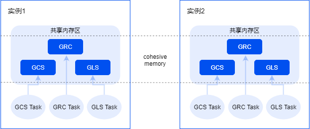
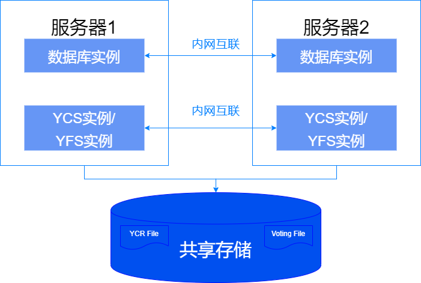

共享集群基于YashanDB内核持续演进，硬件上依赖共享存储实现shared-Disk的架构，同时引入了Cohesive Memory核心技术实现Shared-Cache能力，可在集群数据库多个实例之间协同数据页的读写访问以及各种非数据类资源的并发控制，主要特点包括：

- 共享集群是一个单库多实例的多活数据库系统，用户连接任意实例都可以访问同一个数据库，多个数据库实例可以并发读写同一份数据，且保证实例之间读写的强一致性，具备高可用、高扩展、高性能等特性。
- 共享集群的核心组件主要包括崖山集群内核（YCK，Yashan Cluster Kernel）、崖山集群服务（YCS，Yashan Cluster Service）和崖山文件系统（YFS，Yashan File System）。
- 共享集群支持在线故障自动切换和故障自动恢复，集群实例异常故障不影响剩余存活实例对外提供服务。
- 通过客户端TAF技术，客户端应用可以在故障时自动切换连接到存活的实例，故障对业务透明无感知。

## 崖山集群内核（YCK，Yashan Cluster Kernel）

YCK通过聚合内存（Cohesive Memory）技术，聚合多实例对数据资源和非数据资源的并发访问。

- **GRC**

    GRC（Global Resource Catalog）负责管理全局资源状态信息，例如一个数据块当前持有者是哪个实例、是以读/写哪种模式持有、哪些实例请求正在排队等。GRC相关元数据采用了一致性哈希算法平均分配到所有实例，任一资源的元数据信息在集群内只有一份。由GRC线程组负责处理多实例对全局资源的并发访问控制，并提供排队服务。

- **GCS**

    GCS（Global Cache Service）负责管理数据块类全局资源的调度，GCS在GRC提供的能力基础上实现实例之间数据块请求的完整流程，包括路由请求消息、数据传输以及状态维护等，由GCS线程组提供相应的服务。

- **GLS**

    GLS（Global Lock Service）负责管理非数据块类全局资源的调度，主要是各种类型的锁，GLS在GRC提供的能力基础上实现实例之间申请全局锁的完整流程，由GLS线程组提供相应的服务。

## 崖山集群服务（YCS，Yashan Cluster Service）

YCS负责管理共享集群数据库，包括集群服务器配置管理，集群资源配置管理，启停、监控服务器以及资源，提供查询服务器资源拓扑状态能力，在各种故障时负责投票仲裁并重组集群。

YCS是高可用的关键部件，通过网络心跳和磁盘心跳来确认其他服务器以及服务器上运行的资源是否正常。监控任务感知到资源运行状态异常时，会进行投票仲裁决定允许留在集群中的幸存者列表，并通知所有服务器的所有资源采取必要的重组动作。

共享集群每台服务器上会部署YCS实例（一组为YCS服务的线程称为一个YCS实例）和数据库实例，同一集群中不同服务器上运行的YCS实例和数据库实例完全一样，并通过内网（又称私网）互联。

YCS要求在共享存储上划分系统盘，用于存储[集群注册表](../共享集群基础设施/崖山集群服务.html#YACfiles)（主要存储集群服务配置信息）和[集群投票文件](../共享集群基础设施/崖山集群服务.html#YACfiles)（主要存储集群运行状态），所有服务器上的YCS实例和数据库实例均可读写系统盘。

## 崖山文件系统（YFS，Yashan File System）

YFS是YashanDB的专用并行文件系统，提供存储设备管理、存储高可用、文件系统接口等功能。

在共享集群部署中，必须依赖YFS进行所有文件操作，包括但不限于控制文件、数据文件、日志文件等的增删改操作。

与通用文件系统相比，YFS的差异主要有：

- YFS分配空间的最小单元较大，以确保文件分区表（FAT）信息占用空间较小，并能够常驻内存。此外，YFS采用共享内存技术，以供数据库实例直连访问，从而降低时延。
- 并行文件系统对于元数据修改会在共享集群所有实例上实时同步，所有数据库实例能够访问到一致的目录文件元数据信息。

YFS无独立进程，作为内嵌资源与YCS实例同进程运行，随YCS启动而启动，无需用户干预。

