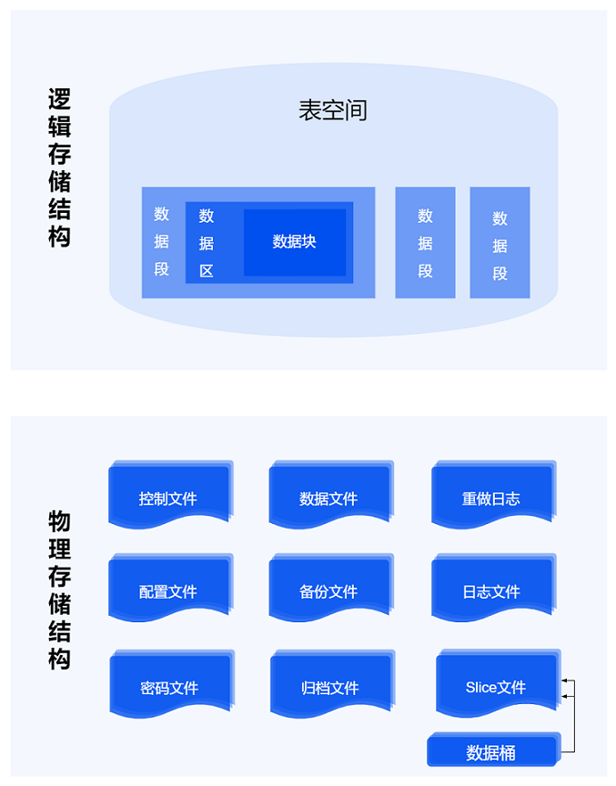
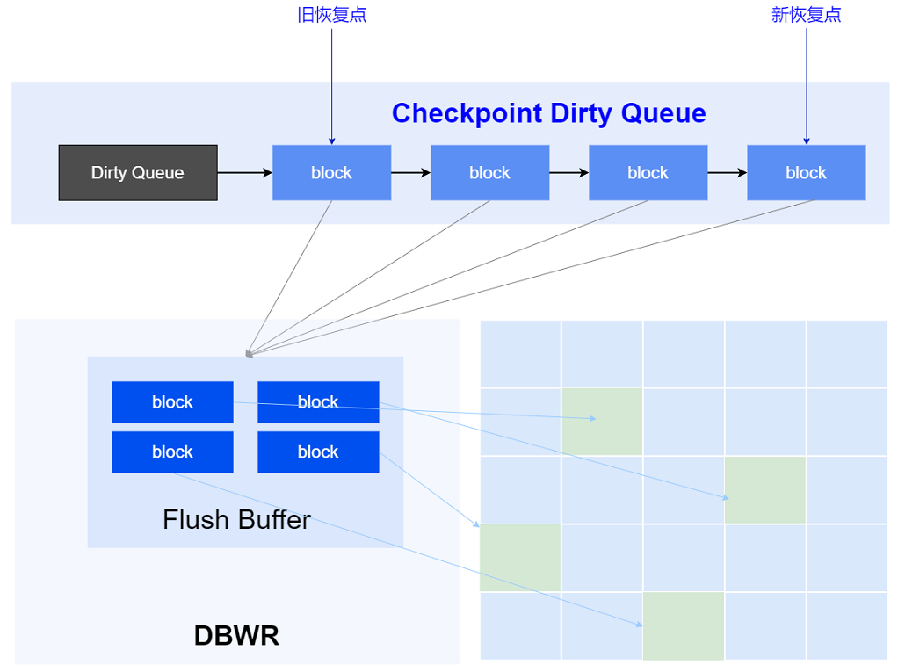
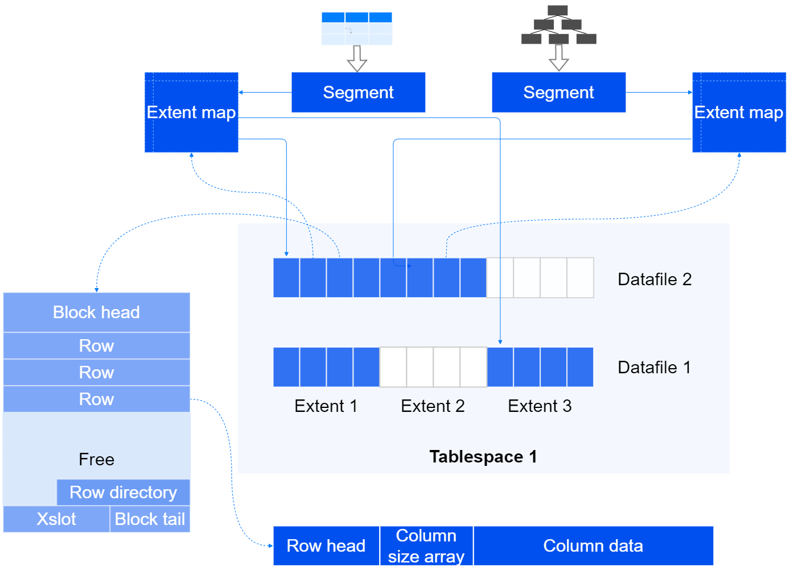
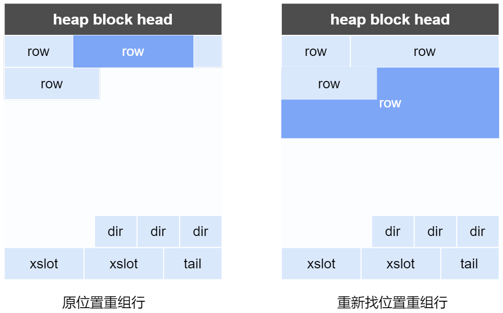
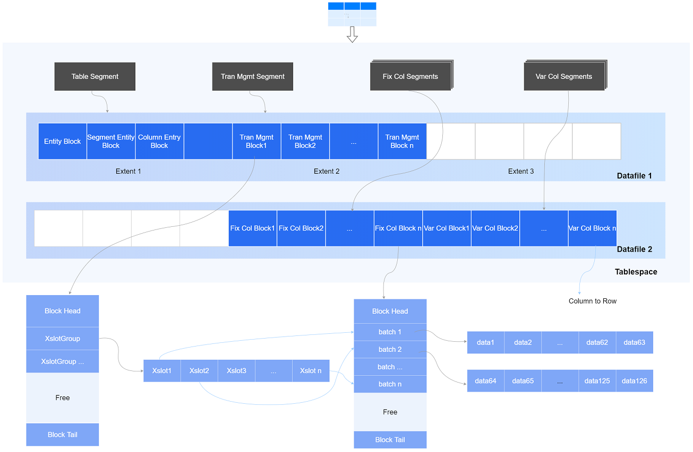
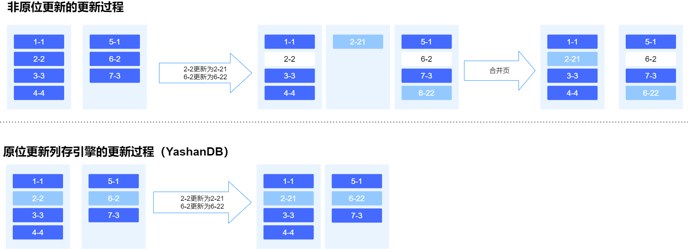
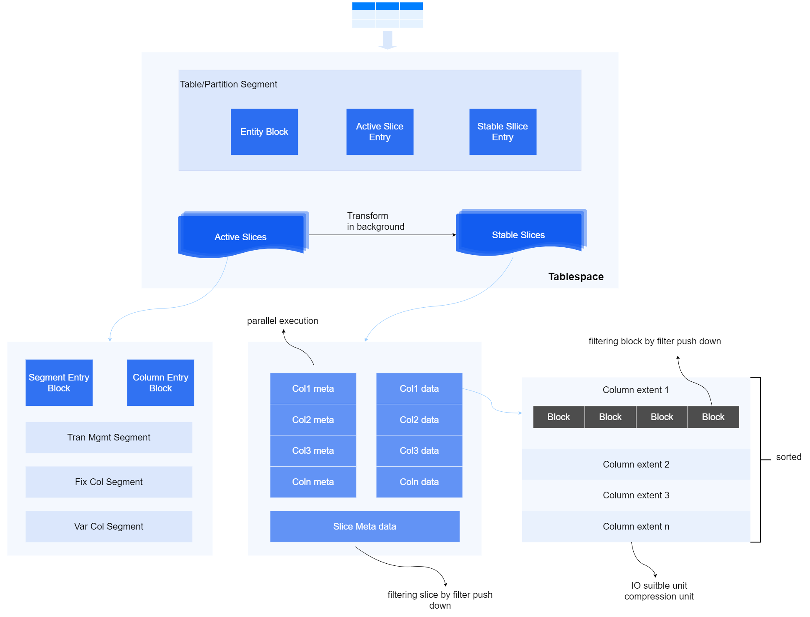
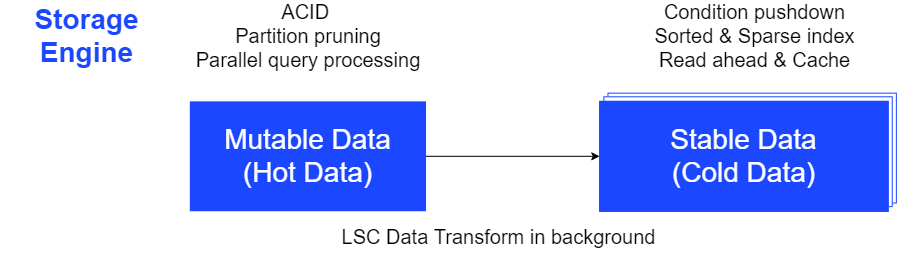

存储引擎是数据库核心部件之一，YashanDB通过不同的存储引擎适应不同的应用场景，以获得面向在线交易场景的高效事务处理能力，面向实时分析场景的事务与分析均衡能力，以及面向海量稳态数据分析场景的高性能。

YashanDB支持的存储结构有：HEAP、BTREE、MCOL和SCOL。

- HEAP：堆式存储，其特点为无序存储，数据写入时随机寻找一个合适的位置进行写入。

- BTREE：B树存储，其特点为一维数据的有序存储，数据写入时按照Key值进行有序写入，以提高查询效率。

- MCOL：可变列式存储（Mutable Columnar Storage），其特点为采用段页式存储，每个列的数据按照数据段集中连续存储，支持原地更新及字典编码。

- SCOL：稳态列式存储（Stable Columnar Storage），其特点为采用切片式存储，数据按行进行切片，每个切片中的列数据集中连续存储，支持压缩和编码。

基于不同的存储结构，YashanDB支持的存储对象类型有行存表，列存表以及BTree索引：

- 行存表：采用HEAP存储结构，主打联机事务处理（On-Line Transaction Processing，OLTP）场景。

- 列存表：

    - TAC Table（Transaction Analytics Columnar Table）：列存表，采用MCOL存储结构，主打在线事务与在线分析处理（Hybrid Transaction and Analytical Process，HTAP）场景。

    - LSC Table（Large-scale Storage Columnar Table）：列存表，采用MCOL以及SCOL存储结构，主打联机分析处理（On-Line Analytical Processing，OLAP）场景。
    
- BTree索引：B树索引，YashanDB支持的默认索引类型。

## 表空间（Tablespace）管理

表空间是可以给表、索引实体对象分配空间的容器。

YashanDB将数据库的存储空间划分为若干表空间，表空间之间互相隔离。每个表空间采用段页式或对象式管理存储空间。

### 段页式管理

段页式表空间的段类型有数据段、索引段、回滚段等不同类型的逻辑段，逻辑段采用数据区和数据块的方式管理空间，使得空间使用更加灵活，管理更加高效，使用率更高。

- **Datafile**

    数据文件，一组数据文件组成一个Tablespace的段页式空间，在Tablespace段页式空间不足时，可以扩展数据文件的大小，或者增加新的数据文件。

- **Segment**

    数据段，数据库中的表、索引等对象实体的数据，都通过Segment来承载。

- **Extent**

    数据区，Segment从Tablespace申请空间时，最小粒度就是一个Extent，一般包括若干个Block。YashanDB使用Extent Map对Segment内的Extent进行管理。

- **Block**

    数据块，数据库的数据是按Block来组织的，数据需要持久化时，Block是最小的磁盘IO单位。通常数据库的Block大小与操作系统的Block大小为倍数关系，YashanDB默认Block大小为8K。

- **事务及MVCC**

    事务是数据库操作的逻辑基本单元，维持了数据库的完整性和一致性，具备ACID特性。YashanDB的所有表对象均实现了事务的ACID以及多版本并发控制（MVCC，Multi-Version Concurrency Control）特性，可以提供事务的完整能力，包括事务的提交和回滚操作，并支持一致性读的多版本控制能力，支持闪回查询等操作。
 
- **持久化**

    持久化即将段页式逻辑结构的内存数据按物理结构落盘，永久化保存。

    

    - **redo**

        在数据库中对数据的修改都必须记录redo重做日志，用于故障恢复，主备复制等，YashanDB采用WAL（Write Ahead Log）机制，对数据修改操作先记录redo，批量落盘，以减少直接将数据落盘对IO性能的影响。

    - **Checkpoint**

        内存中修改的数据不会直接落盘，而是由YashanDB的Checkpoint机制来完成，这些数据基于redo记录的顺序被加入到队列中，当Checkpoint被触发时，写进程将执行读取数据并插入到数据文件中，同时更新队列和释放redo空间。

        

        系统采取多线程写、IO合并、IO排序等优化方式提升落盘效率。同时，YashanDB引入双写机制，避免在服务器掉电等意外场景下可能出现的半写问题，严格保证数据完整性。

### 对象式管理

对象式表空间的对象类型有切片元数据对象、列式数据对象等，对象采用物理文件的方式进行管理，一个对象写入一个文件，使得数据在磁盘上连续存储，有着高效的读取性能，且对压缩编码友好。

SCOL格式的数据将以切片（Slice）文件的形式持久化存储到对应的数据桶（DataBucket）中，Databucket数据桶是一组数据文件目录组成一个Tablespace的对象式空间，支持指定本地磁盘或云端存储。

## 存储结构

### HEAP存储结构

HEAP存储以无序的方式进行组织和存储数据。用户增/删/改/查操作的记录，按数据行（Row）格式组织和存储。Row格式中描述每个列字段的长度，支撑包含变长列（VARCHAR、LOB等）字段的数据行存储，每个数据行按照列声明的顺序进行顺序存储。

堆式存储维护一个空闲空间管理结构，当需要写入数据时，堆式存储将在空间中快速找到一个合适的位置进行写入。由于不需要维护数据有序，写入是一个高效的过程，适用于行表的高速插入。

在update某一个行式变长列字段时，系统采取如下几种不同的存储方式：

- in-place update

    字段长度在更新或者长度未发生变化，可以直接原地进行数据替换。undo中只记录被修改部分列修改前的值。

    

    列字段长度在更新后变小时，将行变短，在原位置重组行；变大时，将行变长，页面free空间足够时在本页面重组行。

    

- 行迁移与行链接

    字段长度在更新后变大时，将行变长，且页面free空间不足够在本页面重组行，此时该行数据将被完整迁移到其他的页面。当变长的行超过了整个页面能容纳的大小时，该行数据将被拆分到多个页面存储，且多个页面通过链接以标识一个行。

    

- PCT Free

    页面需要保留的空闲空间比例，即页面插入数据后，空闲空间大小不能小于这个值。PCT Free的设置是为了减少行迁移的产生，而行迁移会影响数据扫描以及更新删除的效率。

### BTREE存储结构

BTREE是一种多叉平衡查找树，是按键值有序存储的架构。BTREE存储结构采用B-Link Tree，树的节点以块为单位，定义树的最底层为0层，0层的块称为叶子块（leaf block），层级大于0的块称为分支块（branch block），树的最顶层只有一个块，称为根块（root block，是一个特殊的branch block）。

BTREE存储结构用于存储BTree索引，BTree索引在单个Block中存储的索引行是有序的，不同Block之间仍是有序的，保证了整个BTree索引是有序的。

### MCOL存储结构

可变列式存储区采用可变列式存储（MCOL，Mutable Columnar Storage）的存储格式进行存储。MCOL是一种基于段页式管理的列式存储结构，以支持实时业务，其最小访问数据单元为Block。

可变列式存储格式由元数据管理段（Meta Management Segment）、事务管理段（Transaction Management Segment）、定长数据段（Fix Col Segment）以及变长数据段（Var Col Segment）等多个数据段组成：

- Batch：可变列式存储按列格式来组织，每个列的一批记录组成一个Batch，作为数据读取的基本单位。

- Meta Management Segment：元数据管理段，记录可变列式存储区的总入口信息及其它元数据信息。

    - Entry Block：入口Block，记录可变列式存储区的相关统计信息、Slice的空闲位图及辅助信息。

    - Segment Entry Block：记录表按列逻辑分割后的所有Segment信息。

    - Column Entry Block：记录所有列的元数据信息。

- Transaction Management Segment：事务管理段，管理可变存储区中的事务信息，最小的事务单位为Xslot。通过Xslot管理各Fix Col Block和Var Col Block上执行的事务，保证数据写入的事务一致性。

- Fix Col Segment：每一个定长列独立划分为一个Segment，内部包含若干Block。

- Var Col Segment：每一个变长列独立划分为一组Segment，由元数据Segment和数据Segment组成。元数据部分存储在定长组织的逻辑上连续存储的数据段上，而数据部分则存储在堆式存储的数据段上。

MCOL中，列被细分为一个或多个数据段，每个列的数据集中连续存储并实现原地更新（in-place update）。相对于HEAP存储结构的全表查询，MCOL既提升了投影操作的查询速度，又实现了快速原地更新。

**in-place update**

传统的分析型数据库采用列式存储时，插入和更新操作都是在末端插入一个新值并标记被替代的数据。而MCOL则实现了原位更新（in-place update），避免了在存储区域产生“墓碑”，避免了空间膨胀与垃圾扫描，有效地提升了存储和检索数据的效率。

**列式变长列存储**：MCOL对变长字段（例如LOB、VARCHAR等）的存储采用列式存储或行列结合技术，每列单独拥有一个或多个Segment。

- 当变长字段较短时，采用纯列式存储方式。

- 当变长字段较长时，采用行号和数据结合的方式进行存储，包含一个元数据Segment用于存储行号和一个Heap Segment用于实际数据的存储。每列每一行数据采用一个Row存储，如下所示：

    

变长字段的数据如果用到了HEAP存储，则沿用[HEAP存储结构](#HEAP)，实现对列式数据的高效删改，同时，通过RowId逻辑映射结构实现行列对应和Batch分批事务处理，保持列式数据的批量增查优势。

### SCOL存储结构

稳态列式存储区采用稳态列式存储（SCOL，Stable Columnar Storage）的存储格式进行存储。SCOL是一种基于对象式管理的列式存储结构，以支持海量数据的存储。

SCOL中，每个列分成若干个对象，每个对象以文件的形式连续存储于磁盘目录中，通过预加载或实时加载的方式缓存到内存Cache中。不同对象之间根据数据类型的差异，支持选择最优的压缩以及编码方式，以节省存储空间和提高访问速度。

- Table/Partion Segment：记录表的总体入口信息。

    - Entry Block：入口Block，记录表数据的切片分布情况、统计信息及辅助信息。

    - Active Slice Entry：记录活跃切片元数据信息。

    - Stable Slice Entry：记录稳态切片元数据信息。

- Active Slice：记录活跃切片的信息，当某个活跃切片中数据量达到阈值后将自动转为稳态切片。

    - Segment Entry Block：记录切片内按列逻辑分割后的所有Segment信息。

    - Column Entry Block：记录所有列的元数据信息。

    - Tran Mgmt Segment：事务管理段，通过Segment中的Xslot管理各Fix Col Block和Var Col Block上执行的事务，保证数据写入的事务一致性。

    - Fix Col Segment：每一个定长列独立划分为一个Segment，内部包含若干Block。

    - Var Col Segment：针对变长列，将进行列转行进行存储，支撑变长列的事务处理能力。

- Stable Slice：记录稳态切片信息。稳态切片对数据进行了压缩编码存储，以提高数据存储和访问效率，并支持合并操作。

SCOL格式数据相比于MCOL数据，具备更优秀的查询性能，通过配置MCOL TTL可以配置可变数据保留时间，配置较小的MCOL TTL可使数据尽快转为稳态数据，提升查询性能。

MCOL格式数据在通过后台转换任务（Transform in background）压缩后会转换为SCOL格式，后台转换任务对业务层的查询请求透明，查询请求获取到的MCOL格式数据和SCOL格式数据会先合并再呈现给用户，并满足事务要求。后台转换任务支持分批次进行活跃/稳态切片自动转换，数据增量写入时以活跃切片形式进行数据存储，当达到一定条件后通过后台转换任务分批转换为稳态切片存储。

## 存储对象

### 行存表

行存表采用[HEAP存储结构](#HEAP)，数据以Row的格式进行组织并存储于HEAP存储区。每个数据行中的数据均以变长形式存储，Row格式里面每列数据按照“数据长度 + 实际数据”的形式组织排布。

### 列存表

#### TAC表

TAC表采用[MCOL存储结构](#MCOL)，以支持实时业务。

#### LSC表

LSC表数据以切片形式（Slices）进行组织，其切片分为活跃切片（Active Slices）和稳态切片（Stable Slices）。

在典型的联机分析处理OLAP应用中，数据在刚写入后的一段时间内是不稳定的，需要对其进行一定程度的更新/删除，例如勘误或校对数据、剔除噪点等数据清洗操作。过了这段时间后，数据不再需要进行更新，进入一个相对稳定的状态，用于业务模型分析、商业智能等分析工作。在YashanDB概念体系文档中，为方便读者更好地理解，我们将需要频繁更新/删除的数据称为“热数据”，将无需频繁更新/删除的相对稳定的数据称为“冷数据”。

LSC表会根据用户输入自动判断数据的冷热，默认使用活跃切片存储热数据、稳态切片存储冷数据（在后续的描述中均使用默认存储方式）。用户也可以根据实际需求进行自定义调整，例如冷热数据均采用稳态切片存储，但可能会对性能产生一定的影响。

- **活跃切片（Active Slices）**

    数据采用[MCOL架构](#MCOL)，对热数据存储友好。对更新删除操作更友好，可用于支持增量写入（实时）业务。

    活跃切片并非缓存，其数据是持久化的，数据写入活跃切片后即受数据库持久化机制保护，保障数据安全。

    

- **稳态切片（Stable Slices）**

    数据采用[SCOL架构](#SCOL)，对冷数据存储友好。数据进行了编码、压缩等处理，并支持数据排序及稀疏索引过滤，条件下推过滤等过滤方式，可支持海量数据的高性能查询。

    稳态切片采用标记删除的方式支持修改操作，当稳态切片修改达到一定程度时，自动触发后台的清理和合并操作。全部数据都被标记删除的切片会被自动清理以释放磁盘空间，而只有少量有效数据的若干个切片会被合并成一个切片以提高数据的访问和存储效率。

访问LSC表数据时，根据Entry Block查询到表数据组织情况，再通过对应的Slices进行下一级数据扫描。

###  BTree索引

数据库可以通过创建索引加速数据访问，索引是一种与表关联的数据结构。在表上创建合适的索引，可以减少需要访问的行数以及I/O，从而极大的提升业务性能。

BTree索引是数据库中最常见的、应用最广泛的索引（通常而言，索引就是指B树索引），也是YashanDB数据库默认的索引类型，采用[BTREE存储结构](#BTREE)。
