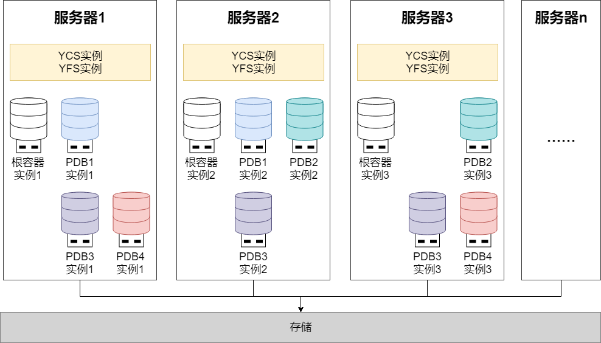

YashanDB支持在单机部署、共享/分布式集群部署以及其各自的高可用部署模式中，部署构建多租户环境。

## 单机（主备）部署多租户

在单机（主备）部署中搭建多租户环境，通常是在多台服务器上分别运行1个主CDB+1个或多个备CDB，通过主备复制实现数据同步。

在对高可用要求较低的场景中，可以只使用一台服务器部署运行一个单CDB。

此部署方案具备以下优势：

- 架构简单：部署方式直观，配置管理相对简单。

- 成本可控：硬件投入和运维成本较低，适合资源有限的场景。

- 高可用选择灵活：可根据业务需要灵活配置备CDB的数量。

## 共享/分布式集群部署多租户

在共享/分布式集群部署中搭建多租户环境，通常是每个集群内会在多台服务器上分别运行多个多活实例。多个实例可并发读写同一份数据，保证实例间读写的强一致性，具备高可用、高扩展、高性能等特性。

集群中每台服务器上会运行1个YCS实例、1个YFS实例、1个根容器实例和若干PDB的实例，每个PDB可以在每台服务器上启动0 - 1个实例。每个根容器实例都能独立管理其下属的PDB实例，同一服务器上的根容器实例和所有PDB实例共用同一个YCS和YFS实例。

同一PDB在不同服务器上启动的PDB实例可以对等访问，不同PDB之间保持完全隔离，确保租户间的安全性和独立性。

此部署方案具备以下优势与特点：

- 集群内部PDB实例管理：可根据服务器资源状况、不同租户的高可用要求以及负载水平，灵活管控每个服务器上运行的PDB实例数量。例如采用交叉运行方式将多个PDB实例相对均衡地分布在不同服务器上，避免单点资源紧张，提升资源优化配置和负载均衡效果。

- 多实例并发访问：同一PDB可在多台服务器上同时启动实例，实现对等访问，负载可以自动分发到不同实例。

- 多级高可用：结合集群内部的多活高可用和主备集群高可用，实现更高级别的容灾能力。

- 高性能：多实例并发读写，充分利用集群资源，提供卓越的性能表现。
