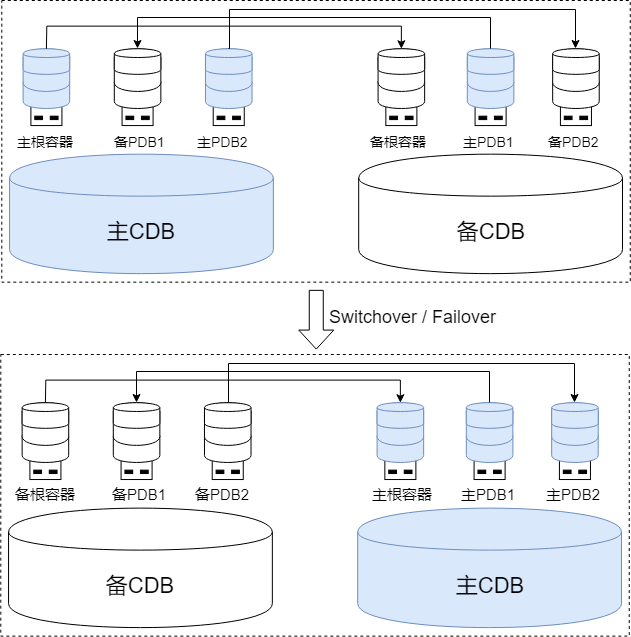
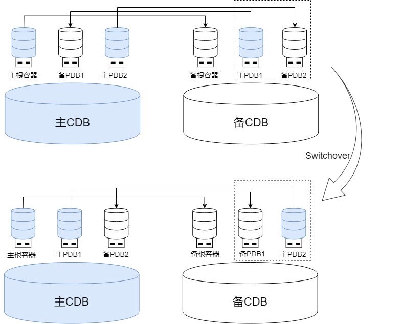

采用主备高可用部署（例如单机主备部署、主备集群部署）的多租户环境能够实现整个CDB的高可用，同时也能实现单个租户（PDB）的独立高可用。

## 主备CDB架构

在单机主备部署、主备集群部署中，主根容器对应的CDB被定义为主CDB，备根容器对应的CDB被定义为备CDB，系统由一个主CDB和若干个备CDB组成。

### 元数据管理

PDB的创建和删除操作只能在主根容器中执行，且会自动同步至备根容器确保主备根容器间的元数据一致性。PDB的其他日常运维操作，例如PDB启停，则在主备根容器中均可执行。

### 主备角色管理

通过主备CDB的交叉PDB部署架构，能够动态平衡负载压力，有效提升整体资源利用率和系统性能。PDB的主备角色不受根容器的角色约束，主根容器所在节点中可以包含备PDB、备根容器所在节点中中也可以包含主PDB。PDB可以进行独立的主备切换，实现对租户级别的灵活容灾和负载管理。

新创建的PDB默认跟随根容器的主备角色，后续通过PDB级别的主备切换可以自由转换主备PDB的分布。

PDB可以进行独立的主备切换，但对整个CDB进行主备切换时会一并切换PDB的角色：

- 整个CDB进行计划内切换：根容器和所有PDB的角色都会转换。

- 整个CDB进行故障切换：备根容器升主后，其上所有PDB的角色都转换为主。

PDB间的主备角色切换互不干扰，可按需配置差异化的自动选主策略，也可按需进行手动切换：

- 自动选主策略：每个PDB可自定义配置个性化的主备切换策略，实现业务级别的灵活容灾。

- 手动主备切换：

    - 全局运维：通过根容器定向操作指定单个或多个PDB进行主备切换。

    - 本地运维：直接连接目标PDB执行主备切换。

## 租户级主备高可用

### PDB主备规模

在CDB的主备规模内，每个PDB可以独立选择其主备规模，例如CDB为一主二备部署，PDB可以灵活地选择单库、一主一备、一主二备或一主一备一级联备部署方案。

### PDB主备复制

PDB间的主备复制链路虽依赖于主备根容器间的连接配置，但不同主备PDB间的日志传输相互独立。可按需配置差异化的高可用策略：

- 保护模式：每个PDB可独立选择适合的保护模式，满足不同业务场景的可靠性要求。

- 多样化主备复制方式：支持物理复制和逻辑复制，用户可根据具体业务需求进行独立选择与配置。
