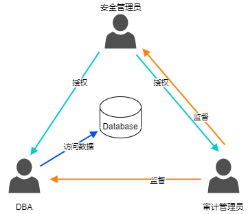

## 基于角色
YashanDB采用基于角色的访问控制（RBAC），限制授权用户对系统的访问。

角色包含权限集，通过角色能有效权限管理，管理员对用户只需关注其角色，对角色只需关注其权限集。

**三权分立**

数据库在运行过程中需要持续的运维和管理，理论上使用sys用户可以执行所有的管理操作，但会产生非常大的安全风险：

- sys为YashanDB的超级管理员账号，拥有完全的权限，可以执行对数据库执行所有的操作，可能存在因误操作导致严重故障的风险。

- 使用sys账号所执行的操作在日志或记录表中均标记为sys，无法追踪回溯到实际的执行者。

- 若将sys账号应用于数据库的日常管理中，使用频度过高，很容易成为黑客窃取口令的目标，一旦窃取成功，将使整个数据库系统被暴露，造成严重后果。

因此，在产品安装完成，系统管理员接手对数据库的管理工作后，建议首先创建数据库的管理员账号，依据管理职责授予其对应的管理权限，使用管理员账号进行后续管理和运维操作。

在计算机信息系统的等保要求（3级及以上标准）中提出数据库系统必须要采用“三权分立”的权限体系，如下图所示：

三权分立是对数据库管理权限的划分，让各类管理员能够独立行使权力又相互制约，可以有效避免管理权限过于集中的风险。

在YashanDB中，三权分立通过ENABLE_SEPARATE_DUTY配置参数，用户可根据安全需求选择是否启用三权分立。

若开启三权分立，内置三权用户及权限如下：

| 管理员角色 | 用户 | 权限说明 |
|--------------------|----------------|----------------------|
| 系统管理员 | 内置：SYS 自定义：在开启三权分立前被授予DBA角色的用户 | ALTER DATABASE ALTER SYSTEM CREATE/ALTER SESSION CREATE/ALTER/DROP USER CREATE/ALTER/DROP (ANY) ROLE CREATE/ALTER/DROP/UNLIMITED TABLESPACE CREATE TABLE CREATE TYPE  CREATE/ALTER/DROP DATABASE LINK CREATE/ALTER/DROP PUBLIC DATABASE LINK CREATE LIBRARY CREATE SEQUENCE CREATE SYNONYM CREATE VIEW CREATE PROCEDURE CREATE TRIGGER CREATE JOB CREATE/ALTER/DROP ANY OUTLINE CREATE/ALTER/DROP PROFILE CREATE/ALTER/DROP ANY MATERIALIZED VIEW CREATE/DROP ANY DIRECTORY CREATE/DROP ANY CONTEXT ANALYZE ANY YSTREAM_CAPTURE FILE SELECT FROM SYS.OBJECT |
| 安全管理员 | 内置：SECURITOR 自定义：在开启三权分立前被授予SECURITY_ADMIN角色的用户 | CREATE SESSION GRANT ANY PRIVILEGE/OBJECT PRIVILEGE/ROLE SELECT ON SYS.USERAUTH$（查看权限系统表） ALL PRIVILEGES ON SYS.ANON_POLICY$（数据动态脱敏策略） ADMINISTER KEY MANAGEMENT LBAC_DBA角色（行访问控制相关权限） SELECT_CATALOG_ROLE角色 |
| 审计管理员 | 内置：AUDITOR 自定义：在开启三权分立前被授予AUDIT_ADMIN角色的用户 | CREATE SESSION AUDIT SYSTEM SELECT_CATALOG_ROLE角色 |

## 基于标签

YashanDB提供了基于标签的访问控制（LBAC，Label-Based Access Control），可以实现行级的强访问控制，精准控制用户对表中各行数据的读写权限，保证数据读写安全。

LBAC是强访问控制的一种方式，通过向表应用标签策略自动在目标表中新增一列记录每行数据的标签（Label），以行为颗粒度对数据进行分级和分类，再为用户分配不同的标签限制其对数据的访问权限。策略与表的应用（关联）关系允许多对多，策略应用后立即生效。

- 标签策略（Label Policy）：用于定义标签的格式与验证规则，通过应用策略将标签与表、用户建立关联关系。

- 标签：由等级（Level）和范围（Compartment）组成，通常表示为`等级1,等级2…:范围1,范围2…`。
    - 等级：用于定义受保护数据的敏感度等级，数值越大表示敏感度越高，例如使用10表示“公共”、20表示“机密”。

    - 范围：用于对受保护数据进行分类，例如使用1表示“员工信息”、2表示“客户信息”。

当用户尝试访问受保护数据时，该用户的安全标签将与受保护数据的标签进行比较：

- 对于读访问（SELECT）：用户只允许查询被LBAC授权可读的行，须同时满足以下要求：

    - 用户的最大读标签中的等级值（DBA_SA_USER_LABELS视图中的MAX_READ_LABEL所对应的等级值） ≥ 目标数据行标签中的等级值

    - 用户标签中的范围集包含目标数据标签中的所有范围

- 对于写访问（INSERT、UPDATE、DELETE）：用户只允许修改、删除或插入被LBAC授权可写的行，须同时满足以下要求：

    - 用户的最小写标签中的等级值（DBA_SA_USER_LABELS视图中的MIN_WRITE_LABEL所对应的等级值） ≥ 目标数据行标签中的等级值    
    
    - 用户标签中的范围集包含目标数据标签中的所有可写范围

