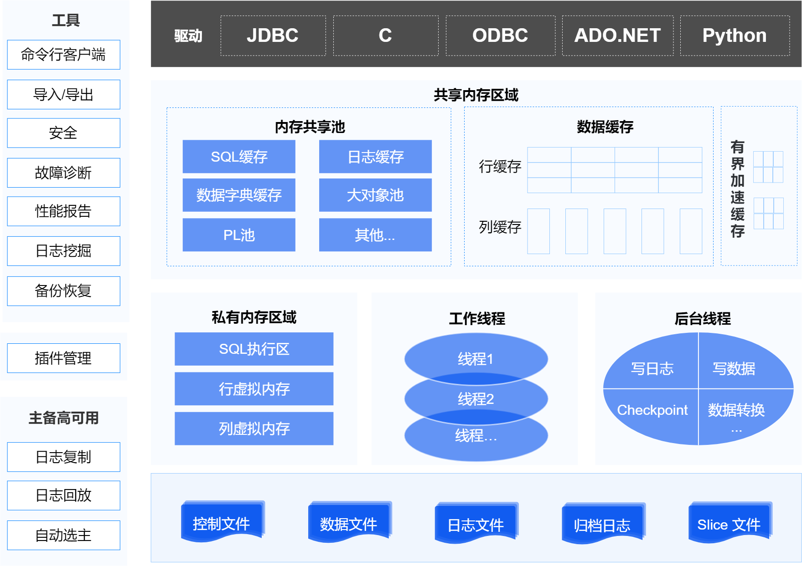
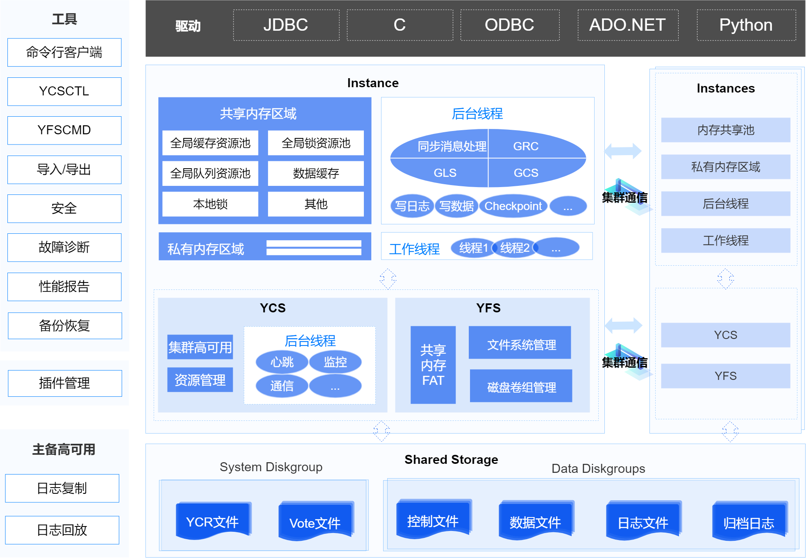
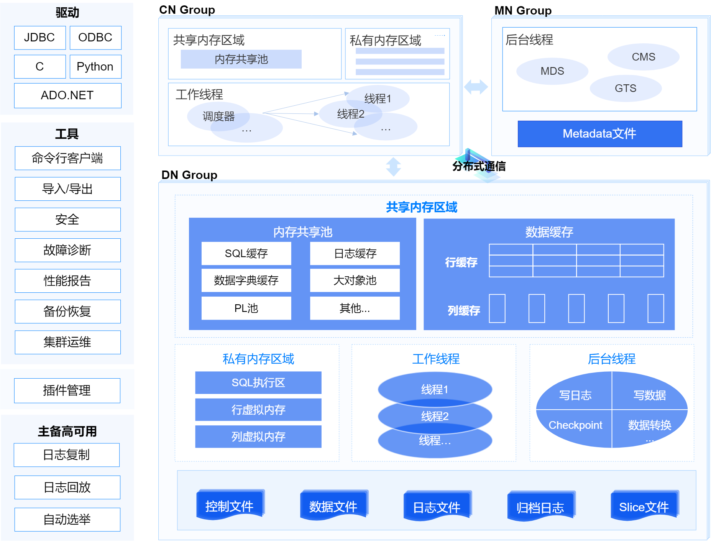

数据库是物理概念，是指在磁盘上存放的各类持久化数据文件的集合。

数据库实例只在运行态存在，包括一组线程和内存空间，YashanDB采取多线程架构，内存空间由共享内存区域和私有内存区域两部分组成。每个正在运行的数据库至少与一个数据库实例相关联。

## 单机部署

## 共享集群部署

## 存算一体分布式集群部署

## 主要模块介绍

**数据库客户端**

一般是指客户基于YashanDB驱动开发的应用程序或YashanDB提供的客户端工具。

- 驱动：应用程序和数据库存储之间的接口，每一个驱动实现某一种开发语言对数据库各类操作指令的调用。

- 工具：一类软件应用程序或工具集，旨在帮助数据库管理员（DBA）和开发人员管理和维护数据库系统。

**插件管理**

插件管理是YashanDB提供的一个开发框架，用于与第三方合作开发插件，以拓展更加丰富的功能。

**单机数据库服务端**

包括数据库实例和一系列持久化文件。

数据库实例只在运行态存在，包括一组线程和内存空间，YashanDB采取多线程架构，内存空间则由共享内存区域和私有内存区域两部分组成。

**共享集群数据库服务端**

包含数据库实例、集群服务组件和共享存储管理的持久化文件。

YashanDB共享集群是一种单库多实例的多活集群，基于Shared-Disk的架构，各组件描述如下：

- Instance：多个服务器上的数据库实例采用聚合内存技术，通过全局资源管理、全局缓存管理以及全局锁管理协同多实例对数据页和非数据类资源的访问，对外提供对等的、强一致的并发读写能力。

- YCS：集群数据库高可用的核心部件，统一管理集群文件系统、数据库等资源，提供配置、启停、监控等能力，并在各种故障场景下提供仲裁服务，维护全局统一的拓扑状态。

- YFS：承担集群文件系统管理职责，直接管理裸设备，并提供强一致的文件系统服务给数据库使用。

**存算一体分布式数据库服务端**

包括分布式服务组件、节点上的数据库实例和一系列持久化文件。

YashanDB存算一体分布式集群部署采用了Shared-Nothing的架构，各服务组件描述如下：

- MN Group：MN负责集群的节点管理、元数据管理和分布式事务管理。MN组内节点具有主备关系，通过Raft协议实现节点间的一致性。

- CN Group：CN负责对外提供接口，接收用户请求，生成分布式查询计划，向DN分发查询计划并汇总执行结果。CN节点采用多活部署，多个CN节点同时提供服务，且支持负载均衡。当某个节点出现异常时，其他节点仍可用，对系统整体不构成影响。

- DN Group：DN负责存储数据，执行CN下发的查询计划。通过DN组提供高可用能力，组内节点具有主备关系，通过Raft协议实现节点间的数据一致性。

- PN Group：PN负责中间计算，隔离了存储与计算节点。该特性为实验室特性，不建议在生产环境中使用。

**持久化文件**

数据库的持久化文件，确保在掉电等异常关闭场景中数据库仍能启动并正常使用，主要包括：

- 控制文件：数据库最关键入口信息，保存数据库基础元数据以及持久化相关信息。

- 数据文件：保存所有系统表、用户表（HEAP表/TAC表/LSC表）以及undo等数据。

- 切片文件：保存LSC表的冷数据。

- redo重做日志文件：保存redo日志，在recovery场景中用于修复脏页，在主备场景中用于向备库复制。

- 归档日志文件：保存归档的redo日志，在recovery场景中用于结合数据库的备份文件将数据库恢复到特定时间点。

- 集群配置数据：保存共享集群的管理配置信息，例如节点、资源等。

- 集群运行期数据：记录共享集群运行过程中的相关信息，尤其是在投票时记录相关过程数据。

**内存区域**

详情请查阅[内存体系](内存体系)。

**进程与线程**

详情请查阅[进程线程体系](进程线程体系)。
