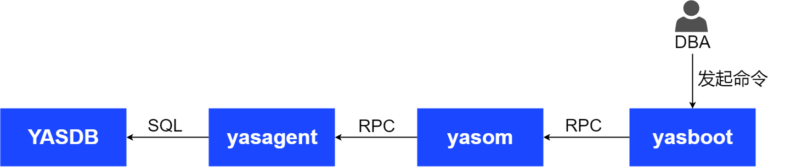

YashanDB采用多线程架构，充分利用多核处理器的计算能力，提高系统的并发性和响应性。在多线程架构中，由一个主线程负责程序的初始化和协调工作，然后创建多个子线程来执行具体的任务。每个线程可以独立地执行特定的代码块，但它们共享进程的资源和内存空间。

根据部署形态以及分工不同，YashanDB的进程可以分为以下几类：

- 服务端核心进程

- 共享集群进程

- 分布式进程

- yasboot进程

## 服务端核心进程（YASDB）

YashanDB实例启动后，创建YASDB进程处理连接到数据库实例的客户端进程的请求。YASDB进程主要包含后台线程以及处理客户请求的工作线程。

### 常驻后台线程

- 主线程（yasdb）

   主线程的主要功能是在数据库启动时启动各个模块，以及处理shutdown、主备切换等操作。在数据库运行过程中，主线程也负责清理一些已经结束的线程资源。

- TCP监听线程（TCP_LSNR）

   TCP监听线程的主要功能是监听指定的TCP端口，处理客户端的连接请求并创建出会话。该线程在数据库启动到NOMOUNT阶段时启动，生命周期与数据库实例一致。

- UDP监听线程（UDP_LSNR）

   UDP监听线程的主要功能是监听指定的UDP端口，以及处理客户端的连接请求。该线程在数据库启动到NOMOUNT阶段时启动，生命周期与数据库实例一致。

- 监听日志线程（LISTENER_LOG）

   LISTENER_LOG线程的主要功能是用于监听日志的异步刷盘。该线程在数据库启动到NOMOUNT阶段时启动，生命周期与数据库实例一致。

   TCP/UDP监听线程在处理连接请求时，产生的登录成功或失败的文本日志，称为监听日志。

- 逻辑时钟线程（TIMER）

   TIMER线程的主要功能是管理和更新逻辑时钟，精度为1ms。该线程在数据库启动到NOMOUNT阶段时启动，生命周期与数据库实例一致。

- 系统监控线程（SMON）

   SMON线程在数据库启动到NOMOUNT阶段时启动，生命周期与数据库一致。主要功能如下：

   - 死锁检测

   - undo定时均衡

   - 异常退出事务后台回滚

   - 后台undo与事务区自动扩展

   - 后台统计信息刷新

- 回滚线程（ROLLBACK）

   ROLLBACK线程的主要功能是在数据库重启后回滚残留事务，该线程在主实例启动到OPEN阶段时启动，回滚任务结束后退出。该线程只在主实例上启动，为了提高处理能力，可以设置启动为一组线程，线程数通过STARTUP_ROLLBACK_PARALLELISM参数配置，默认为2个。

- 检查点任务调度线程（CKPT）

   CKPT线程的主要功能是调度全量和增量checkpoint的任务。该线程在数据库启动到NOMOUNT阶段时启动，生命周期与数据库实例一致。

- 数据库写盘线程（DBWR）

   DBWR线程的主要功能是将脏数据块（Dirty Blocks）从数据库缓存区写回到磁盘上的数据文件。该线程在数据库启动到NOMOUNT阶段时启动，生命周期与数据库实例一致。DBWR数量默认为2个，最多为16个，线程数通过DBWR_COUNT参数配置。具体功能如下：

   - 脏数据块刷新：DBWR线程定期或在特定条件下将脏数据块刷新到磁盘上的数据文件。

   - 数据写回策略：DBWR线程根据一些策略来决定哪些脏数据块需要被写回磁盘。

   - 写回优化：DBWR线程会尽量合并多个数据块的写回操作，以减少磁盘I/O操作的次数，提高写入性能。

   - 检查点处理：DBWR线程在检查点（Checkpoint）发生时，会将所有脏数据块写回到磁盘，以确保数据库的一致性。

- redo日志发送线程（RD_SEND）

   RD_SEND线程的主要功能是将主库的redo日志传输给备库。该线程只在主实例启动到MOUNT阶段时启动，shutdown或主库降备后关闭。

- redo刷盘线程（LOGW）

   LOGW线程的主要功能是基于一定的策略（定期或redo数量达到阈值），将内存中的redo日志刷盘到redo日志文件。该线程只在主实例启动到OPEN阶段时启动，生命周期与数据库实例一致。

- JOB的调度线程（DBMS_SCHEDULER）

   DBMS_SCHEDULER线程的主要功能是调度JOB任务以及触发定时任务，该线程只在主实例启动到OPEN阶段时启动，生命周期与数据库实例一致。

- JOB的执行线程（JOB_QUEUE）

   JOB_QUEUE线程的主要功能是执行JOB任务，当有JOB任务启动时，由DBMS_SCHEDULER线程负责创建该线程，并在该线程上执行相关任务，任务执行结束后该线程退出。

- 性能报告快照自动管理线程（MMON）

   MMON线程的主要功能是创建和清理性能报告快照，该线程只在主实例启动到NOMOUNT阶段时启动，生命周期与数据库实例一致。

- 热块回收线程（HOT_CACHE_RECYC）

   HOT_CACHE_RECYC线程的主要功能是用于处理热块回收（Hot Block Recycle）的相关任务。该线程只在主实例启动到OPEN阶段时启动，主库降备或实例退出时退出。
   
   热块回收是YashanDB数据库中的一项性能优化技术，旨在减少缓冲区高频访问的块（也称为热块）在内存中的停留时间，以便为其他需要访问的块腾出空间。当一个块被频繁访问时，它会被标记为热块，并在缓冲池中保持较长时间，热块较多可能会导致其他块在缓冲池中的可用空间变小，从而降低整体的数据库性能。HOT_CACHE_RECYC线程负责将热块释放回空闲空间以供其他块使用，提高缓冲区的利用率。

- 冷数据表扫描预读线程（PRELOADER）

   PRELOADER线程的主要功能是对冷数据的访问进行预读，线程数通过SCOL_DATA_PRELOADERS参数配置，默认为2个。该线程在数据库启动到NOMOUNT阶段时启动，生命周期与数据库实例一致。

- 后台转换任务调度线程（XFMR）

   XFMR线程的主要功能是调度LSC后台转换任务，后台任务包括：冷热数据转换，冷数据compact，冷数据compact任务发现。该线程主要用于管理后台任务调度顺序，优先级，控制后台任务数量。XFMR线程只在主库上启动，在数据库启动到OPEN阶段时启动，主库降备或实例退出时退出。

- SLICES文件同步线程（SCF_SENDER）

   SCF_SENDER线程的主要功能是将主实例生成的slice文件发往备实例。

- 预加载内存文件线程（MMS_PRELOAD）

   MMS_PRELOAD线程的主要功能是预加载MMS表空间的BIT MAP页，提高数据访问的性能。该线程在数据库启动到NOMOUNT阶段时启动，在预加载任务结束后退出，线程数通过MMS_DATA_LOADERS参数配置。

- BUFFER_POOL辅助线程（BUFFER_POOL）

   BUFFER_POOL线程是buffer pool的后台辅助线程，职责包括buffer pool内部资源均衡、block异步访问请求处理等。该线程在数据库启动到NOMOUNT阶段时启动，生命周期与数据库实例一致。每个实例有且仅有一个该线程。

- LSC后台转换任务执行线程（XFMR_WORKER）

   XFMR_WORKER线程主要负责LSC后台转换任务执行，该线程池中的线程（XFMR_WORKER_x）执行XFMR调度线程调度到的任务，线程数通过DATA_TRANSFORMER_MAX_WORKERS参数配置。在主实例启动到OPEN阶段时启动，长时间无后台任务、主库降备或实例退出时线程退出。

- 共享模式会话工作线程（SESS_WORKER）

   SESS_WORKER_x是共享模式下会话业务的执行调度线程。线程数通过MAX_WORKERS参数配置，默认数量为当前服务器CPU核数的两倍。线程在会话登录时创建，生命周期与数据库实例一致。

- 专用模式会话工作线程（WORKER）

   WORKER线程是专用模式下会话业务的执行调度线程。线程数等于当前的连接数，线程在会话登录时创建，会话退出时销毁。

- 并行执行任务线程（PARAL_WORKER）

   PARAL_WORKER_x主要负责并行执行任务。线程数通过MAX_PARALLEL_WORKERS参数配置，线程在并行执行线程不足时启动，生命周期与数据库实例一致。

- 高精度定时器线程（SCHD_TIMER）

   SCHD_TIMER线程是YashanDB的高精度定时器线程，用于注册超时事件，在超时后唤醒对应的等待线程。该线程有且只有1个，生命周期与数据库实例一致。

### 可选后台线程

**备份相关线程**

- 备份恢复数据恢复线程（RST_WORKER）

   RST_WORKER线程的主要功能是在备份集恢复（restore）时，用于从备份集恢复数据到数据库，线程数量取决于用户指定的并发数（可选并发数为1 - 8）。该线程在执行数据库恢复时启动（此时数据库处于NOMOUNT阶段），数据库恢复完成后退出。

- 备份恢复数据备份线程（BAK_WORKER）

   BAK_WORKER线程的主要功能是在数据库备份（backup）时，用于将数据拷贝到备份集，线程数量取决于用户指定的并发数（可选并发数为1 - 8）。该线程在数据库执行备份时启动（此时数据库处于OPEN阶段），数据库备份完成后退出。

**HA相关线程**

- HA监听线程（REPL_TCP_LSNR）

   REPL_TCP_LSNR线程是HA的监听线程，接收通过replication_addr地址传输的网络消息。该线程主要负责监听调度HA任务，YashanDB数据库为主备模式部署时，在数据库启动到MOUNT阶段时启动，生命周期与数据库实例一致。

- HA任务工作线程（REPL_WORKER）

   REPL_WORKER线程的主要功能是处理HA监听线程（REPL_TCP_LSNR）收到的任务，主要任务包含数据传输、数据同步等。

**备库相关线程**

- redo日志接收线程（RD_RECV）

   RD_RECV线程的主要功能是在备库上接收redo日志。只在备库上创建，在备库启动到NOMOUNT阶段时启动，shutdown或备库升主后关闭。

- redo回放调度线程（STBY_RCY）

   STBY_RCY线程是备库redo日志回放的调度线程，主要用于启动备库redo日志在线回放的任务。STBY_RCY收到任务后对日志进行分析，然后交给回放线程分配任务，控制备库redo日志的并行回放。该线程只在备库启动到OPEN阶段时启动，备库升主或实例退出时退出。

- redo回放工作线程（RCY_REPL）

   RCY_REPL线程的主要功能是redo日志的并行回放线程，redo回放调度线程（STBY_RCY）将日志分析好后分配任务给该线程，RCY_REPL线程收到任务后并行执行回放操作。该线程只在备库上启动，线程数通过RECOVERY_PARALLELISM参数配置，默认为16个，该线程只在备库启动到OPEN阶段时启动，备库升主或实例退出时退出。

- 归档日志修复线程（FAL_CLI）

   FAL_CLI线程的主要功能是用于修复备库归档GAP，当备库发现日志存在GAP，会启动该线程从主库接收归档修改GAP。该线程只在备库上启动，数据库OPEN阶段后，该线程由回放线程（RCY_REPL）线程启动，GAP修复完成后退出。

**归档相关线程**

- 归档文件传输线程（RD_ARCH）

   RD_ARCH线程的主要功能是当在线redo文件发生切换后，该线程将redo日志文件复制到物理存储中。仅当数据库处于ARCHIVELOG模式时，RD_ARCH线程才存在。该线程在数据库启动到MOUNT阶段时启动，关闭归档模式或关闭数据库时退出。

- 归档文件清理线程（ARCH_DATA）

   ARCH_DATA线程的主要功能是清理归档slice文件，该线程定期检查slice归档文件是否符合清理条件，并进行归档slice文件清理。打开归档模式时，该线程在数据库启动到MOUNT阶段时启动，生命周期与数据库实例一致。

**共享线程会话模式相关线程**

- 会话调度线程（REACTOR）

   REACTOR线程是共享线程会话模式下的会话调度线程，负责将任务调度给指定的SESS_WORKER执行。该线程在数据库启动到NOMOUNT阶段时启动，生命周期与数据库实例一致。

- 会话登录线程

   LOGIN_WORKER_X主要负责共享线程会话模式下会话连接时的登录任务处理。该线程在数据库启动到NOMOUNT阶段时创建，生命周期与数据库实例一致。

**其他线程**

- 健康检查监控线程（HEALTH_MONITOR）

   HEALTH_MONITOR线程的主要功能是监控健康检查项，执行故障检测，处理数据库异常。该线程需要通过DIAG_ADR_ENABLED参数配置打开或关闭（默认打开），打开时，该线程在数据库启动到MOUNT阶段时启动，生命周期与数据库实例一致。

- BUILD DATABASE托管线程（BUILD_SEND）

   BUILD_SEND线程的主要功能是数据库BUILD DATABASE时指定会话包含`DISCONNECT FROM SESSION`字段后，被指定的会话会启动一个后台线程来托管执行的业务，被指定的会话的业务不受影响。该线程在执行托管任务后启动，BUILD DATABASE完成后退出，每个会话最多只能有一个托管线程。
   
- 统计信息收集线程（STATS）

   STATS线程的主要功能是收集统计信息，当开启动态采样或执行统计信息收集时才会启动，采样结束后自动退出。可以通过配置参数OPTIMIZER_DYNAMIC_SAMPLING开启动态采样，采样周期默认为每天凌晨2点自动启动收集，可通过相关高级包修改采样周期。

- 并行创建索引线程（BUILD_INDEX）

   BUILD_INDEX线程的主要功能是并发创建索引，在命令执行时创建（create / rebuild index ... parall），执行结束后退出，该线程数默认为CPU核数，可以由用户指定线程数，每个线程负责扫描一部分数据后进行排序。

- 转化表为LOGGING线程（SET_LOGGING）

   SET_LOGGING线程的主要功能是在后台异步修改表为LOGGING，该线程在执行特定SQL命令时启动（alter table logging async），执行结束后退出。

- 并发格式化文件线程（PARALLEL_BUILD）

   PARALLEL_BUILD线程的主要功能是并发格式化数据文件。该线程在创建数据文件指定并发度或文件超过1G时启动，数据文件创建结束后退出。

- GLS故障恢复线程（GLS_RECOVER）

   GLS_RECOVER线程的主要功能是共享集群发生故障时，负责故障后全局锁资源的状态恢复。该线程会在所有实例中运行，在共享集群故障恢复reform过程中由master广播触发启动，共享集群故障恢复reform完成后退出。

**内部网络通信相关线程**

内部网络通信相关线程在存算一体分布式集群部署和共享集群部署中启动，相关线程有：

- ICS监控线程（ICS_MONITOR）

   ICS_MONITOR线程主要负责内部网络通信模块的心跳探测以及异常链路的拉起等功能，在数据库启动到OPEN阶段时启动，生命周期与数据库实例一致。

   内部通讯服务软件（ICS，Internal Communication Service）是YashanDB的内部统一网络框架，负责内部实例间的消息交互。

- ICS发送链路服务线程（ICS_SENDx_y_z）

   ICS_SENDx_y_z线程为ICS内部网络数据发送线程，在发送链路首次创建时启动，生命周期与数据库实例一致。线程名中x、y、z含义如下：

   - x：节点ID

   - y：链路等级

   - z：链路ID

- ICS接收链路服务线程（ICS_RECVx_y_z）

   ICS_RECVx_y_z线程为ICS内部网络数据接收线程，在发送链路首次创建时启动，生命周期与数据库实例一致。线程名中x、y、z含义如下：

   - x：节点ID

   - y：链路等级
   
   - z：链路ID

- ICS TCP监听线程（ICS_TCP_LSNR）

   ICS_TCP_LSNR线程主要负责监听指定的TCP端口来创建相应的网络连接。该线程在数据库启动到OPEN阶段时启动，生命周期与数据库实例一致。

**自动选主相关线程**

自动选主相关线程在打开自动选主开关时启动，相关线程有：

- 自动选主主线程（ELECTION_MAIN）

   ELECTION_MAIN线程主要负责自选举中收发YASDB的消息，处理与YASDB之间的交互信息。该线程在数据库启动到NOMOUNT阶段时启动，生命周期与数据库实例一致。

- 选举线程（ELECT_WORKER）

   选举线程池（ELECT_WORKER）主要负责选举相关任务的执行。该线程池中的线程（ELEC_WORKER_x）主要负责ELECTION_MAIN线程下发的自选举任务的执行，例如收发心跳、升主、降备等。该线程在数据库启动到NOMOUNT阶段时启动，生命周期与数据库实例一致，线程池中的线程最多有3个。

## 共享集群进程

### 主要进程

共享集群部署下，主要进程有：

- 共享集群管理进程（YASCS，简称YCS）

   YCS主要负责共享集群的节点管理、资源管理、集群监控、集群高可用等能力。该进程包含如下主要线程：

   - YCS服务相关线程

   - YFS服务相关线程

- 共享集群管理进程的监控进程（YASCSM，简称YCSM）

   YCSM监控进程用于持续监控YCS进程的状态，并在YCS进程异常时及时将其拉起或终止并重启。该进程为独立进程，在YCS进程启动时最先启动，YCS进程退出后退出。

- 共享集群特权代理进程（YASROOTAGENT，简称YCSRA）

   YCSRA代理进程需要root权限启动，为YCS提供服务，可执行I/O Fencing等高权限操作。该进程独立启停，请确保YCS进程启动前已sudo启动YCSRA。

### 主要线程

#### YCS服务相关线程

- YCS资源监控线程（YCS_RES_MON）

   YCS_RES_MON线程主要负责监控YCS管理的YFS以及YASDB的资源状态，每个YCS进程内有两个该线程分别监控YFS以及YASDB的状态，该线程在YCS启动YFS或YASDB后启动，YCS停止YFS或YASDB资源前停止。

- YCS拓扑通知线程（YCS_NOTIFY_TOPO）

   YCS_NOTIFY_TOPO线程主要负责YCS拓扑变化时通知内嵌资源YFS，该线程在YCS进程启动时创建，YCS进程退出时退出。

- YCS客户端磁盘心跳线程（YCSC_DISK_HB）

   YCSC_DISK_HB线程主要负责YCS客户端读写磁盘心跳、异常处理和在途IO保护，该线程在YASDB与YCS握手成功后启动，YASDB进程退出时退出。

- YCS磁盘心跳监控线程（YCS_DISK_HB_MON）

   YCS_DISK_HB_MON进程主要负责检查voting file上磁盘心跳和异常处理，该线程在YCS进程启动时创建，YCS进程退出时退出。

- YCS内部监控线程（YASCM_MON）

   YASCM_MON线程主要负责写入网络心跳和磁盘心跳，该线程在YCS进程启动时创建，YCS进程退出时退出。

- YCS资源管理线程（YCS_RES_MNGR）

   YCS_RES_MNGR线程主要负责启停资源、控制资源监控、管理资源拓扑信息等，该线程在YCS实例加入主或成为主后启动，YCS重启或退出时退出。

- YCS操作系统负载监控线程（YCS_OS_WATCHER）

   YCS_OS_WATCHER线程主要负责定期收集操作系统负载信息并保存到相应文件中，该线程可以由用户启动和停止，默认在YCS进程启动时启动，在YCS进程退出时退出。

- YCS心跳线程（YCS_HEARTBEAT）

   YCS_HEARTBEAT线程是YCS写入网络心跳和磁盘心跳的线程，该线程在YCS进程启动时创建，YCS进程退出时退出。

- YCS资源启动线程（YCS_RES_START_SH）

   YCS_RES_START_SH线程是YCS资源启动脚本执行线程，YCS需要启动YASDB时启动该线程执行YASDB启动脚本，该线程在YCS需要启动YASDB时启动，脚本执行结束后退出。

- YCS资源停止线程（YCS_RES_STOP_SH）

   YCS_RES_STOP_SH线程是YCS资源停止脚本执行线程，YCS需要停止YASDB时启动该线程执行YASDB停止脚本，该线程在YCS需要停止YASDB时启动，脚本执行结束后退出。

- YCS与YASDB心跳线程（YCSC_TOPO）

   YCSC_TOPO线程主要负责YASDB与YCS拓扑信息的收发和处理，YASDB定时向YCS发送心跳获取拓扑信息。该线程在YCS与YASDB握手成功后启动，YCS与YASDB断连时退出。

- YCS-YASDB消息处理线程（YCS_RES_SVR）

   YCS_RES_SVR线程主要负责处理YASDB的请求，包含发送拓扑信息给YASDB、YASDB升主后刷新及广播拓扑等。该线程在YCS进程启动时创建，YCS进程退出时退出。

- YCS_内部工具消息处理线程（YCS_TOOL_SVR）

   YCS_TOOL_SVR线程主要负责处理内部工具（ycsctl）的执行请求，该线程在资源监听线程监听到消息并握手成功后启动，消息处理结束后退出。

- YCS本地网络监听线程（YCS_UDS_LSNR）

   YCS_UDS_LSNR线程是UDS服务监听线程，负责接收内部工具（ycsctl）以及YASDB的连接请求。该线程在YCS进程启动时创建，YCS进程退出时退出。

- YCS客户端线程（YCSC_PROC）

   YCSC_PROC线程主要负责与YCS连接、收发和处理topo信息等。该线程在YCS与YASDB握手成功后启动，YCS与YASDB断连时退出。

- YCS客户端磁盘心跳线程（YCSC_DHB_PROC）

   YCSC_DHB_PROC线程主要负责读写磁盘心跳、异常处理和在途IO保护。该线程在该线程在YCS与YASDB握手成功后启动，YCS与YASDB断连或被集群踢出时退出。

#### YFS服务相关线程

- YFS监听客户端连接线程（YFS_UDS_LSNR）

   YFS_UDS_LSNR线程是YFS的UDS服务监听线程，主要负责处理YASDB的连接请求。该线程在YFS实例启动时创建，YFS实例退出时退出。

- YFS转发请求处理线程（YFS_REDI_SERVICE）

   YFS_REDI_SERVICE线程主要负责处理转发请求，共享集群中涉及元数据变更的操作请求只能由其中一个特定YFS实例处理，其他YFS实例收到相关操作请求会转发到这个特定YFS实例，由相关线程处理请求。

- YFS资源回收线程（YFS_RECYCLE）

   YFS_RECYCLE线程是YFS资源回收线程，用于目录、磁盘空间、共享内存的回收。YFS实例启动后启动该线程，YFS实例退出时该线程退出。

- YFS增量复制线程（YFS_INC_SYNC_TASK）

   YFS_INC_SYNC_TASK线程是增量复制线程，用于YFS实例间数据同步，前文提到只有一个特定YFS实例能处理涉及元数据变化的操作请求，处理后会通过增量复制线程同步到其他YFS实例（线程数与其他YFS实例数相等），其他YFS实例离线时与之对应的增量复制线程退出，如果YFS实例均不离线，则该特定YFS实例进程结束时所有增量复制线程退出。

- YFS会话处理线程（YFS_HANDLER）

   YFS_HANDLER是YFS会话线程，用于处理客户端连接的请求，每一个会话连接启动一个YFS_HANDLER线程，客户端连接退出时该线程退出。

- YFS拓扑信息处理线程（YFS_TOPO_CHANGE_PROCESS）

   YFS_TOPO_CHANGE_PROCESS线程是YFS处理topo线程，用于处理topo变化时YFS实例重新申请加入集群等操作。该线程在YFS实例启动时创建，YFS实例退出时退出。

## 分布式进程

### 主要进程

存算一体分布式集群部署下，通过配置服务端核心进程YASDB的能力，可以分为以下3种进程类型：

- MN进程

   MN（Management Node）进程主要负责分布式下元数据管理，集群管理，分布式事务协调等功能。

- CN进程

   CN（Coordinator Node）进程负责对外提供接口，接收用户请求，生成分布式查询计划，向DN分发查询计划并汇总执行结果。

- DN进程

   DN（Data Node）进程负责存储数据，执行CN下发的查询计划。

### 主要线程

- 集群管理线程（CM_SERVICE）

   CM_SERVICE线程主要负责分布式集群管理模块的内部消息处理以及任务调度，在数据库启动到OPEN阶段时启动，生命周期与数据库实例一致。具体功能有：

   - 节点异常探测任务调度。

   - 节点主备切换任务调度。

   - 节点信息推送、拉取任务调度。

   - 节点加入、退出集群消息处理。

- CM任务工作线程（CM_WORKER）

  CM_WORKER主要负责执行CM_SERVICE下发的任务，在数据库启动到OPEN阶段时启动，生命周期与数据库实例一致。具体功能如下：

   - CM异常探测。

   - CM主动拉取节点元数据。

   - CM主动推送节点元数据。

   - 节点主备切换任务处理。

- 分布式任务调度线程（TASK_SERVICE）

   TASK_SERVICE线程主要负责处理运维管理任务或内部任务，在数据库启动到OPEN阶段时启动，生命周期与数据库实例一致。

- 分布式任务工作线程（TASK_WORKER）

   TASK_WORKER主要负责执行TASK_SERVICE下发的执行任务，在数据库启动到OPEN阶段时启动，生命周期与数据库实例一致。

- 分布式元数据管理服务线程（MM_SERVICE）

   MM_SERVICE线程要负责管理全局元数据，在数据库启动到OPEN阶段时启动，生命周期与数据库实例一致。具体功能如下：

   - 定期检查异常，并生成相关任务交给PUB_SERVICE线程执行。

   - 处理元数据同步的请求，例如同步全局的dataOid等。

- 分布式DDL异常推送线程（PUB_SERVICE）

   PUB_SERVICE线程的主要功能是处理MM_SERVICE分发的分布式DDL异常恢复的指令，在数据库启动到OPEN阶段时启动，生命周期与数据库实例一致。

- 分布式元数据管理客户端线程（LMM_SERVICE）

   LMM_SERVICE线程主要与MM_SERVICE线程交互，负责同步服务端的元数据，在数据库启动到OPEN阶段时启动，生命周期与数据库实例一致。

- 分布式事务协调线程（TM_SERVICE）

   TM_SERVICE线程主要负责定期发现并恢复未决事务，在数据库启动到OPEN阶段时启动，生命周期与数据库实例一致。

- GTS服务线程（GTS_SERVICE）

   GTS_SERVICE线程主要负责同步全局时间戳分布式集群中的所有实例，在数据库启动到OPEN阶段时启动，生命周期与数据库实例一致。

- GTS客户端线程（LGTS_SERVICE）

   LGTS_SERVICE线程负责接收GTS_SERVICE线程同步的全局时间戳，在数据库启动到OPEN阶段时启动，生命周期与数据库实例一致。

## yasboot进程

通过yasboot安装YashanDB产品时，将启动yasom进程（全局默认1个）和yasagent进程（每台服务器1个），yasboot的运行均依赖于这两个进程。

- yasboot

   用户进行YashanDB运维管理的命令行工具。

- yasom

   YashanDB运维服务进程，接收yasboot命令并进行指令下发和控制，管理yasagent进程。

   yasom为独立进程，支持主备（primary/secondary），全局有且仅允许有1个主yasom进程、N个（N ≥ 0，默认为0）备yasom进程，同一个数据库环境中每台服务器上最多只能运行1个yasom进程。主yasom进程在产品安装部署后启动，可以通过yasboot相关命令进行启停。

   主yasom进程功能完整，备yasom进程则无法使用数据库部署、数据库托管、数据库卸载、备库扩缩容、服务器扩容、升级、升级回滚、仲裁、job、巡检等功能。

   同一个数据库环境中，不允许使用多个yasom进程同时对数据库进行操作。

- yasagent

   无状态的运维服务进程，运行在YASDB进程所在的服务器上，接收yasom的指令并通过工具/驱动/命令等方式向YASDB进程或文件系统执行查询和操作等任务。

   yasagent为独立进程，在产品安装部署后启动，可以通过yasboot命令进行启动和停止。
