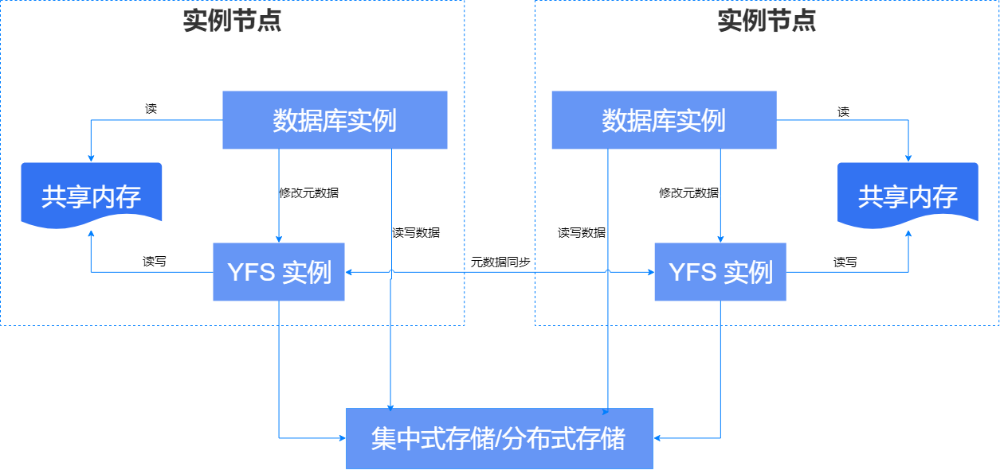
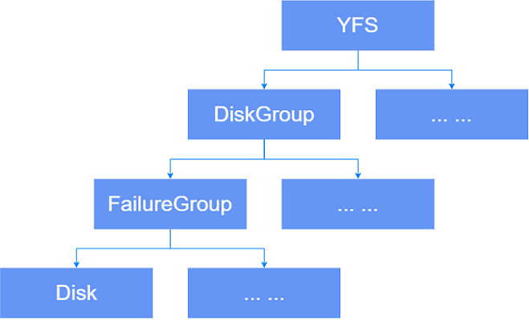

崖山文件系统YFS是YashanDB的专用并行文件系统，提供存储设备管理、存储高可用、文件系统接口等功能。

集群中每一个服务器上运行的一组YFS相关线程称为一个YFS实例，YFS实例与YCS实例运行在同一进程（YCS进程）中。生产环境下，通常每台服务器只会运行一个YFS实例。

数据库服务端核心进程YASDB是YFS实例的客户端（Client），只与同服务器的YFS实例通信。YASDB进程通过Unix Domain Socket向YFS实例发起元数据变更请求，YFS实例更新共享内存中的元数据缓存，并将元数据变更持久化到共享存储。YASDB进程读取共享内存中的元数据，直接对磁盘进行读写，无需通过YFS实例，IO性能接近直接读写裸设备。

YFS实例管理全局存储元数据，通过事务保证操作的原子性，各YFS服务之间通过网络同步元数据，通过一致性协议保证全局一致性，确保YFS各实例看到的文件状态没有差别。

## 磁盘管理

YFS具备磁盘管理能力，将磁盘裸设备（Disk）划分为磁盘组、故障组等逻辑概念，以层级结构管理。

### 磁盘组（DiskGroup）

磁盘组（DiskGroup）是YFS管理磁盘设备的最顶层逻辑单元。

YFS中可能存在多个磁盘组，各磁盘组之间资源隔离、故障隔离。不同磁盘组可以执行差异化存储管理，指定不同规格属性，例如为不同磁盘组配置不同的冗余度。

#### 磁盘组分类 

YFS根据功能不同将磁盘组分为：

- 系统磁盘组：用于存储YFS自身元数据，建议容量不小于500MB，YFS依赖该盘完成启动和初始化。

- 数据磁盘组：用于存储业务数据。

一个最小可用的YFS规格如下：

- 至少需要1个物理磁盘设备，在逻辑上组成1个故障组（默认名称为SDG0_0），进而组成1个系统磁盘组（默认名称为SYSTEM）。

- 至少需要1个物理磁盘设备，在逻辑上组成1个故障组（默认名称为DG0_0），进而组成1个数据磁盘组（默认名称为DG0）。

#### 冗余度（Redundancy）

磁盘组的冗余度（又称“冗余级别”）是YFS中用于定义磁盘组数据保护能力的核心属性参数，它决定了数据文件的副本数量，从而影响数据高可用、高可靠的程度。

冗余度分为External、Normal和High，高可用、高可靠程度依次增强。若为External则无数据冗余，数据的可靠性依赖外部能力实现，例如RAID。

冗余度与文件副本数的关系如下表所示。

| 冗余度 | 系统磁盘组 所有文件副本数 | 数据磁盘组 用户数据副本数 | 数据磁盘组 YFS元数据副本数 |
| ---------- | ------ | ----------- | --------------- |
| External   | 1      | 1           | 1               |
| Normal     | 3      | 2           | 2 ~ 3           |
| High       | 5      | 3           | 3 ~ 5           |

每个磁盘组的冗余度相互独立，需在创建磁盘组时指定，一旦创建不可更改。

#### 分配单元（Allocation Unit）

分配单元（AU，Allocation Unit）是YFS分配磁盘空间的最小维度，YFS将磁盘划分为固定大小的分配单元进行管理，同一个磁盘组内所有磁盘采用统一的分配单元大小。

分配单元颗粒度包括1MB（默认值）、4MB、8MB、16MB以及32MB。该属性值在创建磁盘组时指定，一旦创建不可更改。

分配单元颗粒度更大时，可创建的文件更大且连续IO性能更佳，但也会消耗更多内存，浪费一些磁盘空间。在实际使用中，应根据业务特征选择合适的分配单元颗粒度，配置建议如下：

- 以小文件为主时，建议选择较小的分配单元颗粒度。

- 以大文件为主时，建议选择较大的分配单元颗粒度。

- 当分配单元颗粒度大于等于绝大多数IO大小时，可以获得更好的性能。

### 故障组（FailureGroup）

YFS将可能同时发生故障的磁盘定义为故障组（FailureGroup），配合多副本机制实现数据的冗余。每个故障组存放一份副本，只要还存在一份完整副本，对应数据便可用。不同故障组下的磁盘故障是独立事件，同时发生故障的概率极低，因此多个副本全部损坏的概率极低，从而保障数据高可用性。

故障组没有绝对统一的划分标准，需结合具体运维条件，依据各磁盘故障概率的相关性进行合理分组，以降低所有故障组同时发生故障的概率，尽可能避免多组故障同时出现。

每个故障组包含一个或多个磁盘，这些磁盘可能是：

- 同一共享存储中的多个LUN

- 同一机柜的磁盘

- 同一电源供电的多个存储设备

- 同一机房的多个存储设备

YFS会从每个故障组中各选一个磁盘将其组成伙伴磁盘集，且每个磁盘最多只能属于一个伙伴磁盘集不可重叠，将同一份数据文件的N个副本分别保存在同一组伙伴磁盘集的N块磁盘上。基于此，冗余度与故障组数量存在如下关联：

- 磁盘组的故障组数量应大于等于该磁盘组冗余度所要求的副本数最小值。

- 对于冗余度为Normal或High的数据磁盘组，YFS元数据的实际副本数在其值域范围内还与故障组数量挂钩，例如某个数据磁盘组的冗余度为High但只有3个故障组，则实际的YFS元数据副本数为3。

- 如果某个伙伴磁盘集中磁盘个数小于磁盘组冗余度所需副本数，该磁盘集将视为不可用，需增加磁盘或故障组使其数量达标才可用。

> **Note**:
> 
> 通过[V$YFS_DISK](../../参考手册/系统视图/动态视图/V$YFS_DISK.md)视图的PARTNERS字段可以查看磁盘的伙伴关系。
> 
> 对磁盘组进行增、删磁盘操作后，各磁盘的伙伴关系可能会发生变化。

### 磁盘设备（Disk）

YFS的所有数据都按指定策略保存在磁盘上，包括YFS自身的元数据、YFS文件以及目录的元数据、用户数据等。

同一个磁盘不应在YFS中复用，可能丢失数据。

YFS仅支持Direct IO模式读写，加入YFS的磁盘至少应支持块大小512B - 64MB的DIO模式读写。

## 文件及目录管理

YFS提供了一组文件操作API，抽象底层存储管理细节，语义兼容大多数文件系统操作，具备文件、目录、路径等文件系统基本概念。

YFS还提供专用的管理终端yfscmd，提供与Linux Shell类似的文件管理界面，例如常见的cd、ls、mv、cp等命令。

### 目录

YFS以目录树的形式组织、管理文件，其路径构成为`+DG_NAME/DIR/PATH/file.name`。

YFS的根是`+`，一级目录是磁盘组的名称，其他次级才是通俗意义上的目录和文件名。磁盘组目录是虚拟目录，无法直接增/删/改，需通过增/删磁盘组间接修改。

可以通过绝对路径中的根识别文件系统类型，以`+`开头的是YFS路径，以`/`开头的是系统本地路径。yfscmd cp指令通过根路径字符识别文件所在文件系统，实现YFS和本地文件系统的交叉复制。

### 文件

YFS文件除用户数据外，还包含一些精简的属性信息，例如创建时间、文件大小等。由于YFS仅支持Direct IO读写，YFS文件大小都是512字节的整倍数。

文件实际占据的磁盘空间可能大于文件大小，约为`Round(FileSize/AuSize) * Redundancy`，文件的元数据也会额外占据少量空间。
