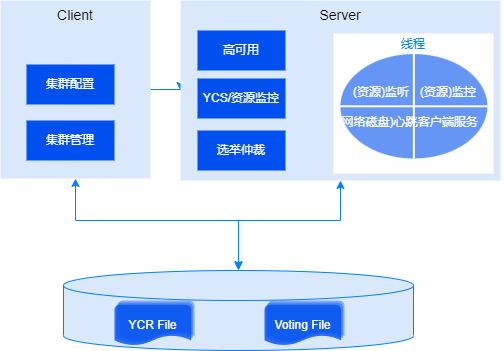

崖山集群服务YCS采用客户端服务端架构，整体架构如下，客户端命令行工具可执行配置、查询等命令，相关命令发送到服务端处理后返回结果给客户端。

## YCS实例

YCS实例采用单进程、多线程的服务架构（进程名为yascs），包括负责监听、心跳、监控以及服务客户端的代理线程。

在YCS进程中会以内嵌方式运行YFS实例，后者同样也包括一系列线程，详情请查阅[崖山存储管理](崖山存储管理)。

## YCS配置

在集群运行前，需要先完成集群服务配置，涉及以下三层概念：集群、服务器和资源。

**集群**

当我们要初始化安装一套集群数据库时，需要先使用YCS客户端工具完成集群的配置，包括指定集群名、参与集群的服务器以及服务器上的资源等。在同一个集群注册表磁盘上只能创建一套集群，如果以覆盖方式创建集群，则之前的集群配置会丢失。

**服务器**

一个集群应至少部署两台服务器，每台服务器分别运行YCS实例提供集群服务。有效保障发生单点故障时至少还有一台服务器提供服务，达到高可用的目标。每台服务器上需要运行配置一套YCS实例，除此之外还需要配置资源信息，包括数据库等。

**资源**

每个服务器需要管理一系列的资源，通过对资源的管理（包括监控和启停），实现高可用的集群服务给上层应用使用。

资源包括内嵌资源和外部资源：

- YFS是集群数据库运行时依赖的并行文件系统，作为内嵌资源随YCS启动，该资源对使用者透明。

- 内嵌的网络资源：

    - 单客户端访问名称（SCAN，Single Client Access Name）是集群数据库可以选配的集群级别的网络资源。配置后，YCS提供一个单一逻辑名称（SCAN域名）供客户端连接，客户端无需感知实际的节点IP信息以及节点拓扑变化，实现透明的连接负载均衡和故障自动转移。集群启动时，SCAN VIP会分配到集群的节点中，运行SCAN VIP的节点会启动一个SCAN监听处理连接请求。
    - 虚拟IP（VIP，Virtual IP）是集群数据库可以选配的节点级别的网络资源。配置后，每个节点提供一个虚拟IP供客户端连接，且该虚拟IP可以在故障实例和正常实例之间迁移，实例级故障对使用者完全透明。

- YashanDB的数据库服务端作为外部资源由YCS进行管理。

配置资源的启停脚本后，可以通过YCS的客户端工具来启停相关资源。

## 集群状态

集群状态，也可以称为集群拓扑状态或拓扑状态，是指整个集群的运行期状态，包括所有服务器上集群服务的启停状态信息，资源的启停状态信息等。

## 集群共享文件

集群共享文件分为以下两类：

- **集群注册表**

    集群注册表（YCR，Yashan Cluster Registry）保存集群服务的配置信息，包括服务器配置、资源配置等，YCR必须保存在共享存储上，所有YCS实例和数据库实例运行期需要能够正常访问YCR，以确保获得一致的集群服务配置信息。

- **集群投票文件**

    集群投票文件（Voting file）是所有服务器运行期会周期性写入状态信息的磁盘文件。在故障发生时，需要在集群投票文件进行投票并决定哪些服务器幸存而哪些服务器被逐出集群，无法访问投票文件则无法获得最新集群状态信息，相关YCS实例和数据库实例无法正常运行。
