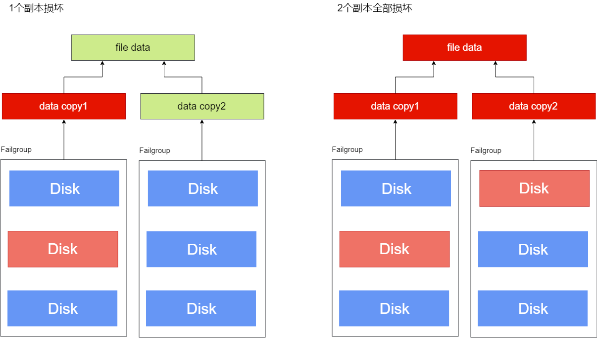
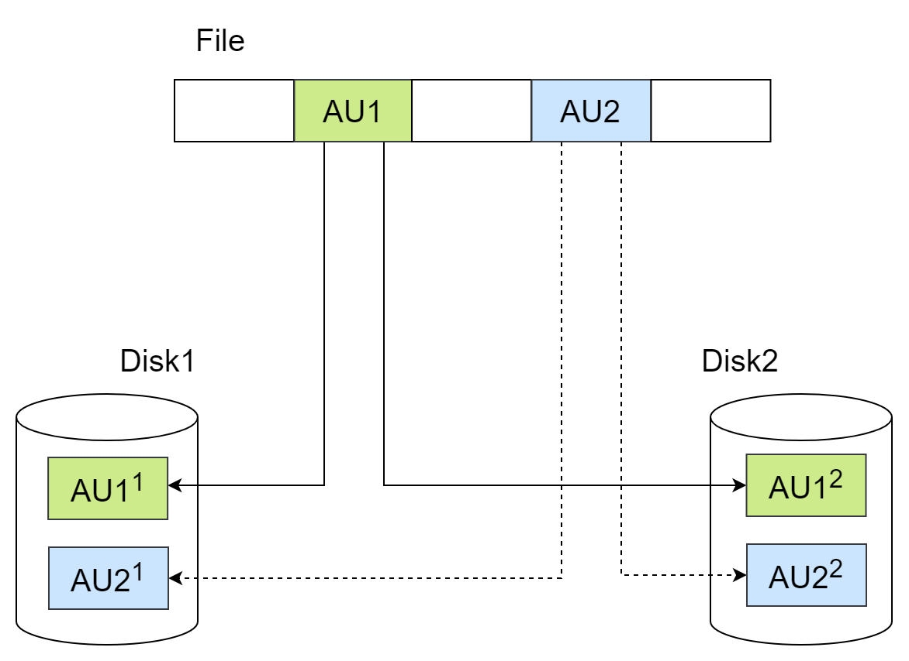
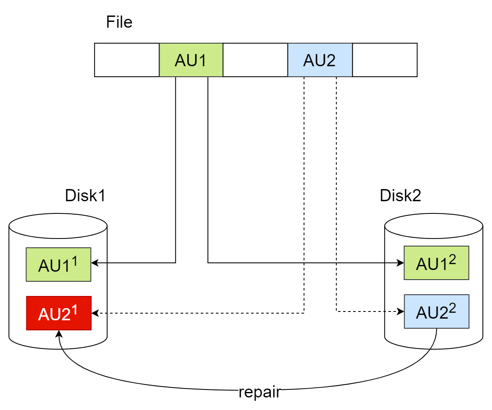
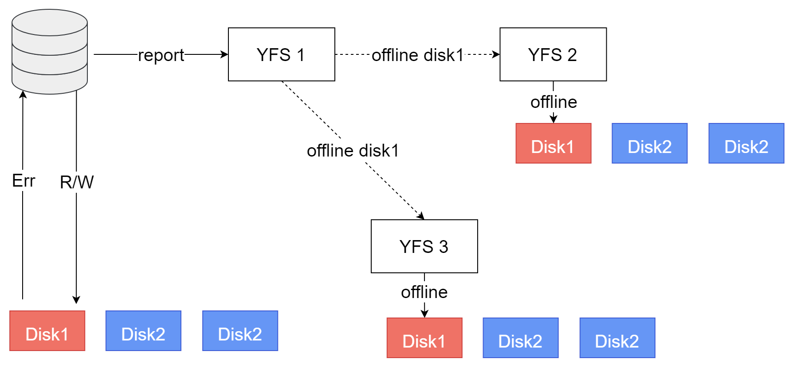

YFS通过diskgroup和多副本技术实现数据的高可用，通过集群化部署实现服务的高可用。

## 数据高可用

### 磁盘组、故障组和冗余度

磁盘组（Diskgroup）是YFS管理的磁盘集合。根据业务需要，YFS中可能存在多个磁盘组。YFS要求磁盘组中的所有磁盘大小相等，如果磁盘大小不同，向磁盘组添加磁盘时可指定磁盘可用空间为所有磁盘中的最小值，这会造成磁盘空间浪费，推荐使用相同大小的一组磁盘。


YFS支持为磁盘组配置External、Normal和High三个级别的磁盘冗余度。在Normal和High冗余度（Redundancy）的磁盘组中创建的文件，YFS为这些文件创建若干数据镜像，文件的每个镜像称为该文件的1个副本。文件的副本会分布在不同故障组（Failgroup），确保部分磁盘故障不会造成所有副本数据损坏，保证文件的完整性。YFS中文件的副本数量由文件所在的磁盘组决定，可以在创建磁盘组时指定冗余度参数，多副本的磁盘空间消耗也会成比例放大，指定磁盘组冗余度时应平衡数据保护强度和磁盘空间效率。

|  冗余度| 说明|
|----|-----|
|External|仅保存一份数据，无多副本保护。|
|Normal|用户数据2副本，YFS元数据最多3副本。|
|High|用户数据3副本，YFS元数据最多5副本。|

对于Normal和High冗余度，冗余度越高意味着YFS内部存在更多副本，对磁盘损坏具备更高的容忍度而不会造成数据丢失，提供更高的数据可用性保护。当发生磁盘故障时，YFS会检查文件副本的完整性，如果所有副本都损坏，YFS将卸载（Dismount）该磁盘组；如至少有一个副本是完整的，数据库不感知磁盘故障，数据库可继续提供服务。

External冗余度磁盘组中的文件没有额外副本，YFS不提供保护，数据的可用性依赖外部存储，如RAID。当外部存储设备发生故障时，对应的磁盘组被卸载不可用。由于External冗余度没有额外的副本，因此磁盘空间利用效率最高，请综合考虑数据价值和外部存储的可靠性，谨慎选用。

> **Warn**:
>
> External冗余度的磁盘组不支持数据高可用，一旦发生磁盘故障整个磁盘组都将不可用，甚至数据丢失，请做好数据备份。

故障组（Failgroup）是磁盘组的子集，用来保存数据副本，创建磁盘组时需要根据冗余度配置每个磁盘组中的故障组。故障组的配置要求如下：

1. 同一个故障组的磁盘故障率高度相关，通常可以根据磁盘的物理关系进行划分，比如同一机柜的磁盘、同一电源的磁盘、通过同一网络连接共享的磁盘等等，当发现其中部分磁盘故障时，通常这些磁盘都不可用。

2. 要求同一磁盘组内所有故障组的磁盘数量必须相同。

3. YFS中所有磁盘都必须属于某个故障组，如磁盘未指定所属故障组，YFS自动为该磁盘创建默认故障组，即创建只包含1个磁盘的故障组。磁盘组创建完成后可通过Alter操作修改故障组，如为所有故障组增加或删除磁盘、新增或删除故障组，操作结束后依然需要满足该磁盘组内所有故障组的磁盘数量相同。

4. External冗余度的磁盘组，至少需1个故障组，用户数据和YFS元数据副本数量均为1；Normal冗余度的磁盘组，至少需2个故障组，用户数据和YFS元数据的副本数为2，如果存在3个以上故障组，则用户数据副本数为2而YFS元数据的副本数为3；High冗余度的磁盘组，至少需要3个故障组，用户数据和YFS元数据副本数为3，如果存在4个以上的故障组，则YFS元数据的副本数至少为4最多为5个副本。

5. YFS的故障组用于保存数据副本，总是需要副本数整倍数的故障组分配磁盘空间，如果磁盘组中的故障组数量不是副本数的整倍数，余数个故障组内的磁盘空间将不可用，请确保故障组数量为用户文件副本数的整倍数，提高空间利用率。

推荐创建足够多的故障组，为YFS元数据提供额外的副本保护。创建磁盘组以后新增故障组不能改变YFS元数据的副本数量，请在创建磁盘组时做好规划。

以Normal冗余度的磁盘组为例，其中的文件为2个副本，YFS会选择该磁盘组的2个不同故障组，分别保存2个数据副本。当某个故障组的磁盘发生故障时，另一个故障组中的数据副本可以保证文件数据的完整性；当2个故障组都有磁盘故障时，文件的2个副本可能全部损坏，文件数据不完整。



### 故障场景

#### 数据块错误

YFS管理磁盘的最小单元称为AU（Allocation Unit），可选1M（默认值）、4M、8M、16M、32M。YFS中的文件由一些在磁盘上离散的AU组成，YFS通过文件元数据实现文件AU的磁盘寻址。冗余度为Normal和High磁盘组中的文件，数据在AU级别实现冗余。对于Normal冗余度磁盘组中的文件，其数据副本数为2，即每1个AU大小的文件数据，在不同故障组的2块磁盘中各有1个AU与之对应，它们存储相同的数据。



写入YFS文件时，YFS会同时更新文件位置对应的2个AU；YFS读取文件时会对数据进行完整性校验（例如checksum校验），依次读取对应位置的2个AU，读取到任意完整的数据，即认为文件对应位置的数据完整，不再读取后续副本。例如Disk1出现数据块错误，可能由磁盘坏道、上一次写入不完整等引起，使得AU2<sup>1</sup>数据错误（不是IO错误），YFS通过数据完整性校验检测到此处数据不完整，则继续读取AU2<sup>2</sup>。AU2<sup>2</sup>处读取的数据通过数据完整性校验，那么文件AU2处的数据依然是完整的，业务层不感知数据块错误。



YFS读取数据时，如发现块级数据错误，且至少存在1个完整的副本，那么YFS会尝试将完整数据写入损坏的数据块，自动完成坏块修复。YFS的坏块修复时，可以在对应YFS实例的日志中看到：

```text
[YFS] repair dg:磁盘组id, fd:文件fd, offset:文件偏移, len:修复长度, copyIndex:修复的副本编号
```

如果文件AU对应的所有副本都出错，则此处数据被损坏，无法恢复。发生这种情况时，可以在对应YFS实例的日志中看到：
```text
[YFS IO] all copies corrupted, message: dgid=磁盘组id, fd=文件fd, offset=文件偏移, size=IO长度
```

#### 磁盘故障

- YFS读写文件时，如读、写某磁盘失败则认为该磁盘故障，YFS检查其他副本所在故障组的故障状态，如果该磁盘保存的是最后一个可用副本，说明当前节点没有修改该文件的任何副本，YFS只需在当前实例将故障磁盘Offline，卸载其所在磁盘组，当前实例将无法对该磁盘组执行任何IO，数据库会报IO错误；
- 如果该磁盘保存的数据，在其他故障组还有可用副本，说明当前节点无法更新故障磁盘上的副本，但可能更新其他副本数据，此时多副本的数据可能不一致，YFS广播所有实例Offline该故障磁盘，避免各实例读取到不同副本不一致的结果。

例如3实例YFS集群，3个共享磁盘（图中为每个实例绘制3块磁盘，实际上是各实例可见的3块共享磁盘）组成的磁盘组。以3副本为例，每个数据副本会保存在一个磁盘中。



**当只有1个磁盘故障时**

当实例1的数据库读写Disk1失败，检测到Disk1故障，数据库向本实例的YFS上报Disk1故障。YFS检测到该磁盘组还有Disk2、Disk3可用，3副本数据还有2个有效副本，磁盘组依然具备服务能力，磁盘组状态不变，依然可用，但标记Disk1为Offline状态。同时YFS发送广播消息，通知集群其他节点，也将Disk1设置为Offline。Offline磁盘时，可以在YFS日志中看到如下内容：

```text
[YFS DISK] offline disk name: 磁盘名称, path: 磁盘路径, diskstatus: 当前磁盘状态
```

也可以通过yfscmd工具查询，所有节点的Disk1的状态为Offline，Disk2、Disk3状态为Normal。

此时集群内3个节点的共享磁盘状态达成一致：Disk1 Offline，Disk2和Disk3状态为Normal，磁盘组正常。数据库完成故障上报后继续执行读写操作，直到写完所有副本所在Disk，即Disk2、Disk3，或者从Disk2、Disk3之一读到完整副本，数据库不感知Disk1的故障。

**当有多个磁盘故障时**

如果Disk2，Disk3已经处于Offline状态，当数据库读写Disk1失败时，向本实例YFS上报磁盘故障，YFS检测到本实例该磁盘组的三个磁盘都故障，所有副本都不可访问，则YFS将本实例的Disk1 Offline，且将磁盘组Dismount。可在本实例YFS日志中看到如下内容：

```text
[YFS DISK] offline disk: 磁盘路径 cause data lost, diskgroup 磁盘组名称 will dismount
```

数据库运行日志中会看到如下内容：

```text
[YFS IO] all copies corrupted, message: dgid=磁盘组编号, fd=文件fd, offset=IO偏移, size=IO大小
```

由于当前节点不会更新任何数据，磁盘故障不会引入多副本的不一致性，YFS无需通知集群其他节点Disk1的状态变化。由于各节点与共享磁盘的连接状态差异，集群中各节点看到的磁盘组状态可能不一致，例如图中节点1的Disk1状态为Offline、磁盘组状态为Dismount，其他2个节点Disk1状态为Normal、磁盘组状态正常。这种差异避免了节点1的故障扩散到集群其他节点，确保集群的最大可用。

YFS的元数据操作（如增删改查文件、目录等）由YFS集群自选主节点执行，如果主节点某个磁盘组状态为Dismount，在任意节点上执行该磁盘组的元数据操作都会失败，提示磁盘组处于Dismount状态，与发起请求的实例看到的磁盘组状态无关。如YFS集群中有节点的磁盘组状态正常，请参考以下步骤使正常节点成为新主节点，即可恢复YFS元数据操作。

以3节点集群为例，登录任意节点，通过以下指令查看YFS集群当前主节点：

```bash
$ export YASCS_HOME=/your/yascs/home
$ ycsctl status
---------------------------------------------------------------------------------------------
Self Host ID|Cluster Master ID|YasFS Master ID|YasDB Master ID|Active Host Count
---------------------------------------------------------------------------------------------
1            1                 1               1               3         
---------------------------------------------------------------------------------------------
Host ID   |Target    |State     |YasFS     |YasDB     |VIP
---------------------------------------------------------------------------------------------
1          online     online     online     online                                                                 
2          online     online     online     online                                                                 
3          online     online     online     online
```

根据`YasFS Master ID`列可知YFS主节点为1号节点，登录节点1查看磁盘组DG0为Dismount状态：

```bash
$ export YASCS_HOME=/your/yascs/home
$ yfscmd show diskgroup
id name     type     level    au_size  stat     block_size  total_mb    free_mb     usable_file_mb
0  SYSTEM   SYSTEM   0        1.00MB   MOUNTED  4096        1024        764         764        
1  DG0      USER     0        32.00MB  DISMOUNTED 4096        0           0           0
```

此时节点1上的磁盘组DG0不可用，如数据库正在使用该磁盘组，数据库无法正常服务，请在节点1执行以下指令停止该节点：

```bash
$ ycsctl stop ycs
```

此时节点1从集群离线，并自动触发YFS集群重构，集群会自动从节点2和节点3中选取一个新主。可登录节点2或节点3查看集群最新状态：

```bash
$ export YASCS_HOME=/your/yascs/home
$ ycsctl status
---------------------------------------------------------------------------------------------
Self Host ID|Cluster Master ID|YasFS Master ID|YasDB Master ID|Active Host Count
---------------------------------------------------------------------------------------------
2            2                 2               2               2         
---------------------------------------------------------------------------------------------
Host ID   |Target    |State     |YasFS     |YasDB     |VIP
---------------------------------------------------------------------------------------------
1          online     offline    offline    offline
2          online     online     online     online
3          online     online     online     online
```

可知节点2为YFS主节点，只要节点2上磁盘组DG0正常，则集群恢复YFS元数据操作。

服务高可用
------
以集群模式部署YFS，当服务器数量发生变化或某个服务器发生故障无法服务时，YFS自动重构，恢复服务。只要集群中至少还有1个可用服务器，YFS集群服务就可用。

另外，YFS利用redo和checkpoint机制确保了数据的一致性和可靠性，当发生极端故障时，重启YFS是通过回放redo日志恢复到有效状态。

主备复制
------

YFS集群状态的一致性非常重要，YFS主实例向所有备实例的实时数据复制，通过传送redo日志实现，如下图：


**1. 日志插入**

YFS集群至少包含1个主实例（Primary）和若干备实例（Standby）。主实例负责处理所有元数据变更，同时将产生对应的redo log，插入Log Cache。

**2. 日志刷盘**

YFS自身的redo file也由YFS管理，受YFS多副本技术保护。

redo log被持久化到redo file，这些数据保存在共享存储上，确保恢复时所有YFS实例都可以访问该文件。

**3. 日志发送**

主实例将本机日志发送给所有备实例，由于YFS的元数据变更数据量很少，这里采用同步发送。

**4. 日志回放**

备实例收到日志后，通过重演主实例redo log更新元数据页面，最终备实例状态与主实例状态同步一致。
