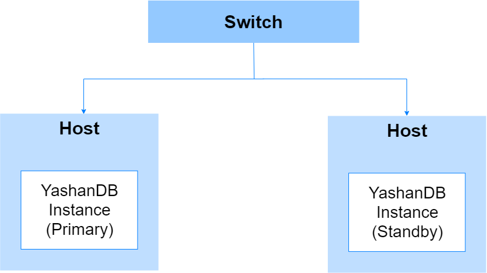
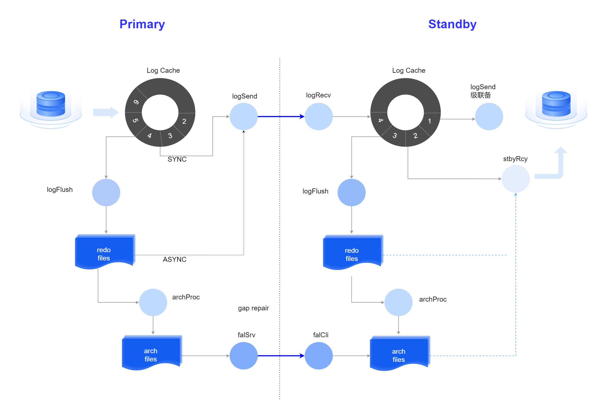
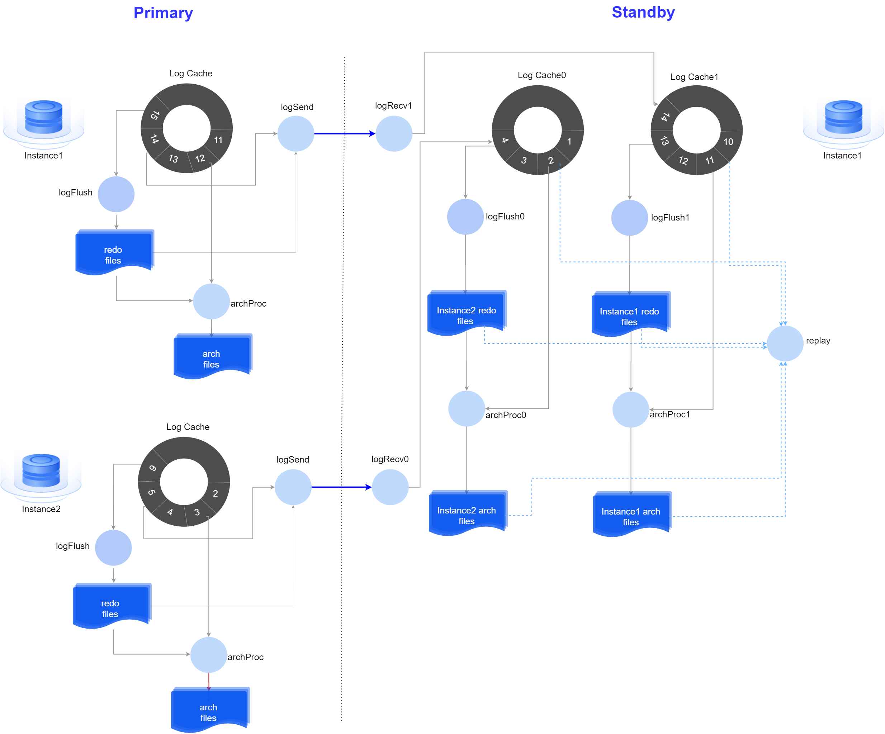
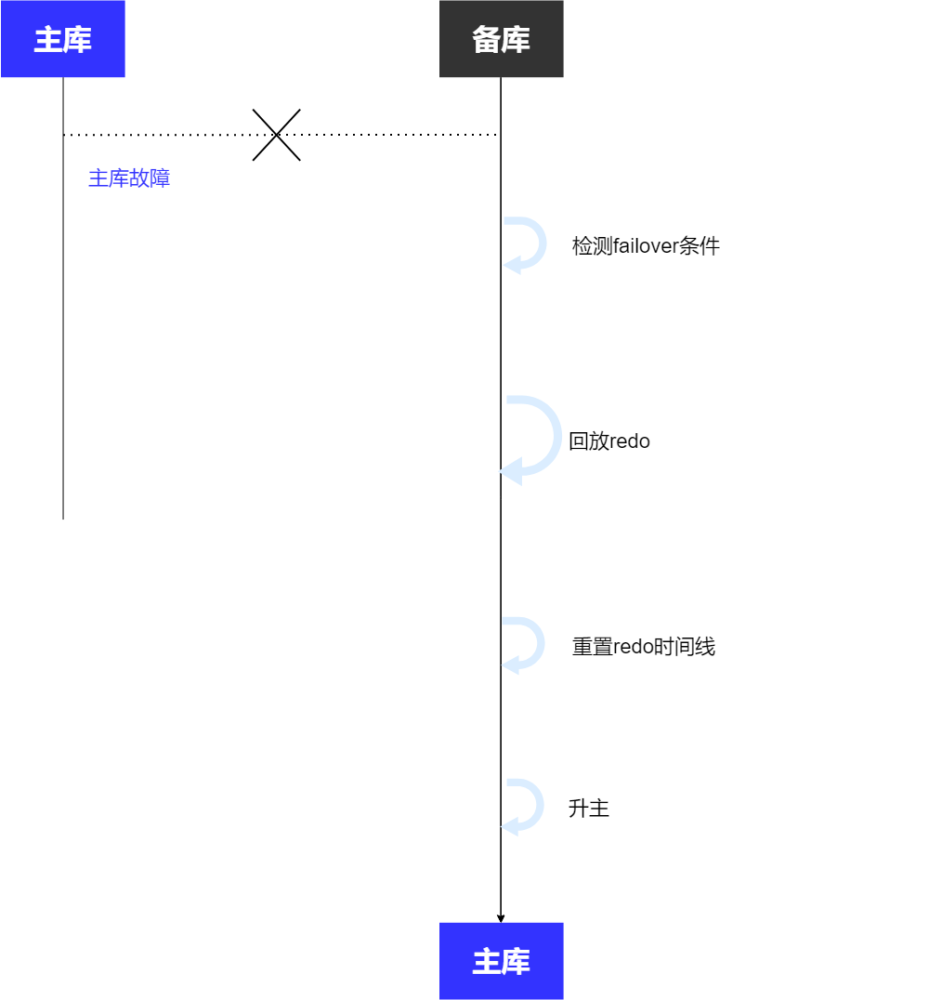
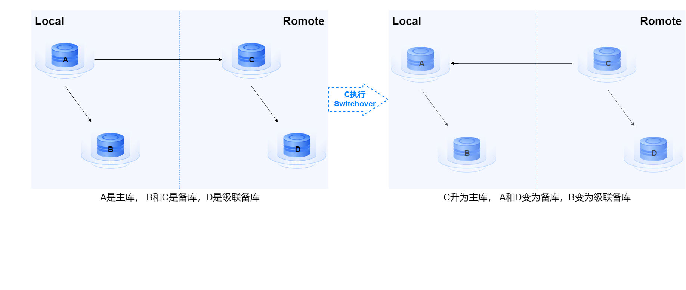
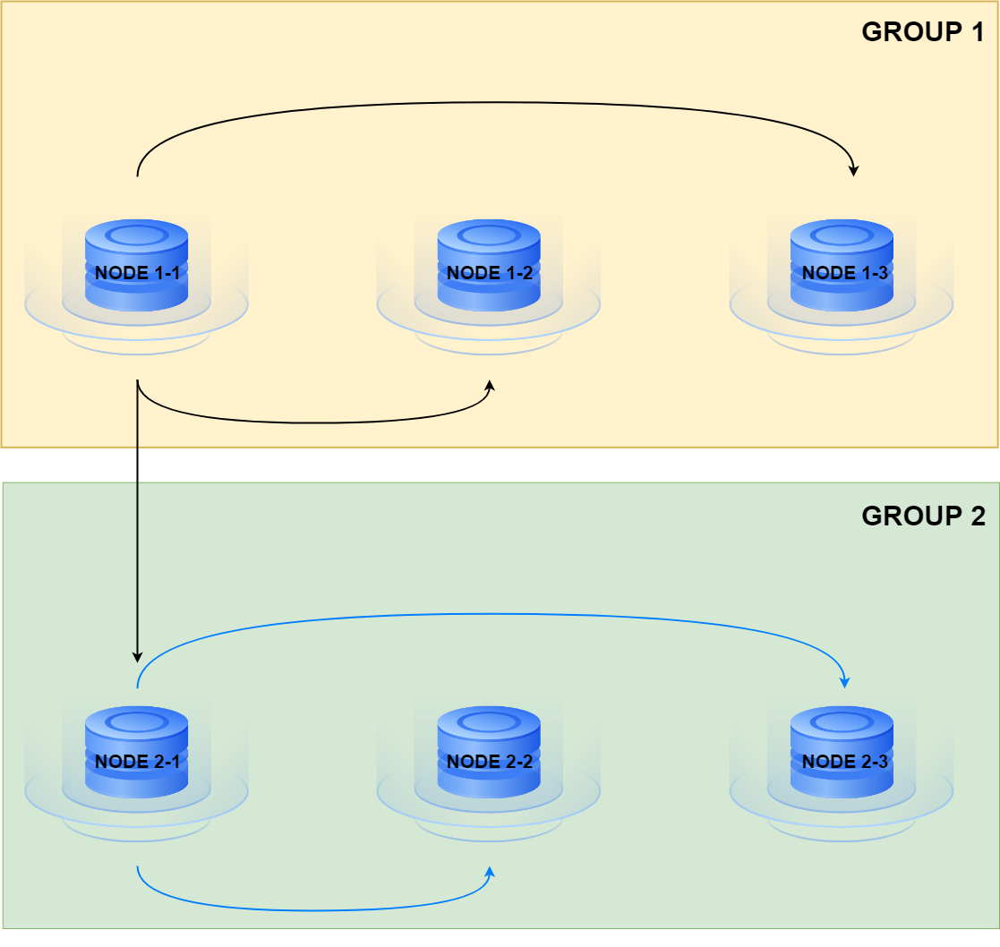
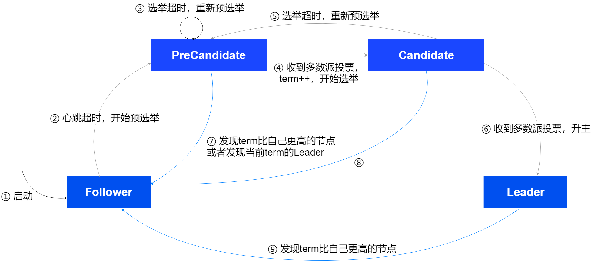

高可用（HA，High Availability）通常是指通过各种技术措施减少系统不能提供服务的时间，保障业务连续性。如果系统每运行100个时间单位中有1个时间单位无法提供服务，则系统的可用性是99%，实际场景中，大多数企业追求的系统可用性目标是尽量接近100%，即7*24小时不间断运行。

YashanDB的高可用架构主要从以下几方面设计，以助力企业达到上述目标：

- 丰富的高可用部署方案：

  - 单机主备部署：主备库部署在不同服务器上，连接到同一交换机，确保网络低时延，保证高可用避免单点故障。

  - 单机级联备部署：部署在异地的异步备库，减少主库带宽负载，保证高可用实现异地容灾。

  - 双复制组主备部署：将两套单机主备环境划分为两个组，再通过异步进行组间数据同步，每个组可以部署在不同的地域/机房，从而实现异地容灾。

  - 共享集群部署：多实例采用多活部署方式，通过客户端TAF技术和服务端故障自动切换能力，保证集群数据库高可用。
  
  - 主备集群部署：主备集群可以部署在不同地点，构建集群容灾环境。

  - 存算一体分布式集群部署：MN组和DN组采用主备部署，在主节点不可用时可以从备节点中自动选举升主，实现发生故障时的自动切换。CN节点采用多活部署，多个节点同时提供在线服务，单点故障不会影响整体。

- 自动选主机制：主库节点不可用时，从备库节点自动选举升主，实现发生故障时的自动切换，包括[一主多备自动选主](./自动选主配置/一主多备自动选主.md)和[一主一备yasom仲裁选主](./自动选主配置/一主一备yasom仲裁选主.md)。

- [备份与恢复](../数据库管理/备份与恢复/00备份与恢复)：作为数据库管理的日常措施，保障数据库的数据安全性，是最基础的高可用能力。

## 主备部署

主备复制是数据库最主要的高可用措施，通过将主库上的数据实时复制到备库来实现。主库是执行业务的数据库实例，备库是复制主库数据的数据库实例。当主库发生故障时，业务可以转移到备库上继续执行，降低故障对业务的影响，提高数据库的可用性。

同时，还支持对备库节点进行按需扩缩容，用户可以根据业务负载和资源状况对高可用部署规模进行灵活调整。

**主库**：

数据库主节点，当前提供在线数据库服务，读写模式。

共享集群部署中则称为**主集群**，主集群多实例同时提供在线服务，并同时向备集群的master实例传送日志。

**备库**：

作为数据库集群的冗余节点，支持创建最多32个备库。其核心工作机制是通过实时接收主库的redo日志，并在本地回放这些redo日志实现数据同步。

共享集群部署中则称为**备集群**，备集群的master实例上启动多线程接收主集群所有实例日志并回放。

### 主备复制链路

主库向备库的实时数据复制通过传送redo日志来实现，如下图：

主备库复制链路：

主备集群复制链路：

1. **日志发送**

  包括SYNC同步传送和ASYNC异步传送两种模式：

  - SYNC同步传送：主库从Log Cache中读取数据发送至备库，性能较高。
  - ASYNC异步传送：主库从redo文件读取数据发送至备库，一般适用于异地备库。

  日志发送采取SYNC还是ASYNC模式，由系统自动选择。

2. **日志应用**

  备库通过回放主库发送过来的redo日志以保持和主库数据的一致性。

  当在Log Cache和redo文件中均未找到需要的数据时，将启动线程同步主库的归档日志文件到备库并从中查找所需数据，最大程度保障主备库的数据一致性。

  物理备库和逻辑备库之间的主要区别在于日志应用的方式：

  * 对于物理备库，使用redo apply机制。

  * 对于逻辑备库，使用SQL Apply机制，将收到的redo日志转换为SQL语句，然后在逻辑备库上执行生成的SQL语句。

### 保护模式

主备复制基于网络传输，势必存在一定的延迟和不稳定性，YashanDB提供三种不同的保护模式供选择配置，由用户根据自身对性能或对数据安全的需求与偏好来决策采用合适的保护模式，具体操作请查阅[管理保护模式](./管理保护模式.md)。

|  保护模式| 事务行为（默认情况下）| 优缺点|
|--------------------|------------|--------------------------|
| **最大保护** | 主库事务执行完，必须等待同步备库（至少1个）将对应redo日志刷盘后才能向客户端返回事务提交成功。 | 若主库故障，同步备库升主后可以保证数据不丢失。 如果同步备库断网或故障将阻塞主库业务。 |
| **最大可用** | 主库事务执行完，等待redo日志传输到同步备库（无需等待备库刷盘结果）即可向客户端返回事务提交成功。 | 主库性能较高，且备库断网或故障不会影响主库业务。 如果主库故障，备库升主后可能发生数据丢失。 |
| **最大性能** | 主库事务对应的所有redo日志写入主库redo文件后，无需等待备库接收redo日志即可向客户端返回事务提交成功。 数据库默认的保护模式，在保障主库可用性的情况下，尽可能做数据保护。 当任意同步备库连接正常时，采取最大保护模式，当所有同步备库断网或故障时，采取最大性能模式。 | 存在数据丢失风险。   |

在单机部署或存算一体分布式集群部署中，用户可以根据实际业务需求和性能考虑定义最大保护模式下具体的[同步备](./定义同步备.md)相应配置，从而灵活调整主库事务提交成功的同步机制。

>**Note**:
>
> 若COMMIT_WAIT参数配置为NOWAIT，则主库事务提交事无需等待日志落盘。建议使用COMMIT_WAIT的默认值WAIT。

### 主备切换

YashanDB支持在主备库均正常的情况下执行计划内切换（Switchover），也支持在主库异常的情况下执行故障切换（Failover）。

**计划内切换**

需在备库上执行，执行时要求主库和备库的网络连接正常，且主库和备库实例均处于OPEN状态。

Switchover的执行流程如下：

**故障切换**

需在备库上执行，执行时要求备库实例处于OPEN状态，此时由于主库故障，备库的redo日志可能没有完全与主库同步，从而丢失数据，所以Failover后需要重置redo时间线，以便区别旧主库和新主库的redo日志。

启动Failover后系统执行流程如下：

## 级联备部署

级联备，即备库的备库，普通备库从主库接收日志，而级联备则是从其上级备库接收日志。

当某个级联备的上级备库升为主库，该级联备转为普通备库。

级联备一般被应用到异地容灾部署中，如下图：

一个备库最多可连接32个级联备，级联备可以继续向下连接级联备，没有层数限制，但不可以成环连接。

级联备模式仅适用于单机部署。

**主备切换**

由于级联备未直接与主库连接，因此不能对其执行Switchover，只能执行Failover。但如果级联备的上级备库执行了Switchover，则该级联备的角色将发生变化，而主备切换以系统中当前的角色状态为准，如下图：

## 双复制组主备部署

在不同机房/地域部署两套单机主备环境，每套主备环境作为一个复制组，数据从一个复制组（主复制组）复制同步到另一个复制组（备复制组）构成异地容灾架构，部署操作请查阅[双复制组主备部署](../安装和升级/安装部署/YashanDB服务端安装（命令行）/单机（主备）部署.md#Manual)。

双复制组主备部署中包含以下角色：

- 主库：负责给所有备库发送redo日志，主库所在复制组称为主复制组。

- 备库：

  - 同步备：主复制组中的所有备库，负责接收主库发送的redo日志并回放。
  
  - 异步备：备复制组中的首节点，负责接收主库发送的redo日志并回放，还作为备复制组中其他节点的上级备库，将接收到的redo日志发送给备复制组中的其他节点。

- 级联备：备复制组中除首节点外的其他节点，接收首节点发送的redo日志并回放。

以下图中的双复制组主备部署为例，GROUP 1为主复制组：NODE1-1为主库、NODE1-2和1-3为同步备库，GROUP 2为备复制组：NODE2-1为异步备库（备复制组的首节点）、NODE2-2和NODE2-3为级联备库。

### 组内主备切换

**主复制组**

- 自动切换：主复制组中的节点数大于等于3时支持配置自动选主。

- 手动切换：主复制组中的主备库支持手动执行Switchover和Failover。

**备复制组**

备复制组内不具备直接进行主备切换能力，始终保持仅首节点接收来自主复制组的数据。若首节点故障，则主备复制组数据同步中断。

如需更换备复制组的首节点，只能通过重新配置相关节点的对端数据库链路参数ARCHIVE_DEST_*实现：

- 所有节点都需添加指向主复制组中主库的对端数据库链路参数ARCHIVE_DEST_*，配置格式为`ARCHIVE_DEST_*='SERVICE=目标节点的REPLICATION_ADDR',DISABLE_ELECTION=TRUE,VALID_FOR=PRIMARY_ROLE`。

- 指向组内节点的对端数据库链路参数ARCHIVE_DEST_*：

    - 首节点上配置格式为`ARCHIVE_DEST_*='SERVICE=目标节点的REPLICATION_ADDR',VALID_FOR=ALL_ROLES`。

    - 其他节点上配置格式为`ARCHIVE_DEST_*='SERVICE=目标节点的REPLICATION_ADDR',VALID_FOR=PRIMARY_ROLE`。

### 组间主备切换

主复制组与备复制组支持组角色手动切换（switchover和failover），但存在如下规则：

- 若原主复制组配置了自动选主，切换前必须先将对应功能关闭。切换完成后，新主复制组将支持配置自动选主，可根据实际需求进行选配。

- 仅当原主复制组所有主备库均已宕机时，才能执行组间failover。切换完成后，需要手动拉起原主复制组（即新备复制组）的所有节点，保证双复制组的配置正常运行。

## 自动选主

自动选主是在单机一主多备（非级联备）、分布式集群节点组一主多备部署形态下，当主节点出现异常不能对外服务时，系统通过一定机制在多个备节点中选举一个节点提升为主节点，旧的主节点降级为备节点。

在YashanDB中，是否启用自动选主通过开关控制。关闭时，主备切换由用户根据实际场景按需选择一个备库手动执行Switchover或Failover；打开时，用户仍可按需选择一个备库手动执行Switchover，但当主节点故障时则由系统根据相应机制选择一个备库执行Failover升主（全程无需手动干预）。

**自动选主机制**

YashanDB的自动选主基于Raft协议实现，采用Raft一致性算法中的选举算法：

- 每个Leader都有任期（Term），若不出现故障，任期是无限期的。

- Leader周期性向Follower发送心跳消息。

- Follower在一个选举超时时间内没有收到Leader的心跳消息则成为PreCandidate，发起预选举。

- 当PreCandidate发现它能够获得大多数节点的选票时，将会切换到Candidate，发起选举并增加任期。

- Candidate的投票请求被多数节点通过（投赞成票）后，将自己提升为主节点。

- Candidate投票未通过则进入下一轮选举直至当选为Leader或其它节点被选为Leader。

- 如果Leader接收到大于自己任期的心跳消息或投票请求，则降为Follower。

实现流程如下图所示：

**Quorum机制**

YashanDB的Raft选举算法在最大保护模式下启用了Quorum机制进行选主，投票规则为：

- 节点LFN（Log Flush Number）大于等于自身，向该节点投赞成票。

- 节点任期（Term）大于等于自身，向该节点投赞成票。

**节点优先级**

满足Quorum机制的前提下，节点优先级（HA_ELECTION_PRIORITY）大于等于自身，向该节点投赞成票。

选主规则为：

- QUORUM_SYNC_STANDBYS配置为MAJORITY时，Candidate需要收到多数派节点`（N/2 +1）`的赞成票才能成为Leader。

- QUORUM_SYNC_STANDBYS配置为同步备库数量时：

  - 当syncNum >=`[N/2]`时，Candidate需要收到`（N/2 +1）`的赞成票才能成为Leader。

  - 当syncNum <`[N/2]`时，Candidate需要收到`（N - syncNum）`的赞成票才能成为Leader。  

其中N为节点数量，syncNum为用户定义的同步备数量。

**拓展能力**

- 自动降备：在开启自动选主场景下，主节点在未收到多数派备节点心跳响应时主动降备的功能。该功能通过HA_ELECTION_LEADER_LEASE_ENABLED参数控制开关。

- 自动换主：在开启自动选主场景下，主节点在发现高节点优先级节点时主动降备，让高节点优先级节点升主的功能。该功能通过HA_ELECTION_AUTO_PRIMARY_SWITCH参数控制开关。

## yasom仲裁选主

yasom仲裁选主是在单机一主一备或分布式DN组内节点一主一备部署下，当主节点发生异常不能对外服务时，系统通过yasom仲裁，将备节点升为主节点，并将原主节点降为备节点。

开启仲裁选主后，仅支持用户通过`yasboot node switchover`命令手动切换主备。若主节点出现故障，将由yasom自动切换主备，用户无需且无法执行Failover。

可根据需要选择是否启用[yasom仲裁选主](自动选主配置/一主一备yasom仲裁选主.md)。

## 并行BUILD备库

YashanDB支持在备库上发起build操作进行备库的初始化。当新建一主多备或在线增加多个备库时，使用并行build可以大大提升部署效率。

并行build由主库指定多台备库发起build操作，主库同时向多台备库发送数据（满足主备部署允许的最大备库数据量限制），多台备库同时执行restore。级联备的并行build则由其上级备库发起。
