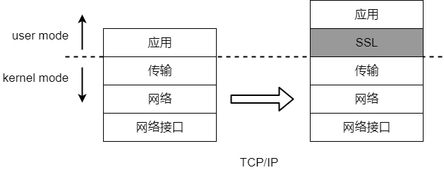
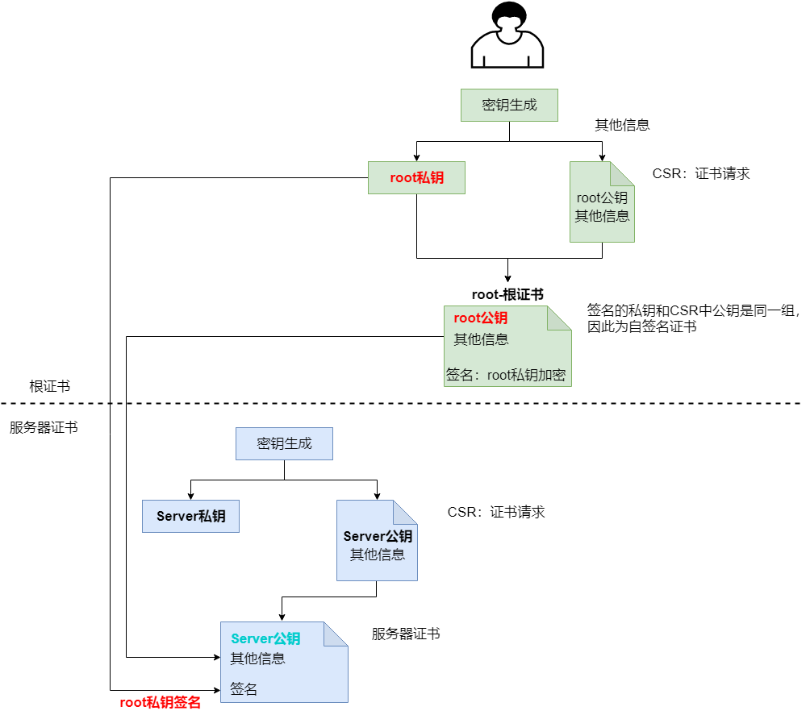
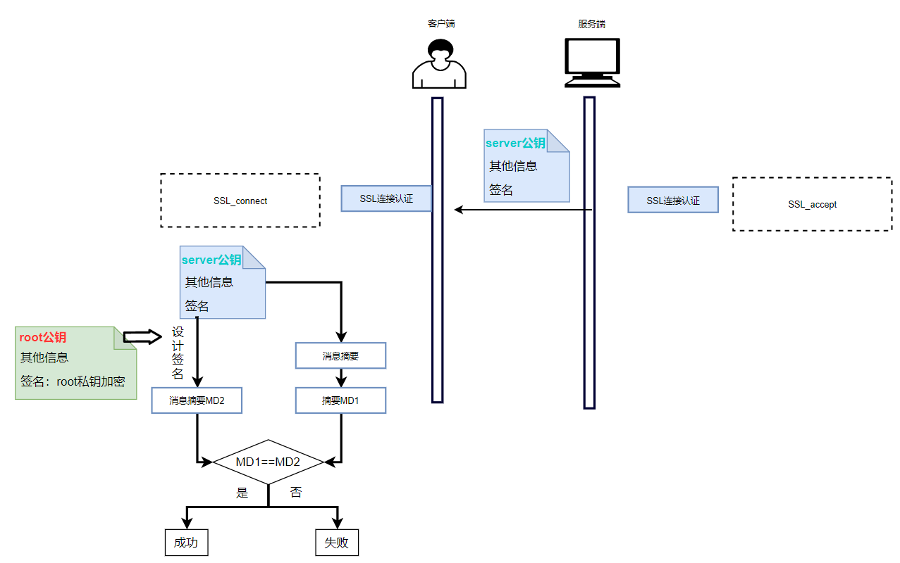

在数据库客户端和服务端之间、数据库各节点之间应该建立安全的通信信道，保障通信数据的机密性和完整性。

YashanDB支持通过SSL或TLCP协议进行通信信道加密和服务端身份认证。

## SSL协议可信信道

### SSL协议

SSL协议属于应用层（YashanDB）和传输层（TCP）之间的协议，SSL对应用层透明，用户无感知。

**SSL握手**

此阶段主要完成如下操作：

- 客户端和服务端的安全认证。

- 生成主密钥和会话密钥，用于后续传输对称加密。

**SSL记录**

此阶段使用双方的密钥进行数据的加密传输，发送方经历分块、压缩、加密等过程，接收方为反方向拆包。

### SSL身份认证

YashanDB对SSL连接的登录请求采用SSL数字证书身份认证，包括证书的制作和证书的验证。

**证书制作**

在服务端生成密钥对（公/私钥）；生成根证书（自签名，包含服务端公钥）；利用根证书生成服务器证书，且用私钥进行签名。

**证书验证**

客户端保留着服务端根证书，服务端将其服务器证书发送至客户端，客户端用root公钥设计签名，与计算的消息摘要对比，进行验证。

## TLCP协议可信信道

### TLCP协议

TLCP协议采用SM系列密码算法和数字证书等密码技术保障传输层的机密性、完整性、身份认证和抗攻击，是一种基于国产密码算法的类SSL安全协议，作用机制与SSL协议类似。

### TLCP身份认证

TLCP采用SM2双证书体系进行身份认证，由CA签发加密证书用于会话密钥生成，签发签名证书用于身份验证。

## 配置可信信道

可信信道均默认关闭，如需开启必须同时配置数字证书，否则将导致数据库无法正常启动。

- SSL协议可信信道

    - 数据库客户端与服务端之间支持SSL可信通道，配置操作请查阅[数据库服务端SSL可信信道](../../数据库管理/基本数据库管理/SSL可信信道配置/数据库服务端SSL可信信道)。

    - HA主备之间支持SSL可信通道，配置操作请查阅[HA节点间SSL可信信道](../../数据库管理/基本数据库管理/SSL可信信道配置/HA节点间SSL可信信道)。

    - 分布式节点间通信网络（DIN）支持SSL可信通道，配置操作请查阅[分布式节点间SSL可信信道](../../数据库管理/基本数据库管理/SSL可信信道配置/分布式节点间SSL可信信道)。

- TLCP协议可信信道
    
    数据库客户端与服务端之间支持TLCP可信通道，配置操作请查阅[数据库服务端TLCP可信信道](../../数据库管理/基本数据库管理/TLCP可信信道配置)。