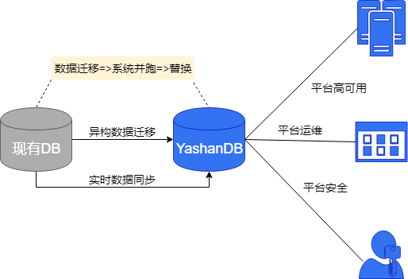

## 备库数据同步

备库数据同步，又称主备复制，是指将主库上的数据实时复制到备库，是数据库最主要的高可用措施。

主备复制的实现过程是主库负责发送redo日志给备库，备库基于redo日志进行相应的处理与应用，从而实现备库和主库的在线同步。根据日志应用机制的不同，主备复制分物理复制和逻辑复制。

关于主备部署、高可用运维等详细操作，请查阅[高可用](../../高可用/YashanDB高可用概述)。

### 物理复制

备库接收到redo日志后，直接回放redo日志更新备库的数据页面，使备库的数据更新到与主库完全一致，这种方式称为物理复制，其备库可引申称为物理备库。物理备库是主库的物理副本，其磁盘数据库结构与主库逐块相同、数据库架构（包括索引）与主库完全相同。

主备库之间物理复制的主要流程为：

1. 创建物理备库，若备库创建晚于主库（例如扩容场景），必须先按主库数据对备库进行初始化。

2. 主库上的日志通过网络发送到备库。

3. 备库回放日志（默认开启，无需手动配置），实现与主库数据同步。

### 逻辑复制

备库接收到redo日志后，将redo日志解析成SQL语句，再通过执行此类SQL语句使备库的数据与主库保持逻辑上一致，这种方式称为逻辑复制，其备库可引申称为逻辑备库。逻辑备库包含与主库相同的逻辑信息，但其数据的物理组织和结构可能与主库不同。

主备库之间逻辑复制的主要流程为：

1. 创建备库（此时备库为物理备库状态），完成相关配置将其转换为逻辑备库，例如新增STANDBY LOG文件、停止备库的redo回放、执行build操作等，具体操作请查阅[逻辑备库配置](../../数据库管理/数据同步/逻辑备库配置)。

2. 在逻辑备库上开启逻辑回放（默认不开启）。

3. 主库上的日志通过网络发送到备库。

4. 备库解析redo日志为SQL语句，然后执行解析所得SQL语句。

## 异构数据库数据同步

YashanDB支持数据变更捕获功能，通过逻辑日志解析接口YStream可以向其他数据库（可以是异构数据库例如Oracle、MySQL等、也可以是另一套YashanDB）实时同步数据。

如需更换/切换正在使用的数据库时，直接对应用系统的数据库进行切换，可能导致数据丢失、错位，或应用系统无法运行等异常情况，因此一般采用新旧系统并跑的方式，如下图所示：

系统并跑时，通过YashanDB提供的数据变更捕获功能和逻辑日志解析接口可以实现新旧数据库之间的实时数据同步。

异构数据库数据同步的主要流程为：

1. YashanDB数据库开启附加日志（[库级附加日志](../../开发手册/SQL参考手册/SQL语句（yashan模式）/ALTER DATABASE.html#supplementallogclauses)或[表级附加日志](../../开发手册/SQL参考手册/SQL语句（yashan模式）/ALTER TABLE.html#supplementaltablelogging)）。

2. 创建并启动用于CDC解析数据库附加日志的YStream服务，具体操作请查阅[DBMS_YSTREAM_ADM](../../开发手册/PL参考手册/内置高级包/DBMS_YSTREAM_ADM)。

3. 使用[YStream API](../../开发手册/YStream参考手册/00YStream参考手册)解析redo日志并组装成SQL。

4. 在另一个数据库中执行解析所得SQL语句，还原数据库相关操作，从而实现数据同步。